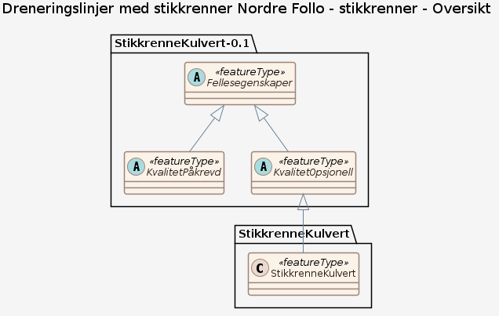
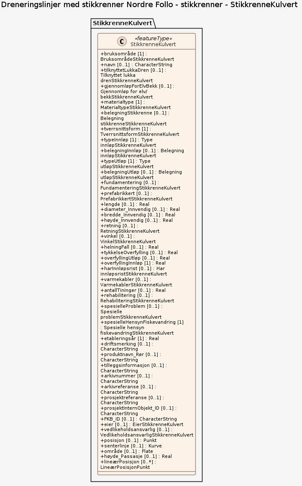
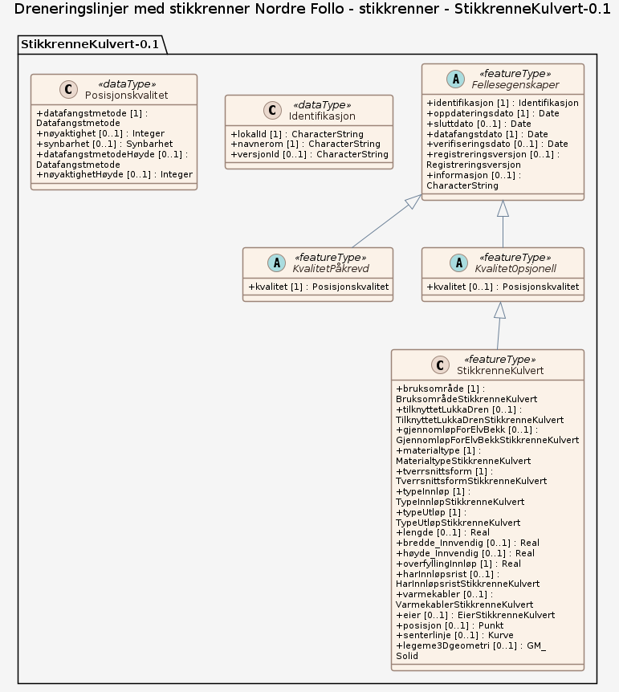
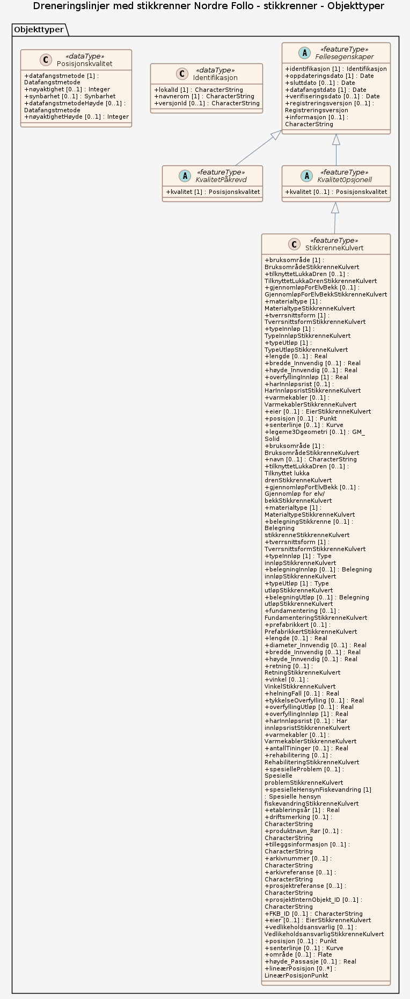

### Datamodell

**Kilde:** [SOSI UML XMI-fil](https://sosi.geonorge.no/svn/SOSI/SOSI%20Del%203/Statens%20kartverk/StikkrenneKulvert-0.1.xml)

#### Oversikt

#### Pakke: StikkrenneKulvert

#### Pakke: StikkrenneKulvert-0.1

#### Komplett diagram

#### StikkrenneKulvert

Rør for vanngjennomløp på tvers av vegen (ev. på tvers av tilgrensende avkjørsel) med maks lysåpning 2,5 meter. Stikkrenne/kulvert har åpent innløp og/eller utløp. Stikkrenne/kulvert kan ha inn- og utløpskonstruksjoner som kummer og støtteskjold. Merknad: Inntil videre registrere stikkrenner med bruksområde biologisk mangfold eller landbruk som vanlig stikkrenne. Dette blir endret på i senere versjon av Datakatalogen.

Egenskaper

<table class="feature-attribute-table">
  <colgroup>
    <col style="width: 35%;" />
    <col style="width: 65%;" />
  </colgroup>
  <tbody>
    <tr>
      <th scope="row">Navn:</th>
      <td><strong>bruksområde</strong></td>
    </tr>
    <tr>
      <th scope="row">Definisjon:</th>
      <td>Angir hva stikkrenne kulvert primært brukes til.</td>
    </tr>
    <tr>
      <th scope="row">Multiplisitet:</th>
      <td>1</td>
    </tr>
    <tr>
      <th scope="row">Type:</th>
      <td>BruksområdeStikkrenneKulvert</td>
    </tr>
    <tr>
      <th scope="row">Tillatte verdier:</th>
      <td>- Kodeliste: <a href="https://raw.githubusercontent.com/vegvesen/NVDB-Datakatalogen/master/GMLBruksområdeStikkrenneKulvert">https://raw.githubusercontent.com/vegvesen/NVDB-Datakatalogen/master/GMLBruksområdeStikkrenneKulvert</a> - Biologisk mangfold – Gjennomløp for å hindre at veg begrenser biologisk mangfold. - Landbruk – Gjennomløp under veg som benyttes i forbindelse med landbruk. - Vann – Gjennomløp for å transportere vann på tvers av vegen. - Voll, vanngjennomløp – Gjennomløp for å lede vann gjennom voll.</td>
    </tr>
  </tbody>
</table>

<table class="feature-attribute-table">
  <colgroup>
    <col style="width: 35%;" />
    <col style="width: 65%;" />
  </colgroup>
  <tbody>
    <tr>
      <th scope="row">Navn:</th>
      <td><strong>tilknyttetLukkaDren</strong></td>
    </tr>
    <tr>
      <th scope="row">Definisjon:</th>
      <td>Angir om stikkrenne er tilknytta lukka drenering. Vannet ledes inn i et lukket dreneringssystem.</td>
    </tr>
    <tr>
      <th scope="row">Multiplisitet:</th>
      <td>0..1</td>
    </tr>
    <tr>
      <th scope="row">Type:</th>
      <td>TilknyttetLukkaDrenStikkrenneKulvert</td>
    </tr>
    <tr>
      <th scope="row">Tillatte verdier:</th>
      <td>- Kodeliste: <a href="https://raw.githubusercontent.com/vegvesen/NVDB-Datakatalogen/master/GMLTilknyttetLukkaDrenStikkrenneKulvert">https://raw.githubusercontent.com/vegvesen/NVDB-Datakatalogen/master/GMLTilknyttetLukkaDrenStikkrenneKulvert</a> - Ja - Nei</td>
    </tr>
  </tbody>
</table>

<table class="feature-attribute-table">
  <colgroup>
    <col style="width: 35%;" />
    <col style="width: 65%;" />
  </colgroup>
  <tbody>
    <tr>
      <th scope="row">Navn:</th>
      <td><strong>gjennomløpForElvBekk</strong></td>
    </tr>
    <tr>
      <th scope="row">Definisjon:</th>
      <td>Angir om elv/bekk renner gjennom stikkrenne/kulvert.</td>
    </tr>
    <tr>
      <th scope="row">Multiplisitet:</th>
      <td>0..1</td>
    </tr>
    <tr>
      <th scope="row">Type:</th>
      <td>GjennomløpForElvBekkStikkrenneKulvert</td>
    </tr>
    <tr>
      <th scope="row">Tillatte verdier:</th>
      <td>- Kodeliste: <a href="https://raw.githubusercontent.com/vegvesen/NVDB-Datakatalogen/master/GMLGjennomløpForElvBekkStikkrenneKulvert">https://raw.githubusercontent.com/vegvesen/NVDB-Datakatalogen/master/GMLGjennomløpForElvBekkStikkrenneKulvert</a> - Ja - Nei</td>
    </tr>
  </tbody>
</table>

<table class="feature-attribute-table">
  <colgroup>
    <col style="width: 35%;" />
    <col style="width: 65%;" />
  </colgroup>
  <tbody>
    <tr>
      <th scope="row">Navn:</th>
      <td><strong>materialtype</strong></td>
    </tr>
    <tr>
      <th scope="row">Definisjon:</th>
      <td>Angir materialtype.</td>
    </tr>
    <tr>
      <th scope="row">Multiplisitet:</th>
      <td>1</td>
    </tr>
    <tr>
      <th scope="row">Type:</th>
      <td>MaterialtypeStikkrenneKulvert</td>
    </tr>
    <tr>
      <th scope="row">Tillatte verdier:</th>
      <td>- Kodeliste: <a href="https://raw.githubusercontent.com/vegvesen/NVDB-Datakatalogen/master/GMLMaterialtypeStikkrenneKulvert">https://raw.githubusercontent.com/vegvesen/NVDB-Datakatalogen/master/GMLMaterialtypeStikkrenneKulvert</a> - Betong - Eternitt - Naturstein - Plast - Stål - Tre</td>
    </tr>
  </tbody>
</table>

<table class="feature-attribute-table">
  <colgroup>
    <col style="width: 35%;" />
    <col style="width: 65%;" />
  </colgroup>
  <tbody>
    <tr>
      <th scope="row">Navn:</th>
      <td><strong>tverrsnittsform</strong></td>
    </tr>
    <tr>
      <th scope="row">Definisjon:</th>
      <td>Angir hvilken type tverrsnitt gjennomløpskonstruksjon har.</td>
    </tr>
    <tr>
      <th scope="row">Multiplisitet:</th>
      <td>1</td>
    </tr>
    <tr>
      <th scope="row">Type:</th>
      <td>TverrsnittsformStikkrenneKulvert</td>
    </tr>
    <tr>
      <th scope="row">Tillatte verdier:</th>
      <td>- Kodeliste: <a href="https://raw.githubusercontent.com/vegvesen/NVDB-Datakatalogen/master/GMLTverrsnittsformStikkrenneKulvert">https://raw.githubusercontent.com/vegvesen/NVDB-Datakatalogen/master/GMLTverrsnittsformStikkrenneKulvert</a> - Ellipseform - Flatbunnet med hvelv - Rektangulær - Sirkulær</td>
    </tr>
  </tbody>
</table>

<table class="feature-attribute-table">
  <colgroup>
    <col style="width: 35%;" />
    <col style="width: 65%;" />
  </colgroup>
  <tbody>
    <tr>
      <th scope="row">Navn:</th>
      <td><strong>typeInnløp</strong></td>
    </tr>
    <tr>
      <th scope="row">Definisjon:</th>
      <td>Angir hvilken type innløp det er i ei stikkrenne.</td>
    </tr>
    <tr>
      <th scope="row">Multiplisitet:</th>
      <td>1</td>
    </tr>
    <tr>
      <th scope="row">Type:</th>
      <td>TypeInnløpStikkrenneKulvert</td>
    </tr>
    <tr>
      <th scope="row">Tillatte verdier:</th>
      <td>- Kodeliste: <a href="https://raw.githubusercontent.com/vegvesen/NVDB-Datakatalogen/master/GMLTypeInnløpStikkrenneKulvert">https://raw.githubusercontent.com/vegvesen/NVDB-Datakatalogen/master/GMLTypeInnløpStikkrenneKulvert</a> - Kum over stikkrenne - Åpent i grøft – Vann renner inn direkte fra åpen grøft. - Åpent i grøft med støtteskjold - Åpent med frontmur</td>
    </tr>
  </tbody>
</table>

<table class="feature-attribute-table">
  <colgroup>
    <col style="width: 35%;" />
    <col style="width: 65%;" />
  </colgroup>
  <tbody>
    <tr>
      <th scope="row">Navn:</th>
      <td><strong>typeUtløp</strong></td>
    </tr>
    <tr>
      <th scope="row">Definisjon:</th>
      <td>Angir hvilken type utløp det er i ei stikkrenne.</td>
    </tr>
    <tr>
      <th scope="row">Multiplisitet:</th>
      <td>1</td>
    </tr>
    <tr>
      <th scope="row">Type:</th>
      <td>TypeUtløpStikkrenneKulvert</td>
    </tr>
    <tr>
      <th scope="row">Tillatte verdier:</th>
      <td>- Kodeliste: <a href="https://raw.githubusercontent.com/vegvesen/NVDB-Datakatalogen/master/GMLTypeUtløpStikkrenneKulvert">https://raw.githubusercontent.com/vegvesen/NVDB-Datakatalogen/master/GMLTypeUtløpStikkrenneKulvert</a> - I bekk/elv – Vann ledes ut i bekk/elv. - I skråning/terreng – Vann ledes ut i skråning eller ut i terreng. - Kum – Vann ledes til kum. - Åpen grøft – Vann ledes til åpen grøft. Merknad: Ofte aktuelt i forbindelse med stikkrenner under avkjørsel.</td>
    </tr>
  </tbody>
</table>

<table class="feature-attribute-table">
  <colgroup>
    <col style="width: 35%;" />
    <col style="width: 65%;" />
  </colgroup>
  <tbody>
    <tr>
      <th scope="row">Navn:</th>
      <td><strong>lengde</strong></td>
    </tr>
    <tr>
      <th scope="row">Definisjon:</th>
      <td>Angir lengde av vegobjektet.</td>
    </tr>
    <tr>
      <th scope="row">Multiplisitet:</th>
      <td>0..1</td>
    </tr>
    <tr>
      <th scope="row">Type:</th>
      <td>Real</td>
    </tr>
  </tbody>
</table>

<table class="feature-attribute-table">
  <colgroup>
    <col style="width: 35%;" />
    <col style="width: 65%;" />
  </colgroup>
  <tbody>
    <tr>
      <th scope="row">Navn:</th>
      <td><strong>bredde_Innvendig</strong></td>
    </tr>
    <tr>
      <th scope="row">Definisjon:</th>
      <td>Angir innvendig bredde av gjennomløpskonstruksjon. Ikke aktuell for sirkulære tverrsnitt.</td>
    </tr>
    <tr>
      <th scope="row">Multiplisitet:</th>
      <td>0..1</td>
    </tr>
    <tr>
      <th scope="row">Type:</th>
      <td>Real</td>
    </tr>
  </tbody>
</table>

<table class="feature-attribute-table">
  <colgroup>
    <col style="width: 35%;" />
    <col style="width: 65%;" />
  </colgroup>
  <tbody>
    <tr>
      <th scope="row">Navn:</th>
      <td><strong>høyde_Innvendig</strong></td>
    </tr>
    <tr>
      <th scope="row">Definisjon:</th>
      <td>Angir innvendig høyde av gjennomløpskonstruksjon. Tar ikke hensyn til ev. igjenfylling i bunn av konstruksjon.</td>
    </tr>
    <tr>
      <th scope="row">Multiplisitet:</th>
      <td>0..1</td>
    </tr>
    <tr>
      <th scope="row">Type:</th>
      <td>Real</td>
    </tr>
  </tbody>
</table>

<table class="feature-attribute-table">
  <colgroup>
    <col style="width: 35%;" />
    <col style="width: 65%;" />
  </colgroup>
  <tbody>
    <tr>
      <th scope="row">Navn:</th>
      <td><strong>overfyllingInnløp</strong></td>
    </tr>
    <tr>
      <th scope="row">Definisjon:</th>
      <td>Angir tykkelsen på overfylling ved innløp. Det vil si tykkelse fra topp av stikkrenne til topp dekke.</td>
    </tr>
    <tr>
      <th scope="row">Multiplisitet:</th>
      <td>1</td>
    </tr>
    <tr>
      <th scope="row">Type:</th>
      <td>Real</td>
    </tr>
  </tbody>
</table>

<table class="feature-attribute-table">
  <colgroup>
    <col style="width: 35%;" />
    <col style="width: 65%;" />
  </colgroup>
  <tbody>
    <tr>
      <th scope="row">Navn:</th>
      <td><strong>harInnløpsrist</strong></td>
    </tr>
    <tr>
      <th scope="row">Definisjon:</th>
      <td>Angir om det er innløpsrist i tilknytning til vegobjektet.</td>
    </tr>
    <tr>
      <th scope="row">Multiplisitet:</th>
      <td>0..1</td>
    </tr>
    <tr>
      <th scope="row">Type:</th>
      <td>HarInnløpsristStikkrenneKulvert</td>
    </tr>
    <tr>
      <th scope="row">Tillatte verdier:</th>
      <td>- Kodeliste: <a href="https://raw.githubusercontent.com/vegvesen/NVDB-Datakatalogen/master/GMLHarInnløpsristStikkrenneKulvert">https://raw.githubusercontent.com/vegvesen/NVDB-Datakatalogen/master/GMLHarInnløpsristStikkrenneKulvert</a> - Ja - Nei</td>
    </tr>
  </tbody>
</table>

<table class="feature-attribute-table">
  <colgroup>
    <col style="width: 35%;" />
    <col style="width: 65%;" />
  </colgroup>
  <tbody>
    <tr>
      <th scope="row">Navn:</th>
      <td><strong>varmekabler</strong></td>
    </tr>
    <tr>
      <th scope="row">Definisjon:</th>
      <td>Angir om det er varmekabler eller ikke i tilknytning til vegobjektet.</td>
    </tr>
    <tr>
      <th scope="row">Multiplisitet:</th>
      <td>0..1</td>
    </tr>
    <tr>
      <th scope="row">Type:</th>
      <td>VarmekablerStikkrenneKulvert</td>
    </tr>
    <tr>
      <th scope="row">Tillatte verdier:</th>
      <td>- Kodeliste: <a href="https://raw.githubusercontent.com/vegvesen/NVDB-Datakatalogen/master/GMLVarmekablerStikkrenneKulvert">https://raw.githubusercontent.com/vegvesen/NVDB-Datakatalogen/master/GMLVarmekablerStikkrenneKulvert</a> - Ja - Nei</td>
    </tr>
  </tbody>
</table>

<table class="feature-attribute-table">
  <colgroup>
    <col style="width: 35%;" />
    <col style="width: 65%;" />
  </colgroup>
  <tbody>
    <tr>
      <th scope="row">Navn:</th>
      <td><strong>eier</strong></td>
    </tr>
    <tr>
      <th scope="row">Definisjon:</th>
      <td>Angir hvem som er eier av vegobjektet.</td>
    </tr>
    <tr>
      <th scope="row">Multiplisitet:</th>
      <td>0..1</td>
    </tr>
    <tr>
      <th scope="row">Type:</th>
      <td>EierStikkrenneKulvert</td>
    </tr>
    <tr>
      <th scope="row">Tillatte verdier:</th>
      <td>- Kodeliste: <a href="https://raw.githubusercontent.com/vegvesen/NVDB-Datakatalogen/master/GMLEierStikkrenneKulvert">https://raw.githubusercontent.com/vegvesen/NVDB-Datakatalogen/master/GMLEierStikkrenneKulvert</a> - Fylkeskommune - Kommune - Privat - Stat, Nye Veier - Stat, Statens vegvesen - Uavklart – Verdi benyttes inntil det er avklart hvem som er eier (ingen verdi tolkes som at vegeier er eier).</td>
    </tr>
  </tbody>
</table>

<table class="feature-attribute-table">
  <colgroup>
    <col style="width: 35%;" />
    <col style="width: 65%;" />
  </colgroup>
  <tbody>
    <tr>
      <th scope="row">Navn:</th>
      <td><strong>posisjon</strong></td>
    </tr>
    <tr>
      <th scope="row">Definisjon:</th>
      <td>Gir punkt som geometrisk representerer objektet.</td>
    </tr>
    <tr>
      <th scope="row">Multiplisitet:</th>
      <td>0..1</td>
    </tr>
    <tr>
      <th scope="row">Type:</th>
      <td>Punkt</td>
    </tr>
  </tbody>
</table>

<table class="feature-attribute-table">
  <colgroup>
    <col style="width: 35%;" />
    <col style="width: 65%;" />
  </colgroup>
  <tbody>
    <tr>
      <th scope="row">Navn:</th>
      <td><strong>senterlinje</strong></td>
    </tr>
    <tr>
      <th scope="row">Definisjon:</th>
      <td>Gir linje/kurve som geometrisk representerer objektet.</td>
    </tr>
    <tr>
      <th scope="row">Multiplisitet:</th>
      <td>0..1</td>
    </tr>
    <tr>
      <th scope="row">Type:</th>
      <td>Kurve</td>
    </tr>
  </tbody>
</table>

<table class="feature-attribute-table">
  <colgroup>
    <col style="width: 35%;" />
    <col style="width: 65%;" />
  </colgroup>
  <tbody>
    <tr>
      <th scope="row">Navn:</th>
      <td><strong>legeme3Dgeometri</strong></td>
    </tr>
    <tr>
      <th scope="row">Definisjon:</th>
      <td>tre-dimensjonal geometri som beskriver objektets form</td>
    </tr>
    <tr>
      <th scope="row">Multiplisitet:</th>
      <td>0..1</td>
    </tr>
    <tr>
      <th scope="row">Type:</th>
      <td>GM_Solid</td>
    </tr>
  </tbody>
</table>

Relasjoner

**Arv**
KvalitetOpsjonell

#### Fellesegenskaper (abstrakt)

abstrakt objekttype som bærer sentrale egenskaper som er anbefalt for bruk i produktspesifikasjoner.

Egenskaper

<table class="feature-attribute-table">
  <colgroup>
    <col style="width: 35%;" />
    <col style="width: 65%;" />
  </colgroup>
  <tbody>
    <tr>
      <th scope="row">Navn:</th>
      <td><strong>identifikasjon</strong></td>
    </tr>
    <tr>
      <th scope="row">Definisjon:</th>
      <td>unik identifikasjon av et objekt  Merknad FKB: Unik identifikasjon av et objekt, ivaretas av den ansvarlige produsent/forvalter, og som kan benyttes av eksterne applikasjoner som referanse til objektet. Den unike identifikatoren er unik for kartobjektet og skal ikke endres i kartobjektets levetid. Dette må ikke forveksles med en tematisk identifikator (for eksempel bygningsnummer) som unikt identifiserer et objekt i virkeligheten. En bygning med samme bygningsnummer vil kunne representeres i mange kartprodukter der det finnes en unik identifikasjon i hver av dem. For FKB benyttes UUID (Universally unique identifier) som lokalId. Dette innebærer at lokalId alene alltid vil være unik. Likevel skal alltid navnerom også angis. Navnerom angir FKB-datasettet.</td>
    </tr>
    <tr>
      <th scope="row">Multiplisitet:</th>
      <td>1</td>
    </tr>
    <tr>
      <th scope="row">Type:</th>
      <td>Identifikasjon</td>
    </tr>
  </tbody>
</table>

<table class="feature-attribute-table">
  <colgroup>
    <col style="width: 35%;" />
    <col style="width: 65%;" />
  </colgroup>
  <tbody>
    <tr>
      <th scope="row">Navn:</th>
      <td><strong>identifikasjon.lokalId</strong></td>
    </tr>
    <tr>
      <th scope="row">Definisjon:</th>
      <td>lokal identifikator av et objekt  Merknad: Det er dataleverendørens ansvar å sørge for at den lokale identifikatoren er unik innenfor navnerommet. For FKB-data benyttes UUID som lokalId.</td>
    </tr>
    <tr>
      <th scope="row">Multiplisitet:</th>
      <td>1</td>
    </tr>
    <tr>
      <th scope="row">Type:</th>
      <td>CharacterString</td>
    </tr>
  </tbody>
</table>

<table class="feature-attribute-table">
  <colgroup>
    <col style="width: 35%;" />
    <col style="width: 65%;" />
  </colgroup>
  <tbody>
    <tr>
      <th scope="row">Navn:</th>
      <td><strong>identifikasjon.navnerom</strong></td>
    </tr>
    <tr>
      <th scope="row">Definisjon:</th>
      <td>navnerom som unikt identifiserer datakilden til et objekt, anbefales å være en http-URI  Eksempel: <a href="http://data.geonorge.no/SentraltStedsnavnsregister/1.0">http://data.geonorge.no/SentraltStedsnavnsregister/1.0</a>  Merknad : Verdien for nanverom vil eies av den dataprodusent som har ansvar for de unike identifikatorene og må være registrert i data.geonorge.no eller data.norge.no</td>
    </tr>
    <tr>
      <th scope="row">Multiplisitet:</th>
      <td>1</td>
    </tr>
    <tr>
      <th scope="row">Type:</th>
      <td>CharacterString</td>
    </tr>
  </tbody>
</table>

<table class="feature-attribute-table">
  <colgroup>
    <col style="width: 35%;" />
    <col style="width: 65%;" />
  </colgroup>
  <tbody>
    <tr>
      <th scope="row">Navn:</th>
      <td><strong>identifikasjon.versjonId</strong></td>
    </tr>
    <tr>
      <th scope="row">Definisjon:</th>
      <td>identifikasjon av en spesiell versjon av et geografisk objekt (instans)</td>
    </tr>
    <tr>
      <th scope="row">Multiplisitet:</th>
      <td>0..1</td>
    </tr>
    <tr>
      <th scope="row">Type:</th>
      <td>CharacterString</td>
    </tr>
  </tbody>
</table>

<table class="feature-attribute-table">
  <colgroup>
    <col style="width: 35%;" />
    <col style="width: 65%;" />
  </colgroup>
  <tbody>
    <tr>
      <th scope="row">Navn:</th>
      <td><strong>oppdateringsdato</strong></td>
    </tr>
    <tr>
      <th scope="row">Definisjon:</th>
      <td>tidspunkt for siste endring på objektet  Merknad FKB:  Denne datoen viser datasystemets siste endring på dataobjektet. Egenskapen settes av forvaltningssystemet etter følgende regler:  i. Oppdateringsdato er tidspunkt for oppdatering av databasen og settes av forvaltningsbasen (ikke av klienten).  ii. Oppdateringsdato skal endres også hvis det er kopidata som blir endret eller importert i en ”kopibase”.  iii. Når avgrensingslinjene til en flate endres, skal flateobjektet få ny oppdateringsdato.  iv. Oppdateringsdato skal endres hvis en egenskap endres.</td>
    </tr>
    <tr>
      <th scope="row">Multiplisitet:</th>
      <td>1</td>
    </tr>
    <tr>
      <th scope="row">Type:</th>
      <td>DateTime</td>
    </tr>
  </tbody>
</table>

<table class="feature-attribute-table">
  <colgroup>
    <col style="width: 35%;" />
    <col style="width: 65%;" />
  </colgroup>
  <tbody>
    <tr>
      <th scope="row">Navn:</th>
      <td><strong>sluttdato</strong></td>
    </tr>
    <tr>
      <th scope="row">Definisjon:</th>
      <td>Tid for når denne versjonen av objektet var erstattet eller opphørt å eksistere.  Merknad FKB: Egenskapen settes av forvaltningssystemet. Sluttdato skal kun sendes med ut fra forvaltningssystemet i sammenhenger der objektenes historikk er interessant.</td>
    </tr>
    <tr>
      <th scope="row">Multiplisitet:</th>
      <td>0..1</td>
    </tr>
    <tr>
      <th scope="row">Type:</th>
      <td>DateTime</td>
    </tr>
  </tbody>
</table>

<table class="feature-attribute-table">
  <colgroup>
    <col style="width: 35%;" />
    <col style="width: 65%;" />
  </colgroup>
  <tbody>
    <tr>
      <th scope="row">Navn:</th>
      <td><strong>datafangstdato</strong></td>
    </tr>
    <tr>
      <th scope="row">Definisjon:</th>
      <td>dato når objektet siste gang ble registrert/observert/målt i terrenget</td>
    </tr>
    <tr>
      <th scope="row">Multiplisitet:</th>
      <td>1</td>
    </tr>
    <tr>
      <th scope="row">Type:</th>
      <td>Date</td>
    </tr>
  </tbody>
</table>

<table class="feature-attribute-table">
  <colgroup>
    <col style="width: 35%;" />
    <col style="width: 65%;" />
  </colgroup>
  <tbody>
    <tr>
      <th scope="row">Navn:</th>
      <td><strong>verifiseringsdato</strong></td>
    </tr>
    <tr>
      <th scope="row">Definisjon:</th>
      <td>dato når dataene er fastslått å være i samsvar med virkeligheten.  Merknad FKB: Brukes for eksempel i de sammenhenger hvor det er foretatt fotogrammetrisk ajourhold, og hvor det ikke er registrert endringer på objektet (det virkelige objektet er i samsvar med dataobjektet)</td>
    </tr>
    <tr>
      <th scope="row">Multiplisitet:</th>
      <td>0..1</td>
    </tr>
    <tr>
      <th scope="row">Type:</th>
      <td>Date</td>
    </tr>
  </tbody>
</table>

<table class="feature-attribute-table">
  <colgroup>
    <col style="width: 35%;" />
    <col style="width: 65%;" />
  </colgroup>
  <tbody>
    <tr>
      <th scope="row">Navn:</th>
      <td><strong>registreringsversjon</strong></td>
    </tr>
    <tr>
      <th scope="row">Definisjon:</th>
      <td>angivelse av hvilken produktspesifikasjon som er utgangspunkt  for dataene</td>
    </tr>
    <tr>
      <th scope="row">Multiplisitet:</th>
      <td>0..1</td>
    </tr>
    <tr>
      <th scope="row">Type:</th>
      <td>Registreringsversjon</td>
    </tr>
    <tr>
      <th scope="row">Tillatte verdier:</th>
      <td>- Kodeliste: <a href="https://register.geonorge.no/sosi-kodelister/fkb/generell/5.0/registreringsversjon">https://register.geonorge.no/sosi-kodelister/fkb/generell/5.0/registreringsversjon</a></td>
    </tr>
  </tbody>
</table>

<table class="feature-attribute-table">
  <colgroup>
    <col style="width: 35%;" />
    <col style="width: 65%;" />
  </colgroup>
  <tbody>
    <tr>
      <th scope="row">Navn:</th>
      <td><strong>informasjon</strong></td>
    </tr>
    <tr>
      <th scope="row">Definisjon:</th>
      <td>generell opplysning.  Merknad FKB: Mulighet til å legge inn utfyllende informasjon om objektet. Egenskapen bør bare brukes til å legge inn ekstra informasjon om enkeltobjekter. Egenskapen bør ikke brukes til å systematisk angi ekstrainformasjon om mange/alle objekter i et datasett.</td>
    </tr>
    <tr>
      <th scope="row">Multiplisitet:</th>
      <td>0..1</td>
    </tr>
    <tr>
      <th scope="row">Type:</th>
      <td>CharacterString</td>
    </tr>
  </tbody>
</table>

#### KvalitetPåkrevd (abstrakt)

abstrakt objekttype med påkrevet kvalitetsangivelse

Egenskaper

<table class="feature-attribute-table">
  <colgroup>
    <col style="width: 35%;" />
    <col style="width: 65%;" />
  </colgroup>
  <tbody>
    <tr>
      <th scope="row">Navn:</th>
      <td><strong>kvalitet</strong></td>
    </tr>
    <tr>
      <th scope="row">Definisjon:</th>
      <td>beskrivelse av kvaliteten på stedfestingen  Merknad: Denne er identisk med ..KVALITET i tidligere versjoner av SOSI.</td>
    </tr>
    <tr>
      <th scope="row">Multiplisitet:</th>
      <td>1</td>
    </tr>
    <tr>
      <th scope="row">Type:</th>
      <td>Posisjonskvalitet</td>
    </tr>
  </tbody>
</table>

<table class="feature-attribute-table">
  <colgroup>
    <col style="width: 35%;" />
    <col style="width: 65%;" />
  </colgroup>
  <tbody>
    <tr>
      <th scope="row">Navn:</th>
      <td><strong>kvalitet.datafangstmetode</strong></td>
    </tr>
    <tr>
      <th scope="row">Definisjon:</th>
      <td>metode for datafangst. Egenskapen beskriver datafangstmetode for grunnrisskoordinater (x,y), eller for både grunnriss og høyde (x,y,z) dersom det ikke er oppgitt noen verdi for datafangstmetodeHøyde.</td>
    </tr>
    <tr>
      <th scope="row">Multiplisitet:</th>
      <td>1</td>
    </tr>
    <tr>
      <th scope="row">Type:</th>
      <td>Datafangstmetode</td>
    </tr>
    <tr>
      <th scope="row">Tillatte verdier:</th>
      <td>- Kodeliste: <a href="https://register.geonorge.no/sosi-kodelister/fkb/generell/5.0/datafangstmetode">https://register.geonorge.no/sosi-kodelister/fkb/generell/5.0/datafangstmetode</a></td>
    </tr>
  </tbody>
</table>

<table class="feature-attribute-table">
  <colgroup>
    <col style="width: 35%;" />
    <col style="width: 65%;" />
  </colgroup>
  <tbody>
    <tr>
      <th scope="row">Navn:</th>
      <td><strong>kvalitet.nøyaktighet</strong></td>
    </tr>
    <tr>
      <th scope="row">Definisjon:</th>
      <td>standardavviket til posisjoneringa av objektet oppgitt i cm  I de aller fleste sammenhenger benyttes en anslått eller forventet verdi for standardavvik, men dersom man har en beregnet verdi skal denne benyttes.  For objekter med punktgeometri benyttes verdi for punktstandardavvik. For objekter med kurvegeometri benyttes standardavviket for tverravviket fra kurva. For objekter med overflate- eller volumgeometri er forståelsen at standardavviket beregnes ut fra (3D) avvikene mellom sann posisjon og nærmeste punkt på overflata.  Merknad: Verdien er ment å beskrive nøyaktigheten til objektet sammenlignet med sann verdi. Standardavvik er i utgangspunktet et mål på det tilfeldige avviket og det innebærer at vi forutsetter at det systematiske avviket i liten grad påvirker nøyaktigheten til posisjoneringa. For fotogrammetriske data settes som hovedregel verdien lik kravet til standardavvik ved datafangst. Se standarden Geodatakvalitet for nærmere definisjon av standardavvik og hvordan dette defineres, beregnes og kontrolleres.</td>
    </tr>
    <tr>
      <th scope="row">Multiplisitet:</th>
      <td>0..1</td>
    </tr>
    <tr>
      <th scope="row">Type:</th>
      <td>Integer</td>
    </tr>
  </tbody>
</table>

<table class="feature-attribute-table">
  <colgroup>
    <col style="width: 35%;" />
    <col style="width: 65%;" />
  </colgroup>
  <tbody>
    <tr>
      <th scope="row">Navn:</th>
      <td><strong>kvalitet.synbarhet</strong></td>
    </tr>
    <tr>
      <th scope="row">Definisjon:</th>
      <td>beskrivelse av hvor godt objektene framgår i datagrunnlaget for posisjonering (f.eks. flybildene).</td>
    </tr>
    <tr>
      <th scope="row">Multiplisitet:</th>
      <td>0..1</td>
    </tr>
    <tr>
      <th scope="row">Type:</th>
      <td>Synbarhet</td>
    </tr>
    <tr>
      <th scope="row">Tillatte verdier:</th>
      <td>- Kodeliste: <a href="https://register.geonorge.no/sosi-kodelister/fkb/generell/5.0/synbarhet">https://register.geonorge.no/sosi-kodelister/fkb/generell/5.0/synbarhet</a></td>
    </tr>
  </tbody>
</table>

<table class="feature-attribute-table">
  <colgroup>
    <col style="width: 35%;" />
    <col style="width: 65%;" />
  </colgroup>
  <tbody>
    <tr>
      <th scope="row">Navn:</th>
      <td><strong>kvalitet.datafangstmetodeHøyde</strong></td>
    </tr>
    <tr>
      <th scope="row">Definisjon:</th>
      <td>metoden brukt for høyderegistrering av posisjon.  Det er bare nødvending å angi en verdi for egenskapen dersom datafangstmetode for høyde avviker fra datafangstmetode for grunnriss.</td>
    </tr>
    <tr>
      <th scope="row">Multiplisitet:</th>
      <td>0..1</td>
    </tr>
    <tr>
      <th scope="row">Type:</th>
      <td>Datafangstmetode</td>
    </tr>
    <tr>
      <th scope="row">Tillatte verdier:</th>
      <td>- Kodeliste: <a href="https://register.geonorge.no/sosi-kodelister/fkb/generell/5.0/datafangstmetode">https://register.geonorge.no/sosi-kodelister/fkb/generell/5.0/datafangstmetode</a></td>
    </tr>
  </tbody>
</table>

<table class="feature-attribute-table">
  <colgroup>
    <col style="width: 35%;" />
    <col style="width: 65%;" />
  </colgroup>
  <tbody>
    <tr>
      <th scope="row">Navn:</th>
      <td><strong>kvalitet.nøyaktighetHøyde</strong></td>
    </tr>
    <tr>
      <th scope="row">Definisjon:</th>
      <td>standardavviket til posisjoneringa av objektet oppgitt i cm  I de aller fleste sammenhenger benyttes en anslått eller forventet verdi for standardavviket, men dersom man faktisk har standardavviket til posisjoneringa av objektet oppgitt i cm  I de aller fleste sammenhenger benyttes en anslått eller forventet verdi for standardavvik, men dersom man har en beregnet verdi skal denne benyttes.  Merknad: Verdien er ment å beskrive nøyaktigheten til objektet sammenlignet med sann verdi. Standardavvik er i utgangspunktet et mål på det tilfeldige avviket og det innebærer at vi forutsetter at det systematiske avviket i liten grad påvirker nøyaktigheten til posisjoneringa. For fotogrammetriske data settes som hovedregel verdien lik kravet til standardavvik ved datafangst. Se standarden Geodatakvalitet for nærmere definisjon av standardavvik og hvordan dette defineres, beregnes og kontrolleres.</td>
    </tr>
    <tr>
      <th scope="row">Multiplisitet:</th>
      <td>0..1</td>
    </tr>
    <tr>
      <th scope="row">Type:</th>
      <td>Integer</td>
    </tr>
  </tbody>
</table>

Relasjoner

**Arv**
Fellesegenskaper

#### KvalitetOpsjonell (abstrakt)

abstrakt objekttype med valgfri kvalitetsangivelse

Egenskaper

<table class="feature-attribute-table">
  <colgroup>
    <col style="width: 35%;" />
    <col style="width: 65%;" />
  </colgroup>
  <tbody>
    <tr>
      <th scope="row">Navn:</th>
      <td><strong>kvalitet</strong></td>
    </tr>
    <tr>
      <th scope="row">Definisjon:</th>
      <td>beskrivelse av kvaliteten på stedfestingen  Merknad: Denne er identisk med ..KVALITET i tidligere versjoner av SOSI.</td>
    </tr>
    <tr>
      <th scope="row">Multiplisitet:</th>
      <td>0..1</td>
    </tr>
    <tr>
      <th scope="row">Type:</th>
      <td>Posisjonskvalitet</td>
    </tr>
  </tbody>
</table>

<table class="feature-attribute-table">
  <colgroup>
    <col style="width: 35%;" />
    <col style="width: 65%;" />
  </colgroup>
  <tbody>
    <tr>
      <th scope="row">Navn:</th>
      <td><strong>kvalitet.datafangstmetode</strong></td>
    </tr>
    <tr>
      <th scope="row">Definisjon:</th>
      <td>metode for datafangst. Egenskapen beskriver datafangstmetode for grunnrisskoordinater (x,y), eller for både grunnriss og høyde (x,y,z) dersom det ikke er oppgitt noen verdi for datafangstmetodeHøyde.</td>
    </tr>
    <tr>
      <th scope="row">Multiplisitet:</th>
      <td>1</td>
    </tr>
    <tr>
      <th scope="row">Type:</th>
      <td>Datafangstmetode</td>
    </tr>
    <tr>
      <th scope="row">Tillatte verdier:</th>
      <td>- Kodeliste: <a href="https://register.geonorge.no/sosi-kodelister/fkb/generell/5.0/datafangstmetode">https://register.geonorge.no/sosi-kodelister/fkb/generell/5.0/datafangstmetode</a></td>
    </tr>
  </tbody>
</table>

<table class="feature-attribute-table">
  <colgroup>
    <col style="width: 35%;" />
    <col style="width: 65%;" />
  </colgroup>
  <tbody>
    <tr>
      <th scope="row">Navn:</th>
      <td><strong>kvalitet.nøyaktighet</strong></td>
    </tr>
    <tr>
      <th scope="row">Definisjon:</th>
      <td>standardavviket til posisjoneringa av objektet oppgitt i cm  I de aller fleste sammenhenger benyttes en anslått eller forventet verdi for standardavvik, men dersom man har en beregnet verdi skal denne benyttes.  For objekter med punktgeometri benyttes verdi for punktstandardavvik. For objekter med kurvegeometri benyttes standardavviket for tverravviket fra kurva. For objekter med overflate- eller volumgeometri er forståelsen at standardavviket beregnes ut fra (3D) avvikene mellom sann posisjon og nærmeste punkt på overflata.  Merknad: Verdien er ment å beskrive nøyaktigheten til objektet sammenlignet med sann verdi. Standardavvik er i utgangspunktet et mål på det tilfeldige avviket og det innebærer at vi forutsetter at det systematiske avviket i liten grad påvirker nøyaktigheten til posisjoneringa. For fotogrammetriske data settes som hovedregel verdien lik kravet til standardavvik ved datafangst. Se standarden Geodatakvalitet for nærmere definisjon av standardavvik og hvordan dette defineres, beregnes og kontrolleres.</td>
    </tr>
    <tr>
      <th scope="row">Multiplisitet:</th>
      <td>0..1</td>
    </tr>
    <tr>
      <th scope="row">Type:</th>
      <td>Integer</td>
    </tr>
  </tbody>
</table>

<table class="feature-attribute-table">
  <colgroup>
    <col style="width: 35%;" />
    <col style="width: 65%;" />
  </colgroup>
  <tbody>
    <tr>
      <th scope="row">Navn:</th>
      <td><strong>kvalitet.synbarhet</strong></td>
    </tr>
    <tr>
      <th scope="row">Definisjon:</th>
      <td>beskrivelse av hvor godt objektene framgår i datagrunnlaget for posisjonering (f.eks. flybildene).</td>
    </tr>
    <tr>
      <th scope="row">Multiplisitet:</th>
      <td>0..1</td>
    </tr>
    <tr>
      <th scope="row">Type:</th>
      <td>Synbarhet</td>
    </tr>
    <tr>
      <th scope="row">Tillatte verdier:</th>
      <td>- Kodeliste: <a href="https://register.geonorge.no/sosi-kodelister/fkb/generell/5.0/synbarhet">https://register.geonorge.no/sosi-kodelister/fkb/generell/5.0/synbarhet</a></td>
    </tr>
  </tbody>
</table>

<table class="feature-attribute-table">
  <colgroup>
    <col style="width: 35%;" />
    <col style="width: 65%;" />
  </colgroup>
  <tbody>
    <tr>
      <th scope="row">Navn:</th>
      <td><strong>kvalitet.datafangstmetodeHøyde</strong></td>
    </tr>
    <tr>
      <th scope="row">Definisjon:</th>
      <td>metoden brukt for høyderegistrering av posisjon.  Det er bare nødvending å angi en verdi for egenskapen dersom datafangstmetode for høyde avviker fra datafangstmetode for grunnriss.</td>
    </tr>
    <tr>
      <th scope="row">Multiplisitet:</th>
      <td>0..1</td>
    </tr>
    <tr>
      <th scope="row">Type:</th>
      <td>Datafangstmetode</td>
    </tr>
    <tr>
      <th scope="row">Tillatte verdier:</th>
      <td>- Kodeliste: <a href="https://register.geonorge.no/sosi-kodelister/fkb/generell/5.0/datafangstmetode">https://register.geonorge.no/sosi-kodelister/fkb/generell/5.0/datafangstmetode</a></td>
    </tr>
  </tbody>
</table>

<table class="feature-attribute-table">
  <colgroup>
    <col style="width: 35%;" />
    <col style="width: 65%;" />
  </colgroup>
  <tbody>
    <tr>
      <th scope="row">Navn:</th>
      <td><strong>kvalitet.nøyaktighetHøyde</strong></td>
    </tr>
    <tr>
      <th scope="row">Definisjon:</th>
      <td>standardavviket til posisjoneringa av objektet oppgitt i cm  I de aller fleste sammenhenger benyttes en anslått eller forventet verdi for standardavviket, men dersom man faktisk har standardavviket til posisjoneringa av objektet oppgitt i cm  I de aller fleste sammenhenger benyttes en anslått eller forventet verdi for standardavvik, men dersom man har en beregnet verdi skal denne benyttes.  Merknad: Verdien er ment å beskrive nøyaktigheten til objektet sammenlignet med sann verdi. Standardavvik er i utgangspunktet et mål på det tilfeldige avviket og det innebærer at vi forutsetter at det systematiske avviket i liten grad påvirker nøyaktigheten til posisjoneringa. For fotogrammetriske data settes som hovedregel verdien lik kravet til standardavvik ved datafangst. Se standarden Geodatakvalitet for nærmere definisjon av standardavvik og hvordan dette defineres, beregnes og kontrolleres.</td>
    </tr>
    <tr>
      <th scope="row">Multiplisitet:</th>
      <td>0..1</td>
    </tr>
    <tr>
      <th scope="row">Type:</th>
      <td>Integer</td>
    </tr>
  </tbody>
</table>

Relasjoner

**Arv**
Fellesegenskaper

#### StikkrenneKulvert

Rør for vanngjennomløp på tvers av vegen (ev. på tvers av tilgrensende avkjørsel) med maks lysåpning 2,5 meter. Stikkrenne/kulvert har åpent innløp og/eller utløp. Stikkrenne/kulvert kan ha inn- og utløpskonstruksjoner som kummer og støtteskjold. Merknad: Inntil videre registrere stikkrenner med bruksområde biologisk mangfold eller landbruk som vanlig stikkrenne. Dette blir endret på i senere versjon av Datakatalogen.

Egenskaper

<table class="feature-attribute-table">
  <colgroup>
    <col style="width: 35%;" />
    <col style="width: 65%;" />
  </colgroup>
  <tbody>
    <tr>
      <th scope="row">Navn:</th>
      <td><strong>bruksområde</strong></td>
    </tr>
    <tr>
      <th scope="row">Definisjon:</th>
      <td>Angir hva stikkrenne kulvert primært brukes til.</td>
    </tr>
    <tr>
      <th scope="row">Multiplisitet:</th>
      <td>1</td>
    </tr>
    <tr>
      <th scope="row">Type:</th>
      <td>BruksområdeStikkrenneKulvert</td>
    </tr>
    <tr>
      <th scope="row">Tillatte verdier:</th>
      <td>- Kodeliste: <a href="https://raw.githubusercontent.com/vegvesen/NVDB-Datakatalogen/master/GMLBruksområdeStikkrenneKulvert">https://raw.githubusercontent.com/vegvesen/NVDB-Datakatalogen/master/GMLBruksområdeStikkrenneKulvert</a> - Biologisk mangfold – Gjennomløp for å hindre at veg begrenser biologisk mangfold. - Landbruk – Gjennomløp under veg som benyttes i forbindelse med landbruk. - Vann – Gjennomløp for å transportere vann på tvers av vegen. - Voll, vanngjennomløp – Gjennomløp for å lede vann gjennom voll.</td>
    </tr>
  </tbody>
</table>

<table class="feature-attribute-table">
  <colgroup>
    <col style="width: 35%;" />
    <col style="width: 65%;" />
  </colgroup>
  <tbody>
    <tr>
      <th scope="row">Navn:</th>
      <td><strong>navn</strong></td>
    </tr>
    <tr>
      <th scope="row">Definisjon:</th>
      <td>Angir navn knyttet til stikkrenne/kulvert.</td>
    </tr>
    <tr>
      <th scope="row">Multiplisitet:</th>
      <td>0..1</td>
    </tr>
    <tr>
      <th scope="row">Type:</th>
      <td>CharacterString</td>
    </tr>
  </tbody>
</table>

<table class="feature-attribute-table">
  <colgroup>
    <col style="width: 35%;" />
    <col style="width: 65%;" />
  </colgroup>
  <tbody>
    <tr>
      <th scope="row">Navn:</th>
      <td><strong>tilknyttetLukkaDren</strong></td>
    </tr>
    <tr>
      <th scope="row">Definisjon:</th>
      <td>Angir om stikkrenne er tilknytta lukka drenering. Vannet ledes inn i et lukket dreneringssystem.</td>
    </tr>
    <tr>
      <th scope="row">Multiplisitet:</th>
      <td>0..1</td>
    </tr>
    <tr>
      <th scope="row">Type:</th>
      <td>Tilknyttet lukka drenStikkrenneKulvert</td>
    </tr>
  </tbody>
</table>

<table class="feature-attribute-table">
  <colgroup>
    <col style="width: 35%;" />
    <col style="width: 65%;" />
  </colgroup>
  <tbody>
    <tr>
      <th scope="row">Navn:</th>
      <td><strong>gjennomløpForElvBekk</strong></td>
    </tr>
    <tr>
      <th scope="row">Definisjon:</th>
      <td>Angir om elv/bekk renner gjennom stikkrenne/kulvert.</td>
    </tr>
    <tr>
      <th scope="row">Multiplisitet:</th>
      <td>0..1</td>
    </tr>
    <tr>
      <th scope="row">Type:</th>
      <td>Gjennomløp for elv/bekkStikkrenneKulvert</td>
    </tr>
  </tbody>
</table>

<table class="feature-attribute-table">
  <colgroup>
    <col style="width: 35%;" />
    <col style="width: 65%;" />
  </colgroup>
  <tbody>
    <tr>
      <th scope="row">Navn:</th>
      <td><strong>materialtype</strong></td>
    </tr>
    <tr>
      <th scope="row">Definisjon:</th>
      <td>Angir materialtype.</td>
    </tr>
    <tr>
      <th scope="row">Multiplisitet:</th>
      <td>1</td>
    </tr>
    <tr>
      <th scope="row">Type:</th>
      <td>MaterialtypeStikkrenneKulvert</td>
    </tr>
    <tr>
      <th scope="row">Tillatte verdier:</th>
      <td>- Kodeliste: <a href="https://raw.githubusercontent.com/vegvesen/NVDB-Datakatalogen/master/GMLMaterialtypeStikkrenneKulvert">https://raw.githubusercontent.com/vegvesen/NVDB-Datakatalogen/master/GMLMaterialtypeStikkrenneKulvert</a> - Betong - Eternitt - Naturstein - Plast - Stål - Tre</td>
    </tr>
  </tbody>
</table>

<table class="feature-attribute-table">
  <colgroup>
    <col style="width: 35%;" />
    <col style="width: 65%;" />
  </colgroup>
  <tbody>
    <tr>
      <th scope="row">Navn:</th>
      <td><strong>belegningStikkrenne</strong></td>
    </tr>
    <tr>
      <th scope="row">Definisjon:</th>
      <td>Angir om det er egen belegning i bunn stikkrenne av annet materiale enn stikkrenne for øvrig. Benyttes for sikring mot erosjon og/eller bremsing av vannhastighet.</td>
    </tr>
    <tr>
      <th scope="row">Multiplisitet:</th>
      <td>0..1</td>
    </tr>
    <tr>
      <th scope="row">Type:</th>
      <td>Belegning stikkrenneStikkrenneKulvert</td>
    </tr>
  </tbody>
</table>

<table class="feature-attribute-table">
  <colgroup>
    <col style="width: 35%;" />
    <col style="width: 65%;" />
  </colgroup>
  <tbody>
    <tr>
      <th scope="row">Navn:</th>
      <td><strong>tverrsnittsform</strong></td>
    </tr>
    <tr>
      <th scope="row">Definisjon:</th>
      <td>Angir hvilken type tverrsnitt gjennomløpskonstruksjon har.</td>
    </tr>
    <tr>
      <th scope="row">Multiplisitet:</th>
      <td>1</td>
    </tr>
    <tr>
      <th scope="row">Type:</th>
      <td>TverrsnittsformStikkrenneKulvert</td>
    </tr>
    <tr>
      <th scope="row">Tillatte verdier:</th>
      <td>- Kodeliste: <a href="https://raw.githubusercontent.com/vegvesen/NVDB-Datakatalogen/master/GMLTverrsnittsformStikkrenneKulvert">https://raw.githubusercontent.com/vegvesen/NVDB-Datakatalogen/master/GMLTverrsnittsformStikkrenneKulvert</a> - Ellipseform - Flatbunnet med hvelv - Rektangulær - Sirkulær</td>
    </tr>
  </tbody>
</table>

<table class="feature-attribute-table">
  <colgroup>
    <col style="width: 35%;" />
    <col style="width: 65%;" />
  </colgroup>
  <tbody>
    <tr>
      <th scope="row">Navn:</th>
      <td><strong>typeInnløp</strong></td>
    </tr>
    <tr>
      <th scope="row">Definisjon:</th>
      <td>Angir hvilken type innløp det er i ei stikkrenne.</td>
    </tr>
    <tr>
      <th scope="row">Multiplisitet:</th>
      <td>1</td>
    </tr>
    <tr>
      <th scope="row">Type:</th>
      <td>Type innløpStikkrenneKulvert</td>
    </tr>
  </tbody>
</table>

<table class="feature-attribute-table">
  <colgroup>
    <col style="width: 35%;" />
    <col style="width: 65%;" />
  </colgroup>
  <tbody>
    <tr>
      <th scope="row">Navn:</th>
      <td><strong>belegningInnløp</strong></td>
    </tr>
    <tr>
      <th scope="row">Definisjon:</th>
      <td>Angir om det er spesiell belegning i området rundt innløpet av stikkrenna.</td>
    </tr>
    <tr>
      <th scope="row">Multiplisitet:</th>
      <td>0..1</td>
    </tr>
    <tr>
      <th scope="row">Type:</th>
      <td>Belegning innløpStikkrenneKulvert</td>
    </tr>
  </tbody>
</table>

<table class="feature-attribute-table">
  <colgroup>
    <col style="width: 35%;" />
    <col style="width: 65%;" />
  </colgroup>
  <tbody>
    <tr>
      <th scope="row">Navn:</th>
      <td><strong>typeUtløp</strong></td>
    </tr>
    <tr>
      <th scope="row">Definisjon:</th>
      <td>Angir hvilken type utløp det er i ei stikkrenne.</td>
    </tr>
    <tr>
      <th scope="row">Multiplisitet:</th>
      <td>1</td>
    </tr>
    <tr>
      <th scope="row">Type:</th>
      <td>Type utløpStikkrenneKulvert</td>
    </tr>
  </tbody>
</table>

<table class="feature-attribute-table">
  <colgroup>
    <col style="width: 35%;" />
    <col style="width: 65%;" />
  </colgroup>
  <tbody>
    <tr>
      <th scope="row">Navn:</th>
      <td><strong>belegningUtløp</strong></td>
    </tr>
    <tr>
      <th scope="row">Definisjon:</th>
      <td>Angir om det er spesiell belegning i området rundt utløpet av stikkrenna.</td>
    </tr>
    <tr>
      <th scope="row">Multiplisitet:</th>
      <td>0..1</td>
    </tr>
    <tr>
      <th scope="row">Type:</th>
      <td>Belegning utløpStikkrenneKulvert</td>
    </tr>
  </tbody>
</table>

<table class="feature-attribute-table">
  <colgroup>
    <col style="width: 35%;" />
    <col style="width: 65%;" />
  </colgroup>
  <tbody>
    <tr>
      <th scope="row">Navn:</th>
      <td><strong>fundamentering</strong></td>
    </tr>
    <tr>
      <th scope="row">Definisjon:</th>
      <td>Angir hvordan stikkrenne/kulvert er fundamentert.</td>
    </tr>
    <tr>
      <th scope="row">Multiplisitet:</th>
      <td>0..1</td>
    </tr>
    <tr>
      <th scope="row">Type:</th>
      <td>FundamenteringStikkrenneKulvert</td>
    </tr>
    <tr>
      <th scope="row">Tillatte verdier:</th>
      <td>- Kodeliste: <a href="https://raw.githubusercontent.com/vegvesen/NVDB-Datakatalogen/master/GMLFundamenteringStikkrenneKulvert">https://raw.githubusercontent.com/vegvesen/NVDB-Datakatalogen/master/GMLFundamenteringStikkrenneKulvert</a> - Bunnplate - Fjellfot - Grus - Leire - Pukk - Stedlige masser - Sålefundament</td>
    </tr>
  </tbody>
</table>

<table class="feature-attribute-table">
  <colgroup>
    <col style="width: 35%;" />
    <col style="width: 65%;" />
  </colgroup>
  <tbody>
    <tr>
      <th scope="row">Navn:</th>
      <td><strong>prefabrikkert</strong></td>
    </tr>
    <tr>
      <th scope="row">Definisjon:</th>
      <td>Angir om gjennomløp er plassprodusert eller prefabrikkert. Bare aktuelt for stikkrenne/kulvert av betong.</td>
    </tr>
    <tr>
      <th scope="row">Multiplisitet:</th>
      <td>0..1</td>
    </tr>
    <tr>
      <th scope="row">Type:</th>
      <td>PrefabrikkertStikkrenneKulvert</td>
    </tr>
    <tr>
      <th scope="row">Tillatte verdier:</th>
      <td>- Kodeliste: <a href="https://raw.githubusercontent.com/vegvesen/NVDB-Datakatalogen/master/GMLPrefabrikkertStikkrenneKulvert">https://raw.githubusercontent.com/vegvesen/NVDB-Datakatalogen/master/GMLPrefabrikkertStikkrenneKulvert</a> - Plassprodusert – Stikkrenne er støpt på stedet. - Prefabrikkert – Stikkrenne/kulvert er prefabrikkert. - Prefabrikkert, ikke NS3121 – Stikkrenne/kulvert er prefabrikkert, består av ikke standardiserte moduler. - Prefabrikkert, NS3121 – Stikkrenne/kulvert er prefabrikkert, består av utskiftbare moduler som er i henhold til NS3121.</td>
    </tr>
  </tbody>
</table>

<table class="feature-attribute-table">
  <colgroup>
    <col style="width: 35%;" />
    <col style="width: 65%;" />
  </colgroup>
  <tbody>
    <tr>
      <th scope="row">Navn:</th>
      <td><strong>lengde</strong></td>
    </tr>
    <tr>
      <th scope="row">Definisjon:</th>
      <td>Angir lengde av vegobjektet.</td>
    </tr>
    <tr>
      <th scope="row">Multiplisitet:</th>
      <td>0..1</td>
    </tr>
    <tr>
      <th scope="row">Type:</th>
      <td>Real</td>
    </tr>
  </tbody>
</table>

<table class="feature-attribute-table">
  <colgroup>
    <col style="width: 35%;" />
    <col style="width: 65%;" />
  </colgroup>
  <tbody>
    <tr>
      <th scope="row">Navn:</th>
      <td><strong>diameter_Innvendig</strong></td>
    </tr>
    <tr>
      <th scope="row">Definisjon:</th>
      <td>Angir innvendig diameter av gjennomløp. Benyttes fortrinnsvis for sirkulære tverrsnitt.</td>
    </tr>
    <tr>
      <th scope="row">Multiplisitet:</th>
      <td>0..1</td>
    </tr>
    <tr>
      <th scope="row">Type:</th>
      <td>Real</td>
    </tr>
  </tbody>
</table>

<table class="feature-attribute-table">
  <colgroup>
    <col style="width: 35%;" />
    <col style="width: 65%;" />
  </colgroup>
  <tbody>
    <tr>
      <th scope="row">Navn:</th>
      <td><strong>bredde_Innvendig</strong></td>
    </tr>
    <tr>
      <th scope="row">Definisjon:</th>
      <td>Angir innvendig bredde av gjennomløpskonstruksjon. Ikke aktuell for sirkulære tverrsnitt.</td>
    </tr>
    <tr>
      <th scope="row">Multiplisitet:</th>
      <td>0..1</td>
    </tr>
    <tr>
      <th scope="row">Type:</th>
      <td>Real</td>
    </tr>
  </tbody>
</table>

<table class="feature-attribute-table">
  <colgroup>
    <col style="width: 35%;" />
    <col style="width: 65%;" />
  </colgroup>
  <tbody>
    <tr>
      <th scope="row">Navn:</th>
      <td><strong>høyde_Innvendig</strong></td>
    </tr>
    <tr>
      <th scope="row">Definisjon:</th>
      <td>Angir innvendig høyde av gjennomløpskonstruksjon. Tar ikke hensyn til ev. igjenfylling i bunn av konstruksjon.</td>
    </tr>
    <tr>
      <th scope="row">Multiplisitet:</th>
      <td>0..1</td>
    </tr>
    <tr>
      <th scope="row">Type:</th>
      <td>Real</td>
    </tr>
  </tbody>
</table>

<table class="feature-attribute-table">
  <colgroup>
    <col style="width: 35%;" />
    <col style="width: 65%;" />
  </colgroup>
  <tbody>
    <tr>
      <th scope="row">Navn:</th>
      <td><strong>retning</strong></td>
    </tr>
    <tr>
      <th scope="row">Definisjon:</th>
      <td>Angir hvilken retning i forhold til metrering vegobjektet har. Angir klokkeretning som vannet renner i, 12 angir at vannet renner parallelt med vegen i metreringsretningen.</td>
    </tr>
    <tr>
      <th scope="row">Multiplisitet:</th>
      <td>0..1</td>
    </tr>
    <tr>
      <th scope="row">Type:</th>
      <td>RetningStikkrenneKulvert</td>
    </tr>
    <tr>
      <th scope="row">Tillatte verdier:</th>
      <td>- Kodeliste: <a href="https://raw.githubusercontent.com/vegvesen/NVDB-Datakatalogen/master/GMLRetningStikkrenneKulvert">https://raw.githubusercontent.com/vegvesen/NVDB-Datakatalogen/master/GMLRetningStikkrenneKulvert</a> - 1 - 10 - 11 - 12 - 2 - 3 - 4 - 5 - 6 - 7 - 8 - 9</td>
    </tr>
  </tbody>
</table>

<table class="feature-attribute-table">
  <colgroup>
    <col style="width: 35%;" />
    <col style="width: 65%;" />
  </colgroup>
  <tbody>
    <tr>
      <th scope="row">Navn:</th>
      <td><strong>vinkel</strong></td>
    </tr>
    <tr>
      <th scope="row">Definisjon:</th>
      <td>Angir om vinkel mellom stikkrenna og veg som stikkrenna krysser er rett eller skrå.</td>
    </tr>
    <tr>
      <th scope="row">Multiplisitet:</th>
      <td>0..1</td>
    </tr>
    <tr>
      <th scope="row">Type:</th>
      <td>VinkelStikkrenneKulvert</td>
    </tr>
    <tr>
      <th scope="row">Tillatte verdier:</th>
      <td>- Kodeliste: <a href="https://raw.githubusercontent.com/vegvesen/NVDB-Datakatalogen/master/GMLVinkelStikkrenneKulvert">https://raw.githubusercontent.com/vegvesen/NVDB-Datakatalogen/master/GMLVinkelStikkrenneKulvert</a> - Rett - Skrå</td>
    </tr>
  </tbody>
</table>

<table class="feature-attribute-table">
  <colgroup>
    <col style="width: 35%;" />
    <col style="width: 65%;" />
  </colgroup>
  <tbody>
    <tr>
      <th scope="row">Navn:</th>
      <td><strong>helningFall</strong></td>
    </tr>
    <tr>
      <th scope="row">Definisjon:</th>
      <td>Angir fall på stikkrenne. Angis alltid som positiv verdi.</td>
    </tr>
    <tr>
      <th scope="row">Multiplisitet:</th>
      <td>0..1</td>
    </tr>
    <tr>
      <th scope="row">Type:</th>
      <td>Real</td>
    </tr>
  </tbody>
</table>

<table class="feature-attribute-table">
  <colgroup>
    <col style="width: 35%;" />
    <col style="width: 65%;" />
  </colgroup>
  <tbody>
    <tr>
      <th scope="row">Navn:</th>
      <td><strong>tykkelseOverfylling</strong></td>
    </tr>
    <tr>
      <th scope="row">Definisjon:</th>
      <td>Angir tykkelse overfylling av rørledning. Det vil si gjennomsnittlig tykkelse fra topp av rørledning til topp dekke.</td>
    </tr>
    <tr>
      <th scope="row">Multiplisitet:</th>
      <td>0..1</td>
    </tr>
    <tr>
      <th scope="row">Type:</th>
      <td>Real</td>
    </tr>
  </tbody>
</table>

<table class="feature-attribute-table">
  <colgroup>
    <col style="width: 35%;" />
    <col style="width: 65%;" />
  </colgroup>
  <tbody>
    <tr>
      <th scope="row">Navn:</th>
      <td><strong>overfyllingUtløp</strong></td>
    </tr>
    <tr>
      <th scope="row">Definisjon:</th>
      <td>Angir tykkelsen på overfylling ved utløp. Det vil si tykkelse fra topp av stikkrenne til topp dekke.</td>
    </tr>
    <tr>
      <th scope="row">Multiplisitet:</th>
      <td>0..1</td>
    </tr>
    <tr>
      <th scope="row">Type:</th>
      <td>Real</td>
    </tr>
  </tbody>
</table>

<table class="feature-attribute-table">
  <colgroup>
    <col style="width: 35%;" />
    <col style="width: 65%;" />
  </colgroup>
  <tbody>
    <tr>
      <th scope="row">Navn:</th>
      <td><strong>overfyllingInnløp</strong></td>
    </tr>
    <tr>
      <th scope="row">Definisjon:</th>
      <td>Angir tykkelsen på overfylling ved innløp. Det vil si tykkelse fra topp av stikkrenne til topp dekke.</td>
    </tr>
    <tr>
      <th scope="row">Multiplisitet:</th>
      <td>1</td>
    </tr>
    <tr>
      <th scope="row">Type:</th>
      <td>Real</td>
    </tr>
  </tbody>
</table>

<table class="feature-attribute-table">
  <colgroup>
    <col style="width: 35%;" />
    <col style="width: 65%;" />
  </colgroup>
  <tbody>
    <tr>
      <th scope="row">Navn:</th>
      <td><strong>harInnløpsrist</strong></td>
    </tr>
    <tr>
      <th scope="row">Definisjon:</th>
      <td>Angir om det er innløpsrist i tilknytning til vegobjektet.</td>
    </tr>
    <tr>
      <th scope="row">Multiplisitet:</th>
      <td>0..1</td>
    </tr>
    <tr>
      <th scope="row">Type:</th>
      <td>Har innløpsristStikkrenneKulvert</td>
    </tr>
  </tbody>
</table>

<table class="feature-attribute-table">
  <colgroup>
    <col style="width: 35%;" />
    <col style="width: 65%;" />
  </colgroup>
  <tbody>
    <tr>
      <th scope="row">Navn:</th>
      <td><strong>varmekabler</strong></td>
    </tr>
    <tr>
      <th scope="row">Definisjon:</th>
      <td>Angir om det er varmekabler eller ikke i tilknytning til vegobjektet.</td>
    </tr>
    <tr>
      <th scope="row">Multiplisitet:</th>
      <td>0..1</td>
    </tr>
    <tr>
      <th scope="row">Type:</th>
      <td>VarmekablerStikkrenneKulvert</td>
    </tr>
    <tr>
      <th scope="row">Tillatte verdier:</th>
      <td>- Kodeliste: <a href="https://raw.githubusercontent.com/vegvesen/NVDB-Datakatalogen/master/GMLVarmekablerStikkrenneKulvert">https://raw.githubusercontent.com/vegvesen/NVDB-Datakatalogen/master/GMLVarmekablerStikkrenneKulvert</a> - Ja - Nei</td>
    </tr>
  </tbody>
</table>

<table class="feature-attribute-table">
  <colgroup>
    <col style="width: 35%;" />
    <col style="width: 65%;" />
  </colgroup>
  <tbody>
    <tr>
      <th scope="row">Navn:</th>
      <td><strong>antallTininger</strong></td>
    </tr>
    <tr>
      <th scope="row">Definisjon:</th>
      <td>Angir hvor mange ganger stikkrenna vanligvis må tines i løpet av en vinter.</td>
    </tr>
    <tr>
      <th scope="row">Multiplisitet:</th>
      <td>0..1</td>
    </tr>
    <tr>
      <th scope="row">Type:</th>
      <td>Real</td>
    </tr>
  </tbody>
</table>

<table class="feature-attribute-table">
  <colgroup>
    <col style="width: 35%;" />
    <col style="width: 65%;" />
  </colgroup>
  <tbody>
    <tr>
      <th scope="row">Navn:</th>
      <td><strong>rehabilitering</strong></td>
    </tr>
    <tr>
      <th scope="row">Definisjon:</th>
      <td>Angir hvilken type rehabilitering som er gjort.</td>
    </tr>
    <tr>
      <th scope="row">Multiplisitet:</th>
      <td>0..1</td>
    </tr>
    <tr>
      <th scope="row">Type:</th>
      <td>RehabiliteringStikkrenneKulvert</td>
    </tr>
    <tr>
      <th scope="row">Tillatte verdier:</th>
      <td>- Kodeliste: <a href="https://raw.githubusercontent.com/vegvesen/NVDB-Datakatalogen/master/GMLRehabiliteringStikkrenneKulvert">https://raw.githubusercontent.com/vegvesen/NVDB-Datakatalogen/master/GMLRehabiliteringStikkrenneKulvert</a> - Delvis utskifting – Del av rør er skiftet/forlenget. - Ikke rehabilitert – Stikkrenne/kulvert er ikke rehabilitert. - Innvendig glassfiberstrømpe – Det er etablert en glassfiberstrømpe inni eksisterende vanngjenomløp. Benevnes også "no dig rørfornying".</td>
    </tr>
  </tbody>
</table>

<table class="feature-attribute-table">
  <colgroup>
    <col style="width: 35%;" />
    <col style="width: 65%;" />
  </colgroup>
  <tbody>
    <tr>
      <th scope="row">Navn:</th>
      <td><strong>spesielleProblem</strong></td>
    </tr>
    <tr>
      <th scope="row">Definisjon:</th>
      <td>Angir eventuelle spesielle problem knyttet til stikkrennen. Dette er problem som stadig gjentar seg.</td>
    </tr>
    <tr>
      <th scope="row">Multiplisitet:</th>
      <td>0..1</td>
    </tr>
    <tr>
      <th scope="row">Type:</th>
      <td>Spesielle problemStikkrenneKulvert</td>
    </tr>
  </tbody>
</table>

<table class="feature-attribute-table">
  <colgroup>
    <col style="width: 35%;" />
    <col style="width: 65%;" />
  </colgroup>
  <tbody>
    <tr>
      <th scope="row">Navn:</th>
      <td><strong>spesielleHensynFiskevandring</strong></td>
    </tr>
    <tr>
      <th scope="row">Definisjon:</th>
      <td>Angir om det skal tas spesielle hensyn i forhold til fiskevandring. For mer info se datterobjekt av type "Fysisk inngrep i vannforekomst".</td>
    </tr>
    <tr>
      <th scope="row">Multiplisitet:</th>
      <td>1</td>
    </tr>
    <tr>
      <th scope="row">Type:</th>
      <td>Spesielle hensyn fiskevandringStikkrenneKulvert</td>
    </tr>
  </tbody>
</table>

<table class="feature-attribute-table">
  <colgroup>
    <col style="width: 35%;" />
    <col style="width: 65%;" />
  </colgroup>
  <tbody>
    <tr>
      <th scope="row">Navn:</th>
      <td><strong>etableringsår</strong></td>
    </tr>
    <tr>
      <th scope="row">Definisjon:</th>
      <td>Angir hvilket år vegobjektet ble etablert på stedet.</td>
    </tr>
    <tr>
      <th scope="row">Multiplisitet:</th>
      <td>1</td>
    </tr>
    <tr>
      <th scope="row">Type:</th>
      <td>Real</td>
    </tr>
  </tbody>
</table>

<table class="feature-attribute-table">
  <colgroup>
    <col style="width: 35%;" />
    <col style="width: 65%;" />
  </colgroup>
  <tbody>
    <tr>
      <th scope="row">Navn:</th>
      <td><strong>driftsmerking</strong></td>
    </tr>
    <tr>
      <th scope="row">Definisjon:</th>
      <td>Identitet/navn på forekomst, normalt synlig på stedet.</td>
    </tr>
    <tr>
      <th scope="row">Multiplisitet:</th>
      <td>0..1</td>
    </tr>
    <tr>
      <th scope="row">Type:</th>
      <td>CharacterString</td>
    </tr>
  </tbody>
</table>

<table class="feature-attribute-table">
  <colgroup>
    <col style="width: 35%;" />
    <col style="width: 65%;" />
  </colgroup>
  <tbody>
    <tr>
      <th scope="row">Navn:</th>
      <td><strong>produktnavn_Rør</strong></td>
    </tr>
    <tr>
      <th scope="row">Definisjon:</th>
      <td>Angir produktnavn for rør. Produktnavn kan inneholde modellnavn, typebetegnelse, typenummer og ev. serienummer.</td>
    </tr>
    <tr>
      <th scope="row">Multiplisitet:</th>
      <td>0..1</td>
    </tr>
    <tr>
      <th scope="row">Type:</th>
      <td>CharacterString</td>
    </tr>
  </tbody>
</table>

<table class="feature-attribute-table">
  <colgroup>
    <col style="width: 35%;" />
    <col style="width: 65%;" />
  </colgroup>
  <tbody>
    <tr>
      <th scope="row">Navn:</th>
      <td><strong>tilleggsinformasjon</strong></td>
    </tr>
    <tr>
      <th scope="row">Definisjon:</th>
      <td>Supplerende informasjon om vegobjektet som ikke framkommer direkte av andre egenskapstyper, kan f.eks. være spesielle forhold knyttet til oppbygging, utdyping av spesielle problem, m.m.</td>
    </tr>
    <tr>
      <th scope="row">Multiplisitet:</th>
      <td>0..1</td>
    </tr>
    <tr>
      <th scope="row">Type:</th>
      <td>CharacterString</td>
    </tr>
  </tbody>
</table>

<table class="feature-attribute-table">
  <colgroup>
    <col style="width: 35%;" />
    <col style="width: 65%;" />
  </colgroup>
  <tbody>
    <tr>
      <th scope="row">Navn:</th>
      <td><strong>arkivnummer</strong></td>
    </tr>
    <tr>
      <th scope="row">Definisjon:</th>
      <td>Gir referanse til relevant sak i vegeiers arkivsystem.</td>
    </tr>
    <tr>
      <th scope="row">Multiplisitet:</th>
      <td>0..1</td>
    </tr>
    <tr>
      <th scope="row">Type:</th>
      <td>CharacterString</td>
    </tr>
  </tbody>
</table>

<table class="feature-attribute-table">
  <colgroup>
    <col style="width: 35%;" />
    <col style="width: 65%;" />
  </colgroup>
  <tbody>
    <tr>
      <th scope="row">Navn:</th>
      <td><strong>arkivreferanse</strong></td>
    </tr>
    <tr>
      <th scope="row">Definisjon:</th>
      <td>Gir referanse/link til ytterligere informasjon om vegobjektet. Fortrinnsvis til vegeiers eget arkivsystem. Kan være til mappe/sak med tilgang til ulik informasjon eller direkte til et dokument.</td>
    </tr>
    <tr>
      <th scope="row">Multiplisitet:</th>
      <td>0..1</td>
    </tr>
    <tr>
      <th scope="row">Type:</th>
      <td>CharacterString</td>
    </tr>
  </tbody>
</table>

<table class="feature-attribute-table">
  <colgroup>
    <col style="width: 35%;" />
    <col style="width: 65%;" />
  </colgroup>
  <tbody>
    <tr>
      <th scope="row">Navn:</th>
      <td><strong>prosjektreferanse</strong></td>
    </tr>
    <tr>
      <th scope="row">Definisjon:</th>
      <td>Referanse til prosjekt. Det benyttes samme prosjektreferanse som på tilhørende Veganlegg (VT30). Benyttes for lettere å kunne skille nye data fra eksisterende data i NVDB.</td>
    </tr>
    <tr>
      <th scope="row">Multiplisitet:</th>
      <td>0..1</td>
    </tr>
    <tr>
      <th scope="row">Type:</th>
      <td>CharacterString</td>
    </tr>
  </tbody>
</table>

<table class="feature-attribute-table">
  <colgroup>
    <col style="width: 35%;" />
    <col style="width: 65%;" />
  </colgroup>
  <tbody>
    <tr>
      <th scope="row">Navn:</th>
      <td><strong>prosjektInternObjekt_ID</strong></td>
    </tr>
    <tr>
      <th scope="row">Definisjon:</th>
      <td>Objektmerking. Unik innenfor tilhørende vegprosjekt.</td>
    </tr>
    <tr>
      <th scope="row">Multiplisitet:</th>
      <td>0..1</td>
    </tr>
    <tr>
      <th scope="row">Type:</th>
      <td>CharacterString</td>
    </tr>
  </tbody>
</table>

<table class="feature-attribute-table">
  <colgroup>
    <col style="width: 35%;" />
    <col style="width: 65%;" />
  </colgroup>
  <tbody>
    <tr>
      <th scope="row">Navn:</th>
      <td><strong>FKB_ID</strong></td>
    </tr>
    <tr>
      <th scope="row">Definisjon:</th>
      <td>Refererer til FKB-identitet. Benyttes i forbindelse med felles forvaltning av geometri.</td>
    </tr>
    <tr>
      <th scope="row">Multiplisitet:</th>
      <td>0..1</td>
    </tr>
    <tr>
      <th scope="row">Type:</th>
      <td>CharacterString</td>
    </tr>
  </tbody>
</table>

<table class="feature-attribute-table">
  <colgroup>
    <col style="width: 35%;" />
    <col style="width: 65%;" />
  </colgroup>
  <tbody>
    <tr>
      <th scope="row">Navn:</th>
      <td><strong>eier</strong></td>
    </tr>
    <tr>
      <th scope="row">Definisjon:</th>
      <td>Angir hvem som er eier av vegobjektet.</td>
    </tr>
    <tr>
      <th scope="row">Multiplisitet:</th>
      <td>0..1</td>
    </tr>
    <tr>
      <th scope="row">Type:</th>
      <td>EierStikkrenneKulvert</td>
    </tr>
    <tr>
      <th scope="row">Tillatte verdier:</th>
      <td>- Kodeliste: <a href="https://raw.githubusercontent.com/vegvesen/NVDB-Datakatalogen/master/GMLEierStikkrenneKulvert">https://raw.githubusercontent.com/vegvesen/NVDB-Datakatalogen/master/GMLEierStikkrenneKulvert</a> - Fylkeskommune - Kommune - Privat - Stat, Nye Veier - Stat, Statens vegvesen - Uavklart – Verdi benyttes inntil det er avklart hvem som er eier (ingen verdi tolkes som at vegeier er eier).</td>
    </tr>
  </tbody>
</table>

<table class="feature-attribute-table">
  <colgroup>
    <col style="width: 35%;" />
    <col style="width: 65%;" />
  </colgroup>
  <tbody>
    <tr>
      <th scope="row">Navn:</th>
      <td><strong>vedlikeholdsansvarlig</strong></td>
    </tr>
    <tr>
      <th scope="row">Definisjon:</th>
      <td>Angir hvem som er ansvarlig for vedlikehold av vegobjektet.</td>
    </tr>
    <tr>
      <th scope="row">Multiplisitet:</th>
      <td>0..1</td>
    </tr>
    <tr>
      <th scope="row">Type:</th>
      <td>VedlikeholdsansvarligStikkrenneKulvert</td>
    </tr>
    <tr>
      <th scope="row">Tillatte verdier:</th>
      <td>- Kodeliste: <a href="https://raw.githubusercontent.com/vegvesen/NVDB-Datakatalogen/master/GMLVedlikeholdsansvarligStikkrenneKulvert">https://raw.githubusercontent.com/vegvesen/NVDB-Datakatalogen/master/GMLVedlikeholdsansvarligStikkrenneKulvert</a> - Fylkeskommune - Kommune - Nye Veier - OPS - Privat - Statens vegvesen - Uavklart</td>
    </tr>
  </tbody>
</table>

<table class="feature-attribute-table">
  <colgroup>
    <col style="width: 35%;" />
    <col style="width: 65%;" />
  </colgroup>
  <tbody>
    <tr>
      <th scope="row">Navn:</th>
      <td><strong>posisjon</strong></td>
    </tr>
    <tr>
      <th scope="row">Definisjon:</th>
      <td>Gir punkt som geometrisk representerer objektet.</td>
    </tr>
    <tr>
      <th scope="row">Multiplisitet:</th>
      <td>0..1</td>
    </tr>
    <tr>
      <th scope="row">Type:</th>
      <td>Punkt</td>
    </tr>
  </tbody>
</table>

<table class="feature-attribute-table">
  <colgroup>
    <col style="width: 35%;" />
    <col style="width: 65%;" />
  </colgroup>
  <tbody>
    <tr>
      <th scope="row">Navn:</th>
      <td><strong>senterlinje</strong></td>
    </tr>
    <tr>
      <th scope="row">Definisjon:</th>
      <td>Gir linje/kurve som geometrisk representerer objektet.</td>
    </tr>
    <tr>
      <th scope="row">Multiplisitet:</th>
      <td>0..1</td>
    </tr>
    <tr>
      <th scope="row">Type:</th>
      <td>Kurve</td>
    </tr>
  </tbody>
</table>

<table class="feature-attribute-table">
  <colgroup>
    <col style="width: 35%;" />
    <col style="width: 65%;" />
  </colgroup>
  <tbody>
    <tr>
      <th scope="row">Navn:</th>
      <td><strong>område</strong></td>
    </tr>
    <tr>
      <th scope="row">Definisjon:</th>
      <td>Gir flate/polygon som geometrisk avgrenser området.</td>
    </tr>
    <tr>
      <th scope="row">Multiplisitet:</th>
      <td>0..1</td>
    </tr>
    <tr>
      <th scope="row">Type:</th>
      <td>Flate</td>
    </tr>
  </tbody>
</table>

<table class="feature-attribute-table">
  <colgroup>
    <col style="width: 35%;" />
    <col style="width: 65%;" />
  </colgroup>
  <tbody>
    <tr>
      <th scope="row">Navn:</th>
      <td><strong>høyde_Passasje</strong></td>
    </tr>
    <tr>
      <th scope="row">Definisjon:</th>
      <td>Angir innvendig høyde når det er tatt hensyn til eventuelle hindringer, f.eks. masser i bunn, oppheng i tak.</td>
    </tr>
    <tr>
      <th scope="row">Multiplisitet:</th>
      <td>0..1</td>
    </tr>
    <tr>
      <th scope="row">Type:</th>
      <td>Real</td>
    </tr>
  </tbody>
</table>

<table class="feature-attribute-table">
  <colgroup>
    <col style="width: 35%;" />
    <col style="width: 65%;" />
  </colgroup>
  <tbody>
    <tr>
      <th scope="row">Navn:</th>
      <td><strong>lineærPosisjon</strong></td>
    </tr>
    <tr>
      <th scope="row">Definisjon:</th>
      <td>Angivelse av posisjon på det linære objektet.</td>
    </tr>
    <tr>
      <th scope="row">Multiplisitet:</th>
      <td>0..*</td>
    </tr>
    <tr>
      <th scope="row">Type:</th>
      <td>LineærPosisjonPunkt</td>
    </tr>
  </tbody>
</table>

### Kodelister

#### «Enumeration» BruksområdeStikkrenneKulvert

**Definisjon:** Angir hva stikkrenne kulvert primært brukes til.

Profilparametre i tagged values

<table class="feature-attribute-table">
  <colgroup>
    <col style="width: 35%;" />
    <col style="width: 65%;" />
  </colgroup>
  <tbody>
    <tr>
      <th scope="row">asDictionary</th>
      <td>false</td>
    </tr>
    <tr>
      <th scope="row">codeList</th>
      <td><a href="https://raw.githubusercontent.com/vegvesen/NVDB-Datakatalogen/master/GMLBruksområdeStikkrenneKulvert">https://raw.githubusercontent.com/vegvesen/NVDB-Datakatalogen/master/GMLBruksområdeStikkrenneKulvert</a></td>
    </tr>
  </tbody>
</table>

Koder

<table class="code-list-table">
  <thead>
    <tr>
      <th>Kodenavn:</th>
      <th>Definisjon:</th>
      <th>Kodeverdi:</th>
    </tr>
  </thead>
  <tbody>
    <tr>
      <td>Biologisk mangfold</td>
      <td>Gjennomløp for å hindre at veg begrenser biologisk mangfold.</td>
      <td></td>
    </tr>
    <tr>
      <td>Landbruk</td>
      <td>Gjennomløp under veg som benyttes i forbindelse med landbruk.</td>
      <td></td>
    </tr>
    <tr>
      <td>Vann</td>
      <td>Gjennomløp for å transportere vann på tvers av vegen.</td>
      <td></td>
    </tr>
    <tr>
      <td>Voll, vanngjennomløp</td>
      <td>Gjennomløp for å lede vann gjennom voll.</td>
      <td></td>
    </tr>
  </tbody>
</table>

#### «Enumeration» TilknyttetLukkaDrenStikkrenneKulvert

**Definisjon:** Angir om stikkrenne er tilknytta lukka drenering. Vannet ledes inn i et lukket dreneringssystem.

Profilparametre i tagged values

<table class="feature-attribute-table">
  <colgroup>
    <col style="width: 35%;" />
    <col style="width: 65%;" />
  </colgroup>
  <tbody>
    <tr>
      <th scope="row">asDictionary</th>
      <td>false</td>
    </tr>
    <tr>
      <th scope="row">codeList</th>
      <td><a href="https://raw.githubusercontent.com/vegvesen/NVDB-Datakatalogen/master/GMLTilknyttetLukkaDrenStikkrenneKulvert">https://raw.githubusercontent.com/vegvesen/NVDB-Datakatalogen/master/GMLTilknyttetLukkaDrenStikkrenneKulvert</a></td>
    </tr>
  </tbody>
</table>

Koder

<table class="code-list-table">
  <thead>
    <tr>
      <th>Kodenavn:</th>
      <th>Definisjon:</th>
      <th>Kodeverdi:</th>
    </tr>
  </thead>
  <tbody>
    <tr>
      <td>Ja</td>
      <td></td>
      <td></td>
    </tr>
    <tr>
      <td>Nei</td>
      <td></td>
      <td></td>
    </tr>
  </tbody>
</table>

#### «Enumeration» GjennomløpForElvBekkStikkrenneKulvert

**Definisjon:** Angir om elv/bekk renner gjennom stikkrenne/kulvert.

Profilparametre i tagged values

<table class="feature-attribute-table">
  <colgroup>
    <col style="width: 35%;" />
    <col style="width: 65%;" />
  </colgroup>
  <tbody>
    <tr>
      <th scope="row">asDictionary</th>
      <td>false</td>
    </tr>
    <tr>
      <th scope="row">codeList</th>
      <td><a href="https://raw.githubusercontent.com/vegvesen/NVDB-Datakatalogen/master/GMLGjennomløpForElvBekkStikkrenneKulvert">https://raw.githubusercontent.com/vegvesen/NVDB-Datakatalogen/master/GMLGjennomløpForElvBekkStikkrenneKulvert</a></td>
    </tr>
  </tbody>
</table>

Koder

<table class="code-list-table">
  <thead>
    <tr>
      <th>Kodenavn:</th>
      <th>Definisjon:</th>
      <th>Kodeverdi:</th>
    </tr>
  </thead>
  <tbody>
    <tr>
      <td>Ja</td>
      <td></td>
      <td></td>
    </tr>
    <tr>
      <td>Nei</td>
      <td></td>
      <td></td>
    </tr>
  </tbody>
</table>

#### «Enumeration» MaterialtypeStikkrenneKulvert

**Definisjon:** Angir materialtype.

Profilparametre i tagged values

<table class="feature-attribute-table">
  <colgroup>
    <col style="width: 35%;" />
    <col style="width: 65%;" />
  </colgroup>
  <tbody>
    <tr>
      <th scope="row">asDictionary</th>
      <td>false</td>
    </tr>
    <tr>
      <th scope="row">codeList</th>
      <td><a href="https://raw.githubusercontent.com/vegvesen/NVDB-Datakatalogen/master/GMLMaterialtypeStikkrenneKulvert">https://raw.githubusercontent.com/vegvesen/NVDB-Datakatalogen/master/GMLMaterialtypeStikkrenneKulvert</a></td>
    </tr>
  </tbody>
</table>

Koder

<table class="code-list-table">
  <thead>
    <tr>
      <th>Kodenavn:</th>
      <th>Definisjon:</th>
      <th>Kodeverdi:</th>
    </tr>
  </thead>
  <tbody>
    <tr>
      <td>Betong</td>
      <td></td>
      <td></td>
    </tr>
    <tr>
      <td>Eternitt</td>
      <td></td>
      <td></td>
    </tr>
    <tr>
      <td>Naturstein</td>
      <td></td>
      <td></td>
    </tr>
    <tr>
      <td>Plast</td>
      <td></td>
      <td></td>
    </tr>
    <tr>
      <td>Stål</td>
      <td></td>
      <td></td>
    </tr>
    <tr>
      <td>Tre</td>
      <td></td>
      <td></td>
    </tr>
  </tbody>
</table>

#### «Enumeration» TverrsnittsformStikkrenneKulvert

**Definisjon:** Angir hvilken type tverrsnitt gjennomløpskonstruksjon har.

Profilparametre i tagged values

<table class="feature-attribute-table">
  <colgroup>
    <col style="width: 35%;" />
    <col style="width: 65%;" />
  </colgroup>
  <tbody>
    <tr>
      <th scope="row">asDictionary</th>
      <td>false</td>
    </tr>
    <tr>
      <th scope="row">codeList</th>
      <td><a href="https://raw.githubusercontent.com/vegvesen/NVDB-Datakatalogen/master/GMLTverrsnittsformStikkrenneKulvert">https://raw.githubusercontent.com/vegvesen/NVDB-Datakatalogen/master/GMLTverrsnittsformStikkrenneKulvert</a></td>
    </tr>
  </tbody>
</table>

Koder

<table class="code-list-table">
  <thead>
    <tr>
      <th>Kodenavn:</th>
      <th>Definisjon:</th>
      <th>Kodeverdi:</th>
    </tr>
  </thead>
  <tbody>
    <tr>
      <td>Ellipseform</td>
      <td></td>
      <td></td>
    </tr>
    <tr>
      <td>Flatbunnet med hvelv</td>
      <td></td>
      <td></td>
    </tr>
    <tr>
      <td>Rektangulær</td>
      <td></td>
      <td></td>
    </tr>
    <tr>
      <td>Sirkulær</td>
      <td></td>
      <td></td>
    </tr>
  </tbody>
</table>

#### «Enumeration» TypeInnløpStikkrenneKulvert

**Definisjon:** Angir hvilken type innløp det er i ei stikkrenne.

Profilparametre i tagged values

<table class="feature-attribute-table">
  <colgroup>
    <col style="width: 35%;" />
    <col style="width: 65%;" />
  </colgroup>
  <tbody>
    <tr>
      <th scope="row">asDictionary</th>
      <td>false</td>
    </tr>
    <tr>
      <th scope="row">codeList</th>
      <td><a href="https://raw.githubusercontent.com/vegvesen/NVDB-Datakatalogen/master/GMLTypeInnløpStikkrenneKulvert">https://raw.githubusercontent.com/vegvesen/NVDB-Datakatalogen/master/GMLTypeInnløpStikkrenneKulvert</a></td>
    </tr>
  </tbody>
</table>

Koder

<table class="code-list-table">
  <thead>
    <tr>
      <th>Kodenavn:</th>
      <th>Definisjon:</th>
      <th>Kodeverdi:</th>
    </tr>
  </thead>
  <tbody>
    <tr>
      <td>Kum over stikkrenne</td>
      <td></td>
      <td></td>
    </tr>
    <tr>
      <td>Åpent i grøft</td>
      <td>Vann renner inn direkte fra åpen grøft.</td>
      <td></td>
    </tr>
    <tr>
      <td>Åpent i grøft med støtteskjold</td>
      <td></td>
      <td></td>
    </tr>
    <tr>
      <td>Åpent med frontmur</td>
      <td></td>
      <td></td>
    </tr>
  </tbody>
</table>

#### «Enumeration» TypeUtløpStikkrenneKulvert

**Definisjon:** Angir hvilken type utløp det er i ei stikkrenne.

Profilparametre i tagged values

<table class="feature-attribute-table">
  <colgroup>
    <col style="width: 35%;" />
    <col style="width: 65%;" />
  </colgroup>
  <tbody>
    <tr>
      <th scope="row">asDictionary</th>
      <td>false</td>
    </tr>
    <tr>
      <th scope="row">codeList</th>
      <td><a href="https://raw.githubusercontent.com/vegvesen/NVDB-Datakatalogen/master/GMLTypeUtløpStikkrenneKulvert">https://raw.githubusercontent.com/vegvesen/NVDB-Datakatalogen/master/GMLTypeUtløpStikkrenneKulvert</a></td>
    </tr>
  </tbody>
</table>

Koder

<table class="code-list-table">
  <thead>
    <tr>
      <th>Kodenavn:</th>
      <th>Definisjon:</th>
      <th>Kodeverdi:</th>
    </tr>
  </thead>
  <tbody>
    <tr>
      <td>I bekk/elv</td>
      <td>Vann ledes ut i bekk/elv.</td>
      <td></td>
    </tr>
    <tr>
      <td>I skråning/terreng</td>
      <td>Vann ledes ut i skråning eller ut i terreng.</td>
      <td></td>
    </tr>
    <tr>
      <td>Kum</td>
      <td>Vann ledes til kum.</td>
      <td></td>
    </tr>
    <tr>
      <td>Åpen grøft</td>
      <td>Vann ledes til åpen grøft. Merknad: Ofte aktuelt i forbindelse med stikkrenner under avkjørsel.</td>
      <td></td>
    </tr>
  </tbody>
</table>

#### «Enumeration» HarInnløpsristStikkrenneKulvert

**Definisjon:** Angir om det er innløpsrist i tilknytning til vegobjektet.

Profilparametre i tagged values

<table class="feature-attribute-table">
  <colgroup>
    <col style="width: 35%;" />
    <col style="width: 65%;" />
  </colgroup>
  <tbody>
    <tr>
      <th scope="row">asDictionary</th>
      <td>false</td>
    </tr>
    <tr>
      <th scope="row">codeList</th>
      <td><a href="https://raw.githubusercontent.com/vegvesen/NVDB-Datakatalogen/master/GMLHarInnløpsristStikkrenneKulvert">https://raw.githubusercontent.com/vegvesen/NVDB-Datakatalogen/master/GMLHarInnløpsristStikkrenneKulvert</a></td>
    </tr>
  </tbody>
</table>

Koder

<table class="code-list-table">
  <thead>
    <tr>
      <th>Kodenavn:</th>
      <th>Definisjon:</th>
      <th>Kodeverdi:</th>
    </tr>
  </thead>
  <tbody>
    <tr>
      <td>Ja</td>
      <td></td>
      <td></td>
    </tr>
    <tr>
      <td>Nei</td>
      <td></td>
      <td></td>
    </tr>
  </tbody>
</table>

#### «Enumeration» VarmekablerStikkrenneKulvert

**Definisjon:** Angir om det er varmekabler eller ikke i tilknytning til vegobjektet.

Profilparametre i tagged values

<table class="feature-attribute-table">
  <colgroup>
    <col style="width: 35%;" />
    <col style="width: 65%;" />
  </colgroup>
  <tbody>
    <tr>
      <th scope="row">asDictionary</th>
      <td>false</td>
    </tr>
    <tr>
      <th scope="row">codeList</th>
      <td><a href="https://raw.githubusercontent.com/vegvesen/NVDB-Datakatalogen/master/GMLVarmekablerStikkrenneKulvert">https://raw.githubusercontent.com/vegvesen/NVDB-Datakatalogen/master/GMLVarmekablerStikkrenneKulvert</a></td>
    </tr>
  </tbody>
</table>

Koder

<table class="code-list-table">
  <thead>
    <tr>
      <th>Kodenavn:</th>
      <th>Definisjon:</th>
      <th>Kodeverdi:</th>
    </tr>
  </thead>
  <tbody>
    <tr>
      <td>Ja</td>
      <td></td>
      <td></td>
    </tr>
    <tr>
      <td>Nei</td>
      <td></td>
      <td></td>
    </tr>
  </tbody>
</table>

#### «Enumeration» EierStikkrenneKulvert

**Definisjon:** Angir hvem som er eier av vegobjektet.

Profilparametre i tagged values

<table class="feature-attribute-table">
  <colgroup>
    <col style="width: 35%;" />
    <col style="width: 65%;" />
  </colgroup>
  <tbody>
    <tr>
      <th scope="row">asDictionary</th>
      <td>false</td>
    </tr>
    <tr>
      <th scope="row">codeList</th>
      <td><a href="https://raw.githubusercontent.com/vegvesen/NVDB-Datakatalogen/master/GMLEierStikkrenneKulvert">https://raw.githubusercontent.com/vegvesen/NVDB-Datakatalogen/master/GMLEierStikkrenneKulvert</a></td>
    </tr>
  </tbody>
</table>

Koder

<table class="code-list-table">
  <thead>
    <tr>
      <th>Kodenavn:</th>
      <th>Definisjon:</th>
      <th>Kodeverdi:</th>
    </tr>
  </thead>
  <tbody>
    <tr>
      <td>Fylkeskommune</td>
      <td></td>
      <td></td>
    </tr>
    <tr>
      <td>Kommune</td>
      <td></td>
      <td></td>
    </tr>
    <tr>
      <td>Privat</td>
      <td></td>
      <td></td>
    </tr>
    <tr>
      <td>Stat, Nye Veier</td>
      <td></td>
      <td></td>
    </tr>
    <tr>
      <td>Stat, Statens vegvesen</td>
      <td></td>
      <td></td>
    </tr>
    <tr>
      <td>Uavklart</td>
      <td>Verdi benyttes inntil det er avklart hvem som er eier (ingen verdi tolkes som at vegeier er eier).</td>
      <td></td>
    </tr>
  </tbody>
</table>

#### «CodeList» Registreringsversjon

**Definisjon:** FKB-verjson som ligger til grunn for registrering. Mest relevant for data som er fotogrammetrisk registrert.

Profilparametre i tagged values

<table class="feature-attribute-table">
  <colgroup>
    <col style="width: 35%;" />
    <col style="width: 65%;" />
  </colgroup>
  <tbody>
    <tr>
      <th scope="row">asDictionary</th>
      <td>true</td>
    </tr>
    <tr>
      <th scope="row">codeList</th>
      <td><a href="https://register.geonorge.no/sosi-kodelister/fkb/generell/5.0/registreringsversjon">https://register.geonorge.no/sosi-kodelister/fkb/generell/5.0/registreringsversjon</a></td>
    </tr>
  </tbody>
</table>

#### «CodeList» Datafangstmetode

**Definisjon:** metode for datafangst.

Datafangstmetoden beskriver hvordan selve vektordataene er posisjonert fra et datagrunnlag (observasjoner med landmålingsutstyr, fotogrammetrisk stereomodell, digital terrengmodell etc.) og ikke prosessen med å innhente det bakenforliggende datagrunnlaget.

Profilparametre i tagged values

<table class="feature-attribute-table">
  <colgroup>
    <col style="width: 35%;" />
    <col style="width: 65%;" />
  </colgroup>
  <tbody>
    <tr>
      <th scope="row">asDictionary</th>
      <td>true</td>
    </tr>
    <tr>
      <th scope="row">codeList</th>
      <td><a href="https://register.geonorge.no/sosi-kodelister/fkb/generell/5.0/datafangstmetode">https://register.geonorge.no/sosi-kodelister/fkb/generell/5.0/datafangstmetode</a></td>
    </tr>
  </tbody>
</table>

#### «CodeList» Synbarhet

**Definisjon:** synbarhet beskriver hvor godt objektene framgår i datagrunnlaget for posisjonering (f.eks. flybildene).

Profilparametre i tagged values

<table class="feature-attribute-table">
  <colgroup>
    <col style="width: 35%;" />
    <col style="width: 65%;" />
  </colgroup>
  <tbody>
    <tr>
      <th scope="row">asDictionary</th>
      <td>true</td>
    </tr>
    <tr>
      <th scope="row">codeList</th>
      <td><a href="https://register.geonorge.no/sosi-kodelister/fkb/generell/5.0/synbarhet">https://register.geonorge.no/sosi-kodelister/fkb/generell/5.0/synbarhet</a></td>
    </tr>
  </tbody>
</table>

#### «Enumeration» FundamenteringStikkrenneKulvert

**Definisjon:** Angir hvordan stikkrenne/kulvert er fundamentert.

Profilparametre i tagged values

<table class="feature-attribute-table">
  <colgroup>
    <col style="width: 35%;" />
    <col style="width: 65%;" />
  </colgroup>
  <tbody>
    <tr>
      <th scope="row">asDictionary</th>
      <td>false</td>
    </tr>
    <tr>
      <th scope="row">codeList</th>
      <td><a href="https://raw.githubusercontent.com/vegvesen/NVDB-Datakatalogen/master/GMLFundamenteringStikkrenneKulvert">https://raw.githubusercontent.com/vegvesen/NVDB-Datakatalogen/master/GMLFundamenteringStikkrenneKulvert</a></td>
    </tr>
  </tbody>
</table>

Koder

<table class="code-list-table">
  <thead>
    <tr>
      <th>Kodenavn:</th>
      <th>Definisjon:</th>
      <th>Kodeverdi:</th>
    </tr>
  </thead>
  <tbody>
    <tr>
      <td>Bunnplate</td>
      <td></td>
      <td></td>
    </tr>
    <tr>
      <td>Fjellfot</td>
      <td></td>
      <td></td>
    </tr>
    <tr>
      <td>Grus</td>
      <td></td>
      <td></td>
    </tr>
    <tr>
      <td>Leire</td>
      <td></td>
      <td></td>
    </tr>
    <tr>
      <td>Pukk</td>
      <td></td>
      <td></td>
    </tr>
    <tr>
      <td>Stedlige masser</td>
      <td></td>
      <td></td>
    </tr>
    <tr>
      <td>Sålefundament</td>
      <td></td>
      <td></td>
    </tr>
  </tbody>
</table>

#### «Enumeration» PrefabrikkertStikkrenneKulvert

**Definisjon:** Angir om gjennomløp er plassprodusert eller prefabrikkert. Bare aktuelt for stikkrenne/kulvert av betong.

Profilparametre i tagged values

<table class="feature-attribute-table">
  <colgroup>
    <col style="width: 35%;" />
    <col style="width: 65%;" />
  </colgroup>
  <tbody>
    <tr>
      <th scope="row">asDictionary</th>
      <td>false</td>
    </tr>
    <tr>
      <th scope="row">codeList</th>
      <td><a href="https://raw.githubusercontent.com/vegvesen/NVDB-Datakatalogen/master/GMLPrefabrikkertStikkrenneKulvert">https://raw.githubusercontent.com/vegvesen/NVDB-Datakatalogen/master/GMLPrefabrikkertStikkrenneKulvert</a></td>
    </tr>
  </tbody>
</table>

Koder

<table class="code-list-table">
  <thead>
    <tr>
      <th>Kodenavn:</th>
      <th>Definisjon:</th>
      <th>Kodeverdi:</th>
    </tr>
  </thead>
  <tbody>
    <tr>
      <td>Plassprodusert</td>
      <td>Stikkrenne er støpt på stedet.</td>
      <td></td>
    </tr>
    <tr>
      <td>Prefabrikkert</td>
      <td>Stikkrenne/kulvert er prefabrikkert.</td>
      <td></td>
    </tr>
    <tr>
      <td>Prefabrikkert, ikke NS3121</td>
      <td>Stikkrenne/kulvert er prefabrikkert, består av ikke standardiserte moduler.</td>
      <td></td>
    </tr>
    <tr>
      <td>Prefabrikkert, NS3121</td>
      <td>Stikkrenne/kulvert er prefabrikkert, består av utskiftbare moduler som er i henhold til NS3121.</td>
      <td></td>
    </tr>
  </tbody>
</table>

#### «Enumeration» RetningStikkrenneKulvert

**Definisjon:** Angir hvilken retning i forhold til metrering vegobjektet har. Angir klokkeretning som vannet renner i, 12 angir at vannet renner parallelt med vegen i metreringsretningen.

Profilparametre i tagged values

<table class="feature-attribute-table">
  <colgroup>
    <col style="width: 35%;" />
    <col style="width: 65%;" />
  </colgroup>
  <tbody>
    <tr>
      <th scope="row">asDictionary</th>
      <td>false</td>
    </tr>
    <tr>
      <th scope="row">codeList</th>
      <td><a href="https://raw.githubusercontent.com/vegvesen/NVDB-Datakatalogen/master/GMLRetningStikkrenneKulvert">https://raw.githubusercontent.com/vegvesen/NVDB-Datakatalogen/master/GMLRetningStikkrenneKulvert</a></td>
    </tr>
  </tbody>
</table>

Koder

<table class="code-list-table">
  <thead>
    <tr>
      <th>Kodenavn:</th>
      <th>Definisjon:</th>
      <th>Kodeverdi:</th>
    </tr>
  </thead>
  <tbody>
    <tr>
      <td></td>
      <td></td>
      <td>1</td>
    </tr>
    <tr>
      <td></td>
      <td></td>
      <td>10</td>
    </tr>
    <tr>
      <td></td>
      <td></td>
      <td>11</td>
    </tr>
    <tr>
      <td></td>
      <td></td>
      <td>12</td>
    </tr>
    <tr>
      <td></td>
      <td></td>
      <td>2</td>
    </tr>
    <tr>
      <td></td>
      <td></td>
      <td>3</td>
    </tr>
    <tr>
      <td></td>
      <td></td>
      <td>4</td>
    </tr>
    <tr>
      <td></td>
      <td></td>
      <td>5</td>
    </tr>
    <tr>
      <td></td>
      <td></td>
      <td>6</td>
    </tr>
    <tr>
      <td></td>
      <td></td>
      <td>7</td>
    </tr>
    <tr>
      <td></td>
      <td></td>
      <td>8</td>
    </tr>
    <tr>
      <td></td>
      <td></td>
      <td>9</td>
    </tr>
  </tbody>
</table>

#### «Enumeration» VinkelStikkrenneKulvert

**Definisjon:** Angir om vinkel mellom stikkrenna og veg som stikkrenna krysser er rett eller skrå.

Profilparametre i tagged values

<table class="feature-attribute-table">
  <colgroup>
    <col style="width: 35%;" />
    <col style="width: 65%;" />
  </colgroup>
  <tbody>
    <tr>
      <th scope="row">asDictionary</th>
      <td>false</td>
    </tr>
    <tr>
      <th scope="row">codeList</th>
      <td><a href="https://raw.githubusercontent.com/vegvesen/NVDB-Datakatalogen/master/GMLVinkelStikkrenneKulvert">https://raw.githubusercontent.com/vegvesen/NVDB-Datakatalogen/master/GMLVinkelStikkrenneKulvert</a></td>
    </tr>
  </tbody>
</table>

Koder

<table class="code-list-table">
  <thead>
    <tr>
      <th>Kodenavn:</th>
      <th>Definisjon:</th>
      <th>Kodeverdi:</th>
    </tr>
  </thead>
  <tbody>
    <tr>
      <td>Rett</td>
      <td></td>
      <td></td>
    </tr>
    <tr>
      <td>Skrå</td>
      <td></td>
      <td></td>
    </tr>
  </tbody>
</table>

#### «Enumeration» RehabiliteringStikkrenneKulvert

**Definisjon:** Angir hvilken type rehabilitering som er gjort.

Profilparametre i tagged values

<table class="feature-attribute-table">
  <colgroup>
    <col style="width: 35%;" />
    <col style="width: 65%;" />
  </colgroup>
  <tbody>
    <tr>
      <th scope="row">asDictionary</th>
      <td>false</td>
    </tr>
    <tr>
      <th scope="row">codeList</th>
      <td><a href="https://raw.githubusercontent.com/vegvesen/NVDB-Datakatalogen/master/GMLRehabiliteringStikkrenneKulvert">https://raw.githubusercontent.com/vegvesen/NVDB-Datakatalogen/master/GMLRehabiliteringStikkrenneKulvert</a></td>
    </tr>
  </tbody>
</table>

Koder

<table class="code-list-table">
  <thead>
    <tr>
      <th>Kodenavn:</th>
      <th>Definisjon:</th>
      <th>Kodeverdi:</th>
    </tr>
  </thead>
  <tbody>
    <tr>
      <td>Delvis utskifting</td>
      <td>Del av rør er skiftet/forlenget.</td>
      <td></td>
    </tr>
    <tr>
      <td>Ikke rehabilitert</td>
      <td>Stikkrenne/kulvert er ikke rehabilitert.</td>
      <td></td>
    </tr>
    <tr>
      <td>Innvendig glassfiberstrømpe</td>
      <td>Det er etablert en glassfiberstrømpe inni eksisterende vanngjenomløp. Benevnes også "no dig rørfornying".</td>
      <td></td>
    </tr>
  </tbody>
</table>

#### «Enumeration» VedlikeholdsansvarligStikkrenneKulvert

**Definisjon:** Angir hvem som er ansvarlig for vedlikehold av vegobjektet.

Profilparametre i tagged values

<table class="feature-attribute-table">
  <colgroup>
    <col style="width: 35%;" />
    <col style="width: 65%;" />
  </colgroup>
  <tbody>
    <tr>
      <th scope="row">asDictionary</th>
      <td>false</td>
    </tr>
    <tr>
      <th scope="row">codeList</th>
      <td><a href="https://raw.githubusercontent.com/vegvesen/NVDB-Datakatalogen/master/GMLVedlikeholdsansvarligStikkrenneKulvert">https://raw.githubusercontent.com/vegvesen/NVDB-Datakatalogen/master/GMLVedlikeholdsansvarligStikkrenneKulvert</a></td>
    </tr>
  </tbody>
</table>

Koder

<table class="code-list-table">
  <thead>
    <tr>
      <th>Kodenavn:</th>
      <th>Definisjon:</th>
      <th>Kodeverdi:</th>
    </tr>
  </thead>
  <tbody>
    <tr>
      <td>Fylkeskommune</td>
      <td></td>
      <td></td>
    </tr>
    <tr>
      <td>Kommune</td>
      <td></td>
      <td></td>
    </tr>
    <tr>
      <td>Nye Veier</td>
      <td></td>
      <td></td>
    </tr>
    <tr>
      <td>OPS</td>
      <td></td>
      <td></td>
    </tr>
    <tr>
      <td>Privat</td>
      <td></td>
      <td></td>
    </tr>
    <tr>
      <td>Statens vegvesen</td>
      <td></td>
      <td></td>
    </tr>
    <tr>
      <td>Uavklart</td>
      <td></td>
      <td></td>
    </tr>
  </tbody>
</table>
