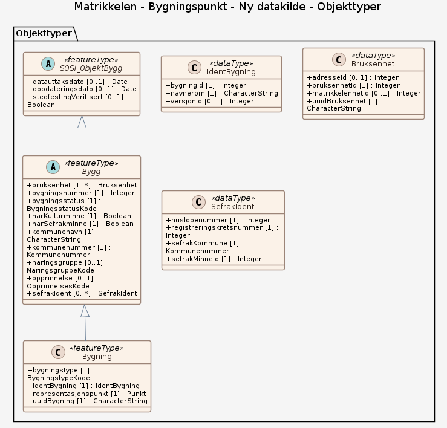

# Produktspesifikasjon: Matrikkelen - Bygningspunkt

*Datasettet Matrikkelen-Bygningspunkt inneholder et lite utdrag av bygningsinformasjonen som er registrert i Matrikkelen, Norges offisielle register over fast eiendom, herunder bygninger. 
Datasettet inneholder representasjonspunkt, bygningstype, bygningsnummer, nåværende bygningsstatus. I tillegg inneholder det ulike id-er for gjenfinning og koblinger (lokal id eller universell uuid) for bygning, og det leveres id(er) for adresse og eiendom pr bygning (hentet fra bruksenhetobjekter i matrikkelsystemet) samt Sefrak-id. 

Utgåtte bygninger er ikke med, - heller ikke bygningsendringer som for eksempel påbygg eller tilbygg.
Produktet inneholder data som er fritt tilgjengelig for alle.

Distribusjoner er satt opp mot en distribusjonsløsning som baserer seg på endringslogg-tjeneste fra Matrikkelsystemet. De ulike distribusjonene har ulik oppdateringsfrekvens, fra 15 minutters forsinkelse på WFS og nedlasting av fritt valgt område fra kart, daglig for kommunevise filer og ukentlig for fylkes- og lands-filer (ny fil kun hvis det er skjedd endringer i Matrikkelen). Ved større endringer/lastinger kan forsinkelsen bli større.*

**Nøkkelord:** Bygning, Bygninger, Bygningspunkt, Bygningstype, SEFRAK, Bygg, Matrikkel, Matrikkelen, Norge fastland, geodataloven, Norge digitalt, beredskapsbase, Det offentlige kartgrunnlaget, Inspire, modellbaserteVegprosjekter, fellesDatakatalog, Eiendom, Basis geodata, IdentBygning, Bruksenhet, SefrakIdent, uuidBygning, bygningId, adresseId, bruksenhetId, matrikkelenhetId, bygningsnummer, bygningsstatus, registrert i kulturminneregister, registrert i SEFRAK-registeret, opprinnelse, kommunenummer, kommunenavn, naringsgruppe

**Emnekategorier:** Basisdata

**Geografisk utstrekning**:

- **Vest**: 2.0
- **Øst**: 33.0
- **Sør**: 57.0
- **Nord**: 72.0

**Tidsmessig utstrekning**:

- **Tidsperiode**:
  - **Fra**: 2026-08-31
  - **Til**: 2026-08-31

## Om spesifikasjonen

> **Denne versjonen av produktspesifikasjonen:**  
> **Opprettet dato:**  
> **Endret dato:** 2026-08-31 
> **Språk:** nor 
> **Kontaktinformasjon:** Kartverket, [kundesenter@kartverket.no](mailto:kundesenter@kartverket.no)

## Om produktet Matrikkelen - Bygningspunkt

> **Romlig representasjonstype:** Vektor 
> **Unik identifikator:** <https://data.geonorge.no/sosi/matrikkel/bygningspunkt> 
> **Kontaktinformasjon:** Kartverket, [kundesenter@kartverket.no](mailto:kundesenter@kartverket.no)
>
> **Romlig oppløsning:**
>
> **Ekvivalent målestokk**: 1000
>
> **Begrensninger:**
>
> **Ressursbegrensninger**:
>
> - **Bruksbegrensninger**: Ingen begrensninger på bruk er oppgitt.
>
> **Juridiske begrensninger**:
>
> - **Tilgangsbegrensninger**: Åpne data
> - **Bruksbegrensninger**: Lisens
> - **Lisens**: Creative Commons BY 4.0 (CC BY 4.0)
> - **Lisenslenke**: <https://creativecommons.org/licenses/by/4.0/>
> - **Lovhenvisning**: Matrikkelloven §30, Forskrift om utlevering, viderebruk og annen behandling av opplysninger fra grunnboken og matrikkelen.
>
> **Sikkerhetsbegrensninger**:
>
> - **Klassifisering**: Ugradert

### Formål

Formålet med datasettet er å dekke behovet og kravet i DOK (det offentlige kartgrunnlaget) og å dekke behovet for bygningspunkt til de som ikke bruker MatrikkelAPI eller tjenester direkte mot matrikkelen. Datasettet er fritt tilgjengelig og krever ikke pålogging. Uttrekket tilsvarer bygningspunkt i FKB-Bygning. FKB-Bygning har i tillegg bygningsomrisset og flere detaljer til omrisset.

### Bruksområde

Kan for eksempel benyttes til kart og presentasjoner og til ulike analyser over bygninger og geografi. 
Datsettet inneholder koblinger mellom bygning, adresse og eiendom fra Matrikkelen, som vil gjøre det enklere å koble, analysere, gjenfinne og kontrollere disse dataene.
Datasettet har punkt-representasjon av bygninger.

## Omfang

### Hele datasettet

**Nivå**: dataset

**Nivåbeskrivelse**: Gjelder hele datasettet. Hvis omfang ikke er oppgitt under en overskrift, gjelder teksten for hele datasettet og alle leveranser

### Ny datakilde

**Nivå**: dataset

## Datainnhold og struktur

### Datamodell - Ny datakilde

➡️ [Se full datamodell for omfang "Ny datakilde" (diagram per pakke og objektkatalog)](ny-datakilde/objektkatalog.html)

## Referansesystem

| EPSG-kode | Navn på referansesystem |
| --- | --- |
| [EPSG:25832](https://epsg.io/25832) | [EUREF89 UTM sone 32, 2d](https://register.geonorge.no/epsg-koder) |
| [EPSG:25833](https://epsg.io/25833) | [EUREF89 UTM sone 33, 2d](https://register.geonorge.no/epsg-koder) |
| [EPSG:25835](https://epsg.io/25835) | [EUREF89 UTM sone 35, 2d](https://register.geonorge.no/epsg-koder) |
| [EPSG:3035](https://epsg.io/3035) | [EUREF89 / ETRS89-LAEA Europe](https://register.geonorge.no/epsg-koder) |
| [EPSG:4258](https://epsg.io/4258) | [EUREF 89 Geografisk (ETRS 89) 2d](https://register.geonorge.no/epsg-koder) |

## Datakvalitet

**Nivå**: dataset

- **Kvalitetsmål**: COMMISSION REGULATION (EU) No 1089/2010 of 23 November 2010 implementing Directive 2007/2/EC of the European Parliament and of the Council as regards interoperability of spatial data sets and services
  **Målebeskrivelse**: Dataene er ikke vurdert iht produktspesifikasjonen
  **Beskrivende resultat**: Dataene er ikke vurdert iht produktspesifikasjonen

- **Kvalitetsmål**: SOSI produktspesifikasjon: Matrikkelen - Bygningspunkt
  **Målebeskrivelse**: Dataene er i henhold til produktspesifikasjonen
  **Beskrivende resultat**: Dataene er i henhold til produktspesifikasjonen

- **Kvalitetsmål**: Sosi applikasjonsskjema
  **Målebeskrivelse**: SOSI-filer er i henhold til applikasjonsskjema
  **Beskrivende resultat**: SOSI-filer er i henhold til applikasjonsskjema

- **Kvalitetsmål**: Sosi applikasjonsskjema
  **Målebeskrivelse**: GML-filer er i henhold til applikasjonsskjema
  **Beskrivende resultat**: GML-filer er i henhold til applikasjonsskjema

- **Kvalitetsmål**: Prosentvis oppfyllelse av FAIR-prinsipper
  **Målebeskrivelse**: Angir fullstendighet i forhold til krav fra FAIR-prinsippene (The FAIR Guiding Principles for scientific data management and stewardship)
  **Resultat**: 98

- **Kvalitetsmål**: FAIR
  **Resultat**: Prosentvis oppfyllelse av FAIR-prinsipper: 98%

## Datafangst og produksjon

**Datainnsamling og prosessering**:

- **Prosesstrinn**:
  - **Beskrivelse**: Data har sin kilde i matrikkelsystemet som ble etablert fra 2007.\\n\\nBygningsdata har ulik kvalitet, vi kan grovt sett dele de i 3 ut fra alder på bygninger:\\n\\n-Etter 2010 (Matrikkelen ble innført)\\n\\n-1983-2010 (GAB-registeret, pålagt registrering av bygninger > 15m2)\\n\\n-Før 1983 (Massivregistrerte bygninger. Få opplysninger (f.eks punkt og bygningstype). Men det kan være etterregistrerte opplysninger, f.eks i forbindelse med eiendomsskatt)\\n\\nI dag vedlikeholdes matrikkeldata stort sett fra saksbehandling og av kommunene (ref Matrikkelloven).\\n\\nViser til matrikkelhistorie: <https://www.kartverket.no/globalassets/eiendom/matrikkel/kurs-i-matrikkelforing/2-den-norske-eiendomsregistreringens-historie.pdf>

## Vedlikehold

**Vedlikeholdsfrekvens**: Kontinuerlig

**Status**: Kontinuerlig oppdatert

## Presentasjon

**navn**: Tegneregler

**Lenke**:
<https://register.geonorge.no/register/versjoner/tegneregler/kartverket/matrikkelen-bygningspunkt>

## Leveranse

| Tjeneste | Endepunkt | Type | Format | Leveranseenheter |
| --- | --- | --- | --- | --- |
| Geonorge nedlastning | [Lenke](https://nedlasting.geonorge.no/api/capabilities/) | GEONORGE:DOWNLOAD | FGDB, GML, PostGIS, SOSI | fylkesvis, kommunevis, landsfiler |
| Atom Feed | [Lenke](http://nedlasting.geonorge.no/geonorge/ATOM-feeds/MatrikkelenBygning_AtomFeedFGDB.xml) | W3C:AtomFeed | FGDB | fylkesvis, kommunevis, landsfiler |
| Atom Feed | [Lenke](http://nedlasting.geonorge.no/geonorge/ATOM-feeds/MatrikkelenBygning_AtomFeedGML.xml) | W3C:AtomFeed | GML | fylkesvis, kommunevis, landsfiler |
| Atom Feed | [Lenke](http://nedlasting.geonorge.no/geonorge/ATOM-feeds/MatrikkelenBygning_AtomFeedPostGIS.xml) | W3C:AtomFeed | PostGIS | fylkesvis, kommunevis, landsfiler |
| Atom Feed | [Lenke](http://nedlasting.geonorge.no/geonorge/ATOM-feeds/MatrikkelenBygning_AtomFeedSOSI.xml) | W3C:AtomFeed | SOSI | fylkesvis, kommunevis, landsfiler |
| Matrikkelkart WMS | [Lenke](https://wms.geonorge.no/skwms1/wms.matrikkelkart?service=wms&request=getcapabilities) | WMS-tjeneste | jpeg |  |
| GML/XSD-skjema: ny-datakilde | [Lenke](https://raw.githubusercontent.com/KentJonsrud/produktspesifikasjon_mal/main/produktspesifikasjon/matrikkelen-bygningspunkt/ny-datakilde/schema/xsd/INPUT/ny-datakilde.xsd) | Nedlasting | XSD |  |

## Metadata

**Metadatastandard**: ISO19115

**Metadatastandardversjon**: 2003

**Metadatadato**: 2026-09-01

**språk**: nor

**Kontakt**:

- **Organisasjon**: Kartverket
- **Kontaktperson**: Kundesenter
- **Logo**: <https://register.geonorge.no/data/organizations/971040238_Kartverket_liten.png>
- **Epost**: kundesenter@kartverket.no
- **rolle**: pointOfContact

**Metadataidentifikator**:

- **Utsteder**: Geonorge
- **kode**: 24d7e9d1-87f6-45a0-b38e-3447f8d7f9a1
- **koderom**: <https://kartkatalog.geonorge.no/metadata/>
- **Metadatalenke**: <https://kartkatalog.geonorge.no/metadata/24d7e9d1-87f6-45a0-b38e-3447f8d7f9a1>

## Tilleggsinformasjon

Trenger du hjelp til å laste ned og ta i bruk Kartverkets data og tjenester? På kartverket.no finner du tips og veiledning.

- **Produktark:** [https://register.geonorge.no/register/versjoner/produktark/kartverket/matrikkelen-bygningspunkt](https://register.geonorge.no/register/versjoner/produktark/kartverket/matrikkelen-bygningspunkt)
- **Produktside:** [https://kartverket.no/eiendom/bygninger](https://kartverket.no/eiendom/bygninger)
