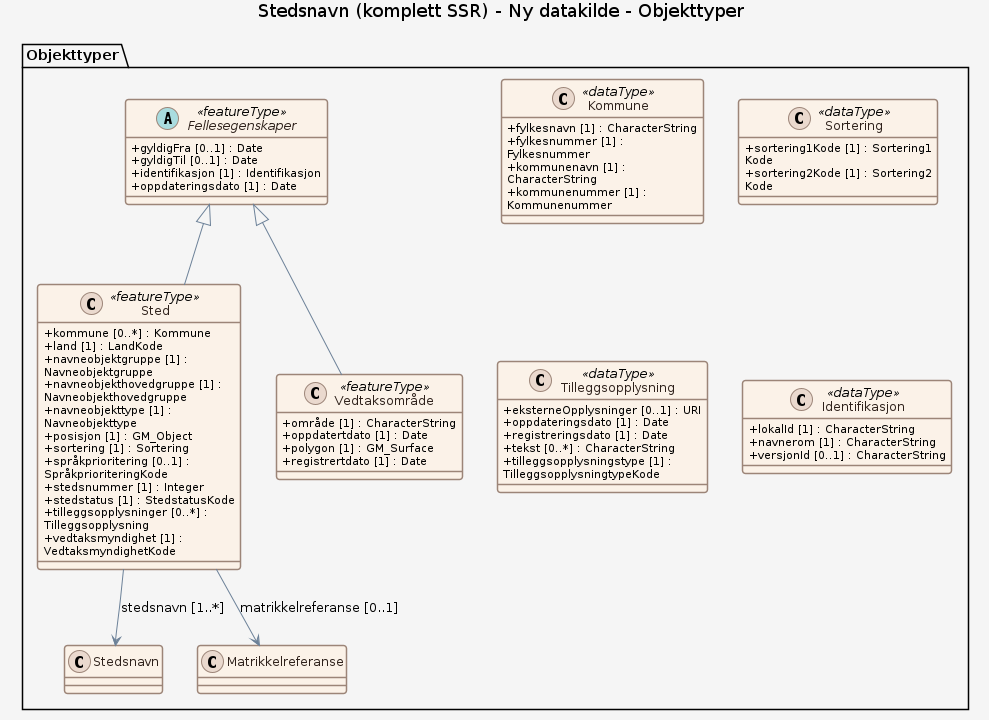

# Produktspesifikasjon: Stedsnavn (komplett SSR)

*Komplett versjon av Stedsnavn fra sentralt stedsnavnsregister (SSR). Stedsnavn på geografiske detaljer basert på kartseriene Norge 1:50 000, økonomisk kartverk, sjøkart og navnevedtak gjort etter lov 18. mai 1990 nr.11 om stadnamn. Hvert navn har opplysninger om språk/språkform, koordinater for posisjon (punkt) , kommunetilhørighet, temakode for navnetype, vedtakstype, dato for registrering av navnevedtak og i hvilken sammenheng navnet er benyttet.*

**Nøkkelord:** Stedsnavn, ssr, sentralt stedsnavnsregister, navn, kulturminne, kulturminner, Norge, fastland, Norske havområder, Norge digitalt, fellesDatakatalog, Basis geodata, Sted, Vedtaksområde, Dokumentasjon, Kommune, DokumentertKlage, Dokument, Tilleggsopplysning, DokumentertSamlevedtak, DokumentIdent, LokaleInnsamlinger, Bokreferanse, Kartforekomst, Skrivemåte, Sortering, KasusForSkrivemåte, DokumentertVedtak, Opplysning, offentligBruk, registreringsdato, kommunenummer, kommunenavn, fylkesnummer, fylkesnavn, arkivreferanse, klagedato, kortBeskrivelse, dokumentdato, beskrivelse, dokumenttype, eksterneOpplysninger, tekst, tilleggsopplysningstype, arkivløpenummer, utgått, vedtaksdato, vedtattAv, saksnummer, år, kildedato, innsamler, forfatter, side, referansetekst, isbn, tittel, utgave, utgivelsesår, eksonym, navnesakstatus, navnestatus, opphavsspråk, språk, stedsnavnnummer, tilleggsopplysninger, kartblad, produktkode, skann, utgiver, land, navneobjekthovedgruppe, navneobjektgruppe, navneobjekttype, stedstatus, språkprioritering, stedsnummer, vedtaksmyndighet, kortnavn, langnavn, skrivemåtenummer, skrivemåtestatus, prioritertSkrivemåte, rekkefølge, statusdato, oppdatertdato, polygon, registrertdato, sortering1Kode, sortering2Kode, funksjonstillegg, kasusTilKjernenavn, kjernenavn, variasjonstillegg, informant

**Emnekategorier:** Basisdata

**Geografisk utstrekning**:

- **Vest**: 2.0
- **Øst**: 33.0
- **Sør**: 57.0
- **Nord**: 72.0

**Tidsmessig utstrekning**:

- **Tidsperiode**:
  - **Fra**: 2019-01-29
  - **Til**: 2026-08-24

## Om spesifikasjonen

> **Denne versjonen av produktspesifikasjonen:**  
> **Opprettet dato:** 2019-01-29 
> **Endret dato:** 2026-08-24 
> **Språk:** nor 
> **Kontaktinformasjon:** Kartverket, [kundesenter@kartverket.no](mailto:kundesenter@kartverket.no)

## Om produktet Stedsnavn (komplett SSR)

> **Romlig representasjonstype:** Vektor 
> **Unik identifikator:** <https://data.geonorge.no/sosi/stedsnavn/stedsnavn_komplett_ssr> 
> **Kontaktinformasjon:** Kartverket, [kundesenter@kartverket.no](mailto:kundesenter@kartverket.no)
>
> **Romlig oppløsning:**
>
> **Ekvivalent målestokk**: 0
>
> **Begrensninger:**
>
> **Ressursbegrensninger**:
>
> - **Bruksbegrensninger**: Ingen begrensninger på bruk er oppgitt.
>
> **Juridiske begrensninger**:
>
> - **Tilgangsbegrensninger**: Åpne data
> - **Bruksbegrensninger**: Lisens
> - **Lisens**: Creative Commons BY 4.0 (CC BY 4.0)
> - **Lisenslenke**: <https://creativecommons.org/licenses/by/4.0/>
> - **Andre begrensninger**: Dataene kan lastes ned og benyttes av alle kostnadsfritt i tråd med creative commons by 3.0.
>
> **Sikkerhetsbegrensninger**:
>
> - **Klassifisering**: Ugradert

### Bruksområde

Analyse og presentasjon i GIS-system. Presentasjon av statistikk og analyser. Produksjon av kart og avledede produkter. Grunnlag for kart- og lokasjonstjenester på Internett. Forskning undervisning. Slektsforskning oppslagsreg

## Omfang

### Hele datasettet

**Nivå**: dataset

**Nivåbeskrivelse**: Gjelder hele datasettet. Hvis omfang ikke er oppgitt under en overskrift, gjelder teksten for hele datasettet og alle leveranser

### Ny datakilde

**Nivå**: dataset

**Nivåbeskrivelse**: sssss

## Datainnhold og struktur

### Datamodell - Ny datakilde

➡️ [Se full datamodell for omfang "Ny datakilde" (diagram per pakke og objektkatalog)](ny-datakilde/objektkatalog.html)

## Referansesystem

| EPSG-kode | Navn på referansesystem |
| --- | --- |
| [EPSG:4258](https://epsg.io/4258) | [EUREF 89 Geografisk (ETRS 89) 2d](https://register.geonorge.no/epsg-koder) |

## Datakvalitet

**Nivå**: dataset

- **Kvalitetsmål**: SOSI produktspesifikasjon: Stedsnavn
  **Målebeskrivelse**: Dataene er ikke vurdert iht produktspesifikasjonen
  **Beskrivende resultat**: Dataene er ikke vurdert iht produktspesifikasjonen

- **Kvalitetsmål**: Sosi applikasjonsskjema
  **Målebeskrivelse**: GML-filer er ikke vurdert i henhold til applikasjonsskjema
  **Beskrivende resultat**: GML-filer er ikke vurdert i henhold til applikasjonsskjema

## Datafangst og produksjon

**Datainnsamling og prosessering**:

- **Prosesstrinn**:
  - **Beskrivelse**: Ingen prosesshistorie tilgjengelig.

## Vedlikehold

**Vedlikeholdsfrekvens**: Kontinuerlig

**Status**: Kontinuerlig oppdatert

## Leveranse

| Tjeneste | Endepunkt | Type | Format | Leveranseenheter |
| --- | --- | --- | --- | --- |
| Geonorge nedlastning | [Lenke](https://nedlasting.geonorge.no/api/capabilities/) | GEONORGE:DOWNLOAD | GML | landsfiler |
| Atom Feed | [Lenke](http://nedlasting.geonorge.no/geonorge/ATOM-feeds/StedsnavnKomplettSSR_AtomFeedGML.xml) | W3C:AtomFeed | GML | landsfiler |
| Stedsnavn (komplett SSR) WMS | [Lenke](https://wms.geonorge.no/skwms1/wms.ssr2?service=wms&request=GetCapabilities) | WMS-tjeneste | png |  |

## Metadata

**Metadatastandard**: ISO19115

**Metadatastandardversjon**: 2003

**Metadatadato**: 2026-08-26

**språk**: nor

**Kontakt**:

- **Organisasjon**: Kartverket
- **Kontaktperson**: Ben Worsley
- **Logo**: <https://register.geonorge.no/data/organizations/971040238_Kartverket_liten.png>
- **Epost**: kundesenter@kartverket.no
- **rolle**: pointOfContact

**Metadataidentifikator**:

- **Utsteder**: Geonorge
- **kode**: e1c50348-962d-4047-8325-bdc265c853ed
- **koderom**: <https://kartkatalog.geonorge.no/metadata/>
- **Metadatalenke**: <https://kartkatalog.geonorge.no/metadata/e1c50348-962d-4047-8325-bdc265c853ed>

## Tilleggsinformasjon

Trenger du hjelp til å laste ned og ta i bruk Kartverkets data og tjenester? På kartverket.no finner du tips og veiledning.
