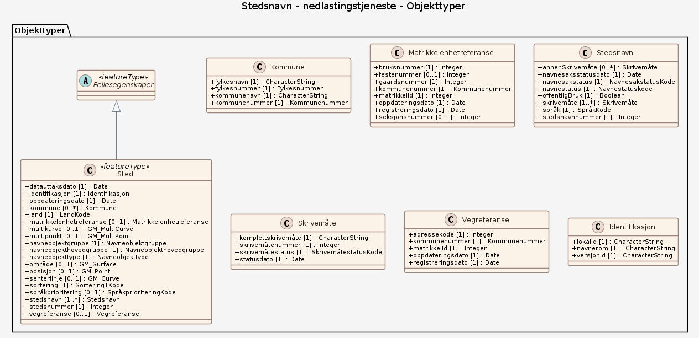

### Datamodell

#### Sted

Sted inneholder opplysninger som beskriver lokaliteten/objektet, blant annet navneobjekttype, beliggenhet og referanser.

Egenskaper

<table class="feature-attribute-table">
  <colgroup>
    <col style="width: 35%;" />
    <col style="width: 65%;" />
  </colgroup>
  <tbody>
    <tr>
      <th scope="row">Navn:</th>
      <td><strong>kommune</strong></td>
    </tr>
    <tr>
      <th scope="row">Definisjon:</th>
      <td>Stedets kommunetilknytning avhenger av stedets geografiske beligenhet og viser hvilke kommuner stedet ligger i.</td>
    </tr>
    <tr>
      <th scope="row">Multiplisitet:</th>
      <td>0..*</td>
    </tr>
    <tr>
      <th scope="row">Type:</th>
      <td>Kommune</td>
    </tr>
  </tbody>
</table>

<table class="feature-attribute-table">
  <colgroup>
    <col style="width: 35%;" />
    <col style="width: 65%;" />
  </colgroup>
  <tbody>
    <tr>
      <th scope="row">Navn:</th>
      <td><strong>kommune.fylkesnavn</strong></td>
    </tr>
    <tr>
      <th scope="row">Definisjon:</th>
      <td>Navnet på fylket, navnet vises på flere språk med riktig rekkefølge på språkene dersom fylket er flerspråklig.</td>
    </tr>
    <tr>
      <th scope="row">Multiplisitet:</th>
      <td>1</td>
    </tr>
    <tr>
      <th scope="row">Type:</th>
      <td>CharacterString</td>
    </tr>
  </tbody>
</table>

<table class="feature-attribute-table">
  <colgroup>
    <col style="width: 35%;" />
    <col style="width: 65%;" />
  </colgroup>
  <tbody>
    <tr>
      <th scope="row">Navn:</th>
      <td><strong>kommune.fylkesnummer</strong></td>
    </tr>
    <tr>
      <th scope="row">Definisjon:</th>
      <td>Fylkesnummer er definerte identifikasjonskoder for norske fylker og to territorier (Svalbard og Jan Mayen).</td>
    </tr>
    <tr>
      <th scope="row">Multiplisitet:</th>
      <td>1</td>
    </tr>
    <tr>
      <th scope="row">Type:</th>
      <td>Fylkesnummer</td>
    </tr>
    <tr>
      <th scope="row">Tillatte verdier:</th>
      <td>- Kodeliste: <a href="https://register.geonorge.no/sosi-kodelister/inndelinger/inndelingsbase/fylkesnummer">https://register.geonorge.no/sosi-kodelister/inndelinger/inndelingsbase/fylkesnummer</a></td>
    </tr>
  </tbody>
</table>

<table class="feature-attribute-table">
  <colgroup>
    <col style="width: 35%;" />
    <col style="width: 65%;" />
  </colgroup>
  <tbody>
    <tr>
      <th scope="row">Navn:</th>
      <td><strong>kommune.kommunenavn</strong></td>
    </tr>
    <tr>
      <th scope="row">Definisjon:</th>
      <td>Navnet på kommunen, navnet vises på flere språk i riktig rekkefølge dersom kommunen er flerspråklig.</td>
    </tr>
    <tr>
      <th scope="row">Multiplisitet:</th>
      <td>1</td>
    </tr>
    <tr>
      <th scope="row">Type:</th>
      <td>CharacterString</td>
    </tr>
  </tbody>
</table>

<table class="feature-attribute-table">
  <colgroup>
    <col style="width: 35%;" />
    <col style="width: 65%;" />
  </colgroup>
  <tbody>
    <tr>
      <th scope="row">Navn:</th>
      <td><strong>kommune.kommunenummer</strong></td>
    </tr>
    <tr>
      <th scope="row">Definisjon:</th>
      <td>Kommunenummer er et firesifret nummer for å identifisere kommuner (eks.: 0101) som er unikt for hver kommune i Norge.</td>
    </tr>
    <tr>
      <th scope="row">Multiplisitet:</th>
      <td>1</td>
    </tr>
    <tr>
      <th scope="row">Type:</th>
      <td>Kommunenummer</td>
    </tr>
    <tr>
      <th scope="row">Tillatte verdier:</th>
      <td>- Kodeliste: <a href="https://register.geonorge.no/sosi-kodelister/inndelinger/inndelingsbase/kommunenummer">https://register.geonorge.no/sosi-kodelister/inndelinger/inndelingsbase/kommunenummer</a></td>
    </tr>
  </tbody>
</table>

<table class="feature-attribute-table">
  <colgroup>
    <col style="width: 35%;" />
    <col style="width: 65%;" />
  </colgroup>
  <tbody>
    <tr>
      <th scope="row">Navn:</th>
      <td><strong>land</strong></td>
    </tr>
    <tr>
      <th scope="row">Definisjon:</th>
      <td>Landet som stedet er i.</td>
    </tr>
    <tr>
      <th scope="row">Multiplisitet:</th>
      <td>1</td>
    </tr>
    <tr>
      <th scope="row">Type:</th>
      <td>LandKode</td>
    </tr>
    <tr>
      <th scope="row">Tillatte verdier:</th>
      <td>- Kodeliste: <a href="https://register.geonorge.no/sosi-kodelister/stedsnavn/landkode">https://register.geonorge.no/sosi-kodelister/stedsnavn/landkode</a></td>
    </tr>
  </tbody>
</table>

<table class="feature-attribute-table">
  <colgroup>
    <col style="width: 35%;" />
    <col style="width: 65%;" />
  </colgroup>
  <tbody>
    <tr>
      <th scope="row">Navn:</th>
      <td><strong>matrikkelenhetreferanse</strong></td>
    </tr>
    <tr>
      <th scope="row">Definisjon:</th>
      <td>Referanse til matrikkelenhet i matrikkelen (eiendomsregisteret).</td>
    </tr>
    <tr>
      <th scope="row">Multiplisitet:</th>
      <td>0..1</td>
    </tr>
    <tr>
      <th scope="row">Type:</th>
      <td>Matrikkelenhetreferanse</td>
    </tr>
  </tbody>
</table>

<table class="feature-attribute-table">
  <colgroup>
    <col style="width: 35%;" />
    <col style="width: 65%;" />
  </colgroup>
  <tbody>
    <tr>
      <th scope="row">Navn:</th>
      <td><strong>matrikkelenhetreferanse.bruksnummer</strong></td>
    </tr>
    <tr>
      <th scope="row">Definisjon:</th>
      <td>Bruksnummer fra matrikkelen.</td>
    </tr>
    <tr>
      <th scope="row">Multiplisitet:</th>
      <td>1</td>
    </tr>
    <tr>
      <th scope="row">Type:</th>
      <td>Integer</td>
    </tr>
  </tbody>
</table>

<table class="feature-attribute-table">
  <colgroup>
    <col style="width: 35%;" />
    <col style="width: 65%;" />
  </colgroup>
  <tbody>
    <tr>
      <th scope="row">Navn:</th>
      <td><strong>matrikkelenhetreferanse.festenummer</strong></td>
    </tr>
    <tr>
      <th scope="row">Definisjon:</th>
      <td>Festenummer fra matrikkelen.</td>
    </tr>
    <tr>
      <th scope="row">Multiplisitet:</th>
      <td>0..1</td>
    </tr>
    <tr>
      <th scope="row">Type:</th>
      <td>Integer</td>
    </tr>
  </tbody>
</table>

<table class="feature-attribute-table">
  <colgroup>
    <col style="width: 35%;" />
    <col style="width: 65%;" />
  </colgroup>
  <tbody>
    <tr>
      <th scope="row">Navn:</th>
      <td><strong>matrikkelenhetreferanse.gaardsnummer</strong></td>
    </tr>
    <tr>
      <th scope="row">Definisjon:</th>
      <td>Gårdsnummer fra matrikkelen.</td>
    </tr>
    <tr>
      <th scope="row">Multiplisitet:</th>
      <td>1</td>
    </tr>
    <tr>
      <th scope="row">Type:</th>
      <td>Integer</td>
    </tr>
  </tbody>
</table>

<table class="feature-attribute-table">
  <colgroup>
    <col style="width: 35%;" />
    <col style="width: 65%;" />
  </colgroup>
  <tbody>
    <tr>
      <th scope="row">Navn:</th>
      <td><strong>matrikkelenhetreferanse.kommunenummer</strong></td>
    </tr>
    <tr>
      <th scope="row">Definisjon:</th>
      <td>Kommunenummer fra matrikkelen.</td>
    </tr>
    <tr>
      <th scope="row">Multiplisitet:</th>
      <td>1</td>
    </tr>
    <tr>
      <th scope="row">Type:</th>
      <td>Kommunenummer</td>
    </tr>
    <tr>
      <th scope="row">Tillatte verdier:</th>
      <td>- Kodeliste: <a href="https://register.geonorge.no/sosi-kodelister/inndelinger/inndelingsbase/kommunenummer">https://register.geonorge.no/sosi-kodelister/inndelinger/inndelingsbase/kommunenummer</a></td>
    </tr>
  </tbody>
</table>

<table class="feature-attribute-table">
  <colgroup>
    <col style="width: 35%;" />
    <col style="width: 65%;" />
  </colgroup>
  <tbody>
    <tr>
      <th scope="row">Navn:</th>
      <td><strong>matrikkelenhetreferanse.matrikkelId</strong></td>
    </tr>
    <tr>
      <th scope="row">Definisjon:</th>
      <td>Unik matrikkelenhetId for matrikkelenhetreferanser.</td>
    </tr>
    <tr>
      <th scope="row">Multiplisitet:</th>
      <td>1</td>
    </tr>
    <tr>
      <th scope="row">Type:</th>
      <td>Integer</td>
    </tr>
  </tbody>
</table>

<table class="feature-attribute-table">
  <colgroup>
    <col style="width: 35%;" />
    <col style="width: 65%;" />
  </colgroup>
  <tbody>
    <tr>
      <th scope="row">Navn:</th>
      <td><strong>matrikkelenhetreferanse.oppdateringsdato</strong></td>
    </tr>
    <tr>
      <th scope="row">Definisjon:</th>
      <td>Dato for siste oppdatering av matrikkelreferanse.</td>
    </tr>
    <tr>
      <th scope="row">Multiplisitet:</th>
      <td>1</td>
    </tr>
    <tr>
      <th scope="row">Type:</th>
      <td>DateTime</td>
    </tr>
  </tbody>
</table>

<table class="feature-attribute-table">
  <colgroup>
    <col style="width: 35%;" />
    <col style="width: 65%;" />
  </colgroup>
  <tbody>
    <tr>
      <th scope="row">Navn:</th>
      <td><strong>matrikkelenhetreferanse.registreringsdato</strong></td>
    </tr>
    <tr>
      <th scope="row">Definisjon:</th>
      <td>Dato for registrering av matrikkelreferanse.</td>
    </tr>
    <tr>
      <th scope="row">Multiplisitet:</th>
      <td>1</td>
    </tr>
    <tr>
      <th scope="row">Type:</th>
      <td>DateTime</td>
    </tr>
  </tbody>
</table>

<table class="feature-attribute-table">
  <colgroup>
    <col style="width: 35%;" />
    <col style="width: 65%;" />
  </colgroup>
  <tbody>
    <tr>
      <th scope="row">Navn:</th>
      <td><strong>matrikkelenhetreferanse.seksjonsnummer</strong></td>
    </tr>
    <tr>
      <th scope="row">Definisjon:</th>
      <td>Seksjonsnummer fra matrikkelen.</td>
    </tr>
    <tr>
      <th scope="row">Multiplisitet:</th>
      <td>0..1</td>
    </tr>
    <tr>
      <th scope="row">Type:</th>
      <td>Integer</td>
    </tr>
  </tbody>
</table>

<table class="feature-attribute-table">
  <colgroup>
    <col style="width: 35%;" />
    <col style="width: 65%;" />
  </colgroup>
  <tbody>
    <tr>
      <th scope="row">Navn:</th>
      <td><strong>multikurve</strong></td>
    </tr>
    <tr>
      <th scope="row">Definisjon:</th>
      <td>Stedets utstrekning representert som multikurve. Kun aktuell for steder som har navneobjekttypen Adressenavn.</td>
    </tr>
    <tr>
      <th scope="row">Multiplisitet:</th>
      <td>0..1</td>
    </tr>
    <tr>
      <th scope="row">Type:</th>
      <td>GM_MultiCurve</td>
    </tr>
  </tbody>
</table>

<table class="feature-attribute-table">
  <colgroup>
    <col style="width: 35%;" />
    <col style="width: 65%;" />
  </colgroup>
  <tbody>
    <tr>
      <th scope="row">Navn:</th>
      <td><strong>multipunkt</strong></td>
    </tr>
    <tr>
      <th scope="row">Definisjon:</th>
      <td>Multipunktet består av posisjoner navnet til det aktuelle stedet har blitt presentert på offentlig-utgitte kart.  Som regel representerer det første punkt i multipunktet stedets faktiske beliggenhet.</td>
    </tr>
    <tr>
      <th scope="row">Multiplisitet:</th>
      <td>0..1</td>
    </tr>
    <tr>
      <th scope="row">Type:</th>
      <td>GM_MultiPoint</td>
    </tr>
  </tbody>
</table>

<table class="feature-attribute-table">
  <colgroup>
    <col style="width: 35%;" />
    <col style="width: 65%;" />
  </colgroup>
  <tbody>
    <tr>
      <th scope="row">Navn:</th>
      <td><strong>navneobjektgruppe</strong></td>
    </tr>
    <tr>
      <th scope="row">Definisjon:</th>
      <td>Mellomnivå i navneobjekttype-hierarkiet.</td>
    </tr>
    <tr>
      <th scope="row">Multiplisitet:</th>
      <td>1</td>
    </tr>
    <tr>
      <th scope="row">Type:</th>
      <td>Navneobjektgruppe</td>
    </tr>
    <tr>
      <th scope="row">Tillatte verdier:</th>
      <td>- Kodeliste: <a href="https://register.geonorge.no/sosi-kodelister/stedsnavn/navneobjektgruppe">https://register.geonorge.no/sosi-kodelister/stedsnavn/navneobjektgruppe</a></td>
    </tr>
  </tbody>
</table>

<table class="feature-attribute-table">
  <colgroup>
    <col style="width: 35%;" />
    <col style="width: 65%;" />
  </colgroup>
  <tbody>
    <tr>
      <th scope="row">Navn:</th>
      <td><strong>navneobjekthovedgruppe</strong></td>
    </tr>
    <tr>
      <th scope="row">Definisjon:</th>
      <td>Generelle navneobjekttypegrupper, øverste nivå i navneobjekttypehierarkiet.</td>
    </tr>
    <tr>
      <th scope="row">Multiplisitet:</th>
      <td>1</td>
    </tr>
    <tr>
      <th scope="row">Type:</th>
      <td>Navneobjekthovedgruppe</td>
    </tr>
    <tr>
      <th scope="row">Tillatte verdier:</th>
      <td>- Kodeliste: <a href="https://register.geonorge.no/sosi-kodelister/stedsnavn/navneobjekthovedgruppe">https://register.geonorge.no/sosi-kodelister/stedsnavn/navneobjekthovedgruppe</a></td>
    </tr>
  </tbody>
</table>

<table class="feature-attribute-table">
  <colgroup>
    <col style="width: 35%;" />
    <col style="width: 65%;" />
  </colgroup>
  <tbody>
    <tr>
      <th scope="row">Navn:</th>
      <td><strong>navneobjekttype</strong></td>
    </tr>
    <tr>
      <th scope="row">Definisjon:</th>
      <td>Stedets navneobjekttype. Det mest spesifikke nivået i navneobjekttypehierarkiet.</td>
    </tr>
    <tr>
      <th scope="row">Multiplisitet:</th>
      <td>1</td>
    </tr>
    <tr>
      <th scope="row">Type:</th>
      <td>Navneobjekttype</td>
    </tr>
    <tr>
      <th scope="row">Tillatte verdier:</th>
      <td>- Kodeliste: <a href="https://register.geonorge.no/sosi-kodelister/stedsnavn/navneobjekttype">https://register.geonorge.no/sosi-kodelister/stedsnavn/navneobjekttype</a></td>
    </tr>
  </tbody>
</table>

<table class="feature-attribute-table">
  <colgroup>
    <col style="width: 35%;" />
    <col style="width: 65%;" />
  </colgroup>
  <tbody>
    <tr>
      <th scope="row">Navn:</th>
      <td><strong>område</strong></td>
    </tr>
    <tr>
      <th scope="row">Definisjon:</th>
      <td>Polygon som representerer stedets utstrekning.</td>
    </tr>
    <tr>
      <th scope="row">Multiplisitet:</th>
      <td>0..1</td>
    </tr>
    <tr>
      <th scope="row">Type:</th>
      <td>GM_Surface</td>
    </tr>
  </tbody>
</table>

<table class="feature-attribute-table">
  <colgroup>
    <col style="width: 35%;" />
    <col style="width: 65%;" />
  </colgroup>
  <tbody>
    <tr>
      <th scope="row">Navn:</th>
      <td><strong>posisjon</strong></td>
    </tr>
    <tr>
      <th scope="row">Definisjon:</th>
      <td>Punkt som representerer stedets beliggenhet.</td>
    </tr>
    <tr>
      <th scope="row">Multiplisitet:</th>
      <td>0..1</td>
    </tr>
    <tr>
      <th scope="row">Type:</th>
      <td>GM_Point</td>
    </tr>
  </tbody>
</table>

<table class="feature-attribute-table">
  <colgroup>
    <col style="width: 35%;" />
    <col style="width: 65%;" />
  </colgroup>
  <tbody>
    <tr>
      <th scope="row">Navn:</th>
      <td><strong>senterlinje</strong></td>
    </tr>
    <tr>
      <th scope="row">Definisjon:</th>
      <td>Kurve som representerer stedets utstrekning.</td>
    </tr>
    <tr>
      <th scope="row">Multiplisitet:</th>
      <td>0..1</td>
    </tr>
    <tr>
      <th scope="row">Type:</th>
      <td>GM_Curve</td>
    </tr>
  </tbody>
</table>

<table class="feature-attribute-table">
  <colgroup>
    <col style="width: 35%;" />
    <col style="width: 65%;" />
  </colgroup>
  <tbody>
    <tr>
      <th scope="row">Navn:</th>
      <td><strong>sortering</strong></td>
    </tr>
    <tr>
      <th scope="row">Definisjon:</th>
      <td>Sorteringskoden brukes til utvalg og presentasjon i SSR-klienten (internt saksbehandlingssystem). Skalaen går fra A til N, der steder med viktighetA er kun relevante innenfor et lite område og viktighetN er brukt på nasjonsnavn.</td>
    </tr>
    <tr>
      <th scope="row">Multiplisitet:</th>
      <td>1</td>
    </tr>
    <tr>
      <th scope="row">Type:</th>
      <td>Sortering1Kode</td>
    </tr>
    <tr>
      <th scope="row">Tillatte verdier:</th>
      <td>- Kodeliste: <a href="https://register.geonorge.no/sosi-kodelister/stedsnavn/sortering1kode">https://register.geonorge.no/sosi-kodelister/stedsnavn/sortering1kode</a></td>
    </tr>
  </tbody>
</table>

<table class="feature-attribute-table">
  <colgroup>
    <col style="width: 35%;" />
    <col style="width: 65%;" />
  </colgroup>
  <tbody>
    <tr>
      <th scope="row">Navn:</th>
      <td><strong>språkprioritering</strong></td>
    </tr>
    <tr>
      <th scope="row">Definisjon:</th>
      <td>Rekkefølge for presentasjon av et steds stedsnavn når stedet har navn på flere språk.</td>
    </tr>
    <tr>
      <th scope="row">Multiplisitet:</th>
      <td>0..1</td>
    </tr>
    <tr>
      <th scope="row">Type:</th>
      <td>SpråkprioriteringKode</td>
    </tr>
    <tr>
      <th scope="row">Tillatte verdier:</th>
      <td>- Kodeliste: <a href="https://register.geonorge.no/sosi-kodelister/stedsnavn/språkprioriteringkode">https://register.geonorge.no/sosi-kodelister/stedsnavn/språkprioriteringkode</a></td>
    </tr>
  </tbody>
</table>

<table class="feature-attribute-table">
  <colgroup>
    <col style="width: 35%;" />
    <col style="width: 65%;" />
  </colgroup>
  <tbody>
    <tr>
      <th scope="row">Navn:</th>
      <td><strong>stedsnavn</strong></td>
    </tr>
    <tr>
      <th scope="row">Definisjon:</th>
      <td>Stedets navn. Et sted kan ha ett eller flere navn på ett eller flere språk.</td>
    </tr>
    <tr>
      <th scope="row">Multiplisitet:</th>
      <td>1..*</td>
    </tr>
    <tr>
      <th scope="row">Type:</th>
      <td>Stedsnavn</td>
    </tr>
  </tbody>
</table>

<table class="feature-attribute-table">
  <colgroup>
    <col style="width: 35%;" />
    <col style="width: 65%;" />
  </colgroup>
  <tbody>
    <tr>
      <th scope="row">Navn:</th>
      <td><strong>stedsnavn.annenSkrivemåte</strong></td>
    </tr>
    <tr>
      <th scope="row">Definisjon:</th>
      <td>Skrivemåte(r) som er registrert på det aktuelle navnet, men som ikke er anbefalt å bruke i det offentlige.</td>
    </tr>
    <tr>
      <th scope="row">Multiplisitet:</th>
      <td>0..*</td>
    </tr>
    <tr>
      <th scope="row">Type:</th>
      <td>Skrivemåte</td>
    </tr>
  </tbody>
</table>

<table class="feature-attribute-table">
  <colgroup>
    <col style="width: 35%;" />
    <col style="width: 65%;" />
  </colgroup>
  <tbody>
    <tr>
      <th scope="row">Navn:</th>
      <td><strong>stedsnavn.annenSkrivemåte.komplettskrivemåte</strong></td>
    </tr>
    <tr>
      <th scope="row">Definisjon:</th>
      <td>Fullstendig skrivemåte. Skrivemåter av samiske og kvenske navn kan ha registrert flere kasusformer i SSR, og i de tilfellene vil det være kasusene Genitiv eller Genitiv/Akkusativ som presenteres i dette datasettet.</td>
    </tr>
    <tr>
      <th scope="row">Multiplisitet:</th>
      <td>1</td>
    </tr>
    <tr>
      <th scope="row">Type:</th>
      <td>CharacterString</td>
    </tr>
  </tbody>
</table>

<table class="feature-attribute-table">
  <colgroup>
    <col style="width: 35%;" />
    <col style="width: 65%;" />
  </colgroup>
  <tbody>
    <tr>
      <th scope="row">Navn:</th>
      <td><strong>stedsnavn.annenSkrivemåte.skrivemåtenummer</strong></td>
    </tr>
    <tr>
      <th scope="row">Definisjon:</th>
      <td>Skrivemåtenummeret er unikt innenfor stedsnavnet skrivemåten er registrert på. SSR-oppslagsnummeret består av Stedsnummer, Stedsnavnnummer og Skrivemåtenummer (eksempel: 1234/1/1).</td>
    </tr>
    <tr>
      <th scope="row">Multiplisitet:</th>
      <td>1</td>
    </tr>
    <tr>
      <th scope="row">Type:</th>
      <td>Integer</td>
    </tr>
  </tbody>
</table>

<table class="feature-attribute-table">
  <colgroup>
    <col style="width: 35%;" />
    <col style="width: 65%;" />
  </colgroup>
  <tbody>
    <tr>
      <th scope="row">Navn:</th>
      <td><strong>stedsnavn.annenSkrivemåte.skrivemåtestatus</strong></td>
    </tr>
    <tr>
      <th scope="row">Definisjon:</th>
      <td>Gjeldende status for skrivemåten.</td>
    </tr>
    <tr>
      <th scope="row">Multiplisitet:</th>
      <td>1</td>
    </tr>
    <tr>
      <th scope="row">Type:</th>
      <td>SkrivemåtestatusKode</td>
    </tr>
    <tr>
      <th scope="row">Tillatte verdier:</th>
      <td>- Kodeliste: <a href="https://register.geonorge.no/sosi-kodelister/stedsnavn/skrivemåtestatuskode">https://register.geonorge.no/sosi-kodelister/stedsnavn/skrivemåtestatuskode</a></td>
    </tr>
  </tbody>
</table>

<table class="feature-attribute-table">
  <colgroup>
    <col style="width: 35%;" />
    <col style="width: 65%;" />
  </colgroup>
  <tbody>
    <tr>
      <th scope="row">Navn:</th>
      <td><strong>stedsnavn.annenSkrivemåte.statusdato</strong></td>
    </tr>
    <tr>
      <th scope="row">Definisjon:</th>
      <td>Datoen den gjeldende skrivemåtestatusen gjelder fra.</td>
    </tr>
    <tr>
      <th scope="row">Multiplisitet:</th>
      <td>1</td>
    </tr>
    <tr>
      <th scope="row">Type:</th>
      <td>Date</td>
    </tr>
  </tbody>
</table>

<table class="feature-attribute-table">
  <colgroup>
    <col style="width: 35%;" />
    <col style="width: 65%;" />
  </colgroup>
  <tbody>
    <tr>
      <th scope="row">Navn:</th>
      <td><strong>stedsnavn.navnesaksstatusdato</strong></td>
    </tr>
    <tr>
      <th scope="row">Definisjon:</th>
      <td>Datoen som gjeldende navnesaksstatus gjelder fra.</td>
    </tr>
    <tr>
      <th scope="row">Multiplisitet:</th>
      <td>1</td>
    </tr>
    <tr>
      <th scope="row">Type:</th>
      <td>Date</td>
    </tr>
  </tbody>
</table>

<table class="feature-attribute-table">
  <colgroup>
    <col style="width: 35%;" />
    <col style="width: 65%;" />
  </colgroup>
  <tbody>
    <tr>
      <th scope="row">Navn:</th>
      <td><strong>stedsnavn.navnesakstatus</strong></td>
    </tr>
    <tr>
      <th scope="row">Definisjon:</th>
      <td>Gjeldende saksbehandlingsstatus for stedsnavnet og de tilhørende skrivemåtene.</td>
    </tr>
    <tr>
      <th scope="row">Multiplisitet:</th>
      <td>1</td>
    </tr>
    <tr>
      <th scope="row">Type:</th>
      <td>NavnesakstatusKode</td>
    </tr>
    <tr>
      <th scope="row">Tillatte verdier:</th>
      <td>- Kodeliste: <a href="https://register.geonorge.no/sosi-kodelister/stedsnavn/navnesakstatuskode">https://register.geonorge.no/sosi-kodelister/stedsnavn/navnesakstatuskode</a></td>
    </tr>
  </tbody>
</table>

<table class="feature-attribute-table">
  <colgroup>
    <col style="width: 35%;" />
    <col style="width: 65%;" />
  </colgroup>
  <tbody>
    <tr>
      <th scope="row">Navn:</th>
      <td><strong>stedsnavn.navnestatus</strong></td>
    </tr>
    <tr>
      <th scope="row">Definisjon:</th>
      <td>Gjeldende navnestatus for stedsnavnet.</td>
    </tr>
    <tr>
      <th scope="row">Multiplisitet:</th>
      <td>1</td>
    </tr>
    <tr>
      <th scope="row">Type:</th>
      <td>Navnestatuskode</td>
    </tr>
    <tr>
      <th scope="row">Tillatte verdier:</th>
      <td>- Kodeliste: <a href="https://register.geonorge.no/sosi-kodelister/stedsnavn/navnestatuskode">https://register.geonorge.no/sosi-kodelister/stedsnavn/navnestatuskode</a></td>
    </tr>
  </tbody>
</table>

<table class="feature-attribute-table">
  <colgroup>
    <col style="width: 35%;" />
    <col style="width: 65%;" />
  </colgroup>
  <tbody>
    <tr>
      <th scope="row">Navn:</th>
      <td><strong>stedsnavn.offentligBruk</strong></td>
    </tr>
    <tr>
      <th scope="row">Definisjon:</th>
      <td>True = Stedsnavnet kan brukes i offentlig kommunikasjon. False = Stedsnavnet skal ikke brukes i offentlig kommunikasjon.</td>
    </tr>
    <tr>
      <th scope="row">Multiplisitet:</th>
      <td>1</td>
    </tr>
    <tr>
      <th scope="row">Type:</th>
      <td>Boolean</td>
    </tr>
  </tbody>
</table>

<table class="feature-attribute-table">
  <colgroup>
    <col style="width: 35%;" />
    <col style="width: 65%;" />
  </colgroup>
  <tbody>
    <tr>
      <th scope="row">Navn:</th>
      <td><strong>stedsnavn.skrivemåte</strong></td>
    </tr>
    <tr>
      <th scope="row">Definisjon:</th>
      <td>Skrivemåten(e) som er anbefalt til offentlig bruk. Som regel er det bare én anbefalt skrivemåte, men det kan forekomme stedsnavn med to eller flere vedtatte skrivemåter.</td>
    </tr>
    <tr>
      <th scope="row">Multiplisitet:</th>
      <td>1..*</td>
    </tr>
    <tr>
      <th scope="row">Type:</th>
      <td>Skrivemåte</td>
    </tr>
  </tbody>
</table>

<table class="feature-attribute-table">
  <colgroup>
    <col style="width: 35%;" />
    <col style="width: 65%;" />
  </colgroup>
  <tbody>
    <tr>
      <th scope="row">Navn:</th>
      <td><strong>stedsnavn.skrivemåte.komplettskrivemåte</strong></td>
    </tr>
    <tr>
      <th scope="row">Definisjon:</th>
      <td>Fullstendig skrivemåte. Skrivemåter av samiske og kvenske navn kan ha registrert flere kasusformer i SSR, og i de tilfellene vil det være kasusene Genitiv eller Genitiv/Akkusativ som presenteres i dette datasettet.</td>
    </tr>
    <tr>
      <th scope="row">Multiplisitet:</th>
      <td>1</td>
    </tr>
    <tr>
      <th scope="row">Type:</th>
      <td>CharacterString</td>
    </tr>
  </tbody>
</table>

<table class="feature-attribute-table">
  <colgroup>
    <col style="width: 35%;" />
    <col style="width: 65%;" />
  </colgroup>
  <tbody>
    <tr>
      <th scope="row">Navn:</th>
      <td><strong>stedsnavn.skrivemåte.skrivemåtenummer</strong></td>
    </tr>
    <tr>
      <th scope="row">Definisjon:</th>
      <td>Skrivemåtenummeret er unikt innenfor stedsnavnet skrivemåten er registrert på. SSR-oppslagsnummeret består av Stedsnummer, Stedsnavnnummer og Skrivemåtenummer (eksempel: 1234/1/1).</td>
    </tr>
    <tr>
      <th scope="row">Multiplisitet:</th>
      <td>1</td>
    </tr>
    <tr>
      <th scope="row">Type:</th>
      <td>Integer</td>
    </tr>
  </tbody>
</table>

<table class="feature-attribute-table">
  <colgroup>
    <col style="width: 35%;" />
    <col style="width: 65%;" />
  </colgroup>
  <tbody>
    <tr>
      <th scope="row">Navn:</th>
      <td><strong>stedsnavn.skrivemåte.skrivemåtestatus</strong></td>
    </tr>
    <tr>
      <th scope="row">Definisjon:</th>
      <td>Gjeldende status for skrivemåten.</td>
    </tr>
    <tr>
      <th scope="row">Multiplisitet:</th>
      <td>1</td>
    </tr>
    <tr>
      <th scope="row">Type:</th>
      <td>SkrivemåtestatusKode</td>
    </tr>
    <tr>
      <th scope="row">Tillatte verdier:</th>
      <td>- Kodeliste: <a href="https://register.geonorge.no/sosi-kodelister/stedsnavn/skrivemåtestatuskode">https://register.geonorge.no/sosi-kodelister/stedsnavn/skrivemåtestatuskode</a></td>
    </tr>
  </tbody>
</table>

<table class="feature-attribute-table">
  <colgroup>
    <col style="width: 35%;" />
    <col style="width: 65%;" />
  </colgroup>
  <tbody>
    <tr>
      <th scope="row">Navn:</th>
      <td><strong>stedsnavn.skrivemåte.statusdato</strong></td>
    </tr>
    <tr>
      <th scope="row">Definisjon:</th>
      <td>Datoen den gjeldende skrivemåtestatusen gjelder fra.</td>
    </tr>
    <tr>
      <th scope="row">Multiplisitet:</th>
      <td>1</td>
    </tr>
    <tr>
      <th scope="row">Type:</th>
      <td>Date</td>
    </tr>
  </tbody>
</table>

<table class="feature-attribute-table">
  <colgroup>
    <col style="width: 35%;" />
    <col style="width: 65%;" />
  </colgroup>
  <tbody>
    <tr>
      <th scope="row">Navn:</th>
      <td><strong>stedsnavn.språk</strong></td>
    </tr>
    <tr>
      <th scope="row">Definisjon:</th>
      <td>Språk for det aktuelle stedsnavnet.</td>
    </tr>
    <tr>
      <th scope="row">Multiplisitet:</th>
      <td>1</td>
    </tr>
    <tr>
      <th scope="row">Type:</th>
      <td>SpråkKode</td>
    </tr>
    <tr>
      <th scope="row">Tillatte verdier:</th>
      <td>- Kodeliste: <a href="https://register.geonorge.no/sosi-kodelister/stedsnavn/SpråkKode">https://register.geonorge.no/sosi-kodelister/stedsnavn/SpråkKode</a></td>
    </tr>
  </tbody>
</table>

<table class="feature-attribute-table">
  <colgroup>
    <col style="width: 35%;" />
    <col style="width: 65%;" />
  </colgroup>
  <tbody>
    <tr>
      <th scope="row">Navn:</th>
      <td><strong>stedsnavn.stedsnavnnummer</strong></td>
    </tr>
    <tr>
      <th scope="row">Definisjon:</th>
      <td>Stedsnavnsnummeret er unikt innenfor stedet skrivemåten er registrert på. SSR-oppslagsnummeret består av Stedsnummer, Stedsnavnnummer og Skrivemåtenummer (eksempel: 1234/1/1).</td>
    </tr>
    <tr>
      <th scope="row">Multiplisitet:</th>
      <td>1</td>
    </tr>
    <tr>
      <th scope="row">Type:</th>
      <td>Integer</td>
    </tr>
  </tbody>
</table>

<table class="feature-attribute-table">
  <colgroup>
    <col style="width: 35%;" />
    <col style="width: 65%;" />
  </colgroup>
  <tbody>
    <tr>
      <th scope="row">Navn:</th>
      <td><strong>stedsnummer</strong></td>
    </tr>
    <tr>
      <th scope="row">Definisjon:</th>
      <td>Stedsnummeret er unikt i SSR. SSR-oppslagsnummeret består av Stedsnummer, Stedsnavnnummer og Skrivemåtenummer (eks: 1234/1/1).</td>
    </tr>
    <tr>
      <th scope="row">Multiplisitet:</th>
      <td>1</td>
    </tr>
    <tr>
      <th scope="row">Type:</th>
      <td>Integer</td>
    </tr>
  </tbody>
</table>

<table class="feature-attribute-table">
  <colgroup>
    <col style="width: 35%;" />
    <col style="width: 65%;" />
  </colgroup>
  <tbody>
    <tr>
      <th scope="row">Navn:</th>
      <td><strong>vegreferanse</strong></td>
    </tr>
    <tr>
      <th scope="row">Definisjon:</th>
      <td>Referanse til Veg i matrikkelen. Det er kun steder med navneobjekttypen Adressenavn som har denne typen referanse.</td>
    </tr>
    <tr>
      <th scope="row">Multiplisitet:</th>
      <td>0..1</td>
    </tr>
    <tr>
      <th scope="row">Type:</th>
      <td>Vegreferanse</td>
    </tr>
  </tbody>
</table>

<table class="feature-attribute-table">
  <colgroup>
    <col style="width: 35%;" />
    <col style="width: 65%;" />
  </colgroup>
  <tbody>
    <tr>
      <th scope="row">Navn:</th>
      <td><strong>vegreferanse.adressekode</strong></td>
    </tr>
    <tr>
      <th scope="row">Definisjon:</th>
      <td>Unik kode for vegen i matrikkelen i gjeldende kommune.</td>
    </tr>
    <tr>
      <th scope="row">Multiplisitet:</th>
      <td>1</td>
    </tr>
    <tr>
      <th scope="row">Type:</th>
      <td>Integer</td>
    </tr>
  </tbody>
</table>

<table class="feature-attribute-table">
  <colgroup>
    <col style="width: 35%;" />
    <col style="width: 65%;" />
  </colgroup>
  <tbody>
    <tr>
      <th scope="row">Navn:</th>
      <td><strong>vegreferanse.kommunenummer</strong></td>
    </tr>
    <tr>
      <th scope="row">Definisjon:</th>
      <td>4 sifret kommunenummer.</td>
    </tr>
    <tr>
      <th scope="row">Multiplisitet:</th>
      <td>1</td>
    </tr>
    <tr>
      <th scope="row">Type:</th>
      <td>Kommunenummer</td>
    </tr>
    <tr>
      <th scope="row">Tillatte verdier:</th>
      <td>- Kodeliste: <a href="https://register.geonorge.no/sosi-kodelister/inndelinger/inndelingsbase/kommunenummer">https://register.geonorge.no/sosi-kodelister/inndelinger/inndelingsbase/kommunenummer</a></td>
    </tr>
  </tbody>
</table>

<table class="feature-attribute-table">
  <colgroup>
    <col style="width: 35%;" />
    <col style="width: 65%;" />
  </colgroup>
  <tbody>
    <tr>
      <th scope="row">Navn:</th>
      <td><strong>vegreferanse.matrikkelId</strong></td>
    </tr>
    <tr>
      <th scope="row">Definisjon:</th>
      <td>Unik vegId for vegreferanser og unik matrikkelenhetId for matrikkelenhetreferanser.</td>
    </tr>
    <tr>
      <th scope="row">Multiplisitet:</th>
      <td>1</td>
    </tr>
    <tr>
      <th scope="row">Type:</th>
      <td>Integer</td>
    </tr>
  </tbody>
</table>

<table class="feature-attribute-table">
  <colgroup>
    <col style="width: 35%;" />
    <col style="width: 65%;" />
  </colgroup>
  <tbody>
    <tr>
      <th scope="row">Navn:</th>
      <td><strong>vegreferanse.oppdateringsdato</strong></td>
    </tr>
    <tr>
      <th scope="row">Definisjon:</th>
      <td>Dato for siste oppdatering av matrikkelreferanse.</td>
    </tr>
    <tr>
      <th scope="row">Multiplisitet:</th>
      <td>1</td>
    </tr>
    <tr>
      <th scope="row">Type:</th>
      <td>DateTime</td>
    </tr>
  </tbody>
</table>

<table class="feature-attribute-table">
  <colgroup>
    <col style="width: 35%;" />
    <col style="width: 65%;" />
  </colgroup>
  <tbody>
    <tr>
      <th scope="row">Navn:</th>
      <td><strong>vegreferanse.registreringsdato</strong></td>
    </tr>
    <tr>
      <th scope="row">Definisjon:</th>
      <td>Dato for registrering av matrikkelreferanse.</td>
    </tr>
    <tr>
      <th scope="row">Multiplisitet:</th>
      <td>1</td>
    </tr>
    <tr>
      <th scope="row">Type:</th>
      <td>DateTime</td>
    </tr>
  </tbody>
</table>

Relasjoner

**Arv**
Fellesegenskaper

#### Fellesegenskaper (abstrakt)

abstrakt objekttype som bærer sentrale egenskaper som er anbefalt for bruk i produktspesifikasjoner.  Merknad: Disse egenskapene skal derfor ikke modelleres inn i fagområdemodeller.

Egenskaper

<table class="feature-attribute-table">
  <colgroup>
    <col style="width: 35%;" />
    <col style="width: 65%;" />
  </colgroup>
  <tbody>
    <tr>
      <th scope="row">Navn:</th>
      <td><strong>datauttaksdato</strong></td>
    </tr>
    <tr>
      <th scope="row">Definisjon:</th>
      <td>dato for uttak fra en database  Merknad: Skiller seg fra Kopidato ved at en ikke skiller på om det er uttak fra en originaldatabase eller en kopidatabase.</td>
    </tr>
    <tr>
      <th scope="row">Multiplisitet:</th>
      <td>1</td>
    </tr>
    <tr>
      <th scope="row">Type:</th>
      <td>DateTime</td>
    </tr>
  </tbody>
</table>

<table class="feature-attribute-table">
  <colgroup>
    <col style="width: 35%;" />
    <col style="width: 65%;" />
  </colgroup>
  <tbody>
    <tr>
      <th scope="row">Navn:</th>
      <td><strong>identifikasjon</strong></td>
    </tr>
    <tr>
      <th scope="row">Definisjon:</th>
      <td>unik identifikasjon av et objekt</td>
    </tr>
    <tr>
      <th scope="row">Multiplisitet:</th>
      <td>1</td>
    </tr>
    <tr>
      <th scope="row">Type:</th>
      <td>Identifikasjon</td>
    </tr>
  </tbody>
</table>

<table class="feature-attribute-table">
  <colgroup>
    <col style="width: 35%;" />
    <col style="width: 65%;" />
  </colgroup>
  <tbody>
    <tr>
      <th scope="row">Navn:</th>
      <td><strong>identifikasjon.lokalId</strong></td>
    </tr>
    <tr>
      <th scope="row">Definisjon:</th>
      <td>lokal identifikator av et objekt  Merknad: Det er dataleverendørens ansvar å sørge for at den lokale identifikatoren er unik innenfor navnerommet.</td>
    </tr>
    <tr>
      <th scope="row">Multiplisitet:</th>
      <td>1</td>
    </tr>
    <tr>
      <th scope="row">Type:</th>
      <td>CharacterString</td>
    </tr>
  </tbody>
</table>

<table class="feature-attribute-table">
  <colgroup>
    <col style="width: 35%;" />
    <col style="width: 65%;" />
  </colgroup>
  <tbody>
    <tr>
      <th scope="row">Navn:</th>
      <td><strong>identifikasjon.navnerom</strong></td>
    </tr>
    <tr>
      <th scope="row">Definisjon:</th>
      <td>navnerom som unikt identifiserer datakilden til et objekt, anbefales å være en http-URI  Eksempel: <a href="http://data.geonorge.no/SentraltStedsnavnsregister/1.0">http://data.geonorge.no/SentraltStedsnavnsregister/1.0</a>  Merknad : Verdien for nanverom vil eies av den dataprodusent som har ansvar for de unike identifikatorene og må være registrert i data.geonorge.no eller data.norge.no</td>
    </tr>
    <tr>
      <th scope="row">Multiplisitet:</th>
      <td>1</td>
    </tr>
    <tr>
      <th scope="row">Type:</th>
      <td>CharacterString</td>
    </tr>
  </tbody>
</table>

<table class="feature-attribute-table">
  <colgroup>
    <col style="width: 35%;" />
    <col style="width: 65%;" />
  </colgroup>
  <tbody>
    <tr>
      <th scope="row">Navn:</th>
      <td><strong>identifikasjon.versjonId</strong></td>
    </tr>
    <tr>
      <th scope="row">Definisjon:</th>
      <td>identifikasjon av en spesiell versjon av et geografisk objekt (instans)</td>
    </tr>
    <tr>
      <th scope="row">Multiplisitet:</th>
      <td>1</td>
    </tr>
    <tr>
      <th scope="row">Type:</th>
      <td>CharacterString</td>
    </tr>
  </tbody>
</table>

<table class="feature-attribute-table">
  <colgroup>
    <col style="width: 35%;" />
    <col style="width: 65%;" />
  </colgroup>
  <tbody>
    <tr>
      <th scope="row">Navn:</th>
      <td><strong>oppdateringsdato</strong></td>
    </tr>
    <tr>
      <th scope="row">Definisjon:</th>
      <td>dato for siste endring på objektetdataene  Merknad: Oppdateringsdato kan være forskjellig fra Datafangsdato ved at data som er registrert kan bufres en kortere eller lengre periode før disse legges inn i datasystemet (databasen).</td>
    </tr>
    <tr>
      <th scope="row">Multiplisitet:</th>
      <td>1</td>
    </tr>
    <tr>
      <th scope="row">Type:</th>
      <td>DateTime</td>
    </tr>
  </tbody>
</table>

### Kodelister

#### «CodeList» Fylkesnummer

**Definisjon:** Tosifret fylkesnummer. Merk at denne kodelista er spesifikk for stedsnavndata siden den inneholder både gjeldende og utgåtte fylker.

Profilparametre i tagged values

<table class="feature-attribute-table">
  <colgroup>
    <col style="width: 35%;" />
    <col style="width: 65%;" />
  </colgroup>
  <tbody>
    <tr>
      <th scope="row">asDictionary</th>
      <td>true</td>
    </tr>
    <tr>
      <th scope="row">codeList</th>
      <td><a href="https://register.geonorge.no/sosi-kodelister/inndelinger/inndelingsbase/fylkesnummer">https://register.geonorge.no/sosi-kodelister/inndelinger/inndelingsbase/fylkesnummer</a></td>
    </tr>
  </tbody>
</table>

#### «CodeList» Kommunenummer

**Definisjon:** Firesifret kommunenummer. Merk at denne kodelista er spesifikk for stedsnavndata siden den inneholder både gjeldende og utgåtte kommuner.

Profilparametre i tagged values

<table class="feature-attribute-table">
  <colgroup>
    <col style="width: 35%;" />
    <col style="width: 65%;" />
  </colgroup>
  <tbody>
    <tr>
      <th scope="row">asDictionary</th>
      <td>true</td>
    </tr>
    <tr>
      <th scope="row">codeList</th>
      <td><a href="https://register.geonorge.no/sosi-kodelister/inndelinger/inndelingsbase/kommunenummer">https://register.geonorge.no/sosi-kodelister/inndelinger/inndelingsbase/kommunenummer</a></td>
    </tr>
  </tbody>
</table>

#### «CodeList» LandKode

**Definisjon:** Navn på land + «Internasjonalt farvann» og «Uspesifisert».

Profilparametre i tagged values

<table class="feature-attribute-table">
  <colgroup>
    <col style="width: 35%;" />
    <col style="width: 65%;" />
  </colgroup>
  <tbody>
    <tr>
      <th scope="row">asDictionary</th>
      <td>true</td>
    </tr>
    <tr>
      <th scope="row">codeList</th>
      <td><a href="https://register.geonorge.no/sosi-kodelister/stedsnavn/landkode">https://register.geonorge.no/sosi-kodelister/stedsnavn/landkode</a></td>
    </tr>
  </tbody>
</table>

#### «CodeList» Navneobjektgruppe

**Definisjon:** Mellomnivå i navneobjekttype-hierarkiet.

Profilparametre i tagged values

<table class="feature-attribute-table">
  <colgroup>
    <col style="width: 35%;" />
    <col style="width: 65%;" />
  </colgroup>
  <tbody>
    <tr>
      <th scope="row">asDictionary</th>
      <td>true</td>
    </tr>
    <tr>
      <th scope="row">codeList</th>
      <td><a href="https://register.geonorge.no/sosi-kodelister/stedsnavn/navneobjektgruppe">https://register.geonorge.no/sosi-kodelister/stedsnavn/navneobjektgruppe</a></td>
    </tr>
  </tbody>
</table>

#### «CodeList» Navneobjekthovedgruppe

**Definisjon:** Øverste nivå i navneobjekttype-hierarkiet.
Hovedgruppene følger i hovedsak INSPIRE Geographical Names «Named Place Type», med følgende unntak:
1. Hovedgruppen «Bebyggelse» omfatter både INSPIREs «populatedPlace» og «building».
2. Hovedgruppene «sjø» og «ferskvann» kan betraktes som underkategorier av INSPIREs «hydrography».

Profilparametre i tagged values

<table class="feature-attribute-table">
  <colgroup>
    <col style="width: 35%;" />
    <col style="width: 65%;" />
  </colgroup>
  <tbody>
    <tr>
      <th scope="row">asDictionary</th>
      <td>true</td>
    </tr>
    <tr>
      <th scope="row">codeList</th>
      <td><a href="https://register.geonorge.no/sosi-kodelister/stedsnavn/navneobjekthovedgruppe">https://register.geonorge.no/sosi-kodelister/stedsnavn/navneobjekthovedgruppe</a></td>
    </tr>
  </tbody>
</table>

#### «CodeList» Navneobjekttype

**Definisjon:** Sted-/lokalitetstyper.

Profilparametre i tagged values

<table class="feature-attribute-table">
  <colgroup>
    <col style="width: 35%;" />
    <col style="width: 65%;" />
  </colgroup>
  <tbody>
    <tr>
      <th scope="row">asDictionary</th>
      <td>true</td>
    </tr>
    <tr>
      <th scope="row">codeList</th>
      <td><a href="https://register.geonorge.no/sosi-kodelister/stedsnavn/navneobjekttype">https://register.geonorge.no/sosi-kodelister/stedsnavn/navneobjekttype</a></td>
    </tr>
  </tbody>
</table>

#### «CodeList» Sortering1Kode

**Definisjon:** Kode for sortering steder etter hvor viktig stedet/lokaliteten er. Koden brukes av saksbehandlingsklienten (SSR) til å vurdere om stedsnavnet skal vises i ulike målestokker og ved plasseringskonflikt under visning i kartbildet. Alle store bokstaver fra og med A til og med N, A er minst viktig og N er viktigst.

Profilparametre i tagged values

<table class="feature-attribute-table">
  <colgroup>
    <col style="width: 35%;" />
    <col style="width: 65%;" />
  </colgroup>
  <tbody>
    <tr>
      <th scope="row">asDictionary</th>
      <td>true</td>
    </tr>
    <tr>
      <th scope="row">codeList</th>
      <td><a href="https://register.geonorge.no/sosi-kodelister/stedsnavn/sortering1kode">https://register.geonorge.no/sosi-kodelister/stedsnavn/sortering1kode</a></td>
    </tr>
  </tbody>
</table>

#### «CodeList» SpråkprioriteringKode

**Definisjon:** Prioriteringsrekkefølge som benyttes for presentasjon når et sted har navn på flere av de offisielle norske språkene, jf. forskriften § 7 annet ledd.

Profilparametre i tagged values

<table class="feature-attribute-table">
  <colgroup>
    <col style="width: 35%;" />
    <col style="width: 65%;" />
  </colgroup>
  <tbody>
    <tr>
      <th scope="row">asDictionary</th>
      <td>true</td>
    </tr>
    <tr>
      <th scope="row">codeList</th>
      <td><a href="https://register.geonorge.no/sosi-kodelister/stedsnavn/språkprioriteringkode">https://register.geonorge.no/sosi-kodelister/stedsnavn/språkprioriteringkode</a></td>
    </tr>
  </tbody>
</table>

#### «CodeList» SkrivemåtestatusKode

**Definisjon:** Statuskodene beskriver skrivemåters autorisasjonsgrad. Statusene Vedtatt, Godkjent og Vedtatt navneledd tilsier at skrivemåten er autorisert til offentlig bruk. Statusen Privat brukes på navneobjekt som ikke skal behandles etter Lov om stadnamn.

Profilparametre i tagged values

<table class="feature-attribute-table">
  <colgroup>
    <col style="width: 35%;" />
    <col style="width: 65%;" />
  </colgroup>
  <tbody>
    <tr>
      <th scope="row">asDictionary</th>
      <td>true</td>
    </tr>
    <tr>
      <th scope="row">codeList</th>
      <td><a href="https://register.geonorge.no/sosi-kodelister/stedsnavn/skrivemåtestatuskode">https://register.geonorge.no/sosi-kodelister/stedsnavn/skrivemåtestatuskode</a></td>
    </tr>
  </tbody>
</table>

#### «CodeList» NavnesakstatusKode

**Definisjon:** Saksbehandlingsstatuser for stedsnavn.

Profilparametre i tagged values

<table class="feature-attribute-table">
  <colgroup>
    <col style="width: 35%;" />
    <col style="width: 65%;" />
  </colgroup>
  <tbody>
    <tr>
      <th scope="row">asDictionary</th>
      <td>true</td>
    </tr>
    <tr>
      <th scope="row">codeList</th>
      <td><a href="https://register.geonorge.no/sosi-kodelister/stedsnavn/navnesakstatuskode">https://register.geonorge.no/sosi-kodelister/stedsnavn/navnesakstatuskode</a></td>
    </tr>
  </tbody>
</table>

#### «CodeList» Navnestatuskode

**Definisjon:** Alle navn i SSR har en navnestatus. Navnestatus har mest relevans for steder som har to eller flere stedsnavn på samme språk. Blant stedsnavn som tilhører samme sted fungerer navnestatusene til stedsnavn på ett språk er uavhengige av navnestatusene til stedsnavn på andre språk.

Navnestatusene Hovednavn, Sidenavn og Undernavn er autoriserte for offentlig bruk dersom det aktuelle stedsnavnet har en skrivemåte som er autorisert for offentlig bruk. Navnestatusene gir føringer for presentasjon av et steds navn, men ellers er navna å regne som likestilte. Offentlige organ kan velge å bruke bare et hovednavn, ett sidenavn eller et undernavn ved presentasjon eller skilting, men i praksis vil det være mest praktisk for publikum å benytte hovednavn fremfor undernavn.

Navnestatusene Historisk, Feilført og Avslått navnevalg er ikke autoriserte for offentlig bruk.

Profilparametre i tagged values

<table class="feature-attribute-table">
  <colgroup>
    <col style="width: 35%;" />
    <col style="width: 65%;" />
  </colgroup>
  <tbody>
    <tr>
      <th scope="row">asDictionary</th>
      <td>true</td>
    </tr>
    <tr>
      <th scope="row">codeList</th>
      <td><a href="https://register.geonorge.no/sosi-kodelister/stedsnavn/navnestatuskode">https://register.geonorge.no/sosi-kodelister/stedsnavn/navnestatuskode</a></td>
    </tr>
  </tbody>
</table>

#### «CodeList» SpråkKode

**Definisjon:** Språk for stedsnavn.

Profilparametre i tagged values

<table class="feature-attribute-table">
  <colgroup>
    <col style="width: 35%;" />
    <col style="width: 65%;" />
  </colgroup>
  <tbody>
    <tr>
      <th scope="row">asDictionary</th>
      <td>true</td>
    </tr>
    <tr>
      <th scope="row">codeList</th>
      <td><a href="https://register.geonorge.no/sosi-kodelister/stedsnavn/SpråkKode">https://register.geonorge.no/sosi-kodelister/stedsnavn/SpråkKode</a></td>
    </tr>
  </tbody>
</table>
