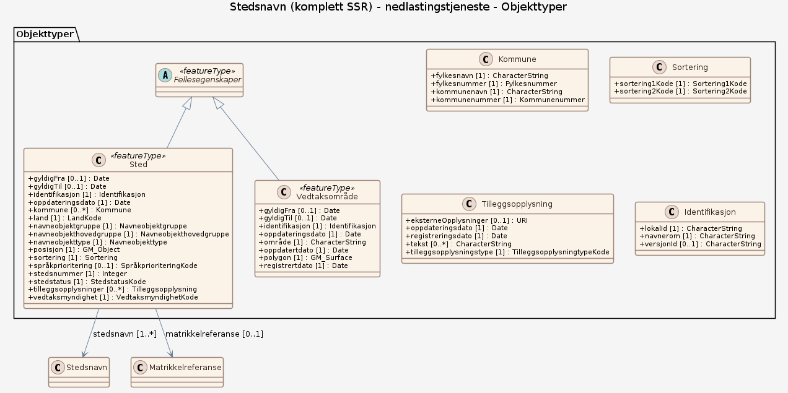

### Datamodell

#### Sted

Sted inneholder all egenskapene som er felles for de ulike stedsnavnene (og deres skrivemåter) for en lokalitet, uavhengig av språk.  Med felles egenskaper menes posisjon, presentasjonsinformasjon, land, kommune, matrikkelnummer, navnetype, osv.

Egenskaper

<table class="feature-attribute-table">
  <colgroup>
    <col style="width: 35%;" />
    <col style="width: 65%;" />
  </colgroup>
  <tbody>
    <tr>
      <th scope="row">Navn:</th>
      <td><strong>kommune</strong></td>
    </tr>
    <tr>
      <th scope="row">Definisjon:</th>
      <td>Stedets kommunetilknytning avhenger av stedets geografiske beligenhet og viser hvlke kommuner stedet ligger i.</td>
    </tr>
    <tr>
      <th scope="row">Multiplisitet:</th>
      <td>0..*</td>
    </tr>
    <tr>
      <th scope="row">Type:</th>
      <td>Kommune</td>
    </tr>
  </tbody>
</table>

<table class="feature-attribute-table">
  <colgroup>
    <col style="width: 35%;" />
    <col style="width: 65%;" />
  </colgroup>
  <tbody>
    <tr>
      <th scope="row">Navn:</th>
      <td><strong>kommune.fylkesnavn</strong></td>
    </tr>
    <tr>
      <th scope="row">Definisjon:</th>
      <td>Navnet på fylket, navnet vises på flere språk med riktig rekkefølge på spårkene dersom fylket er flerspråklig.</td>
    </tr>
    <tr>
      <th scope="row">Multiplisitet:</th>
      <td>1</td>
    </tr>
    <tr>
      <th scope="row">Type:</th>
      <td>CharacterString</td>
    </tr>
  </tbody>
</table>

<table class="feature-attribute-table">
  <colgroup>
    <col style="width: 35%;" />
    <col style="width: 65%;" />
  </colgroup>
  <tbody>
    <tr>
      <th scope="row">Navn:</th>
      <td><strong>kommune.fylkesnummer</strong></td>
    </tr>
    <tr>
      <th scope="row">Definisjon:</th>
      <td>Fylkesnummer er definerte identifikasjonskoder for norske fylker og to territorier (Svalbard og Jan Mayen)</td>
    </tr>
    <tr>
      <th scope="row">Multiplisitet:</th>
      <td>1</td>
    </tr>
    <tr>
      <th scope="row">Type:</th>
      <td>Fylkesnummer</td>
    </tr>
    <tr>
      <th scope="row">Tillatte verdier:</th>
      <td>- 01 – Østfold - 02 – Akershus - 03 – Oslo - 04 – Hedmark - 05 – Oppland - 06 – Buskerud - 07 – Vestfold - 08 – Telemark - 09 – Aust-Agder - 10 – Vest-Agder - 11 – Rogaland - 12 – Hordaland - 13 – Bergen (utgått) - 14 – Sogn og Fjordane - 15 – Møre og Romsdal - 16 – Sør-Trøndelag (utgått) - 17 – Nord-Trøndelag (utgått) - 18 – Nordland - 19 – Troms - Romsa - 20 – Finnmark - Finnmárku - 21 – Svalbard - 22 – Jan Mayen - 23 – Kontinentalsokkelen - 50 – Trøndelag</td>
    </tr>
  </tbody>
</table>

<table class="feature-attribute-table">
  <colgroup>
    <col style="width: 35%;" />
    <col style="width: 65%;" />
  </colgroup>
  <tbody>
    <tr>
      <th scope="row">Navn:</th>
      <td><strong>kommune.kommunenavn</strong></td>
    </tr>
    <tr>
      <th scope="row">Definisjon:</th>
      <td>Navnet på kommunen, navnet vises på flere språk dersom kommunen er flerspråklig.</td>
    </tr>
    <tr>
      <th scope="row">Multiplisitet:</th>
      <td>1</td>
    </tr>
    <tr>
      <th scope="row">Type:</th>
      <td>CharacterString</td>
    </tr>
  </tbody>
</table>

<table class="feature-attribute-table">
  <colgroup>
    <col style="width: 35%;" />
    <col style="width: 65%;" />
  </colgroup>
  <tbody>
    <tr>
      <th scope="row">Navn:</th>
      <td><strong>kommune.kommunenummer</strong></td>
    </tr>
    <tr>
      <th scope="row">Definisjon:</th>
      <td>Kommunenummer er nummer for å identifisere kommunerer og er et firesifret nummer (eks.: 0101) som er unikt for hver kommune i Norge</td>
    </tr>
    <tr>
      <th scope="row">Multiplisitet:</th>
      <td>1</td>
    </tr>
    <tr>
      <th scope="row">Type:</th>
      <td>Kommunenummer</td>
    </tr>
    <tr>
      <th scope="row">Tillatte verdier:</th>
      <td>- 0101 – Halden - 0102 – Sarpsborg (utgått) - 0103 – Fredrikstad (utgått) - 0104 – Moss - 0105 – Sarpsborg - 0106 – Fredrikstad - 0111 – Hvaler - 0113 – Borge (utgått) - 0114 – Varteig (utgått) - 0115 – Skjeberg (utgått) - 0118 – Aremark - 0119 – Marker - 0121 – Rømskog - 0122 – Trøgstad - 0123 – Spydeberg - 0124 – Askim - 0125 – Eidsberg - 0127 – Skiptvet - 0128 – Rakkestad - 0130 – Tune (utgått) - 0131 – Rolvsøy (utgått) - 0133 – Kråkerøy (utgått) - 0134 – Onsøy (utgått) - 0135 – Råde - 0136 – Rygge - 0137 – Våler i Østfold - 0138 – Hobøl - 0211 – Vestby - 0213 – Ski - 0214 – Ås - 0215 – Frogn - 0216 – Nesodden - 0217 – Oppegård - 0219 – Bærum - 0220 – Asker - 0221 – Aurskog-Høland - 0226 – Sørum - 0227 – Fet - 0228 – Rælingen - 0229 – Enebakk - 0230 – Lørenskog - 0231 – Skedsmo - 0233 – Nittedal - 0234 – Gjerdrum - 0235 – Ullensaker - 0236 – Nes i Akershus - 0237 – Eidsvoll - 0238 – Nannestad - 0239 – Hurdal - 0301 – Oslo - 0401 – Hamar (utgått) - 0402 – Kongsvinger - 0403 – Hamar - 0412 – Ringsaker - 0414 – Vang (utgått) - 0415 – Løten - 0417 – Stange - 0418 – Nord-Odal - 0419 – Sør-Odal - 0420 – Eidskog - 0423 – Grue - 0425 – Åsnes - 0426 – Våler i Hedmark - 0427 – Elverum - 0428 – Trysil - 0429 – Åmot - 0430 – Stor-Elvdal - 0432 – Rendalen - 0434 – Engerdal - 0436 – Tolga - 0437 – Tynset - 0438 – Alvdal - 0439 – Folldal - 0441 – Os i Hedmark - 0501 – Lillehammer - 0502 – Gjøvik - 0511 – Dovre - 0512 – Lesja - 0513 – Skjåk - 0514 – Lom - 0515 – Vågå - 0516 – Nord-Fron - 0517 – Sel - 0519 – Sør-Fron - 0520 – Ringebu - 0521 – Øyer - 0522 – Gausdal - 0528 – Østre Toten - 0529 – Vestre Toten - 0532 – Jevnaker - 0533 – Lunner - 0534 – Gran - 0536 – Søndre Land - 0538 – Nordre Land - 0540 – Sør-Aurdal - 0541 – Etnedal - 0542 – Nord-Aurdal - 0543 – Vestre Slidre - 0544 – Øystre Slidre - 0545 – Vang - 0602 – Drammen - 0604 – Kongsberg - 0605 – Ringerike - 0612 – Hole - 0615 – Flå - 0616 – Nes i Buskerud - 0617 – Gol - 0618 – Hemsedal - 0619 – Ål - 0620 – Hol - 0621 – Sigdal - 0622 – Krødsherad - 0623 – Modum - 0624 – Øvre Eiker - 0625 – Nedre Eiker - 0626 – Lier - 0627 – Røyken - 0628 – Hurum - 0631 – Flesberg - 0632 – Rollag - 0633 – Nore og Uvdal - 0701 – Horten - 0702 – Holmestrand (utgått) - 0703 – Horten (utgått) - 0704 – Tønsberg - 0705 – Tønsberg (utgått) - 0706 – Sandefjord (utgått) - 0707 – Larvik (utgått) - 0708 – Stavern (utgått) - 0709 – Larvik (utgått) - 0710 – Sandefjord - 0711 – Svelvik - 0712 – Larvik - 0713 – Sande i Vestfold - 0714 – Hof (utgått) - 0715 – Holmestrand - 0716 – Re - 0717 – Borre (utgått) - 0718 – Ramnes (utgått) - 0719 – Andebu (utgått) - 0720 – Stokke (utgått) - 0721 – Sem (utgått) - 0722 – Nøtterøy (utgått) - 0723 – Tjøme (utgått) - 0725 – Tjølling (utgått) - 0726 – Brunlanes (utgått) - 0727 – Hedrum (utgått) - 0728 – Lardal (utgått) - 0729 – Færder - 0805 – Porsgrunn - 0806 – Skien - 0807 – Notodden - 0811 – Siljan - 0814 – Bamble - 0815 – Kragerø - 0817 – Drangedal - 0819 – Nome - 0821 – Bø i Telemark - 0822 – Sauherad - 0826 – Tinn - 0827 – Hjartdal - 0828 – Seljord - 0829 – Kviteseid - 0830 – Nissedal - 0831 – Fyresdal - 0833 – Tokke - 0834 – Vinje - 0901 – Risør - 0903 – Arendal (utgått) - 0904 – Grimstad - 0906 – Arendal - 0911 – Gjerstad - 0912 – Vegårshei - 0914 – Tvedestrand - 0918 – Moland (utgått) - 0919 – Froland - 0920 – Øyestad (utgått) - 0921 – Tromøy (utgått) - 0922 – Hisøy (utgått) - 0926 – Lillesand - 0928 – Birkenes - 0929 – Åmli - 0935 – Iveland - 0937 – Evje og Hornnes - 0938 – Bygland - 0940 – Valle - 0941 – Bykle - 1001 – Kristiansand - 1002 – Mandal - 1003 – Farsund - 1004 – Flekkefjord - 1014 – Vennesla - 1017 – Songdalen - 1018 – Søgne - 1021 – Marnardal - 1026 – Åseral - 1027 – Audnedal - 1029 – Lindesnes - 1032 – Lyngdal - 1034 – Hægebostad - 1037 – Kvinesdal - 1046 – Sirdal - 1101 – Eigersund - 1102 – Sandnes - 1103 – Stavanger - 1106 – Haugesund - 1111 – Sokndal - 1112 – Lund - 1114 – Bjerkreim - 1119 – Hå - 1120 – Klepp - 1121 – Time - 1122 – Gjesdal - 1124 – Sola - 1127 – Randaberg - 1129 – Forsand - 1130 – Strand - 1133 – Hjelmeland - 1134 – Suldal - 1135 – Sauda - 1141 – Finnøy - 1142 – Rennesøy - 1144 – Kvitsøy - 1145 – Bokn - 1146 – Tysvær - 1149 – Karmøy - 1151 – Utsira - 1154 – Vindafjord ((utgått) - 1159 – Ølen (utgått) - 1160 – Vindafjord - 1201 – Bergen - 1211 – Etne - 1214 – Ølen (utgått) - 1216 – Sveio - 1219 – Bømlo - 1221 – Stord - 1222 – Fitjar - 1223 – Tysnes - 1224 – Kvinnherad - 1227 – Jondal - 1228 – Odda - 1231 – Ullensvang - 1232 – Eidfjord - 1233 – Ulvik - 1234 – Granvin - 1235 – Voss - 1238 – Kvam - 1241 – Fusa - 1242 – Samnanger - 1243 – Os i Hordaland - 1244 – Austevoll - 1245 – Sund - 1246 – Fjell - 1247 – Askøy - 1251 – Vaksdal - 1252 – Modalen - 1253 – Osterøy - 1256 – Meland - 1259 – Øygarden - 1260 – Radøy - 1263 – Lindås - 1264 – Austrheim - 1265 – Fedje - 1266 – Masfjorden - 1401 – Flora - 1411 – Gulen - 1412 – Solund - 1413 – Hyllestad - 1416 – Høyanger - 1417 – Vik - 1418 – Balestrand - 1419 – Leikanger - 1420 – Sogndal - 1421 – Aurland - 1422 – Lærdal - 1424 – Årdal - 1426 – Luster - 1428 – Askvoll - 1429 – Fjaler - 1430 – Gaular - 1431 – Jølster - 1432 – Førde - 1433 – Naustdal - 1438 – Bremanger - 1439 – Vågsøy - 1441 – Selje - 1443 – Eid - 1444 – Hornindal - 1445 – Gloppen - 1449 – Stryn - 1502 – Molde - 1504 – Ålesund - 1505 – Kristiansund - 1511 – Vanylven - 1514 – Sande i Møre og Romsdal - 1515 – Herøy i Møre og Romsdal - 1516 – Ulstein - 1517 – Hareid - 1519 – Volda - 1520 – Ørsta - 1523 – Ørskog - 1524 – Norddal - 1525 – Stranda - 1526 – Stordal - 1528 – Sykkylven - 1529 – Skodje - 1531 – Sula - 1532 – Giske - 1534 – Haram - 1535 – Vestnes - 1539 – Rauma - 1543 – Nesset - 1545 – Midsund - 1546 – Sandøy - 1547 – Aukra - 1548 – Fræna - 1551 – Eide - 1554 – Averøy - 1557 – Gjemnes - 1560 – Tingvoll - 1563 – Sunndal - 1566 – Surnadal - 1567 – Rindal - 1569 – Aure (utgått) - 1571 – Halsa - 1572 – Tustna (utgått) - 1573 – Smøla - 1576 – Aure - 1601 – Trondheim (utgått) - 1612 – Hemne (utgått) - 1613 – Snillfjord (utgått) - 1617 – Hitra (utgått) - 1620 – Frøya (utgått) - 1621 – Ørland (utgått) - 1622 – Agdenes (utgått) - 1624 – Rissa (utgått) - 1627 – Bjugn (utgått) - 1630 – Åfjord (utgått) - 1632 – Roan (utgått) - 1633 – Osen (utgått) - 1634 – Oppdal (utgått) - 1635 – Rennebu (utgått) - 1636 – Meldal (utgått) - 1638 – Orkdal (utgått) - 1640 – Røros (utgått) - 1644 – Holtålen (utgått) - 1648 – Midtre Gauldal (utgått) - 1653 – Melhus (utgått) - 1657 – Skaun (utgått) - 1662 – Klæbu (utgått) - 1663 – Malvik (utgått) - 1664 – Selbu (utgått) - 1665 – Tydal (utgått) - 1702 – Steinkjer (utgått) - 1703 – Namsos (utgått) - 1711 – Meråker (utgått) - 1714 – Stjørdal (utgått) - 1717 – Frosta (utgått) - 1718 – Leksvik (utgått) - 1719 – Levanger (utgått) - 1721 – Verdal (utgått) - 1723 – Mosvik (utgått) - 1724 – Verran (utgått) - 1725 – Namdalseid (utgått) - 1729 – Inderøy (utgått) - 1736 – Snåase – Snåsa (utgått) - 1738 – Lierne (utgått) - 1739 – Raarvihke – Røyrvik (utgått) - 1740 – Namsskogan (utgått) - 1742 – Grong (utgått) - 1743 – Høylandet (utgått) - 1744 – Overhalla (utgått) - 1748 – Fosnes (utgått) - 1749 – Flatanger (utgått) - 1750 – Vikna (utgått) - 1751 – Nærøy (utgått) - 1755 – Leka (utgått) - 1756 – Inderøy (utgått) - 1804 – Bodø - 1805 – Narvik - 1811 – Bindal - 1812 – Sømna - 1813 – Brønnøy - 1815 – Vega - 1816 – Vevelstad - 1818 – Herøy i Nordland - 1820 – Alstahaug - 1822 – Leirfjord - 1824 – Vefsn - 1825 – Grane - 1826 – Hattfjelldal - 1827 – Dønna - 1828 – Nesna - 1832 – Hemnes - 1833 – Rana - 1834 – Lurøy - 1835 – Træna - 1836 – Rødøy - 1837 – Meløy - 1838 – Gildeskål - 1839 – Beiarn - 1840 – Saltdal - 1841 – Fauske – Fuossko - 1842 – Skjerstad (utgått) - 1845 – Sørfold - 1848 – Steigen - 1849 – Hamarøy – Hábmer - 1850 – Divtasvuodna – Tysfjord - 1851 – Lødingen - 1852 – Tjeldsund - 1853 – Evenes - 1854 – Ballangen - 1856 – Røst - 1857 – Værøy - 1859 – Flakstad - 1860 – Vestvågøy - 1865 – Vågan - 1866 – Hadsel - 1867 – Bø i Nordland - 1868 – Øksnes - 1870 – Sortland – Suortá - 1871 – Andøy - 1874 – Moskenes - 1901 – Harstad (utgått) - 1902 – Tromsø - 1903 – Harstad – Hárstták - 1911 – Kvæfjord - 1913 – Skånland - 1915 – Bjarkøy (utgått) - 1917 – Ibestad - 1919 – Gratangen - 1920 – Loabák – Lavangen - 1922 – Bardu - 1923 – Salangen - 1924 – Målselv - 1925 – Sørreisa - 1926 – Dyrøy - 1927 – Tranøy - 1928 – Torsken - 1929 – Berg - 1931 – Lenvik - 1933 – Balsfjord - 1936 – Karlsøy - 1938 – Lyngen - 1939 – Storfjord – Omasvuotna – Omasvuono - 1940 – Gáivuotna – Kåfjord – Kaivuono - 1941 – Skjervøy - 1942 – Nordreisa - 1943 – Kvænangen - 2001 – Hammerfest (utgått) - 2002 – Vardø - 2003 – Vadsø - 2004 – Hammerfest - 2011 – Guovdageaidnu – Kautokeino - 2012 – Alta - 2014 – Loppa - 2015 – Hasvik - 2016 – Sørøysund (utgått) - 2017 – Kvalsund - 2018 – Måsøy - 2019 – Nordkapp - 2020 – Porsanger – Porsá?gu – Porsanki - 2021 – Kárášjohka – Karasjok - 2022 – Lebesby - 2023 – Gamvik - 2024 – Berlevåg - 2025 – Deatnu – Tana - 2027 – Unjárga – Nesseby - 2028 – Båtsfjord - 2030 – Sør-Varanger - 2111 – Spitsbergen - 2121 – Bjørnøya - 2131 – Hopen - 2211 – Jan Mayen - 2311 – Sokkelen sør for 62 grader Nord - 2321 – Sokkelen nord for 62 grader Nord - 5001 – Trondheim - 5004 – Steinkjer - 5005 – Namsos - 5011 – Hemne - 5012 – Snillfjord - 5013 – Hitra - 5014 – Frøya - 5015 – Ørland - 5016 – Agdenes - 5017 – Bjugn - 5018 – Åfjord - 5019 – Roan - 5020 – Osen - 5021 – Oppdal - 5022 – Rennebu - 5023 – Meldal - 5024 – Orkdal - 5025 – Røros - 5026 – Holtålen - 5027 – Midtre Gauldal - 5028 – Melhus - 5029 – Skaun - 5030 – Klæbu - 5031 – Malvik - 5032 – Selbu - 5033 – Tydal - 5034 – Meråker - 5035 – Stjørdal - 5036 – Frosta - 5037 – Levanger - 5038 – Verdal - 5039 – Verran - 5040 – Namdalseid - 5041 – Snåase – Snåsa - 5042 – Lierne - 5043 – Raarvihke – Røyrvik - 5044 – Namsskogan - 5045 – Grong - 5046 – Høylandet - 5047 – Overhalla - 5048 – Frosnes - 5049 – Flatanger - 5050 – Vikna - 5051 – Nærøy - 5052 – Leka - 5053 – Inderøy - 5054 – Indre Fosen</td>
    </tr>
  </tbody>
</table>

<table class="feature-attribute-table">
  <colgroup>
    <col style="width: 35%;" />
    <col style="width: 65%;" />
  </colgroup>
  <tbody>
    <tr>
      <th scope="row">Navn:</th>
      <td><strong>land</strong></td>
    </tr>
    <tr>
      <th scope="row">Definisjon:</th>
      <td>Hvilke land steder ligger i.  Tobokstavers kodeliste, subsett av ISO 3166-1 alpha-2.</td>
    </tr>
    <tr>
      <th scope="row">Multiplisitet:</th>
      <td>1</td>
    </tr>
    <tr>
      <th scope="row">Type:</th>
      <td>LandKode</td>
    </tr>
    <tr>
      <th scope="row">Tillatte verdier:</th>
      <td>- Kodeliste: <a href="http://skjema.geonorge.no/SOSI/produktspesifikasjon/Stedsnavn/5.0Utkast/2016-03-30/LandKode">http://skjema.geonorge.no/SOSI/produktspesifikasjon/Stedsnavn/5.0Utkast/2016-03-30/LandKode</a> - Danmark - Finland - Færøyene - Grønland - internasjonaltFarvann – Brukerdefinert - Island - Norge - Russland - Storbritannia - Svalbard_og_Jan_Mayen – Svalbard og Jan Mayen - Sverige - Tyskland - uspesifisert – Brukerdefinert</td>
    </tr>
  </tbody>
</table>

<table class="feature-attribute-table">
  <colgroup>
    <col style="width: 35%;" />
    <col style="width: 65%;" />
  </colgroup>
  <tbody>
    <tr>
      <th scope="row">Navn:</th>
      <td><strong>navneobjektgruppe</strong></td>
    </tr>
    <tr>
      <th scope="row">Definisjon:</th>
      <td>Inndeling i kategorier under hver hovedgruppe.</td>
    </tr>
    <tr>
      <th scope="row">Multiplisitet:</th>
      <td>1</td>
    </tr>
    <tr>
      <th scope="row">Type:</th>
      <td>Navneobjektgruppe</td>
    </tr>
    <tr>
      <th scope="row">Tillatte verdier:</th>
      <td>- Kodeliste: <a href="http://skjema.geonorge.no/SOSI/produktspesifikasjon/Stedsnavn/5.0/Navneobjektgruppe">http://skjema.geonorge.no/SOSI/produktspesifikasjon/Stedsnavn/5.0/Navneobjektgruppe</a> - administrativeIndelinger – Samlegruppe for objekttyper som beskriver alle typer administrative inndelinger. - bane – Samlegruppe for objekttyper som beskriver funksjoner knyttet til skinnegående kjøretøy. - bartFjell – Samlegruppe for objekttyper som beskriver overflater av bart fjell. - bebyggelsesområder – Samlegruppe for objekttyper som beskriver områder med flere bygninger samlet innenfor et begrenset område. - bolighus – Samlegruppe for objekttyper som beskriver enkeltbygninger til boligformål som er bebodd midlertidig eller permanent. - detaljerIFerskvann – Samlegruppe for objekttyper som beskriver detaljer i ferskvann. - detaljISjø – Samlegruppe for objekttyper som beskriver detaljer i sjøen. - dyrkamark – Samlegruppe for objekttyper som beskriver ulike typer dyrket mark. - energi – Samlegruppe for objekttyper som beskriver anlegg for energi produksjon og transport. - farvann – Samlegruppe for objekttyper som beskriver større områder av sjø. - ferskvannskontur – Samlegruppe for objekttyper som beskriver omrisset av objekter med ferskvann. - flater – Samlegruppe for objekttyper som flate terrengområder. - fritidsanlegg – Samlegruppe for objekttyper som beskriver bygningsmessige og naturlige anlegg for rekreasjon og fritidsaktiviteter. - gardsbebyggelse – Samlegruppe for objekttyper som beskriver områder med samling av bebyggelse som hovedsakelig er knyttet til landbruk. - grunnerIFerskvann – Samlegruppe for objekttyper under vannflaten som stikker høyere opp enn resten av området, men ikke vesentlig over vannflaten. - grunnerISjø – Samlegruppe for objekttyper under havflaten som stikker høyere opp enn resten av området, men ikke vesentlig over vannflaten. - høyder – Samlegruppe for objekttyper som er høyere enn andre objektyper i samme område. - institusjoner – Samlegruppe for objekttyper som beskriver enkeltbygninger eller mindre samlinger av bygninger av institusjonell karakter. - isOgPermafrost – Samlegruppe for objekttyper som er fryst. - kommunikasjon – Samlegruppe for objekttyper som beskriver anlegg for radiokommunikasjon. - kulturinstitusjoner – Samlegruppe for objekttyper som beskriver institusjoner for kulturell aktivitet. - kulturminner – Samlegruppe for objekttyper som er vernet som kulturminner. - kystkontur – Samlegruppe for objekttyper som beskriver grensa mellom sjø og tørt land. - luftfart – Samlegruppe for objekttyper som beskriver anlegg hvor luftfartøy lander og tar av. - løsmasseavsetninger – Samlegruppe for objekttyper som beskriver avsetting av løse masser. - navigasjon – Samlegruppe for objekttyper som beskriver navigasjonshjelpemidler for skipsfart. - næring – Samlegruppe for objekttyper som beskriver enkeltbygninger til næringsformål. - rennendeVann – Samlegruppe for objekttyper som beskriver rennenede ferskvann. - samferdselsanlegg – Samlegruppe for objekttyper som beskriver anlegg som brukes i forbindelse med transport, både for kjøretøy og til fots. - senkninger – Samlegruppe for objekttyper som er senket ned i forhold til andre objekttyper i samme område. - sjøbunn – Samlegruppe for objekttyper som beskriver sjøbunnen. - sjøfart – Samlegruppe for objekttyper som beskriver anlegg som har tilknytning til sjøfart. - skråninger – Samlegruppe for objekttyper som beskriver hellende terreng. - stilleståendeVann – Samlegruppe for objekttyper av ferskvann som ser ut til å stå stille. - terrengdetaljer – Samlegruppe for objekttyper som beskriver spesielle terrengdetaljer. - terrengområder – Samlegruppe for objekttyper som beskriver terrengoverflate over større områder. - uttakOgDeponi – Samlegruppe for objekttyper av menneskeskapte uttak eller fyllinger. - veg – Samlegruppe for objekttyper som beskriver objekter som brukes til ferdsel, både motorisert og til fots. - vegetasjon – Samlegruppe for objekttyper som beskriver vegetasjonen. - verne-OgBruksområder – Samlegruppe for objekttyper som regulerer vern og bruksrettigheter. - våtmark – Samlegruppe for objekttyper som beskriver våt/fuktig mark.</td>
    </tr>
  </tbody>
</table>

<table class="feature-attribute-table">
  <colgroup>
    <col style="width: 35%;" />
    <col style="width: 65%;" />
  </colgroup>
  <tbody>
    <tr>
      <th scope="row">Navn:</th>
      <td><strong>navneobjekthovedgruppe</strong></td>
    </tr>
    <tr>
      <th scope="row">Definisjon:</th>
      <td>Hovedgruppene følger i hovedsak Inspire "NamedPlaceTypeValue", men populatedPlace og building er samlet under bebyggelse og hydrography er delt mellom sjø og ferskvann.</td>
    </tr>
    <tr>
      <th scope="row">Multiplisitet:</th>
      <td>1</td>
    </tr>
    <tr>
      <th scope="row">Type:</th>
      <td>Navneobjekthovedgruppe</td>
    </tr>
    <tr>
      <th scope="row">Tillatte verdier:</th>
      <td>- Kodeliste: <a href="http://skjema.geonorge.no/SOSI/produktspesifikasjon/Stedsnavn/5.0/Navneobjekthovedgruppe">http://skjema.geonorge.no/SOSI/produktspesifikasjon/Stedsnavn/5.0/Navneobjekthovedgruppe</a> - bebyggelse – Alle grupper som er relevante under hovedgruppe bebyggelse. Tilsvarer Inspire temaet "building" og "populatedPlace". - ferskvann – Alle grupper som er relevante under hovedgruppe Ferskvann. Under Inspire temaet "hydrography" som vi har delt i to. - infrastruktur – Alle grupper som er relevante under hovedgruppe infrastruktur. Tilsvarer Inspire temaet "transportNetwork". - kultur – Alle grupper som er relevante under hovedgruppe Kultur.
Tilsvarer Inspire temaet "protctedSite". - markslag – Alle grupper som er relevante under hovedgruppe Markslag. Tilsvarer Inspire temaet "landcover". - offentligAdministrasjon – Alle grupper som er relevante under hovedgruppe offentlig administrasjon. Tilsvarer Inspire temaet "administrativUnit". - sjø – Alle grupper som er relevante under hovedgruppe Sjø. Under Inspire temaet "hydrography" som vi har delt i to. - terreng – Alle  grupper som beskriver terrengformasjoner.
Tilsvarer Inspire temaet "landform".</td>
    </tr>
  </tbody>
</table>

<table class="feature-attribute-table">
  <colgroup>
    <col style="width: 35%;" />
    <col style="width: 65%;" />
  </colgroup>
  <tbody>
    <tr>
      <th scope="row">Navn:</th>
      <td><strong>navneobjekttype</strong></td>
    </tr>
    <tr>
      <th scope="row">Definisjon:</th>
      <td>Stedets navneobjekttype er en underinndeling av navneobjektgruppene som igjen er inndeling av navneobjekthovedgruppene.</td>
    </tr>
    <tr>
      <th scope="row">Multiplisitet:</th>
      <td>1</td>
    </tr>
    <tr>
      <th scope="row">Type:</th>
      <td>Navneobjekttype</td>
    </tr>
    <tr>
      <th scope="row">Tillatte verdier:</th>
      <td>- Kodeliste: <a href="http://skjema.geonorge.no/SOSI/produktspesifikasjon/Stedsnavn/5.0/Navneobjekttype">http://skjema.geonorge.no/SOSI/produktspesifikasjon/Stedsnavn/5.0/Navneobjekttype</a> - administrativBydel – Offisielt navn på bydelsforvaltningen i et angitt område. - adressenavn – Offisielt adressenavn, veg-/gatenavn eller områdenavn, jf. § 2 bokstav e i matrikkelforskriften. - adressetilleggsnavn – Et stedsnavn som er en del av den offisielle (veg-)adressen, jf. § 54 i matrikkelforskriften; vanligvis bruksnavn eller sjeldnere bygnings-/institusjonsnavn. - allmenning – Område hvor rettighetene er regulert og fordelt på flere. - alpinanlegg – Anlegg for slalåm, utfor, snøbrett osv. - ankringsplass – Opplagsplass for store fartøy. - annenAdministrativInndeling – Andre administrative inndelinger som ikke tilhører øvrige navneobjekttyper. - annenBygningForReligionsutøvelse – Synagoge, moské, frikirke, menighetshus, kloster, gravkapell, bårehus, krematorium. - annenIndustri-OgLagerbygning – Mindre industri- og produksjonsbedrift eller lager. - annenKulturdetalj – Alle andre typer kulturdetaljer, f.eks. lekeplass, utkikkstårn, fiskeplass, og lignende. - annenTerrengdetalj – Små detaljer som ikke dekkes av andre navneobjekttyper innenfor kategorien. - annenVanndetalj – Andre navngitte forhold i ferskvann. - badeplass – Offentlig eller privat badeplass. - bakke – Terrengskråning, særlig om siden av en ås eller haug. - bakkeISjø – Skrånende sjøbunn. - bakketoppISjø – Undersjøisk knaus, kolle eller haug. - bakkeVeg – Allment kjent bakke på alle typer veger og gater. - banestrekning – Jernbanestrekning, tunnelbane eller trikkelinje/-strekning. - banke – Flatt, større undervannsområde. - bankeISjø – Større grunt område i sjøen med dypere vann omkring; fiskegrunn. - barnehage – Offentlig og privat barnehage. - bassengISjø – Vid, undersjøisk dal. - bekk – Rennende vann i naturlig vannvei, vanligvis smalere enn 3 meter. - berg – Markert eller avrunda høyde med stein, steinmasse (med eller uten vegetasjon). - bergverk – Gruve, skjerp og mineraluttak i dagen eller under jorda. - boinstitusjon – Dekker både tilrettelagte boliger og asyl-/flykningmottak. - boligblokk – Stort (bolig)hus av mur, betong med over fire boliger som har felles trapp(er) eller heis(er). - boligfelt – Regulert boligområde. - bomstasjon – Større bomanlegg på offentlig veg. - borettslag – Bofellesskap i blokk eller flerbebyggelse. - botn – Innerste del av en dal; rundaktig, bratt dal eller uthulning i fjellet. - bru – Både på veg og jernbane. - bruk – Navn på (landbruks)eiendom med ett eller flere bruksnummer under ett gardsnummer, jf. lov om stadnamn §§ 2 og 8. - brygge – Mindre, fastbygd bryggeanlegg. - busstasjon – Større busstopp der flere busslinjer kobles, knutepunkt. - busstopp – Stoppested for rutegående vegtrafikk. - by – Tettbygd sted som er større og (til dels) innehar viktigere funksjoner enn andre tettbygde steder / tettsteder. - bydel – Kulturmessig del av by. - bygdelagBygd – Stort, uregulert gards- og boligområde. - byggForJordbrukFiskeOgFangst – Til primærnæring, f.eks. naust, uthus, sommerfjøs eller gamme. - båe – Fjell eller stein under vannflaten. - båeISjø – Spiss grunne; blindskjær som sjøen bryter over. - båke – Fast sjømerke. Sprinkelverk bygget i tre eller metall. - campingplass – Alle typer, med/uten campinghytter, campingvogner og telt. - dal – Mellomstor eller liten dal. - dalføre – Stor dal med sidedaler. - dam – Både store reguleringsdammer og små fløtningsdammer. Angi kurve for lange og ett punkt midt på for korte damkroner. - delAvInnsjø – Mindre del av innsjø. - delAvVann – Mindre del av vann. - egg – Skarp fjellegg der det går bratt ned på begge sider. - eggISjø – Undersjøisk kant mot havdyp. - eid – Lavt eller smalt parti mellom to vannkanter (elv eller vann). - eidISjø – Landstripe med sjø på begge sider som binder sammen to landområder. - eiendom – Navn på eiendomer som ikke er bruksnavn, ev. felles stedsnavn for flere eiendommer. - eiendomsteig – Et stykke eiendom som ikke henger sammen med resten av eindommen. - elv – Rennende vann i naturlig vannvei, vanligvis bredere enn 3 meter. - elvemel – Bratt sand-/grusskråning langs elv eller vann. - elvesving – Naturlig sving i elv eller bekk. - eneboligMindreBoligbygg – Navn på mindre eiendom for fast bosetting. Hovedsakelig eiendom hvor eier kan bestemme skrivemåten (jf. § 8 i lov om stadnamn og § 54 i matrikkelforskriften). Kan også omfatte eget navn på bygg, eller våningshus/gardsbruk som ikke er gitt eget matrikkelnummer. - eng – Kultivert slåtte-/gressmark. - fabrikk – Større industrivirksomhet. - farledSkipslei – Allment kjent seglingslei/farvannsområde med dybdeforhold passende for skip av en viss størrelse. - fengsel – Bygning der arresterte eller dømte personer soner straff. - ferjekai – Ferjekai i fast regulert ferjesamband. - ferjestrekning – Ferjesamband som inngår i områdets samferdselsnett. - fiskeplassISjø – Navngitt fiskested; fiskemed. - fjell – Høyereliggende område (over tregrensa) med stein og sva og lite vegetasjon som reiser seg over landskapet omkring (med høye berg og nuter). - fjellheis – Gondolbane og trallebane for frakt av folk. - fjellIDagen – Lite/ingen vegetasjon; sva, svaberg. Erstattes av sva. - fjellkant – Aksel, skulder, nese og bryn. - fjellkjedeISjø – Lengre, sammenhengende undersjøisk fjellformasjon. - fjellområde – Større område med fjell og fjellandskap. - fjellovergang – Vegstrekning som krysser værutsatt fjellparti. - fjellside – Åpent, skrånende terreng i fjellet. - fjelltoppISjø – Undersjøisk fjelltopp. - fjellvegg – Tilnærmet loddrett vegg i fjellside. - fjord – Arm av havet inn i fastlandet. - fjordmunning – Område ytterst i en fjord. - flyplass – Offentlig godkjent, avgrenset område med start- og landingsplass for fly. - fløtningsanlegg – Kunstig fløtningsanlegg. - fonn – Liten snø- eller isflate som vanligvis ikke smelter om sommeren. - fornøyelsespark – Store, regulerte anlegg. - forretningsbygg – Bygning for kontor-, salg- og servicevirksomhet. - forsamlingshusKulturhus – Teater, kino, samfunnshus, grendehus o.l. - forskningsstasjon – Bemannet forskningsstasjon eller meteorologisk stasjon med bygningsmasse. - foss – Vann i tilnærmet fritt fall. - friluftsområde – Et område som er avsatt for friluftsliv. - fritidsbolig – Eget navn på hytter og hus som ikke er ment for fast bosetting. - fylke – Offisielt navn. - fyllplass – Plass for deponering av masse som stein, jord og søppel. - fyrlykt – Linse og lyskilde anbrakt i hus eller liknende. Ikke flytende. - fyrstasjon – Automatisk og ubemannet. Et fast anlegg hvor linse og lyskilde er anbrakt i hus, tårn eller spesielt bygg. Ikke flytende. - gammelBosettingsplass – Nedlagt bruk, seter, boplass hvor bygningen(e) er borte eller bare tuftene er tilbake. - garasjeHangarbygg – Trikkestall, bussgarasje, flyhangar eller lokomotivstall. - gard – Felles navn for et helt gardsnummer (jf. § 8 i lov om stadnamn). - gass-OljefeltISjø – Navngitt gass- eller oljefelt i havet. - geologiskStruktur – Navngitt struktur/formasjon i berggrunnen. - gjerde – Oppsatt stengsel, vern, skille mellom jordstykker, eiendommer eller beiteområder. - gravplass – Alle typer gravlunder, gravplasser. - grend – Mindre uregulert gards-, seter- og boligområde. - grensemerke – Offisielt grensemerke: Varde, tre, stein, bolt, kors o.l. - grind – Port i gjerde. - grotte – Naturlig fjellgrotte. - grunne – Lite område under vann som hever seg fra området rundt. - grunneISjø – Markant forhøyning av havbunnen. - grunnkrets – Offisielt navn på grunnkrets. - gruppeAvTjern – To eller flere små tjern. - gruppeAvVann – To eller flere vann. - grustakSteinbrudd – Uttaksplass/-område for sand, grus, pukk, skifer eller stein. - grøft – Rennende vann i oppgravd vannvei, f.eks. dreneringsgrøft i myr. - halvøy – Større nes i ferskvann med smalt eid mot fastland. - halvøyISjø – Større nes med smalt eid mot fastland. - hammar - haug – Liten, markant forhøynet terrengform. - havdyp – Stort, dypt område i havet. - havn – Sted der fartøy laster, losser eller søker ly for vær og sjø. - havnehage – Inngjerdet beitemark. - havområde – Del av et hav. - havstrøm – Kontinuerlig bevegelse av vann (i havet) på grunn av klimatiske forhold eller tidevann. - hei – Berglendt, høyere beliggende område med beitemark. - helikopterlandingsplass – Landingsplass for helikopter. - heller – Utoverhengende bergvegg eller berghule. - helseinstitusjon – Aldershjem, rekreasjonshjem og lignende. - historiskBosetting – Ubebodd eller forlatt bosetting med bestående bygningsmasse eller ruiner. - holdeplass – Ubetjent stoppested for jernbane, tunnelbane og/eller trikk. - holme – Liten øy i ferskvann. - holmegruppeISjø – To eller flere små øyer. - holmeISjø – Liten øy. - hotell – Større, offentlig godkjent overnattingssted. - hylle – Flatt, tilnærmet vannrett område i fjellside. - hylleISjø – Undersjøisk benk; klippeavsats, kant, fremspring, avsats. - hyttefelt – Offentlig eller privat hyttefelt. Regulert område med høy utnyttelsesgrad. - høl – Dyp elvebunn under foss eller etter et stryk. - høyde – Høyereliggende terrengform, mindre omfattende enn ås og større enn haug. - idrettsanlegg – Alle typer utendørsanlegg for idrett. - idrettshall – Alle typer innendørsanlegg, f.eks. ishall, svømmehall, idrettshall og ridehall. - industriområde – Større, sammenhengende område til industri- og næringsformål. - innsjø – Stort vann. - isbre – Større sammenhengende snø- eller isområde som ikke smelter i løpet av sommeren. - iskuppel – Konveks ismasse av en viss tykkelse i større bre eller innlandsis. - jernbanebru – Bru for jernbane. - jernbanetunnel – Tunnel for jernbane. Bruk kurve/linje for tunnelstrekning på jerbane eller punkt for navn på tunnelåpning/kort tunnel. - jernstang – Fast sjømerke av typen jernstang eller jernsøyle. - jorde – Kultivert dyrkningsmark. - juv – Kløftlignende dal eller canyon. - kabel – Alle typer kabler i sjø eller i ferskvann. - kai – Større, fastbygd bryggeanlegg. - kanal – Kunstig eller naturlig vannvei eller gjennomseiling. - kilde – Oppkomme, olle, kildeutspring, osv. - kirke – Kirke, kapell, arbeidskirke o.l. - klakkISjø – Fjellknatt på sjøbunnen. - klopp – Liten gangbru av stokker og/eller stein over bekker og elver, i myr eller i fjæra. - kommune – Offisielt navn. - kontinentalsokkel – Område med grunt hav rundt kontinentene. Ofte brukt om et lands økonomiske interessesone til sjøs. - korallrev – Rev som er dannet av koraller. - kraftgateRørgate – Store tilførselsrør for kraftanlegg. - kraftledning – Stor strømoverføringsledning. - kraftstasjon – Alle typer / alle størrelser til energiproduksjon (f.eks. el. og varme). - krater – Skål- eller traktformet senkning i jordoverflaten forårsaket av vulkansk aktivitet eller av meteorittnedslag. - kulturMessehall – Stort anlegg/hall til flerbruk - varemesse, konserter, idrettsarrangement. - landingsplass – Landingsplass for privatfly. - landskapsområde – Område der drag i landskapet, naturforhold, arealbruk og bosetting er samlende og skiller seg fra tilgrensende områder. - lanterne – En innretning hvor linsen med eller uten beskyttelsesglass utgjør en del av den bærende del av konstruksjonen. Ikke flytende. - li – Skrånende terreng. - lon – Utbuktning i elv eller bekk der vannet renner stille. - lysbøye – Flytende innretning for farvannsmerking med en lanterne som lyskilde. - matrikkeladressenavn – Et stedsnavn som inngår i den offiselle adressen ved matrikkeladresser, jf. § 55 tredje ledd i matrikkelforskriften. - melkeplass – Seterplass uten hus (ev. med enkelt skur) brukt til melking av husdyr. - militærtByggAnlegg – Militærleir. - mindreBrukonstruksjon – Korte bruer eller kulverter hvor navnet er av liten allmenn interresse eller av teknisk art. - mo – Større, flatt landområde (ofte skogkledd). - molo – Fast byggverk, utstikkende voll i sjøen. - moreneryggISjø – Marin israndavsetning. - museumGalleriBibliotek – Alle typer museum, galleri og bibliotek. - myr – Alle typer fra åpen gressmyr til våt moldjord dekket med kjerr. - nasjon – Offisielt navn på selvstendig stat eller land. - navnegard – Opprinnelig navn fra før garden ble oppdelt i gards- og bruksenheter. Navnegardens utbredelse kan omfatte flere enn ett gardsnummer. - nes – Landområde stikkende ut i ferskvann. - nesISjø – Landområde stikkende ut i sjø. - nesVedElver – Landet mellom to møtende elver. - offersted – Alle typer offersted. - oljeinstallasjon – Stasjonær olje- og gassinstallasjon (fast eller flytende). - oppdrettsanlegg – Anlegg for foring og stell av husdyr til de kan settes i produksjon eller slaktes; oppforing av fisk (og andre sjødyr) i fangenskap. - os – Innløp eller utløp av elv eller bekk i innsjø/vann/tjern eller sjø (saltvann). - overbygg – Overbygg over veg eller jernbane for beskyttelse mot ras, for å gjemme f.eks. veg i bebyggelseområde eller som viltoverganger. - overett – To sjømerker, med eller uten lys, som, når de peiles på linje, viser kurs for gjennomseiling. - park – Kultivert grøntområde i by/tettsted. - parkeringsplass – Tomt (eller bygning) for parkering av biler. - pensjonat – Mindre, offentlig godkjent overnattingssted. - platåISjø – Stor, flat forhøyning som skiller seg fra havbunnen omkring. - poststed – Offisielt poststed/postnummerområde. - pytt – Lite vannhull (mindre enn tjern). - rasISjø – Undersjøisk rasområde med stein, jord, sand eller leire. - rasteplass – Rasteplass definert og lagt til rette av Statens vegvesen eller annen offentlig myndighet. - reinbeitedistrikt – Reinbeitedistrikt. - renneKløftISjø – Undersjøisk dal, kanal, senkning, ravine, fure, spor, rille o.l. - revISjø – Grunne, banke av stein/fjell (som strekker seg ut fra en kyst). - rygg – Langstrakt terrengform. - ryggISjø – Undersjøisk ås, åskam eller fjellrygg. - rørledning – Alle typer rørledninger: Olje, gass, vann o.l. - rådhus – Administrasjonssenteret i den administrative enheten, f.eks. stat, fylke, kommune. - sadelISjø – Undersjøisk skar mellom to høyere topper/rygger. - sand – Finkornede avsetninger (sand og/eller grus). - senkning – Flat forsenkning, dalsenkning. - serveringssted – Serveringssted uten overnatting. - seterStøl – Enklere landbruksbebyggelse med hus. Kan ha periodisk fast bosetting, vanligvis sommerstid. - setervoll – Ryddet, gressbevokst område på seter uten hus. - severdighet – Minnesmerke, arkeologiske funn o.l. - sjødetalj – Detalj som ikke dekkes av andre sjø-navneobjekttyper. - sjømerkeMedIndirekteBelysning – Sjømerke med indirekte belyst struktur, skilt, fundament eller plasseringspunkt. - sjøstykke – Stykke av sjøen utanfor land, vanligvis innaskjærs eller i kystnære farvann. - sjøvarde – Varde av stein eller betong primært for navigering til sjøs. - skar – Markant senkning i fjell eller berg. - skiheis – Skitrekk og stolheis i skianlegg. - skjær – Fjell eller stein i vannflaten. - skjærISjø – Bergrunn nær eller rett over vannflaten. - skog – Alle typer fra stor barskog til og med vierkratt i Finnmark. - skogholt – Mindre samling av trær. - skogområde – Større område med skog og mark. - skole – Offentlig og privat skole. - skolekrets – Skolekrets definert av kommunen. - skredområde – Område der det går eller har gått skred. - skytebane – Bane for øvelse el. konkurranse i skyting. - skytefelt – Militært sprengingsfelt, bombe- og skytefelt, både på land og sjø. - slette – Åpent, flatt område. - sluse – Kunstig løfteanretning for båter i vassdrag. - småbåthavn – Regulert havneanlegg for småbåter. - sokkelISjø – Undersjøisk fjellfot. - sokn – Kirkesokn i Den norske kirke. - soneinndelingTilHavs – Fiskerisone, havrettssone og lignende. - stake – Flytende sjømerke. Ofte kalt bøyestake, stakebøye, kubbestake. - stasjon – Stoppested for jernbane, tunnelbane og/eller trikk. Som regel betjent. - statistiskTettsted – Tettsted etter Statistisk sentralbyrås klassifisering som brukes for å lage statistikk over befolkning og tettsteder. - stein – Frittliggende steinblokk. - sti – Stistrekning, råk, slepe (gammel drifteveg), reindriftsveg. - strand – Sand-, grus- eller steindekket område i vannkanten ved elv eller vann. - strandISjø – Sand-, grus- eller steindekket område i sjøkanten. - stryk – Del av elv, bekk der vannet går i stryk (og skiller seg tydelig fra resten av elva/bekken). - stup – Loddrett, svært bratt berg. - stø – Båtplass i vannkanten uten naust. - stølsSetereiendom - sund – Innsnevret område i vann eller vassdrag. - sundISjø – Innsnevret område mellom øyer eller fastland. - sva – Bart, avrundet glatt fjell - sykehus – Offentlig og privat sykehus. - søkk – Mindre markant, begrenset fordypning. - søkkISjø – Stor eller liten grop på sjøbunnen. - taubane – Heis til frakt av gods/høy, ikke persontrafikk. - tettbebyggelse – Bebygd område uten sentrumskarakter. - tettsted – Mindre, bymessig bebygd område med sentrumskarakter. - tettsteddel – Kulturmessig del av tettsted. - tjern – Lite vann. - topp – Tind, markant topp på fjell, berg, ås osv. - torg – Stor, åpen plass i en by. - torvtak – Sted for uttak av myrtorv, brenntorv eller veksttorv. - traktorveg – Driftsveg anlagt for traktorbruk. Ikke fremkommelig med vanlig personbil. - tuft – Sted som har hatt bebyggelse, men som antagelig ikke har vært bebodd. Ruin. - tunnel – Vanlig tunnel på veg. Bruk kurve/linje for tunnelstrekning eller punkt for navn på tunnelåpning. - turisthytte – Overnattingssted utenfor tettbygd område. - tV-Radio-EllerMobiltelefontårn – Alle typer bakkebasert telekommunikasjon. - tømmervelte – Midlertidig lagringsplass for tømmer. - undersjøiskVegg – Fjellside i havet. - universitetHøgskole – Offentlig og privat høgskole og universitet. - ur – Steinområde, steinrøys eller steinur. - utmark – Beitemark i skog og mark vekk fra garden (og innmarka). - utsiktspunkt – Både fra tårn og på bakken. - utstikker – Flytende bryggeanlegg. - vad – Vadested, vanligvis der en stistrekning krysser elv, bekk eller vann. - vaktstasjonBeredsskapsbygning – Bygning for politi/brann/los/toll/ambulanse/fly- og skipsovervåkning. - valgkrets – Valgkrets definert av kommunen. - vann – Middels stort vann. - vannstandsmåler – Innretning for å måle vann eller tidevannsnivå. - vannverk – Inntak for drikkevann/vanningsvann. - varde – (Som oftest) oppstablet stein som skal markere sti, grensemerke, trigonometrisk punkt o.l. - vegbom – Mindre bomanlegg på privat veg. - vegkryss – Allment kjent vegkryss i alle typer veger og gater. - vegstrekning – Navn på vegstrekning som ikke nødvendigvis har et formelt vedtak, og ikke er det samme som adressenavnet. Det kan være f.eks. turistrekninger og ringveger rundt en by. - vegsving – Allment kjent sving på alle typer veger og gater. - verneområde – Et område med spesiell natur- og/eller kulturverdi som er formelt vedtatt vernet etter offentlig regelverk. Alle typer, både på sjø og land. - vidde – Høyereliggende (fjell)område med lite høydevariasjoner innenfor området, som regel over tregrensa. - vik – Kil eller bukt i vann eller vassdrag. - vikISjø – Kil, bukt. - vulkanISjø – Vulkan eller slamvulkan på havbunnen. - vågISjø – Fjordarm, større vik. - våtmarksområde – Sump, område med våtmark. - øy – Tørt landområde i ferskvann atskilt fra fastlandet. - øygruppe – To eller flere øyer i ferskvann. - øygruppeISjø – To eller flere øyer. - øyISjø – Tørt landområde atskilt fra fastlandet. - øyr – Sand-/grusområde i elvemunning, elvedelta både mot innsjø/vann og saltvann. - ås – Langstrakt høydedrag.</td>
    </tr>
  </tbody>
</table>

<table class="feature-attribute-table">
  <colgroup>
    <col style="width: 35%;" />
    <col style="width: 65%;" />
  </colgroup>
  <tbody>
    <tr>
      <th scope="row">Navn:</th>
      <td><strong>posisjon</strong></td>
    </tr>
    <tr>
      <th scope="row">Definisjon:</th>
      <td>Stedfesting av objektet med eller uten utstrekning. Flate, kurve, punkt eller punktsky.</td>
    </tr>
    <tr>
      <th scope="row">Multiplisitet:</th>
      <td>1</td>
    </tr>
    <tr>
      <th scope="row">Type:</th>
      <td>GM_Object</td>
    </tr>
  </tbody>
</table>

<table class="feature-attribute-table">
  <colgroup>
    <col style="width: 35%;" />
    <col style="width: 65%;" />
  </colgroup>
  <tbody>
    <tr>
      <th scope="row">Navn:</th>
      <td><strong>sortering</strong></td>
    </tr>
    <tr>
      <th scope="row">Definisjon:</th>
      <td>Sorteringsegenskapene skal benyttes til å angi stedets viktighet i forskjellige målestokker (i forhold til andre stedsnavn).</td>
    </tr>
    <tr>
      <th scope="row">Multiplisitet:</th>
      <td>1</td>
    </tr>
    <tr>
      <th scope="row">Type:</th>
      <td>Sortering</td>
    </tr>
  </tbody>
</table>

<table class="feature-attribute-table">
  <colgroup>
    <col style="width: 35%;" />
    <col style="width: 65%;" />
  </colgroup>
  <tbody>
    <tr>
      <th scope="row">Navn:</th>
      <td><strong>sortering.sortering1Kode</strong></td>
    </tr>
    <tr>
      <th scope="row">Definisjon:</th>
      <td>Bokstavkode fra A til N der N er viktigste objekttype som tegnes først, mens A er de minst viktige som vises dersom det er plass.</td>
    </tr>
    <tr>
      <th scope="row">Multiplisitet:</th>
      <td>1</td>
    </tr>
    <tr>
      <th scope="row">Type:</th>
      <td>Sortering1Kode</td>
    </tr>
    <tr>
      <th scope="row">Tillatte verdier:</th>
      <td>- Kodeliste: <a href="http://skjema.geonorge.no/SOSI/produktspesifikasjon/Stedsnavn/5.0Utkast/2016-03-30/Sortering1Kode">http://skjema.geonorge.no/SOSI/produktspesifikasjon/Stedsnavn/5.0Utkast/2016-03-30/Sortering1Kode</a> - viktighetA – Minst viktige objekt tegnes til slutt vanligvis i små målestokker. - viktighetB – Viktigere enn A - viktighetC – Viktigere enn A og B - viktighetD – Viktigere enn C men mindre viktig enn E - viktighetE – Viktigere enn D men mindre viktig enn F - viktighetF – Viktigere enn E men mindre viktig enn G - viktighetG – Viktigere enn F men mindre viktig enn H - viktighetH – Viktigere enn G men mindre viktig enn I - viktighetI – Viktigere enn H men mindre viktig enn J - viktighetJ – Viktigere enn I men mindre viktig enn K - viktighetK – Viktigere enn J men mindre viktig enn L - viktighetL – Viktigere enn K men mindre viktig enn M - viktighetM – Viktigere enn L men mindre viktig enn N - viktighetN – Høyest prioritet, de viktigste navnene, tegnes vanligvis fra små målestokker.</td>
    </tr>
  </tbody>
</table>

<table class="feature-attribute-table">
  <colgroup>
    <col style="width: 35%;" />
    <col style="width: 65%;" />
  </colgroup>
  <tbody>
    <tr>
      <th scope="row">Navn:</th>
      <td><strong>sortering.sortering2Kode</strong></td>
    </tr>
    <tr>
      <th scope="row">Definisjon:</th>
      <td>Tall fra 1 til 99 som brukes til å sortere innefor sortering1kode, der 99 har høyest prioritet.</td>
    </tr>
    <tr>
      <th scope="row">Multiplisitet:</th>
      <td>1</td>
    </tr>
    <tr>
      <th scope="row">Type:</th>
      <td>Sortering2Kode</td>
    </tr>
    <tr>
      <th scope="row">Tillatte verdier:</th>
      <td>- Kodeliste: <a href="http://skjema.geonorge.no/SOSI/produktspesifikasjon/Stedsnavn/5.0Utkast/2016-03-30/Sortering2Kode">http://skjema.geonorge.no/SOSI/produktspesifikasjon/Stedsnavn/5.0Utkast/2016-03-30/Sortering2Kode</a> - viktighet01 – Minst viktig av de navnene med samme sorteringsbokstav i Sortering1Kode. - viktighet02 – Viktigere enn de med 01 under samme bokstav i Sortering1Kode. - viktighet03 – Viktigere enn de med 02 under samme bokstav i Sortering1Kode. - viktighet04 – Viktigere enn de med lavere nummer under samme bokstav i Sortering1Kode. - viktighet05 – Viktigere enn de med lavere nummer under samme bokstav i Sortering1Kode. - viktighet06 – Viktigere enn de med lavere nummer under samme bokstav i Sortering1Kode. - viktighet07 – Viktigere enn de med lavere nummer under samme bokstav i Sortering1Kode. - viktighet08 – Viktigere enn de med lavere nummer under samme bokstav i Sortering1Kode. - viktighet09 – Viktigere enn de med lavere nummer under samme bokstav i Sortering1Kode. - viktighet10 – Viktigere enn de med lavere nummer under samme bokstav i Sortering1Kode. - viktighet11 – Viktigere enn de med lavere nummer under samme bokstav i Sortering1Kode. - viktighet12 – Viktigere enn de med lavere nummer under samme bokstav i Sortering1Kode. - viktighet13 – Viktigere enn de med lavere nummer under samme bokstav i Sortering1Kode. - viktighet14 – Viktigere enn de med lavere nummer under samme bokstav i Sortering1Kode. - viktighet15 – Viktigere enn de med lavere nummer under samme bokstav i Sortering1Kode. - viktighet16 – Viktigere enn de med lavere nummer under samme bokstav i Sortering1Kode. - viktighet17 – Viktigere enn de med lavere nummer under samme bokstav i Sortering1Kode. - viktighet18 – Viktigere enn de med lavere nummer under samme bokstav i Sortering1Kode. - viktighet19 – Viktigere enn de med lavere nummer under samme bokstav i Sortering1Kode. - viktighet20 – Viktigere enn de med lavere nummer under samme bokstav i Sortering1Kode. - viktighet21 – Viktigere enn de med lavere nummer under samme bokstav i Sortering1Kode. - viktighet22 – Viktigere enn de med lavere nummer under samme bokstav i Sortering1Kode. - viktighet23 – Viktigere enn de med lavere nummer under samme bokstav i Sortering1Kode. - viktighet24 – Viktigere enn de med lavere nummer under samme bokstav i Sortering1Kode. - viktighet25 – Viktigere enn de med lavere nummer under samme bokstav i Sortering1Kode. - viktighet26 – Viktigere enn de med lavere nummer under samme bokstav i Sortering1Kode. - viktighet27 – Viktigere enn de med lavere nummer under samme bokstav i Sortering1Kode. - viktighet28 – Viktigere enn de med lavere nummer under samme bokstav i Sortering1Kode. - viktighet29 – Viktigere enn de med lavere nummer under samme bokstav i Sortering1Kode. - viktighet30 – Viktigere enn de med lavere nummer under samme bokstav i Sortering1Kode. - viktighet31 – Viktigere enn de med lavere nummer under samme bokstav i Sortering1Kode. - viktighet32 – Viktigere enn de med lavere nummer under samme bokstav i Sortering1Kode. - viktighet33 – Viktigere enn de med lavere nummer under samme bokstav i Sortering1Kode. - viktighet34 – Viktigere enn de med lavere nummer under samme bokstav i Sortering1Kode. - viktighet35 – Viktigere enn de med lavere nummer under samme bokstav i Sortering1Kode. - viktighet36 – Viktigere enn de med lavere nummer under samme bokstav i Sortering1Kode. - viktighet37 – Viktigere enn de med lavere nummer under samme bokstav i Sortering1Kode. - viktighet38 – Viktigere enn de med lavere nummer under samme bokstav i Sortering1Kode. - viktighet39 – Viktigere enn de med lavere nummer under samme bokstav i Sortering1Kode. - viktighet40 – Viktigere enn de med lavere nummer under samme bokstav i Sortering1Kode. - viktighet41 – Viktigere enn de med lavere nummer under samme bokstav i Sortering1Kode. - viktighet42 – Viktigere enn de med lavere nummer under samme bokstav i Sortering1Kode. - viktighet43 – Viktigere enn de med lavere nummer under samme bokstav i Sortering1Kode. - viktighet44 – Viktigere enn de med lavere nummer under samme bokstav i Sortering1Kode. - viktighet45 – Viktigere enn de med lavere nummer under samme bokstav i Sortering1Kode. - viktighet46 – Viktigere enn de med lavere nummer under samme bokstav i Sortering1Kode. - viktighet47 – Viktigere enn de med lavere nummer under samme bokstav i Sortering1Kode. - viktighet48 – Viktigere enn de med lavere nummer under samme bokstav i Sortering1Kode. - viktighet49 – Viktigere enn de med lavere nummer under samme bokstav i Sortering1Kode. - viktighet50 – Viktigere enn de med lavere nummer under samme bokstav i Sortering1Kode. - viktighet51 – Viktigere enn de med lavere nummer under samme bokstav i Sortering1Kode. - viktighet52 – Viktigere enn de med lavere nummer under samme bokstav i Sortering1Kode. - viktighet53 – Viktigere enn de med lavere nummer under samme bokstav i Sortering1Kode. - viktighet54 – Viktigere enn de med lavere nummer under samme bokstav i Sortering1Kode. - viktighet55 – Viktigere enn de med lavere nummer under samme bokstav i Sortering1Kode. - viktighet56 – Viktigere enn de med lavere nummer under samme bokstav i Sortering1Kode. - viktighet57 – Viktigere enn de med lavere nummer under samme bokstav i Sortering1Kode. - viktighet58 – Viktigere enn de med lavere nummer under samme bokstav i Sortering1Kode. - viktighet59 – Viktigere enn de med lavere nummer under samme bokstav i Sortering1Kode. - viktighet60 – Viktigere enn de med lavere nummer under samme bokstav i Sortering1Kode. - viktighet61 – Viktigere enn de med lavere nummer under samme bokstav i Sortering1Kode. - viktighet62 – Viktigere enn de med lavere nummer under samme bokstav i Sortering1Kode. - viktighet63 – Viktigere enn de med lavere nummer under samme bokstav i Sortering1Kode. - viktighet64 – Viktigere enn de med lavere nummer under samme bokstav i Sortering1Kode. - viktighet65 – Viktigere enn de med lavere nummer under samme bokstav i Sortering1Kode. - viktighet66 – Viktigere enn de med lavere nummer under samme bokstav i Sortering1Kode. - viktighet67 – Viktigere enn de med lavere nummer under samme bokstav i Sortering1Kode. - viktighet68 – Viktigere enn de med lavere nummer under samme bokstav i Sortering1Kode. - viktighet69 – Viktigere enn de med lavere nummer under samme bokstav i Sortering1Kode. - viktighet70 – Viktigere enn de med lavere nummer under samme bokstav i Sortering1Kode. - viktighet71 – Viktigere enn de med lavere nummer under samme bokstav i Sortering1Kode. - viktighet72 – Viktigere enn de med lavere nummer under samme bokstav i Sortering1Kode. - viktighet73 – Viktigere enn de med lavere nummer under samme bokstav i Sortering1Kode. - viktighet74 – Viktigere enn de med lavere nummer under samme bokstav i Sortering1Kode. - viktighet75 – Viktigere enn de med lavere nummer under samme bokstav i Sortering1Kode. - viktighet76 – Viktigere enn de med lavere nummer under samme bokstav i Sortering1Kode. - viktighet77 – Viktigere enn de med lavere nummer under samme bokstav i Sortering1Kode. - viktighet78 – Viktigere enn de med lavere nummer under samme bokstav i Sortering1Kode. - viktighet79 – Viktigere enn de med lavere nummer under samme bokstav i Sortering1Kode. - viktighet80 – Viktigere enn de med lavere nummer under samme bokstav i Sortering1Kode. - viktighet81 – Viktigere enn de med lavere nummer under samme bokstav i Sortering1Kode. - viktighet82 – Viktigere enn de med lavere nummer under samme bokstav i Sortering1Kode. - viktighet83 – Viktigere enn de med lavere nummer under samme bokstav i Sortering1Kode. - viktighet84 – Viktigere enn de med lavere nummer under samme bokstav i Sortering1Kode. - viktighet85 – Viktigere enn de med lavere nummer under samme bokstav i Sortering1Kode. - viktighet86 – Viktigere enn de med lavere nummer under samme bokstav i Sortering1Kode. - viktighet87 – Viktigere enn de med lavere nummer under samme bokstav i Sortering1Kode. - viktighet88 – Viktigere enn de med lavere nummer under samme bokstav i Sortering1Kode. - viktighet89 – Viktigere enn de med lavere nummer under samme bokstav i Sortering1Kode. - viktighet90 – Viktigere enn de med lavere nummer under samme bokstav i Sortering1Kode. - viktighet91 – Viktigere enn de med lavere nummer under samme bokstav i Sortering1Kode. - viktighet92 – Viktigere enn de med lavere nummer under samme bokstav i Sortering1Kode. - viktighet93 – Viktigere enn de med lavere nummer under samme bokstav i Sortering1Kode. - viktighet94 – Viktigere enn de med lavere nummer under samme bokstav i Sortering1Kode. - viktighet95 – Viktigere enn de med lavere nummer under samme bokstav i Sortering1Kode. - viktighet96 – Viktigere enn de med lavere nummer under samme bokstav i Sortering1Kode. - viktighet97 – Viktigere enn de med lavere nummer under samme bokstav i Sortering1Kode. - viktighet98 – Viktigere enn de med lavere nummer under samme bokstav i Sortering1Kode. - viktighet99 – Viktigtse navn av de med samme sorteringsbokstav, har høyest prioritet.</td>
    </tr>
  </tbody>
</table>

<table class="feature-attribute-table">
  <colgroup>
    <col style="width: 35%;" />
    <col style="width: 65%;" />
  </colgroup>
  <tbody>
    <tr>
      <th scope="row">Navn:</th>
      <td><strong>språkprioritering</strong></td>
    </tr>
    <tr>
      <th scope="row">Definisjon:</th>
      <td>Angir rekkefølgen av navn på forskjellige språk som skal vises på skilt og kart, jf. forskriften § 7 annet ledd.</td>
    </tr>
    <tr>
      <th scope="row">Multiplisitet:</th>
      <td>0..1</td>
    </tr>
    <tr>
      <th scope="row">Type:</th>
      <td>SpråkprioriteringKode</td>
    </tr>
    <tr>
      <th scope="row">Tillatte verdier:</th>
      <td>- Kodeliste: <a href="http://skjema.geonorge.no/SOSI/produktspesifikasjon/Stedsnavn/5.0Utkast/2016-03-30/SpråkprioriteringKode">http://skjema.geonorge.no/SOSI/produktspesifikasjon/Stedsnavn/5.0Utkast/2016-03-30/SpråkprioriteringKode</a> - kvensk-nordsamisk-lulesamisk-sørsamisk-norsk – Brukes i samisk forvaltningsområde, dersom kvensk skal prioriteres over samisk. - kvensk-nordsamisk-skoltesamisk-lulesamisk-sørsamisk-norsk – Brukes i samisk forvaltningsområde, nordsamisk område, dersom kvensk skal prioriteres over samisk. - kvensk-norsk-nordsamisk-lulesamisk-sørsamisk – Brukes i norsk forvaltningsområde dersom kvensk skal prioriteres over norsk. - kvensk-norsk-nordsamisk-skoltesamisk-lulesamisk-sørsamisk – Brukes i norsk forvaltningsområde dersom kvensk skal prioriteres over norsk, men nordsamisk kan forekomme. - kvensk-norsk-skoltesamisk-nordsamisk-lulesamisk-sørsamisk – Brukes i norsk forvaltningsområde dersom kvensk skal prioriteres over norsk, men skoltesamisk kan forekomme. - kvensk-skoltesamisk-nordsamisk-lulesamisk-sørsamisk-norsk – Brukes i samisk forvaltningsområde, skoltesamisk område, dersom kvensk skal prioriteres over samisk. - lulesamisk-nordsamisk-skoltesamisk-sørsamisk-norsk-kvensk – Brukes i samisk forvaltningsområde, lulesamisk område der nordsamisk kan forekomme. - lulesamisk-nordsamisk-sørsamisk-norsk-kvensk – Brukes i samisk forvaltningsområde, lulesamisk område der nordsamisk kan forekomme. - lulesamisk-sørsamisk-nordsamisk-norsk-kvensk – Brukes i samisk forvaltningsområde, lulesamisk område der sørsamisk kan forekomme. - lulesamisk-sørsamisk-nordsamisk-skoltesamisk-norsk-kvensk – Brukes i samisk forvaltningsområde, lulesamisk område der sørsamisk kan forekomme. - nordsamisk-lulesamisk-sørsamisk-norsk-kvensk – Brukes i samisk forvaltningsområde, nordsamisk område. - nordsamisk-skoltesamisk-lulesamisk-sørsamisk-norsk-kvensk – Brukes i samisk forvaltningsområde, nordsamisk område. - norsk-lulesamisk-nordsamisk-skoltesamisk-sørsamisk-kvensk – Brukes i norsk forvaltingsområde, lulesamisk område der nordsamisk kan forekomme sammen med lulesamisk. - norsk-lulesamisk-nordsamisk-sørsamisk-kvensk – Brukes i norsk forvaltingsområde, lulesamisk område der nordsamisk kan forekomme sammen med lulesamisk. - norsk-lulesamisk-sørsamisk-nordsamisk-kvensk – Brukes i norsk forvaltingsområde, lulesamisk område der sørdsamisk kan forekomme sammen med lulesamisk. - norsk-lulesamisk-sørsamisk-nordsamisk-skoltesamisk-kvensk – Brukes i norsk forvaltingsområde, lulesamisk område der sørdsamisk kan forekomme sammen med lulesamisk. - norsk-nordsamisk-lulesamisk-sørsamisk-kvensk – Brukes i norsk forvaltingsområde, nordsamisk område der lulesamisk kan forekomme sammen med nordsamisk. - norsk-nordsamisk-skoltesamisk-lulesamisk-sørsamisk-kvensk – Brukes i norsk forvaltingsområde, nordsamisk område der skoltesamisk kan forekomme sammen med nordsamisk. - norsk-skoltesamisk-nordsamisk-lulesamisk-sørsamisk-kvensk – Brukes i norsk forvaltingsområde, skoltesamisk område der nordsamisk kan forekomme sammen med skoltesamisk. - norsk-sørsamisk-lulesamisk-nordsamisk-kvensk – Brukes i norsk forvaltingsområde, sørsamisk område der lulesamisk kan forekomme sammen med sørsamisk. - norsk-sørsamisk-lulesamisk-nordsamisk-skoltesamisk-kvensk – Brukes i norsk forvaltingsområde, sørsamisk område der lulesamisk kan forekomme sammen med sørsamisk. - skoltesamisk-nordsamisk-lulesamisk-sørsamisk-norsk-kvensk – Brukes i samisk forvaltningsområde, skoltesamisk område. - sørsamisk-lulesamisk-nordsamisk-norsk-kvensk – Brukes i samisk forvaltningsområde, sørdsamisk område. - sørsamisk-lulesamisk-nordsamisk-skoltesamisk-norsk-kvensk – Brukes i samisk forvaltningsområde, sørsamisk område.</td>
    </tr>
  </tbody>
</table>

<table class="feature-attribute-table">
  <colgroup>
    <col style="width: 35%;" />
    <col style="width: 65%;" />
  </colgroup>
  <tbody>
    <tr>
      <th scope="row">Navn:</th>
      <td><strong>stedsnummer</strong></td>
    </tr>
    <tr>
      <th scope="row">Definisjon:</th>
      <td>Stedsnummer, stedsnavnsnummer og skrivemåtenummer skal sammen utgjøre en såkalt tematisk id som brukes av registerførere som opplslagsnummer. Identifikatoren ligner litt på Gnr/Bnr/Fnr.  Stedsnummeret er et løpende nummer systemet gir stedet som en identifikator. Stedsnummeret er unikt og kan ikke brukes om igjen.</td>
    </tr>
    <tr>
      <th scope="row">Multiplisitet:</th>
      <td>1</td>
    </tr>
    <tr>
      <th scope="row">Type:</th>
      <td>Integer</td>
    </tr>
  </tbody>
</table>

<table class="feature-attribute-table">
  <colgroup>
    <col style="width: 35%;" />
    <col style="width: 65%;" />
  </colgroup>
  <tbody>
    <tr>
      <th scope="row">Navn:</th>
      <td><strong>stedstatus</strong></td>
    </tr>
    <tr>
      <th scope="row">Definisjon:</th>
      <td>Stedstatus forteller om stedet (navneobjektet) eksisterer, er historisk eller er planlagt.</td>
    </tr>
    <tr>
      <th scope="row">Multiplisitet:</th>
      <td>1</td>
    </tr>
    <tr>
      <th scope="row">Type:</th>
      <td>StedstatusKode</td>
    </tr>
    <tr>
      <th scope="row">Tillatte verdier:</th>
      <td>- Kodeliste: <a href="http://skjema.geonorge.no/SOSI/produktspesifikasjon/Stedsnavn/5.0Utkast/2016-03-30/StedstatusKode">http://skjema.geonorge.no/SOSI/produktspesifikasjon/Stedsnavn/5.0Utkast/2016-03-30/StedstatusKode</a> - aktiv – Objektet eksisterer. - feilført – Objektet er feilaktig registrert. - planlagt – Objektet eksisterer ikke ennå, men er planlagt. Denne statusen vil være aktuell ved for eksempel registrering av adressenavn for planlagte veier. - relikt – Objektet eksisterer ikke lengre, men stedsnavnet kan fortsatt være i bruk.</td>
    </tr>
  </tbody>
</table>

<table class="feature-attribute-table">
  <colgroup>
    <col style="width: 35%;" />
    <col style="width: 65%;" />
  </colgroup>
  <tbody>
    <tr>
      <th scope="row">Navn:</th>
      <td><strong>tilleggsopplysninger</strong></td>
    </tr>
    <tr>
      <th scope="row">Definisjon:</th>
      <td>Her kan registerføreren legge inn opplysninger som er relevante for stedet.</td>
    </tr>
    <tr>
      <th scope="row">Multiplisitet:</th>
      <td>0..*</td>
    </tr>
    <tr>
      <th scope="row">Type:</th>
      <td>Tilleggsopplysning</td>
    </tr>
  </tbody>
</table>

<table class="feature-attribute-table">
  <colgroup>
    <col style="width: 35%;" />
    <col style="width: 65%;" />
  </colgroup>
  <tbody>
    <tr>
      <th scope="row">Navn:</th>
      <td><strong>tilleggsopplysninger.eksterneOpplysninger</strong></td>
    </tr>
    <tr>
      <th scope="row">Definisjon:</th>
      <td>Lenke til opplysnnger som ligger utenfor registeret/databasen, for eksempel en nettside.</td>
    </tr>
    <tr>
      <th scope="row">Multiplisitet:</th>
      <td>0..1</td>
    </tr>
    <tr>
      <th scope="row">Type:</th>
      <td>URI</td>
    </tr>
  </tbody>
</table>

<table class="feature-attribute-table">
  <colgroup>
    <col style="width: 35%;" />
    <col style="width: 65%;" />
  </colgroup>
  <tbody>
    <tr>
      <th scope="row">Navn:</th>
      <td><strong>tilleggsopplysninger.oppdateringsdato</strong></td>
    </tr>
    <tr>
      <th scope="row">Definisjon:</th>
      <td>Dato for siste oppdatering.</td>
    </tr>
    <tr>
      <th scope="row">Multiplisitet:</th>
      <td>1</td>
    </tr>
    <tr>
      <th scope="row">Type:</th>
      <td>DateTime</td>
    </tr>
  </tbody>
</table>

<table class="feature-attribute-table">
  <colgroup>
    <col style="width: 35%;" />
    <col style="width: 65%;" />
  </colgroup>
  <tbody>
    <tr>
      <th scope="row">Navn:</th>
      <td><strong>tilleggsopplysninger.registreringsdato</strong></td>
    </tr>
    <tr>
      <th scope="row">Definisjon:</th>
      <td>Dato for første registrering.</td>
    </tr>
    <tr>
      <th scope="row">Multiplisitet:</th>
      <td>1</td>
    </tr>
    <tr>
      <th scope="row">Type:</th>
      <td>DateTime</td>
    </tr>
  </tbody>
</table>

<table class="feature-attribute-table">
  <colgroup>
    <col style="width: 35%;" />
    <col style="width: 65%;" />
  </colgroup>
  <tbody>
    <tr>
      <th scope="row">Navn:</th>
      <td><strong>tilleggsopplysninger.tekst</strong></td>
    </tr>
    <tr>
      <th scope="row">Definisjon:</th>
      <td>Her føres opplysninger som ikke er direkte knyttet til etymologi.</td>
    </tr>
    <tr>
      <th scope="row">Multiplisitet:</th>
      <td>0..*</td>
    </tr>
    <tr>
      <th scope="row">Type:</th>
      <td>CharacterString</td>
    </tr>
  </tbody>
</table>

<table class="feature-attribute-table">
  <colgroup>
    <col style="width: 35%;" />
    <col style="width: 65%;" />
  </colgroup>
  <tbody>
    <tr>
      <th scope="row">Navn:</th>
      <td><strong>tilleggsopplysninger.tilleggsopplysningstype</strong></td>
    </tr>
    <tr>
      <th scope="row">Definisjon:</th>
      <td>Viser hvilken type opplysning dette er. For eksempel kan en slik kode være "språkfaglig", som brukes når navneansvarlig ser behov for utdypende informasjon om et stedsnavns opphav.</td>
    </tr>
    <tr>
      <th scope="row">Multiplisitet:</th>
      <td>1</td>
    </tr>
    <tr>
      <th scope="row">Type:</th>
      <td>TilleggsopplysningtypeKode</td>
    </tr>
    <tr>
      <th scope="row">Tillatte verdier:</th>
      <td>- Kodeliste: <a href="http://skjema.geonorge.no/SOSI/produktspesifikasjon/Stedsnavn/5.0Utkast/2016-03-30/TilleggsopplysningtypeKode">http://skjema.geonorge.no/SOSI/produktspesifikasjon/Stedsnavn/5.0Utkast/2016-03-30/TilleggsopplysningtypeKode</a> - adresseinformasjonFraSSR – Denne er brukt under konverteringen fra gammelt SSR for å overføre gateident fra SSR for navneenheter med navne(objekttype)kode "Adressenavn". - adressekode – Felt for å registrere adressekoden fra matrikkelen. - historisk – Informasjom om historien til stedsnavnet eller stedet. - lokalitet – Tilleggsinformasjon om lokalitetenen som har betydning for stedsnavn. - matrikkelnummerFraSSR – Denne er brukt under konverteringen fra gammelt SSR for å overføre gnr/bnr/fnr for et utvalg av navneenhetene, basert på navneobjekttyper - merknadFraSSR – Merknadstekst konvertert fra SSR. Det er ikke mulig å registrere denne typen tilleggsopplysning i ny SSR. - navnesak – Navnesak - språkfaglig – Informasjon av språkfaglig karakter som tileggsopplysning til stedsnavnet.</td>
    </tr>
  </tbody>
</table>

<table class="feature-attribute-table">
  <colgroup>
    <col style="width: 35%;" />
    <col style="width: 65%;" />
  </colgroup>
  <tbody>
    <tr>
      <th scope="row">Navn:</th>
      <td><strong>vedtaksmyndighet</strong></td>
    </tr>
    <tr>
      <th scope="row">Definisjon:</th>
      <td>Vedtaksmyndigheten er bestemt av loven og avhengig av navneobjekttype og geografisk beliggenhet.</td>
    </tr>
    <tr>
      <th scope="row">Multiplisitet:</th>
      <td>1</td>
    </tr>
    <tr>
      <th scope="row">Type:</th>
      <td>VedtaksmyndighetKode</td>
    </tr>
    <tr>
      <th scope="row">Tillatte verdier:</th>
      <td>- Kodeliste: <a href="http://skjema.geonorge.no/SOSI/produktspesifikasjon/Stedsnavn/5.0Utkast/2016-03-30/VedtaksmyndighetKode">http://skjema.geonorge.no/SOSI/produktspesifikasjon/Stedsnavn/5.0Utkast/2016-03-30/VedtaksmyndighetKode</a> - Avinor – Avinor er vedtaksmyndighet for stedsnavnet. - Bispedømmerådet – Bispedømmerådet er vedtaksmyndighet for stedsnavn på stedet. - departement – Departementet er vedtaksmyndighet for stedsnavn på stedet. - Direktoratet_for_naturforvaltning – Direktoratet for naturforvaltning var vedtaksmyndighet for stedsnavnet før lovens endring i 2006. - fylkeskommune – Fylkeskommunen er vedtaksmyndighet for stedsnavn på stedet. - Jernbaneverket – Jernbaneverket var vedtaksmyndighet når stedsnavnet ble vedtatt. Etter lovendring i 2006 har Kartverket vedtaksmyndighet på stedsnavn på stedet. - Klagenemnda_for_stedsnavnsaker – Klagenemnda for stedsnavnsaker - kommune – Kommunen er vedtaksmyndighet for stedsnavnet på stedet. - Kongen_i_statsråd – Kongen i statsråd har vedtatt stedsnavnet på stedet. - Kystverket – Kystverket var vedtaksmyndighet når stedsnavnet ble vedtatt. Etter lovendring i 2006 har Kartverket vedtaksmyndighet på stedsnavn på stedet. - Norges_geologiske_undersøkelse – Norges geologiske undersøkelse var vedtaksmyndighet når stedsnavnet ble vedtatt. Etter lovendring i 2006 har Kartverket vedtaksmyndighet på stedsnavn på stedet. - Polarinstituttet – Polarinstituttet er vedtaksmyndighet for stedsnavn på stedet. - Posten_Norge_AS – Posten var vedtaksmyndighet når stedsnavnet ble vedtatt. Etter lovendring i 2006 har Kartverket vedtaksmyndighet på stedsnavn på stedet. - privat_eier – Privat eier kan selv bestemme stedsnavnet på stedet. - Reindriftsforvaltningen – Reindriftsforvaltningen var vedtaksmyndighet når stedsnavnet ble vedtatt. Etter lovendring i 2006 har Kartverket vedtaksmyndighet på stedsnavn på stedet. - Statens_kartverk – Kartverket er vedtaksmyndighet for stedsnavn på stedet. - Statens_vegvesen – Statens vegvesen var vedtaksmyndighet når stedsnavnet ble vedtatt. Etter lovendring i 2006 har Kartverket vedtaksmyndighet på stedsnavn på stedet. - Statskog – Statskog var vedtaksmyndighet når stedsnavnet ble vedtatt. Etter lovendring i 2006 har Kartverket vedtaksmyndighet på stedsnavn på stedet. - utenforLovensVirkeområde – Utenfor lovens virkeområde</td>
    </tr>
  </tbody>
</table>

Relasjoner

**Arv**
Fellesegenskaper

**Assosiasjoner**
Stedsnavn – rolle: stedsnavn – kardinalitet: 1..*
Matrikkelreferanse – rolle: matrikkelreferanse – kardinalitet: 0..1

#### Vedtaksområde

Skal brukes for å vise utstrekningen av et samlevedtak. Et gitt vedtaksområde kan brukes av flere samlevedtak.

Egenskaper

<table class="feature-attribute-table">
  <colgroup>
    <col style="width: 35%;" />
    <col style="width: 65%;" />
  </colgroup>
  <tbody>
    <tr>
      <th scope="row">Navn:</th>
      <td><strong>område</strong></td>
    </tr>
    <tr>
      <th scope="row">Definisjon:</th>
      <td>Område er et slags navn for å lettere kunne søke opp vedtaksområdet og gjenbruke det i andre samlevedtak. Vedtaksområdene vil som regel være et administrativt område, jf. stedsnavnloven § 5 tredje ledd, men det kan ha blitt registrert gjort samlevdtak utover disse. I fremtiden kan man også se for seg en endring som gjør at det må vær mulig å gjøre samlevedtak med helt andre vedtaksområder enn kun innenfor et administrativt område.</td>
    </tr>
    <tr>
      <th scope="row">Multiplisitet:</th>
      <td>1</td>
    </tr>
    <tr>
      <th scope="row">Type:</th>
      <td>CharacterString</td>
    </tr>
  </tbody>
</table>

<table class="feature-attribute-table">
  <colgroup>
    <col style="width: 35%;" />
    <col style="width: 65%;" />
  </colgroup>
  <tbody>
    <tr>
      <th scope="row">Navn:</th>
      <td><strong>oppdatertdato</strong></td>
    </tr>
    <tr>
      <th scope="row">Definisjon:</th>
      <td>Dato for siste oppdatering.</td>
    </tr>
    <tr>
      <th scope="row">Multiplisitet:</th>
      <td>1</td>
    </tr>
    <tr>
      <th scope="row">Type:</th>
      <td>DateTime</td>
    </tr>
  </tbody>
</table>

<table class="feature-attribute-table">
  <colgroup>
    <col style="width: 35%;" />
    <col style="width: 65%;" />
  </colgroup>
  <tbody>
    <tr>
      <th scope="row">Navn:</th>
      <td><strong>polygon</strong></td>
    </tr>
    <tr>
      <th scope="row">Definisjon:</th>
      <td>Geometri for vedtaksområde.</td>
    </tr>
    <tr>
      <th scope="row">Multiplisitet:</th>
      <td>1</td>
    </tr>
    <tr>
      <th scope="row">Type:</th>
      <td>GM_Surface</td>
    </tr>
  </tbody>
</table>

<table class="feature-attribute-table">
  <colgroup>
    <col style="width: 35%;" />
    <col style="width: 65%;" />
  </colgroup>
  <tbody>
    <tr>
      <th scope="row">Navn:</th>
      <td><strong>registrertdato</strong></td>
    </tr>
    <tr>
      <th scope="row">Definisjon:</th>
      <td>Dato for første registrering.</td>
    </tr>
    <tr>
      <th scope="row">Multiplisitet:</th>
      <td>1</td>
    </tr>
    <tr>
      <th scope="row">Type:</th>
      <td>DateTime</td>
    </tr>
  </tbody>
</table>

Relasjoner

**Arv**
Fellesegenskaper

#### Fellesegenskaper (abstrakt)

abstrakt objekttype som bærer sentrale egenskaper som er anbefalt for bruk i produktspesifikasjoner.  Merknad: Disse egenskapene skal derfor ikke modelleres inn i fagområdemodeller.

Egenskaper

<table class="feature-attribute-table">
  <colgroup>
    <col style="width: 35%;" />
    <col style="width: 65%;" />
  </colgroup>
  <tbody>
    <tr>
      <th scope="row">Navn:</th>
      <td><strong>gyldigFra</strong></td>
    </tr>
    <tr>
      <th scope="row">Definisjon:</th>
      <td>Tidspunktet når objektet oppstod i den virkelige verden</td>
    </tr>
    <tr>
      <th scope="row">Multiplisitet:</th>
      <td>0..1</td>
    </tr>
    <tr>
      <th scope="row">Type:</th>
      <td>DateTime</td>
    </tr>
  </tbody>
</table>

<table class="feature-attribute-table">
  <colgroup>
    <col style="width: 35%;" />
    <col style="width: 65%;" />
  </colgroup>
  <tbody>
    <tr>
      <th scope="row">Navn:</th>
      <td><strong>gyldigTil</strong></td>
    </tr>
    <tr>
      <th scope="row">Definisjon:</th>
      <td>Tidspunktet når objektet opphørte å eksistere i den virkelige verden</td>
    </tr>
    <tr>
      <th scope="row">Multiplisitet:</th>
      <td>0..1</td>
    </tr>
    <tr>
      <th scope="row">Type:</th>
      <td>DateTime</td>
    </tr>
  </tbody>
</table>

<table class="feature-attribute-table">
  <colgroup>
    <col style="width: 35%;" />
    <col style="width: 65%;" />
  </colgroup>
  <tbody>
    <tr>
      <th scope="row">Navn:</th>
      <td><strong>identifikasjon</strong></td>
    </tr>
    <tr>
      <th scope="row">Definisjon:</th>
      <td>unik identifikasjon av et objekt</td>
    </tr>
    <tr>
      <th scope="row">Multiplisitet:</th>
      <td>1</td>
    </tr>
    <tr>
      <th scope="row">Type:</th>
      <td>Identifikasjon</td>
    </tr>
  </tbody>
</table>

<table class="feature-attribute-table">
  <colgroup>
    <col style="width: 35%;" />
    <col style="width: 65%;" />
  </colgroup>
  <tbody>
    <tr>
      <th scope="row">Navn:</th>
      <td><strong>identifikasjon.lokalId</strong></td>
    </tr>
    <tr>
      <th scope="row">Definisjon:</th>
      <td>lokal identifikator av et objekt  Merknad: Det er dataleverendørens ansvar å sørge for at den lokale identifikatoren er unik innenfor navnerommet.</td>
    </tr>
    <tr>
      <th scope="row">Multiplisitet:</th>
      <td>1</td>
    </tr>
    <tr>
      <th scope="row">Type:</th>
      <td>CharacterString</td>
    </tr>
  </tbody>
</table>

<table class="feature-attribute-table">
  <colgroup>
    <col style="width: 35%;" />
    <col style="width: 65%;" />
  </colgroup>
  <tbody>
    <tr>
      <th scope="row">Navn:</th>
      <td><strong>identifikasjon.navnerom</strong></td>
    </tr>
    <tr>
      <th scope="row">Definisjon:</th>
      <td>navnerom som unikt identifiserer datakilden til et objekt, anbefales å være en http-URI  Eksempel: <a href="http://data.geonorge.no/SentraltStedsnavnsregister/1.0">http://data.geonorge.no/SentraltStedsnavnsregister/1.0</a>  Merknad : Verdien for nanverom vil eies av den dataprodusent som har ansvar for de unike identifikatorene og må være registrert i data.geonorge.no eller data.norge.no</td>
    </tr>
    <tr>
      <th scope="row">Multiplisitet:</th>
      <td>1</td>
    </tr>
    <tr>
      <th scope="row">Type:</th>
      <td>CharacterString</td>
    </tr>
  </tbody>
</table>

<table class="feature-attribute-table">
  <colgroup>
    <col style="width: 35%;" />
    <col style="width: 65%;" />
  </colgroup>
  <tbody>
    <tr>
      <th scope="row">Navn:</th>
      <td><strong>identifikasjon.versjonId</strong></td>
    </tr>
    <tr>
      <th scope="row">Definisjon:</th>
      <td>identifikasjon av en spesiell versjon av et geografisk objekt (instans)</td>
    </tr>
    <tr>
      <th scope="row">Multiplisitet:</th>
      <td>0..1</td>
    </tr>
    <tr>
      <th scope="row">Type:</th>
      <td>CharacterString</td>
    </tr>
  </tbody>
</table>

<table class="feature-attribute-table">
  <colgroup>
    <col style="width: 35%;" />
    <col style="width: 65%;" />
  </colgroup>
  <tbody>
    <tr>
      <th scope="row">Navn:</th>
      <td><strong>oppdateringsdato</strong></td>
    </tr>
    <tr>
      <th scope="row">Definisjon:</th>
      <td>dato for siste endring på objektetdataene  Merknad: Oppdateringsdato kan være forskjellig fra Datafangsdato ved at data som er registrert kan bufres en kortere eller lengre periode før disse legges inn i datasystemet (databasen).</td>
    </tr>
    <tr>
      <th scope="row">Multiplisitet:</th>
      <td>1</td>
    </tr>
    <tr>
      <th scope="row">Type:</th>
      <td>DateTime</td>
    </tr>
  </tbody>
</table>

### Kodelister

#### «Enumeration» Fylkesnummer

**Definisjon:** nummerering av fylker i henhold til Statistisk sentralbyrå sin offisielle liste

Merknad:
Det presiseres at fylkesnummer alltid skal ha 2 sifre, dvs. eventuelt med ledende null. Fylkesnummer benyttes for kopling mot en rekke andre registre som også benytter 2 sifre.

Koder

<table class="code-list-table">
  <thead>
    <tr>
      <th>Kodenavn:</th>
      <th>Definisjon:</th>
      <th>Kodeverdi:</th>
    </tr>
  </thead>
  <tbody>
    <tr>
      <td></td>
      <td>Østfold</td>
      <td>01</td>
    </tr>
    <tr>
      <td></td>
      <td>Akershus</td>
      <td>02</td>
    </tr>
    <tr>
      <td></td>
      <td>Oslo</td>
      <td>03</td>
    </tr>
    <tr>
      <td></td>
      <td>Hedmark</td>
      <td>04</td>
    </tr>
    <tr>
      <td></td>
      <td>Oppland</td>
      <td>05</td>
    </tr>
    <tr>
      <td></td>
      <td>Buskerud</td>
      <td>06</td>
    </tr>
    <tr>
      <td></td>
      <td>Vestfold</td>
      <td>07</td>
    </tr>
    <tr>
      <td></td>
      <td>Telemark</td>
      <td>08</td>
    </tr>
    <tr>
      <td></td>
      <td>Aust-Agder</td>
      <td>09</td>
    </tr>
    <tr>
      <td></td>
      <td>Vest-Agder</td>
      <td>10</td>
    </tr>
    <tr>
      <td></td>
      <td>Rogaland</td>
      <td>11</td>
    </tr>
    <tr>
      <td></td>
      <td>Hordaland</td>
      <td>12</td>
    </tr>
    <tr>
      <td></td>
      <td>Bergen (utgått)</td>
      <td>13</td>
    </tr>
    <tr>
      <td></td>
      <td>Sogn og Fjordane</td>
      <td>14</td>
    </tr>
    <tr>
      <td></td>
      <td>Møre og Romsdal</td>
      <td>15</td>
    </tr>
    <tr>
      <td></td>
      <td>Sør-Trøndelag (utgått)</td>
      <td>16</td>
    </tr>
    <tr>
      <td></td>
      <td>Nord-Trøndelag (utgått)</td>
      <td>17</td>
    </tr>
    <tr>
      <td></td>
      <td>Nordland</td>
      <td>18</td>
    </tr>
    <tr>
      <td></td>
      <td>Troms - Romsa</td>
      <td>19</td>
    </tr>
    <tr>
      <td></td>
      <td>Finnmark - Finnmárku</td>
      <td>20</td>
    </tr>
    <tr>
      <td></td>
      <td>Svalbard</td>
      <td>21</td>
    </tr>
    <tr>
      <td></td>
      <td>Jan Mayen</td>
      <td>22</td>
    </tr>
    <tr>
      <td></td>
      <td>Kontinentalsokkelen</td>
      <td>23</td>
    </tr>
    <tr>
      <td></td>
      <td>Trøndelag</td>
      <td>50</td>
    </tr>
  </tbody>
</table>

#### «Enumeration» Kommunenummer

**Definisjon:** nummerering av kommuner i henhold til Statistisk sentralbyrå sin offisielle liste samt et utvalg av utgåtte numre

Merknad: Det presiseres at kommune alltid skal ha 4 sifre, dvs. eventuelt med ledende null. Kommune benyttes for kopling mot en rekke andre registre som også benytter 4 sifre.

Profilparametre i tagged values

<table class="feature-attribute-table">
  <colgroup>
    <col style="width: 35%;" />
    <col style="width: 65%;" />
  </colgroup>
  <tbody>
    <tr>
      <th scope="row">asDictionary</th>
      <td>false</td>
    </tr>
  </tbody>
</table>

Koder

<table class="code-list-table">
  <thead>
    <tr>
      <th>Kodenavn:</th>
      <th>Definisjon:</th>
      <th>Kodeverdi:</th>
    </tr>
  </thead>
  <tbody>
    <tr>
      <td></td>
      <td>Halden</td>
      <td>0101</td>
    </tr>
    <tr>
      <td></td>
      <td>Sarpsborg (utgått)</td>
      <td>0102</td>
    </tr>
    <tr>
      <td></td>
      <td>Fredrikstad (utgått)</td>
      <td>0103</td>
    </tr>
    <tr>
      <td></td>
      <td>Moss</td>
      <td>0104</td>
    </tr>
    <tr>
      <td></td>
      <td>Sarpsborg</td>
      <td>0105</td>
    </tr>
    <tr>
      <td></td>
      <td>Fredrikstad</td>
      <td>0106</td>
    </tr>
    <tr>
      <td></td>
      <td>Hvaler</td>
      <td>0111</td>
    </tr>
    <tr>
      <td></td>
      <td>Borge (utgått)</td>
      <td>0113</td>
    </tr>
    <tr>
      <td></td>
      <td>Varteig (utgått)</td>
      <td>0114</td>
    </tr>
    <tr>
      <td></td>
      <td>Skjeberg (utgått)</td>
      <td>0115</td>
    </tr>
    <tr>
      <td></td>
      <td>Aremark</td>
      <td>0118</td>
    </tr>
    <tr>
      <td></td>
      <td>Marker</td>
      <td>0119</td>
    </tr>
    <tr>
      <td></td>
      <td>Rømskog</td>
      <td>0121</td>
    </tr>
    <tr>
      <td></td>
      <td>Trøgstad</td>
      <td>0122</td>
    </tr>
    <tr>
      <td></td>
      <td>Spydeberg</td>
      <td>0123</td>
    </tr>
    <tr>
      <td></td>
      <td>Askim</td>
      <td>0124</td>
    </tr>
    <tr>
      <td></td>
      <td>Eidsberg</td>
      <td>0125</td>
    </tr>
    <tr>
      <td></td>
      <td>Skiptvet</td>
      <td>0127</td>
    </tr>
    <tr>
      <td></td>
      <td>Rakkestad</td>
      <td>0128</td>
    </tr>
    <tr>
      <td></td>
      <td>Tune (utgått)</td>
      <td>0130</td>
    </tr>
    <tr>
      <td></td>
      <td>Rolvsøy (utgått)</td>
      <td>0131</td>
    </tr>
    <tr>
      <td></td>
      <td>Kråkerøy (utgått)</td>
      <td>0133</td>
    </tr>
    <tr>
      <td></td>
      <td>Onsøy (utgått)</td>
      <td>0134</td>
    </tr>
    <tr>
      <td></td>
      <td>Råde</td>
      <td>0135</td>
    </tr>
    <tr>
      <td></td>
      <td>Rygge</td>
      <td>0136</td>
    </tr>
    <tr>
      <td></td>
      <td>Våler i Østfold</td>
      <td>0137</td>
    </tr>
    <tr>
      <td></td>
      <td>Hobøl</td>
      <td>0138</td>
    </tr>
    <tr>
      <td></td>
      <td>Vestby</td>
      <td>0211</td>
    </tr>
    <tr>
      <td></td>
      <td>Ski</td>
      <td>0213</td>
    </tr>
    <tr>
      <td></td>
      <td>Ås</td>
      <td>0214</td>
    </tr>
    <tr>
      <td></td>
      <td>Frogn</td>
      <td>0215</td>
    </tr>
    <tr>
      <td></td>
      <td>Nesodden</td>
      <td>0216</td>
    </tr>
    <tr>
      <td></td>
      <td>Oppegård</td>
      <td>0217</td>
    </tr>
    <tr>
      <td></td>
      <td>Bærum</td>
      <td>0219</td>
    </tr>
    <tr>
      <td></td>
      <td>Asker</td>
      <td>0220</td>
    </tr>
    <tr>
      <td></td>
      <td>Aurskog-Høland</td>
      <td>0221</td>
    </tr>
    <tr>
      <td></td>
      <td>Sørum</td>
      <td>0226</td>
    </tr>
    <tr>
      <td></td>
      <td>Fet</td>
      <td>0227</td>
    </tr>
    <tr>
      <td></td>
      <td>Rælingen</td>
      <td>0228</td>
    </tr>
    <tr>
      <td></td>
      <td>Enebakk</td>
      <td>0229</td>
    </tr>
    <tr>
      <td></td>
      <td>Lørenskog</td>
      <td>0230</td>
    </tr>
    <tr>
      <td></td>
      <td>Skedsmo</td>
      <td>0231</td>
    </tr>
    <tr>
      <td></td>
      <td>Nittedal</td>
      <td>0233</td>
    </tr>
    <tr>
      <td></td>
      <td>Gjerdrum</td>
      <td>0234</td>
    </tr>
    <tr>
      <td></td>
      <td>Ullensaker</td>
      <td>0235</td>
    </tr>
    <tr>
      <td></td>
      <td>Nes i Akershus</td>
      <td>0236</td>
    </tr>
    <tr>
      <td></td>
      <td>Eidsvoll</td>
      <td>0237</td>
    </tr>
    <tr>
      <td></td>
      <td>Nannestad</td>
      <td>0238</td>
    </tr>
    <tr>
      <td></td>
      <td>Hurdal</td>
      <td>0239</td>
    </tr>
    <tr>
      <td></td>
      <td>Oslo</td>
      <td>0301</td>
    </tr>
    <tr>
      <td></td>
      <td>Hamar (utgått)</td>
      <td>0401</td>
    </tr>
    <tr>
      <td></td>
      <td>Kongsvinger</td>
      <td>0402</td>
    </tr>
    <tr>
      <td></td>
      <td>Hamar</td>
      <td>0403</td>
    </tr>
    <tr>
      <td></td>
      <td>Ringsaker</td>
      <td>0412</td>
    </tr>
    <tr>
      <td></td>
      <td>Vang (utgått)</td>
      <td>0414</td>
    </tr>
    <tr>
      <td></td>
      <td>Løten</td>
      <td>0415</td>
    </tr>
    <tr>
      <td></td>
      <td>Stange</td>
      <td>0417</td>
    </tr>
    <tr>
      <td></td>
      <td>Nord-Odal</td>
      <td>0418</td>
    </tr>
    <tr>
      <td></td>
      <td>Sør-Odal</td>
      <td>0419</td>
    </tr>
    <tr>
      <td></td>
      <td>Eidskog</td>
      <td>0420</td>
    </tr>
    <tr>
      <td></td>
      <td>Grue</td>
      <td>0423</td>
    </tr>
    <tr>
      <td></td>
      <td>Åsnes</td>
      <td>0425</td>
    </tr>
    <tr>
      <td></td>
      <td>Våler i Hedmark</td>
      <td>0426</td>
    </tr>
    <tr>
      <td></td>
      <td>Elverum</td>
      <td>0427</td>
    </tr>
    <tr>
      <td></td>
      <td>Trysil</td>
      <td>0428</td>
    </tr>
    <tr>
      <td></td>
      <td>Åmot</td>
      <td>0429</td>
    </tr>
    <tr>
      <td></td>
      <td>Stor-Elvdal</td>
      <td>0430</td>
    </tr>
    <tr>
      <td></td>
      <td>Rendalen</td>
      <td>0432</td>
    </tr>
    <tr>
      <td></td>
      <td>Engerdal</td>
      <td>0434</td>
    </tr>
    <tr>
      <td></td>
      <td>Tolga</td>
      <td>0436</td>
    </tr>
    <tr>
      <td></td>
      <td>Tynset</td>
      <td>0437</td>
    </tr>
    <tr>
      <td></td>
      <td>Alvdal</td>
      <td>0438</td>
    </tr>
    <tr>
      <td></td>
      <td>Folldal</td>
      <td>0439</td>
    </tr>
    <tr>
      <td></td>
      <td>Os i Hedmark</td>
      <td>0441</td>
    </tr>
    <tr>
      <td></td>
      <td>Lillehammer</td>
      <td>0501</td>
    </tr>
    <tr>
      <td></td>
      <td>Gjøvik</td>
      <td>0502</td>
    </tr>
    <tr>
      <td></td>
      <td>Dovre</td>
      <td>0511</td>
    </tr>
    <tr>
      <td></td>
      <td>Lesja</td>
      <td>0512</td>
    </tr>
    <tr>
      <td></td>
      <td>Skjåk</td>
      <td>0513</td>
    </tr>
    <tr>
      <td></td>
      <td>Lom</td>
      <td>0514</td>
    </tr>
    <tr>
      <td></td>
      <td>Vågå</td>
      <td>0515</td>
    </tr>
    <tr>
      <td></td>
      <td>Nord-Fron</td>
      <td>0516</td>
    </tr>
    <tr>
      <td></td>
      <td>Sel</td>
      <td>0517</td>
    </tr>
    <tr>
      <td></td>
      <td>Sør-Fron</td>
      <td>0519</td>
    </tr>
    <tr>
      <td></td>
      <td>Ringebu</td>
      <td>0520</td>
    </tr>
    <tr>
      <td></td>
      <td>Øyer</td>
      <td>0521</td>
    </tr>
    <tr>
      <td></td>
      <td>Gausdal</td>
      <td>0522</td>
    </tr>
    <tr>
      <td></td>
      <td>Østre Toten</td>
      <td>0528</td>
    </tr>
    <tr>
      <td></td>
      <td>Vestre Toten</td>
      <td>0529</td>
    </tr>
    <tr>
      <td></td>
      <td>Jevnaker</td>
      <td>0532</td>
    </tr>
    <tr>
      <td></td>
      <td>Lunner</td>
      <td>0533</td>
    </tr>
    <tr>
      <td></td>
      <td>Gran</td>
      <td>0534</td>
    </tr>
    <tr>
      <td></td>
      <td>Søndre Land</td>
      <td>0536</td>
    </tr>
    <tr>
      <td></td>
      <td>Nordre Land</td>
      <td>0538</td>
    </tr>
    <tr>
      <td></td>
      <td>Sør-Aurdal</td>
      <td>0540</td>
    </tr>
    <tr>
      <td></td>
      <td>Etnedal</td>
      <td>0541</td>
    </tr>
    <tr>
      <td></td>
      <td>Nord-Aurdal</td>
      <td>0542</td>
    </tr>
    <tr>
      <td></td>
      <td>Vestre Slidre</td>
      <td>0543</td>
    </tr>
    <tr>
      <td></td>
      <td>Øystre Slidre</td>
      <td>0544</td>
    </tr>
    <tr>
      <td></td>
      <td>Vang</td>
      <td>0545</td>
    </tr>
    <tr>
      <td></td>
      <td>Drammen</td>
      <td>0602</td>
    </tr>
    <tr>
      <td></td>
      <td>Kongsberg</td>
      <td>0604</td>
    </tr>
    <tr>
      <td></td>
      <td>Ringerike</td>
      <td>0605</td>
    </tr>
    <tr>
      <td></td>
      <td>Hole</td>
      <td>0612</td>
    </tr>
    <tr>
      <td></td>
      <td>Flå</td>
      <td>0615</td>
    </tr>
    <tr>
      <td></td>
      <td>Nes i Buskerud</td>
      <td>0616</td>
    </tr>
    <tr>
      <td></td>
      <td>Gol</td>
      <td>0617</td>
    </tr>
    <tr>
      <td></td>
      <td>Hemsedal</td>
      <td>0618</td>
    </tr>
    <tr>
      <td></td>
      <td>Ål</td>
      <td>0619</td>
    </tr>
    <tr>
      <td></td>
      <td>Hol</td>
      <td>0620</td>
    </tr>
    <tr>
      <td></td>
      <td>Sigdal</td>
      <td>0621</td>
    </tr>
    <tr>
      <td></td>
      <td>Krødsherad</td>
      <td>0622</td>
    </tr>
    <tr>
      <td></td>
      <td>Modum</td>
      <td>0623</td>
    </tr>
    <tr>
      <td></td>
      <td>Øvre Eiker</td>
      <td>0624</td>
    </tr>
    <tr>
      <td></td>
      <td>Nedre Eiker</td>
      <td>0625</td>
    </tr>
    <tr>
      <td></td>
      <td>Lier</td>
      <td>0626</td>
    </tr>
    <tr>
      <td></td>
      <td>Røyken</td>
      <td>0627</td>
    </tr>
    <tr>
      <td></td>
      <td>Hurum</td>
      <td>0628</td>
    </tr>
    <tr>
      <td></td>
      <td>Flesberg</td>
      <td>0631</td>
    </tr>
    <tr>
      <td></td>
      <td>Rollag</td>
      <td>0632</td>
    </tr>
    <tr>
      <td></td>
      <td>Nore og Uvdal</td>
      <td>0633</td>
    </tr>
    <tr>
      <td></td>
      <td>Horten</td>
      <td>0701</td>
    </tr>
    <tr>
      <td></td>
      <td>Holmestrand (utgått)</td>
      <td>0702</td>
    </tr>
    <tr>
      <td></td>
      <td>Horten (utgått)</td>
      <td>0703</td>
    </tr>
    <tr>
      <td></td>
      <td>Tønsberg</td>
      <td>0704</td>
    </tr>
    <tr>
      <td></td>
      <td>Tønsberg (utgått)</td>
      <td>0705</td>
    </tr>
    <tr>
      <td></td>
      <td>Sandefjord (utgått)</td>
      <td>0706</td>
    </tr>
    <tr>
      <td></td>
      <td>Larvik (utgått)</td>
      <td>0707</td>
    </tr>
    <tr>
      <td></td>
      <td>Stavern (utgått)</td>
      <td>0708</td>
    </tr>
    <tr>
      <td></td>
      <td>Larvik (utgått)</td>
      <td>0709</td>
    </tr>
    <tr>
      <td></td>
      <td>Sandefjord</td>
      <td>0710</td>
    </tr>
    <tr>
      <td></td>
      <td>Svelvik</td>
      <td>0711</td>
    </tr>
    <tr>
      <td></td>
      <td>Larvik</td>
      <td>0712</td>
    </tr>
    <tr>
      <td></td>
      <td>Sande i Vestfold</td>
      <td>0713</td>
    </tr>
    <tr>
      <td></td>
      <td>Hof (utgått)</td>
      <td>0714</td>
    </tr>
    <tr>
      <td></td>
      <td>Holmestrand</td>
      <td>0715</td>
    </tr>
    <tr>
      <td></td>
      <td>Re</td>
      <td>0716</td>
    </tr>
    <tr>
      <td></td>
      <td>Borre (utgått)</td>
      <td>0717</td>
    </tr>
    <tr>
      <td></td>
      <td>Ramnes (utgått)</td>
      <td>0718</td>
    </tr>
    <tr>
      <td></td>
      <td>Andebu (utgått)</td>
      <td>0719</td>
    </tr>
    <tr>
      <td></td>
      <td>Stokke (utgått)</td>
      <td>0720</td>
    </tr>
    <tr>
      <td></td>
      <td>Sem (utgått)</td>
      <td>0721</td>
    </tr>
    <tr>
      <td></td>
      <td>Nøtterøy (utgått)</td>
      <td>0722</td>
    </tr>
    <tr>
      <td></td>
      <td>Tjøme (utgått)</td>
      <td>0723</td>
    </tr>
    <tr>
      <td></td>
      <td>Tjølling (utgått)</td>
      <td>0725</td>
    </tr>
    <tr>
      <td></td>
      <td>Brunlanes (utgått)</td>
      <td>0726</td>
    </tr>
    <tr>
      <td></td>
      <td>Hedrum (utgått)</td>
      <td>0727</td>
    </tr>
    <tr>
      <td></td>
      <td>Lardal (utgått)</td>
      <td>0728</td>
    </tr>
    <tr>
      <td></td>
      <td>Færder</td>
      <td>0729</td>
    </tr>
    <tr>
      <td></td>
      <td>Porsgrunn</td>
      <td>0805</td>
    </tr>
    <tr>
      <td></td>
      <td>Skien</td>
      <td>0806</td>
    </tr>
    <tr>
      <td></td>
      <td>Notodden</td>
      <td>0807</td>
    </tr>
    <tr>
      <td></td>
      <td>Siljan</td>
      <td>0811</td>
    </tr>
    <tr>
      <td></td>
      <td>Bamble</td>
      <td>0814</td>
    </tr>
    <tr>
      <td></td>
      <td>Kragerø</td>
      <td>0815</td>
    </tr>
    <tr>
      <td></td>
      <td>Drangedal</td>
      <td>0817</td>
    </tr>
    <tr>
      <td></td>
      <td>Nome</td>
      <td>0819</td>
    </tr>
    <tr>
      <td></td>
      <td>Bø i Telemark</td>
      <td>0821</td>
    </tr>
    <tr>
      <td></td>
      <td>Sauherad</td>
      <td>0822</td>
    </tr>
    <tr>
      <td></td>
      <td>Tinn</td>
      <td>0826</td>
    </tr>
    <tr>
      <td></td>
      <td>Hjartdal</td>
      <td>0827</td>
    </tr>
    <tr>
      <td></td>
      <td>Seljord</td>
      <td>0828</td>
    </tr>
    <tr>
      <td></td>
      <td>Kviteseid</td>
      <td>0829</td>
    </tr>
    <tr>
      <td></td>
      <td>Nissedal</td>
      <td>0830</td>
    </tr>
    <tr>
      <td></td>
      <td>Fyresdal</td>
      <td>0831</td>
    </tr>
    <tr>
      <td></td>
      <td>Tokke</td>
      <td>0833</td>
    </tr>
    <tr>
      <td></td>
      <td>Vinje</td>
      <td>0834</td>
    </tr>
    <tr>
      <td></td>
      <td>Risør</td>
      <td>0901</td>
    </tr>
    <tr>
      <td></td>
      <td>Arendal (utgått)</td>
      <td>0903</td>
    </tr>
    <tr>
      <td></td>
      <td>Grimstad</td>
      <td>0904</td>
    </tr>
    <tr>
      <td></td>
      <td>Arendal</td>
      <td>0906</td>
    </tr>
    <tr>
      <td></td>
      <td>Gjerstad</td>
      <td>0911</td>
    </tr>
    <tr>
      <td></td>
      <td>Vegårshei</td>
      <td>0912</td>
    </tr>
    <tr>
      <td></td>
      <td>Tvedestrand</td>
      <td>0914</td>
    </tr>
    <tr>
      <td></td>
      <td>Moland (utgått)</td>
      <td>0918</td>
    </tr>
    <tr>
      <td></td>
      <td>Froland</td>
      <td>0919</td>
    </tr>
    <tr>
      <td></td>
      <td>Øyestad (utgått)</td>
      <td>0920</td>
    </tr>
    <tr>
      <td></td>
      <td>Tromøy (utgått)</td>
      <td>0921</td>
    </tr>
    <tr>
      <td></td>
      <td>Hisøy (utgått)</td>
      <td>0922</td>
    </tr>
    <tr>
      <td></td>
      <td>Lillesand</td>
      <td>0926</td>
    </tr>
    <tr>
      <td></td>
      <td>Birkenes</td>
      <td>0928</td>
    </tr>
    <tr>
      <td></td>
      <td>Åmli</td>
      <td>0929</td>
    </tr>
    <tr>
      <td></td>
      <td>Iveland</td>
      <td>0935</td>
    </tr>
    <tr>
      <td></td>
      <td>Evje og Hornnes</td>
      <td>0937</td>
    </tr>
    <tr>
      <td></td>
      <td>Bygland</td>
      <td>0938</td>
    </tr>
    <tr>
      <td></td>
      <td>Valle</td>
      <td>0940</td>
    </tr>
    <tr>
      <td></td>
      <td>Bykle</td>
      <td>0941</td>
    </tr>
    <tr>
      <td></td>
      <td>Kristiansand</td>
      <td>1001</td>
    </tr>
    <tr>
      <td></td>
      <td>Mandal</td>
      <td>1002</td>
    </tr>
    <tr>
      <td></td>
      <td>Farsund</td>
      <td>1003</td>
    </tr>
    <tr>
      <td></td>
      <td>Flekkefjord</td>
      <td>1004</td>
    </tr>
    <tr>
      <td></td>
      <td>Vennesla</td>
      <td>1014</td>
    </tr>
    <tr>
      <td></td>
      <td>Songdalen</td>
      <td>1017</td>
    </tr>
    <tr>
      <td></td>
      <td>Søgne</td>
      <td>1018</td>
    </tr>
    <tr>
      <td></td>
      <td>Marnardal</td>
      <td>1021</td>
    </tr>
    <tr>
      <td></td>
      <td>Åseral</td>
      <td>1026</td>
    </tr>
    <tr>
      <td></td>
      <td>Audnedal</td>
      <td>1027</td>
    </tr>
    <tr>
      <td></td>
      <td>Lindesnes</td>
      <td>1029</td>
    </tr>
    <tr>
      <td></td>
      <td>Lyngdal</td>
      <td>1032</td>
    </tr>
    <tr>
      <td></td>
      <td>Hægebostad</td>
      <td>1034</td>
    </tr>
    <tr>
      <td></td>
      <td>Kvinesdal</td>
      <td>1037</td>
    </tr>
    <tr>
      <td></td>
      <td>Sirdal</td>
      <td>1046</td>
    </tr>
    <tr>
      <td></td>
      <td>Eigersund</td>
      <td>1101</td>
    </tr>
    <tr>
      <td></td>
      <td>Sandnes</td>
      <td>1102</td>
    </tr>
    <tr>
      <td></td>
      <td>Stavanger</td>
      <td>1103</td>
    </tr>
    <tr>
      <td></td>
      <td>Haugesund</td>
      <td>1106</td>
    </tr>
    <tr>
      <td></td>
      <td>Sokndal</td>
      <td>1111</td>
    </tr>
    <tr>
      <td></td>
      <td>Lund</td>
      <td>1112</td>
    </tr>
    <tr>
      <td></td>
      <td>Bjerkreim</td>
      <td>1114</td>
    </tr>
    <tr>
      <td></td>
      <td>Hå</td>
      <td>1119</td>
    </tr>
    <tr>
      <td></td>
      <td>Klepp</td>
      <td>1120</td>
    </tr>
    <tr>
      <td></td>
      <td>Time</td>
      <td>1121</td>
    </tr>
    <tr>
      <td></td>
      <td>Gjesdal</td>
      <td>1122</td>
    </tr>
    <tr>
      <td></td>
      <td>Sola</td>
      <td>1124</td>
    </tr>
    <tr>
      <td></td>
      <td>Randaberg</td>
      <td>1127</td>
    </tr>
    <tr>
      <td></td>
      <td>Forsand</td>
      <td>1129</td>
    </tr>
    <tr>
      <td></td>
      <td>Strand</td>
      <td>1130</td>
    </tr>
    <tr>
      <td></td>
      <td>Hjelmeland</td>
      <td>1133</td>
    </tr>
    <tr>
      <td></td>
      <td>Suldal</td>
      <td>1134</td>
    </tr>
    <tr>
      <td></td>
      <td>Sauda</td>
      <td>1135</td>
    </tr>
    <tr>
      <td></td>
      <td>Finnøy</td>
      <td>1141</td>
    </tr>
    <tr>
      <td></td>
      <td>Rennesøy</td>
      <td>1142</td>
    </tr>
    <tr>
      <td></td>
      <td>Kvitsøy</td>
      <td>1144</td>
    </tr>
    <tr>
      <td></td>
      <td>Bokn</td>
      <td>1145</td>
    </tr>
    <tr>
      <td></td>
      <td>Tysvær</td>
      <td>1146</td>
    </tr>
    <tr>
      <td></td>
      <td>Karmøy</td>
      <td>1149</td>
    </tr>
    <tr>
      <td></td>
      <td>Utsira</td>
      <td>1151</td>
    </tr>
    <tr>
      <td></td>
      <td>Vindafjord ((utgått)</td>
      <td>1154</td>
    </tr>
    <tr>
      <td></td>
      <td>Ølen (utgått)</td>
      <td>1159</td>
    </tr>
    <tr>
      <td></td>
      <td>Vindafjord</td>
      <td>1160</td>
    </tr>
    <tr>
      <td></td>
      <td>Bergen</td>
      <td>1201</td>
    </tr>
    <tr>
      <td></td>
      <td>Etne</td>
      <td>1211</td>
    </tr>
    <tr>
      <td></td>
      <td>Ølen (utgått)</td>
      <td>1214</td>
    </tr>
    <tr>
      <td></td>
      <td>Sveio</td>
      <td>1216</td>
    </tr>
    <tr>
      <td></td>
      <td>Bømlo</td>
      <td>1219</td>
    </tr>
    <tr>
      <td></td>
      <td>Stord</td>
      <td>1221</td>
    </tr>
    <tr>
      <td></td>
      <td>Fitjar</td>
      <td>1222</td>
    </tr>
    <tr>
      <td></td>
      <td>Tysnes</td>
      <td>1223</td>
    </tr>
    <tr>
      <td></td>
      <td>Kvinnherad</td>
      <td>1224</td>
    </tr>
    <tr>
      <td></td>
      <td>Jondal</td>
      <td>1227</td>
    </tr>
    <tr>
      <td></td>
      <td>Odda</td>
      <td>1228</td>
    </tr>
    <tr>
      <td></td>
      <td>Ullensvang</td>
      <td>1231</td>
    </tr>
    <tr>
      <td></td>
      <td>Eidfjord</td>
      <td>1232</td>
    </tr>
    <tr>
      <td></td>
      <td>Ulvik</td>
      <td>1233</td>
    </tr>
    <tr>
      <td></td>
      <td>Granvin</td>
      <td>1234</td>
    </tr>
    <tr>
      <td></td>
      <td>Voss</td>
      <td>1235</td>
    </tr>
    <tr>
      <td></td>
      <td>Kvam</td>
      <td>1238</td>
    </tr>
    <tr>
      <td></td>
      <td>Fusa</td>
      <td>1241</td>
    </tr>
    <tr>
      <td></td>
      <td>Samnanger</td>
      <td>1242</td>
    </tr>
    <tr>
      <td></td>
      <td>Os i Hordaland</td>
      <td>1243</td>
    </tr>
    <tr>
      <td></td>
      <td>Austevoll</td>
      <td>1244</td>
    </tr>
    <tr>
      <td></td>
      <td>Sund</td>
      <td>1245</td>
    </tr>
    <tr>
      <td></td>
      <td>Fjell</td>
      <td>1246</td>
    </tr>
    <tr>
      <td></td>
      <td>Askøy</td>
      <td>1247</td>
    </tr>
    <tr>
      <td></td>
      <td>Vaksdal</td>
      <td>1251</td>
    </tr>
    <tr>
      <td></td>
      <td>Modalen</td>
      <td>1252</td>
    </tr>
    <tr>
      <td></td>
      <td>Osterøy</td>
      <td>1253</td>
    </tr>
    <tr>
      <td></td>
      <td>Meland</td>
      <td>1256</td>
    </tr>
    <tr>
      <td></td>
      <td>Øygarden</td>
      <td>1259</td>
    </tr>
    <tr>
      <td></td>
      <td>Radøy</td>
      <td>1260</td>
    </tr>
    <tr>
      <td></td>
      <td>Lindås</td>
      <td>1263</td>
    </tr>
    <tr>
      <td></td>
      <td>Austrheim</td>
      <td>1264</td>
    </tr>
    <tr>
      <td></td>
      <td>Fedje</td>
      <td>1265</td>
    </tr>
    <tr>
      <td></td>
      <td>Masfjorden</td>
      <td>1266</td>
    </tr>
    <tr>
      <td></td>
      <td>Flora</td>
      <td>1401</td>
    </tr>
    <tr>
      <td></td>
      <td>Gulen</td>
      <td>1411</td>
    </tr>
    <tr>
      <td></td>
      <td>Solund</td>
      <td>1412</td>
    </tr>
    <tr>
      <td></td>
      <td>Hyllestad</td>
      <td>1413</td>
    </tr>
    <tr>
      <td></td>
      <td>Høyanger</td>
      <td>1416</td>
    </tr>
    <tr>
      <td></td>
      <td>Vik</td>
      <td>1417</td>
    </tr>
    <tr>
      <td></td>
      <td>Balestrand</td>
      <td>1418</td>
    </tr>
    <tr>
      <td></td>
      <td>Leikanger</td>
      <td>1419</td>
    </tr>
    <tr>
      <td></td>
      <td>Sogndal</td>
      <td>1420</td>
    </tr>
    <tr>
      <td></td>
      <td>Aurland</td>
      <td>1421</td>
    </tr>
    <tr>
      <td></td>
      <td>Lærdal</td>
      <td>1422</td>
    </tr>
    <tr>
      <td></td>
      <td>Årdal</td>
      <td>1424</td>
    </tr>
    <tr>
      <td></td>
      <td>Luster</td>
      <td>1426</td>
    </tr>
    <tr>
      <td></td>
      <td>Askvoll</td>
      <td>1428</td>
    </tr>
    <tr>
      <td></td>
      <td>Fjaler</td>
      <td>1429</td>
    </tr>
    <tr>
      <td></td>
      <td>Gaular</td>
      <td>1430</td>
    </tr>
    <tr>
      <td></td>
      <td>Jølster</td>
      <td>1431</td>
    </tr>
    <tr>
      <td></td>
      <td>Førde</td>
      <td>1432</td>
    </tr>
    <tr>
      <td></td>
      <td>Naustdal</td>
      <td>1433</td>
    </tr>
    <tr>
      <td></td>
      <td>Bremanger</td>
      <td>1438</td>
    </tr>
    <tr>
      <td></td>
      <td>Vågsøy</td>
      <td>1439</td>
    </tr>
    <tr>
      <td></td>
      <td>Selje</td>
      <td>1441</td>
    </tr>
    <tr>
      <td></td>
      <td>Eid</td>
      <td>1443</td>
    </tr>
    <tr>
      <td></td>
      <td>Hornindal</td>
      <td>1444</td>
    </tr>
    <tr>
      <td></td>
      <td>Gloppen</td>
      <td>1445</td>
    </tr>
    <tr>
      <td></td>
      <td>Stryn</td>
      <td>1449</td>
    </tr>
    <tr>
      <td></td>
      <td>Molde</td>
      <td>1502</td>
    </tr>
    <tr>
      <td></td>
      <td>Ålesund</td>
      <td>1504</td>
    </tr>
    <tr>
      <td></td>
      <td>Kristiansund</td>
      <td>1505</td>
    </tr>
    <tr>
      <td></td>
      <td>Vanylven</td>
      <td>1511</td>
    </tr>
    <tr>
      <td></td>
      <td>Sande i Møre og Romsdal</td>
      <td>1514</td>
    </tr>
    <tr>
      <td></td>
      <td>Herøy i Møre og Romsdal</td>
      <td>1515</td>
    </tr>
    <tr>
      <td></td>
      <td>Ulstein</td>
      <td>1516</td>
    </tr>
    <tr>
      <td></td>
      <td>Hareid</td>
      <td>1517</td>
    </tr>
    <tr>
      <td></td>
      <td>Volda</td>
      <td>1519</td>
    </tr>
    <tr>
      <td></td>
      <td>Ørsta</td>
      <td>1520</td>
    </tr>
    <tr>
      <td></td>
      <td>Ørskog</td>
      <td>1523</td>
    </tr>
    <tr>
      <td></td>
      <td>Norddal</td>
      <td>1524</td>
    </tr>
    <tr>
      <td></td>
      <td>Stranda</td>
      <td>1525</td>
    </tr>
    <tr>
      <td></td>
      <td>Stordal</td>
      <td>1526</td>
    </tr>
    <tr>
      <td></td>
      <td>Sykkylven</td>
      <td>1528</td>
    </tr>
    <tr>
      <td></td>
      <td>Skodje</td>
      <td>1529</td>
    </tr>
    <tr>
      <td></td>
      <td>Sula</td>
      <td>1531</td>
    </tr>
    <tr>
      <td></td>
      <td>Giske</td>
      <td>1532</td>
    </tr>
    <tr>
      <td></td>
      <td>Haram</td>
      <td>1534</td>
    </tr>
    <tr>
      <td></td>
      <td>Vestnes</td>
      <td>1535</td>
    </tr>
    <tr>
      <td></td>
      <td>Rauma</td>
      <td>1539</td>
    </tr>
    <tr>
      <td></td>
      <td>Nesset</td>
      <td>1543</td>
    </tr>
    <tr>
      <td></td>
      <td>Midsund</td>
      <td>1545</td>
    </tr>
    <tr>
      <td></td>
      <td>Sandøy</td>
      <td>1546</td>
    </tr>
    <tr>
      <td></td>
      <td>Aukra</td>
      <td>1547</td>
    </tr>
    <tr>
      <td></td>
      <td>Fræna</td>
      <td>1548</td>
    </tr>
    <tr>
      <td></td>
      <td>Eide</td>
      <td>1551</td>
    </tr>
    <tr>
      <td></td>
      <td>Averøy</td>
      <td>1554</td>
    </tr>
    <tr>
      <td></td>
      <td>Gjemnes</td>
      <td>1557</td>
    </tr>
    <tr>
      <td></td>
      <td>Tingvoll</td>
      <td>1560</td>
    </tr>
    <tr>
      <td></td>
      <td>Sunndal</td>
      <td>1563</td>
    </tr>
    <tr>
      <td></td>
      <td>Surnadal</td>
      <td>1566</td>
    </tr>
    <tr>
      <td></td>
      <td>Rindal</td>
      <td>1567</td>
    </tr>
    <tr>
      <td></td>
      <td>Aure (utgått)</td>
      <td>1569</td>
    </tr>
    <tr>
      <td></td>
      <td>Halsa</td>
      <td>1571</td>
    </tr>
    <tr>
      <td></td>
      <td>Tustna (utgått)</td>
      <td>1572</td>
    </tr>
    <tr>
      <td></td>
      <td>Smøla</td>
      <td>1573</td>
    </tr>
    <tr>
      <td></td>
      <td>Aure</td>
      <td>1576</td>
    </tr>
    <tr>
      <td></td>
      <td>Trondheim (utgått)</td>
      <td>1601</td>
    </tr>
    <tr>
      <td></td>
      <td>Hemne (utgått)</td>
      <td>1612</td>
    </tr>
    <tr>
      <td></td>
      <td>Snillfjord (utgått)</td>
      <td>1613</td>
    </tr>
    <tr>
      <td></td>
      <td>Hitra (utgått)</td>
      <td>1617</td>
    </tr>
    <tr>
      <td></td>
      <td>Frøya (utgått)</td>
      <td>1620</td>
    </tr>
    <tr>
      <td></td>
      <td>Ørland (utgått)</td>
      <td>1621</td>
    </tr>
    <tr>
      <td></td>
      <td>Agdenes (utgått)</td>
      <td>1622</td>
    </tr>
    <tr>
      <td></td>
      <td>Rissa (utgått)</td>
      <td>1624</td>
    </tr>
    <tr>
      <td></td>
      <td>Bjugn (utgått)</td>
      <td>1627</td>
    </tr>
    <tr>
      <td></td>
      <td>Åfjord (utgått)</td>
      <td>1630</td>
    </tr>
    <tr>
      <td></td>
      <td>Roan (utgått)</td>
      <td>1632</td>
    </tr>
    <tr>
      <td></td>
      <td>Osen (utgått)</td>
      <td>1633</td>
    </tr>
    <tr>
      <td></td>
      <td>Oppdal (utgått)</td>
      <td>1634</td>
    </tr>
    <tr>
      <td></td>
      <td>Rennebu (utgått)</td>
      <td>1635</td>
    </tr>
    <tr>
      <td></td>
      <td>Meldal (utgått)</td>
      <td>1636</td>
    </tr>
    <tr>
      <td></td>
      <td>Orkdal (utgått)</td>
      <td>1638</td>
    </tr>
    <tr>
      <td></td>
      <td>Røros (utgått)</td>
      <td>1640</td>
    </tr>
    <tr>
      <td></td>
      <td>Holtålen (utgått)</td>
      <td>1644</td>
    </tr>
    <tr>
      <td></td>
      <td>Midtre Gauldal (utgått)</td>
      <td>1648</td>
    </tr>
    <tr>
      <td></td>
      <td>Melhus (utgått)</td>
      <td>1653</td>
    </tr>
    <tr>
      <td></td>
      <td>Skaun (utgått)</td>
      <td>1657</td>
    </tr>
    <tr>
      <td></td>
      <td>Klæbu (utgått)</td>
      <td>1662</td>
    </tr>
    <tr>
      <td></td>
      <td>Malvik (utgått)</td>
      <td>1663</td>
    </tr>
    <tr>
      <td></td>
      <td>Selbu (utgått)</td>
      <td>1664</td>
    </tr>
    <tr>
      <td></td>
      <td>Tydal (utgått)</td>
      <td>1665</td>
    </tr>
    <tr>
      <td></td>
      <td>Steinkjer (utgått)</td>
      <td>1702</td>
    </tr>
    <tr>
      <td></td>
      <td>Namsos (utgått)</td>
      <td>1703</td>
    </tr>
    <tr>
      <td></td>
      <td>Meråker (utgått)</td>
      <td>1711</td>
    </tr>
    <tr>
      <td></td>
      <td>Stjørdal (utgått)</td>
      <td>1714</td>
    </tr>
    <tr>
      <td></td>
      <td>Frosta (utgått)</td>
      <td>1717</td>
    </tr>
    <tr>
      <td></td>
      <td>Leksvik (utgått)</td>
      <td>1718</td>
    </tr>
    <tr>
      <td></td>
      <td>Levanger (utgått)</td>
      <td>1719</td>
    </tr>
    <tr>
      <td></td>
      <td>Verdal (utgått)</td>
      <td>1721</td>
    </tr>
    <tr>
      <td></td>
      <td>Mosvik (utgått)</td>
      <td>1723</td>
    </tr>
    <tr>
      <td></td>
      <td>Verran (utgått)</td>
      <td>1724</td>
    </tr>
    <tr>
      <td></td>
      <td>Namdalseid (utgått)</td>
      <td>1725</td>
    </tr>
    <tr>
      <td></td>
      <td>Inderøy (utgått)</td>
      <td>1729</td>
    </tr>
    <tr>
      <td></td>
      <td>Snåase – Snåsa (utgått)</td>
      <td>1736</td>
    </tr>
    <tr>
      <td></td>
      <td>Lierne (utgått)</td>
      <td>1738</td>
    </tr>
    <tr>
      <td></td>
      <td>Raarvihke – Røyrvik (utgått)</td>
      <td>1739</td>
    </tr>
    <tr>
      <td></td>
      <td>Namsskogan (utgått)</td>
      <td>1740</td>
    </tr>
    <tr>
      <td></td>
      <td>Grong (utgått)</td>
      <td>1742</td>
    </tr>
    <tr>
      <td></td>
      <td>Høylandet (utgått)</td>
      <td>1743</td>
    </tr>
    <tr>
      <td></td>
      <td>Overhalla (utgått)</td>
      <td>1744</td>
    </tr>
    <tr>
      <td></td>
      <td>Fosnes (utgått)</td>
      <td>1748</td>
    </tr>
    <tr>
      <td></td>
      <td>Flatanger (utgått)</td>
      <td>1749</td>
    </tr>
    <tr>
      <td></td>
      <td>Vikna (utgått)</td>
      <td>1750</td>
    </tr>
    <tr>
      <td></td>
      <td>Nærøy (utgått)</td>
      <td>1751</td>
    </tr>
    <tr>
      <td></td>
      <td>Leka (utgått)</td>
      <td>1755</td>
    </tr>
    <tr>
      <td></td>
      <td>Inderøy (utgått)</td>
      <td>1756</td>
    </tr>
    <tr>
      <td></td>
      <td>Bodø</td>
      <td>1804</td>
    </tr>
    <tr>
      <td></td>
      <td>Narvik</td>
      <td>1805</td>
    </tr>
    <tr>
      <td></td>
      <td>Bindal</td>
      <td>1811</td>
    </tr>
    <tr>
      <td></td>
      <td>Sømna</td>
      <td>1812</td>
    </tr>
    <tr>
      <td></td>
      <td>Brønnøy</td>
      <td>1813</td>
    </tr>
    <tr>
      <td></td>
      <td>Vega</td>
      <td>1815</td>
    </tr>
    <tr>
      <td></td>
      <td>Vevelstad</td>
      <td>1816</td>
    </tr>
    <tr>
      <td></td>
      <td>Herøy i Nordland</td>
      <td>1818</td>
    </tr>
    <tr>
      <td></td>
      <td>Alstahaug</td>
      <td>1820</td>
    </tr>
    <tr>
      <td></td>
      <td>Leirfjord</td>
      <td>1822</td>
    </tr>
    <tr>
      <td></td>
      <td>Vefsn</td>
      <td>1824</td>
    </tr>
    <tr>
      <td></td>
      <td>Grane</td>
      <td>1825</td>
    </tr>
    <tr>
      <td></td>
      <td>Hattfjelldal</td>
      <td>1826</td>
    </tr>
    <tr>
      <td></td>
      <td>Dønna</td>
      <td>1827</td>
    </tr>
    <tr>
      <td></td>
      <td>Nesna</td>
      <td>1828</td>
    </tr>
    <tr>
      <td></td>
      <td>Hemnes</td>
      <td>1832</td>
    </tr>
    <tr>
      <td></td>
      <td>Rana</td>
      <td>1833</td>
    </tr>
    <tr>
      <td></td>
      <td>Lurøy</td>
      <td>1834</td>
    </tr>
    <tr>
      <td></td>
      <td>Træna</td>
      <td>1835</td>
    </tr>
    <tr>
      <td></td>
      <td>Rødøy</td>
      <td>1836</td>
    </tr>
    <tr>
      <td></td>
      <td>Meløy</td>
      <td>1837</td>
    </tr>
    <tr>
      <td></td>
      <td>Gildeskål</td>
      <td>1838</td>
    </tr>
    <tr>
      <td></td>
      <td>Beiarn</td>
      <td>1839</td>
    </tr>
    <tr>
      <td></td>
      <td>Saltdal</td>
      <td>1840</td>
    </tr>
    <tr>
      <td></td>
      <td>Fauske – Fuossko</td>
      <td>1841</td>
    </tr>
    <tr>
      <td></td>
      <td>Skjerstad (utgått)</td>
      <td>1842</td>
    </tr>
    <tr>
      <td></td>
      <td>Sørfold</td>
      <td>1845</td>
    </tr>
    <tr>
      <td></td>
      <td>Steigen</td>
      <td>1848</td>
    </tr>
    <tr>
      <td></td>
      <td>Hamarøy – Hábmer</td>
      <td>1849</td>
    </tr>
    <tr>
      <td></td>
      <td>Divtasvuodna – Tysfjord</td>
      <td>1850</td>
    </tr>
    <tr>
      <td></td>
      <td>Lødingen</td>
      <td>1851</td>
    </tr>
    <tr>
      <td></td>
      <td>Tjeldsund</td>
      <td>1852</td>
    </tr>
    <tr>
      <td></td>
      <td>Evenes</td>
      <td>1853</td>
    </tr>
    <tr>
      <td></td>
      <td>Ballangen</td>
      <td>1854</td>
    </tr>
    <tr>
      <td></td>
      <td>Røst</td>
      <td>1856</td>
    </tr>
    <tr>
      <td></td>
      <td>Værøy</td>
      <td>1857</td>
    </tr>
    <tr>
      <td></td>
      <td>Flakstad</td>
      <td>1859</td>
    </tr>
    <tr>
      <td></td>
      <td>Vestvågøy</td>
      <td>1860</td>
    </tr>
    <tr>
      <td></td>
      <td>Vågan</td>
      <td>1865</td>
    </tr>
    <tr>
      <td></td>
      <td>Hadsel</td>
      <td>1866</td>
    </tr>
    <tr>
      <td></td>
      <td>Bø i Nordland</td>
      <td>1867</td>
    </tr>
    <tr>
      <td></td>
      <td>Øksnes</td>
      <td>1868</td>
    </tr>
    <tr>
      <td></td>
      <td>Sortland – Suortá</td>
      <td>1870</td>
    </tr>
    <tr>
      <td></td>
      <td>Andøy</td>
      <td>1871</td>
    </tr>
    <tr>
      <td></td>
      <td>Moskenes</td>
      <td>1874</td>
    </tr>
    <tr>
      <td></td>
      <td>Harstad (utgått)</td>
      <td>1901</td>
    </tr>
    <tr>
      <td></td>
      <td>Tromsø</td>
      <td>1902</td>
    </tr>
    <tr>
      <td></td>
      <td>Harstad – Hárstták</td>
      <td>1903</td>
    </tr>
    <tr>
      <td></td>
      <td>Kvæfjord</td>
      <td>1911</td>
    </tr>
    <tr>
      <td></td>
      <td>Skånland</td>
      <td>1913</td>
    </tr>
    <tr>
      <td></td>
      <td>Bjarkøy (utgått)</td>
      <td>1915</td>
    </tr>
    <tr>
      <td></td>
      <td>Ibestad</td>
      <td>1917</td>
    </tr>
    <tr>
      <td></td>
      <td>Gratangen</td>
      <td>1919</td>
    </tr>
    <tr>
      <td></td>
      <td>Loabák – Lavangen</td>
      <td>1920</td>
    </tr>
    <tr>
      <td></td>
      <td>Bardu</td>
      <td>1922</td>
    </tr>
    <tr>
      <td></td>
      <td>Salangen</td>
      <td>1923</td>
    </tr>
    <tr>
      <td></td>
      <td>Målselv</td>
      <td>1924</td>
    </tr>
    <tr>
      <td></td>
      <td>Sørreisa</td>
      <td>1925</td>
    </tr>
    <tr>
      <td></td>
      <td>Dyrøy</td>
      <td>1926</td>
    </tr>
    <tr>
      <td></td>
      <td>Tranøy</td>
      <td>1927</td>
    </tr>
    <tr>
      <td></td>
      <td>Torsken</td>
      <td>1928</td>
    </tr>
    <tr>
      <td></td>
      <td>Berg</td>
      <td>1929</td>
    </tr>
    <tr>
      <td></td>
      <td>Lenvik</td>
      <td>1931</td>
    </tr>
    <tr>
      <td></td>
      <td>Balsfjord</td>
      <td>1933</td>
    </tr>
    <tr>
      <td></td>
      <td>Karlsøy</td>
      <td>1936</td>
    </tr>
    <tr>
      <td></td>
      <td>Lyngen</td>
      <td>1938</td>
    </tr>
    <tr>
      <td></td>
      <td>Storfjord – Omasvuotna – Omasvuono</td>
      <td>1939</td>
    </tr>
    <tr>
      <td></td>
      <td>Gáivuotna – Kåfjord – Kaivuono</td>
      <td>1940</td>
    </tr>
    <tr>
      <td></td>
      <td>Skjervøy</td>
      <td>1941</td>
    </tr>
    <tr>
      <td></td>
      <td>Nordreisa</td>
      <td>1942</td>
    </tr>
    <tr>
      <td></td>
      <td>Kvænangen</td>
      <td>1943</td>
    </tr>
    <tr>
      <td></td>
      <td>Hammerfest (utgått)</td>
      <td>2001</td>
    </tr>
    <tr>
      <td></td>
      <td>Vardø</td>
      <td>2002</td>
    </tr>
    <tr>
      <td></td>
      <td>Vadsø</td>
      <td>2003</td>
    </tr>
    <tr>
      <td></td>
      <td>Hammerfest</td>
      <td>2004</td>
    </tr>
    <tr>
      <td></td>
      <td>Guovdageaidnu – Kautokeino</td>
      <td>2011</td>
    </tr>
    <tr>
      <td></td>
      <td>Alta</td>
      <td>2012</td>
    </tr>
    <tr>
      <td></td>
      <td>Loppa</td>
      <td>2014</td>
    </tr>
    <tr>
      <td></td>
      <td>Hasvik</td>
      <td>2015</td>
    </tr>
    <tr>
      <td></td>
      <td>Sørøysund (utgått)</td>
      <td>2016</td>
    </tr>
    <tr>
      <td></td>
      <td>Kvalsund</td>
      <td>2017</td>
    </tr>
    <tr>
      <td></td>
      <td>Måsøy</td>
      <td>2018</td>
    </tr>
    <tr>
      <td></td>
      <td>Nordkapp</td>
      <td>2019</td>
    </tr>
    <tr>
      <td></td>
      <td>Porsanger – Porsá?gu – Porsanki</td>
      <td>2020</td>
    </tr>
    <tr>
      <td></td>
      <td>Kárášjohka – Karasjok</td>
      <td>2021</td>
    </tr>
    <tr>
      <td></td>
      <td>Lebesby</td>
      <td>2022</td>
    </tr>
    <tr>
      <td></td>
      <td>Gamvik</td>
      <td>2023</td>
    </tr>
    <tr>
      <td></td>
      <td>Berlevåg</td>
      <td>2024</td>
    </tr>
    <tr>
      <td></td>
      <td>Deatnu – Tana</td>
      <td>2025</td>
    </tr>
    <tr>
      <td></td>
      <td>Unjárga – Nesseby</td>
      <td>2027</td>
    </tr>
    <tr>
      <td></td>
      <td>Båtsfjord</td>
      <td>2028</td>
    </tr>
    <tr>
      <td></td>
      <td>Sør-Varanger</td>
      <td>2030</td>
    </tr>
    <tr>
      <td></td>
      <td>Spitsbergen</td>
      <td>2111</td>
    </tr>
    <tr>
      <td></td>
      <td>Bjørnøya</td>
      <td>2121</td>
    </tr>
    <tr>
      <td></td>
      <td>Hopen</td>
      <td>2131</td>
    </tr>
    <tr>
      <td></td>
      <td>Jan Mayen</td>
      <td>2211</td>
    </tr>
    <tr>
      <td></td>
      <td>Sokkelen sør for 62 grader Nord</td>
      <td>2311</td>
    </tr>
    <tr>
      <td></td>
      <td>Sokkelen nord for 62 grader Nord</td>
      <td>2321</td>
    </tr>
    <tr>
      <td></td>
      <td>Trondheim</td>
      <td>5001</td>
    </tr>
    <tr>
      <td></td>
      <td>Steinkjer</td>
      <td>5004</td>
    </tr>
    <tr>
      <td></td>
      <td>Namsos</td>
      <td>5005</td>
    </tr>
    <tr>
      <td></td>
      <td>Hemne</td>
      <td>5011</td>
    </tr>
    <tr>
      <td></td>
      <td>Snillfjord</td>
      <td>5012</td>
    </tr>
    <tr>
      <td></td>
      <td>Hitra</td>
      <td>5013</td>
    </tr>
    <tr>
      <td></td>
      <td>Frøya</td>
      <td>5014</td>
    </tr>
    <tr>
      <td></td>
      <td>Ørland</td>
      <td>5015</td>
    </tr>
    <tr>
      <td></td>
      <td>Agdenes</td>
      <td>5016</td>
    </tr>
    <tr>
      <td></td>
      <td>Bjugn</td>
      <td>5017</td>
    </tr>
    <tr>
      <td></td>
      <td>Åfjord</td>
      <td>5018</td>
    </tr>
    <tr>
      <td></td>
      <td>Roan</td>
      <td>5019</td>
    </tr>
    <tr>
      <td></td>
      <td>Osen</td>
      <td>5020</td>
    </tr>
    <tr>
      <td></td>
      <td>Oppdal</td>
      <td>5021</td>
    </tr>
    <tr>
      <td></td>
      <td>Rennebu</td>
      <td>5022</td>
    </tr>
    <tr>
      <td></td>
      <td>Meldal</td>
      <td>5023</td>
    </tr>
    <tr>
      <td></td>
      <td>Orkdal</td>
      <td>5024</td>
    </tr>
    <tr>
      <td></td>
      <td>Røros</td>
      <td>5025</td>
    </tr>
    <tr>
      <td></td>
      <td>Holtålen</td>
      <td>5026</td>
    </tr>
    <tr>
      <td></td>
      <td>Midtre Gauldal</td>
      <td>5027</td>
    </tr>
    <tr>
      <td></td>
      <td>Melhus</td>
      <td>5028</td>
    </tr>
    <tr>
      <td></td>
      <td>Skaun</td>
      <td>5029</td>
    </tr>
    <tr>
      <td></td>
      <td>Klæbu</td>
      <td>5030</td>
    </tr>
    <tr>
      <td></td>
      <td>Malvik</td>
      <td>5031</td>
    </tr>
    <tr>
      <td></td>
      <td>Selbu</td>
      <td>5032</td>
    </tr>
    <tr>
      <td></td>
      <td>Tydal</td>
      <td>5033</td>
    </tr>
    <tr>
      <td></td>
      <td>Meråker</td>
      <td>5034</td>
    </tr>
    <tr>
      <td></td>
      <td>Stjørdal</td>
      <td>5035</td>
    </tr>
    <tr>
      <td></td>
      <td>Frosta</td>
      <td>5036</td>
    </tr>
    <tr>
      <td></td>
      <td>Levanger</td>
      <td>5037</td>
    </tr>
    <tr>
      <td></td>
      <td>Verdal</td>
      <td>5038</td>
    </tr>
    <tr>
      <td></td>
      <td>Verran</td>
      <td>5039</td>
    </tr>
    <tr>
      <td></td>
      <td>Namdalseid</td>
      <td>5040</td>
    </tr>
    <tr>
      <td></td>
      <td>Snåase – Snåsa</td>
      <td>5041</td>
    </tr>
    <tr>
      <td></td>
      <td>Lierne</td>
      <td>5042</td>
    </tr>
    <tr>
      <td></td>
      <td>Raarvihke – Røyrvik</td>
      <td>5043</td>
    </tr>
    <tr>
      <td></td>
      <td>Namsskogan</td>
      <td>5044</td>
    </tr>
    <tr>
      <td></td>
      <td>Grong</td>
      <td>5045</td>
    </tr>
    <tr>
      <td></td>
      <td>Høylandet</td>
      <td>5046</td>
    </tr>
    <tr>
      <td></td>
      <td>Overhalla</td>
      <td>5047</td>
    </tr>
    <tr>
      <td></td>
      <td>Frosnes</td>
      <td>5048</td>
    </tr>
    <tr>
      <td></td>
      <td>Flatanger</td>
      <td>5049</td>
    </tr>
    <tr>
      <td></td>
      <td>Vikna</td>
      <td>5050</td>
    </tr>
    <tr>
      <td></td>
      <td>Nærøy</td>
      <td>5051</td>
    </tr>
    <tr>
      <td></td>
      <td>Leka</td>
      <td>5052</td>
    </tr>
    <tr>
      <td></td>
      <td>Inderøy</td>
      <td>5053</td>
    </tr>
    <tr>
      <td></td>
      <td>Indre Fosen</td>
      <td>5054</td>
    </tr>
  </tbody>
</table>

#### «Enumeration» LandKode

**Definisjon:** Landkoder, subsett av&lt;b&gt; ISO 3166-1 alpha-2&lt;/b&gt; som kun inneholder de landkodene som vi har bruk for for å konvertere SSR til SSR 2.0. Etter produksjonsetting utvides kodelista ved behov.

Merk: XZ - "Internasjonalt farvann" og ZZ "Uspesifisert" er brukerdefinerte koder (tillatt etter ISO-beskrivelsen). Det vil si at koden ikke har noen bestemt betydning i ISO-kodelista, og vår kodeliste må være tilgjengelig for at eksterne parter kan tolke vår bruk av kodeverdiene.

Profilparametre i tagged values

<table class="feature-attribute-table">
  <colgroup>
    <col style="width: 35%;" />
    <col style="width: 65%;" />
  </colgroup>
  <tbody>
    <tr>
      <th scope="row">asDictionary</th>
      <td>false</td>
    </tr>
    <tr>
      <th scope="row">codeList</th>
      <td><a href="http://skjema.geonorge.no/SOSI/produktspesifikasjon/Stedsnavn/5.0Utkast/2016-03-30/LandKode">http://skjema.geonorge.no/SOSI/produktspesifikasjon/Stedsnavn/5.0Utkast/2016-03-30/LandKode</a></td>
    </tr>
  </tbody>
</table>

Koder

<table class="code-list-table">
  <thead>
    <tr>
      <th>Kodenavn:</th>
      <th>Definisjon:</th>
      <th>Kodeverdi:</th>
    </tr>
  </thead>
  <tbody>
    <tr>
      <td>Danmark</td>
      <td></td>
      <td></td>
    </tr>
    <tr>
      <td>Finland</td>
      <td></td>
      <td></td>
    </tr>
    <tr>
      <td>Færøyene</td>
      <td></td>
      <td></td>
    </tr>
    <tr>
      <td>Grønland</td>
      <td></td>
      <td></td>
    </tr>
    <tr>
      <td>internasjonaltFarvann</td>
      <td>Brukerdefinert</td>
      <td></td>
    </tr>
    <tr>
      <td>Island</td>
      <td></td>
      <td></td>
    </tr>
    <tr>
      <td>Norge</td>
      <td></td>
      <td></td>
    </tr>
    <tr>
      <td>Russland</td>
      <td></td>
      <td></td>
    </tr>
    <tr>
      <td>Storbritannia</td>
      <td></td>
      <td></td>
    </tr>
    <tr>
      <td>Svalbard_og_Jan_Mayen</td>
      <td>Svalbard og Jan Mayen</td>
      <td></td>
    </tr>
    <tr>
      <td>Sverige</td>
      <td></td>
      <td></td>
    </tr>
    <tr>
      <td>Tyskland</td>
      <td></td>
      <td></td>
    </tr>
    <tr>
      <td>uspesifisert</td>
      <td>Brukerdefinert</td>
      <td></td>
    </tr>
  </tbody>
</table>

#### «Enumeration» Navneobjektgruppe

**Definisjon:** Gruppeinndelingen av navneobjekttypene

Profilparametre i tagged values

<table class="feature-attribute-table">
  <colgroup>
    <col style="width: 35%;" />
    <col style="width: 65%;" />
  </colgroup>
  <tbody>
    <tr>
      <th scope="row">asDictionary</th>
      <td>true</td>
    </tr>
    <tr>
      <th scope="row">codeList</th>
      <td><a href="http://skjema.geonorge.no/SOSI/produktspesifikasjon/Stedsnavn/5.0/Navneobjektgruppe">http://skjema.geonorge.no/SOSI/produktspesifikasjon/Stedsnavn/5.0/Navneobjektgruppe</a></td>
    </tr>
  </tbody>
</table>

Koder

<table class="code-list-table">
  <thead>
    <tr>
      <th>Kodenavn:</th>
      <th>Definisjon:</th>
      <th>Kodeverdi:</th>
    </tr>
  </thead>
  <tbody>
    <tr>
      <td>administrativeIndelinger</td>
      <td>Samlegruppe for objekttyper som beskriver alle typer administrative inndelinger.</td>
      <td></td>
    </tr>
    <tr>
      <td>bane</td>
      <td>Samlegruppe for objekttyper som beskriver funksjoner knyttet til skinnegående kjøretøy.</td>
      <td></td>
    </tr>
    <tr>
      <td>bartFjell</td>
      <td>Samlegruppe for objekttyper som beskriver overflater av bart fjell.</td>
      <td></td>
    </tr>
    <tr>
      <td>bebyggelsesområder</td>
      <td>Samlegruppe for objekttyper som beskriver områder med flere bygninger samlet innenfor et begrenset område.</td>
      <td></td>
    </tr>
    <tr>
      <td>bolighus</td>
      <td>Samlegruppe for objekttyper som beskriver enkeltbygninger til boligformål som er bebodd midlertidig eller permanent.</td>
      <td></td>
    </tr>
    <tr>
      <td>detaljerIFerskvann</td>
      <td>Samlegruppe for objekttyper som beskriver detaljer i ferskvann.</td>
      <td></td>
    </tr>
    <tr>
      <td>detaljISjø</td>
      <td>Samlegruppe for objekttyper som beskriver detaljer i sjøen.</td>
      <td></td>
    </tr>
    <tr>
      <td>dyrkamark</td>
      <td>Samlegruppe for objekttyper som beskriver ulike typer dyrket mark.</td>
      <td></td>
    </tr>
    <tr>
      <td>energi</td>
      <td>Samlegruppe for objekttyper som beskriver anlegg for energi produksjon og transport.</td>
      <td></td>
    </tr>
    <tr>
      <td>farvann</td>
      <td>Samlegruppe for objekttyper som beskriver større områder av sjø.</td>
      <td></td>
    </tr>
    <tr>
      <td>ferskvannskontur</td>
      <td>Samlegruppe for objekttyper som beskriver omrisset av objekter med ferskvann.</td>
      <td></td>
    </tr>
    <tr>
      <td>flater</td>
      <td>Samlegruppe for objekttyper som flate terrengområder.</td>
      <td></td>
    </tr>
    <tr>
      <td>fritidsanlegg</td>
      <td>Samlegruppe for objekttyper som beskriver bygningsmessige og naturlige anlegg for rekreasjon og fritidsaktiviteter.</td>
      <td></td>
    </tr>
    <tr>
      <td>gardsbebyggelse</td>
      <td>Samlegruppe for objekttyper som beskriver områder med samling av bebyggelse som hovedsakelig er knyttet til landbruk.</td>
      <td></td>
    </tr>
    <tr>
      <td>grunnerIFerskvann</td>
      <td>Samlegruppe for objekttyper under vannflaten som stikker høyere opp enn resten av området, men ikke vesentlig over vannflaten.</td>
      <td></td>
    </tr>
    <tr>
      <td>grunnerISjø</td>
      <td>Samlegruppe for objekttyper under havflaten som stikker høyere opp enn resten av området, men ikke vesentlig over vannflaten.</td>
      <td></td>
    </tr>
    <tr>
      <td>høyder</td>
      <td>Samlegruppe for objekttyper som er høyere enn andre objektyper i samme område.</td>
      <td></td>
    </tr>
    <tr>
      <td>institusjoner</td>
      <td>Samlegruppe for objekttyper som beskriver enkeltbygninger eller mindre samlinger av bygninger av institusjonell karakter.</td>
      <td></td>
    </tr>
    <tr>
      <td>isOgPermafrost</td>
      <td>Samlegruppe for objekttyper som er fryst.</td>
      <td></td>
    </tr>
    <tr>
      <td>kommunikasjon</td>
      <td>Samlegruppe for objekttyper som beskriver anlegg for radiokommunikasjon.</td>
      <td></td>
    </tr>
    <tr>
      <td>kulturinstitusjoner</td>
      <td>Samlegruppe for objekttyper som beskriver institusjoner for kulturell aktivitet.</td>
      <td></td>
    </tr>
    <tr>
      <td>kulturminner</td>
      <td>Samlegruppe for objekttyper som er vernet som kulturminner.</td>
      <td></td>
    </tr>
    <tr>
      <td>kystkontur</td>
      <td>Samlegruppe for objekttyper som beskriver grensa mellom sjø og tørt land.</td>
      <td></td>
    </tr>
    <tr>
      <td>luftfart</td>
      <td>Samlegruppe for objekttyper som beskriver anlegg hvor luftfartøy lander og tar av.</td>
      <td></td>
    </tr>
    <tr>
      <td>løsmasseavsetninger</td>
      <td>Samlegruppe for objekttyper som beskriver avsetting av løse masser.</td>
      <td></td>
    </tr>
    <tr>
      <td>navigasjon</td>
      <td>Samlegruppe for objekttyper som beskriver navigasjonshjelpemidler for skipsfart.</td>
      <td></td>
    </tr>
    <tr>
      <td>næring</td>
      <td>Samlegruppe for objekttyper som beskriver enkeltbygninger til næringsformål.</td>
      <td></td>
    </tr>
    <tr>
      <td>rennendeVann</td>
      <td>Samlegruppe for objekttyper som beskriver rennenede ferskvann.</td>
      <td></td>
    </tr>
    <tr>
      <td>samferdselsanlegg</td>
      <td>Samlegruppe for objekttyper som beskriver anlegg som brukes i forbindelse med transport, både for kjøretøy og til fots.</td>
      <td></td>
    </tr>
    <tr>
      <td>senkninger</td>
      <td>Samlegruppe for objekttyper som er senket ned i forhold til andre objekttyper i samme område.</td>
      <td></td>
    </tr>
    <tr>
      <td>sjøbunn</td>
      <td>Samlegruppe for objekttyper som beskriver sjøbunnen.</td>
      <td></td>
    </tr>
    <tr>
      <td>sjøfart</td>
      <td>Samlegruppe for objekttyper som beskriver anlegg som har tilknytning til sjøfart.</td>
      <td></td>
    </tr>
    <tr>
      <td>skråninger</td>
      <td>Samlegruppe for objekttyper som beskriver hellende terreng.</td>
      <td></td>
    </tr>
    <tr>
      <td>stilleståendeVann</td>
      <td>Samlegruppe for objekttyper av ferskvann som ser ut til å stå stille.</td>
      <td></td>
    </tr>
    <tr>
      <td>terrengdetaljer</td>
      <td>Samlegruppe for objekttyper som beskriver spesielle terrengdetaljer.</td>
      <td></td>
    </tr>
    <tr>
      <td>terrengområder</td>
      <td>Samlegruppe for objekttyper som beskriver terrengoverflate over større områder.</td>
      <td></td>
    </tr>
    <tr>
      <td>uttakOgDeponi</td>
      <td>Samlegruppe for objekttyper av menneskeskapte uttak eller fyllinger.</td>
      <td></td>
    </tr>
    <tr>
      <td>veg</td>
      <td>Samlegruppe for objekttyper som beskriver objekter som brukes til ferdsel, både motorisert og til fots.</td>
      <td></td>
    </tr>
    <tr>
      <td>vegetasjon</td>
      <td>Samlegruppe for objekttyper som beskriver vegetasjonen.</td>
      <td></td>
    </tr>
    <tr>
      <td>verne-OgBruksområder</td>
      <td>Samlegruppe for objekttyper som regulerer vern og bruksrettigheter.</td>
      <td></td>
    </tr>
    <tr>
      <td>våtmark</td>
      <td>Samlegruppe for objekttyper som beskriver våt/fuktig mark.</td>
      <td></td>
    </tr>
  </tbody>
</table>

#### «Enumeration» Navneobjekthovedgruppe

**Definisjon:** Hovedgruppeinndelingen av navneobjekttyper.

Profilparametre i tagged values

<table class="feature-attribute-table">
  <colgroup>
    <col style="width: 35%;" />
    <col style="width: 65%;" />
  </colgroup>
  <tbody>
    <tr>
      <th scope="row">asDictionary</th>
      <td>true</td>
    </tr>
    <tr>
      <th scope="row">codeList</th>
      <td><a href="http://skjema.geonorge.no/SOSI/produktspesifikasjon/Stedsnavn/5.0/Navneobjekthovedgruppe">http://skjema.geonorge.no/SOSI/produktspesifikasjon/Stedsnavn/5.0/Navneobjekthovedgruppe</a></td>
    </tr>
  </tbody>
</table>

Koder

<table class="code-list-table">
  <thead>
    <tr>
      <th>Kodenavn:</th>
      <th>Definisjon:</th>
      <th>Kodeverdi:</th>
    </tr>
  </thead>
  <tbody>
    <tr>
      <td>bebyggelse</td>
      <td>Alle grupper som er relevante under hovedgruppe bebyggelse. Tilsvarer Inspire temaet "building" og "populatedPlace".</td>
      <td></td>
    </tr>
    <tr>
      <td>ferskvann</td>
      <td>Alle grupper som er relevante under hovedgruppe Ferskvann. Under Inspire temaet "hydrography" som vi har delt i to.</td>
      <td></td>
    </tr>
    <tr>
      <td>infrastruktur</td>
      <td>Alle grupper som er relevante under hovedgruppe infrastruktur. Tilsvarer Inspire temaet "transportNetwork".</td>
      <td></td>
    </tr>
    <tr>
      <td>kultur</td>
      <td>Alle grupper som er relevante under hovedgruppe Kultur.
Tilsvarer Inspire temaet "protctedSite".</td>
      <td></td>
    </tr>
    <tr>
      <td>markslag</td>
      <td>Alle grupper som er relevante under hovedgruppe Markslag. Tilsvarer Inspire temaet "landcover".</td>
      <td></td>
    </tr>
    <tr>
      <td>offentligAdministrasjon</td>
      <td>Alle grupper som er relevante under hovedgruppe offentlig administrasjon. Tilsvarer Inspire temaet "administrativUnit".</td>
      <td></td>
    </tr>
    <tr>
      <td>sjø</td>
      <td>Alle grupper som er relevante under hovedgruppe Sjø. Under Inspire temaet "hydrography" som vi har delt i to.</td>
      <td></td>
    </tr>
    <tr>
      <td>terreng</td>
      <td>Alle  grupper som beskriver terrengformasjoner.
Tilsvarer Inspire temaet "landform".</td>
      <td></td>
    </tr>
  </tbody>
</table>

#### «Enumeration» Navneobjekttype

**Definisjon:** Detaljert klassifisering av hvilke type fenomen stedsnavnet står til.

Profilparametre i tagged values

<table class="feature-attribute-table">
  <colgroup>
    <col style="width: 35%;" />
    <col style="width: 65%;" />
  </colgroup>
  <tbody>
    <tr>
      <th scope="row">asDictionary</th>
      <td>true</td>
    </tr>
    <tr>
      <th scope="row">codeList</th>
      <td><a href="http://skjema.geonorge.no/SOSI/produktspesifikasjon/Stedsnavn/5.0/Navneobjekttype">http://skjema.geonorge.no/SOSI/produktspesifikasjon/Stedsnavn/5.0/Navneobjekttype</a></td>
    </tr>
  </tbody>
</table>

Koder

<table class="code-list-table">
  <thead>
    <tr>
      <th>Kodenavn:</th>
      <th>Definisjon:</th>
      <th>Kodeverdi:</th>
    </tr>
  </thead>
  <tbody>
    <tr>
      <td>administrativBydel</td>
      <td>Offisielt navn på bydelsforvaltningen i et angitt område.</td>
      <td></td>
    </tr>
    <tr>
      <td>adressenavn</td>
      <td>Offisielt adressenavn, veg-/gatenavn eller områdenavn, jf. § 2 bokstav e i matrikkelforskriften.</td>
      <td></td>
    </tr>
    <tr>
      <td>adressetilleggsnavn</td>
      <td>Et stedsnavn som er en del av den offisielle (veg-)adressen, jf. § 54 i matrikkelforskriften; vanligvis bruksnavn eller sjeldnere bygnings-/institusjonsnavn.</td>
      <td></td>
    </tr>
    <tr>
      <td>allmenning</td>
      <td>Område hvor rettighetene er regulert og fordelt på flere.</td>
      <td></td>
    </tr>
    <tr>
      <td>alpinanlegg</td>
      <td>Anlegg for slalåm, utfor, snøbrett osv.</td>
      <td></td>
    </tr>
    <tr>
      <td>ankringsplass</td>
      <td>Opplagsplass for store fartøy.</td>
      <td></td>
    </tr>
    <tr>
      <td>annenAdministrativInndeling</td>
      <td>Andre administrative inndelinger som ikke tilhører øvrige navneobjekttyper.</td>
      <td></td>
    </tr>
    <tr>
      <td>annenBygningForReligionsutøvelse</td>
      <td>Synagoge, moské, frikirke, menighetshus, kloster, gravkapell, bårehus, krematorium.</td>
      <td></td>
    </tr>
    <tr>
      <td>annenIndustri-OgLagerbygning</td>
      <td>Mindre industri- og produksjonsbedrift eller lager.</td>
      <td></td>
    </tr>
    <tr>
      <td>annenKulturdetalj</td>
      <td>Alle andre typer kulturdetaljer, f.eks. lekeplass, utkikkstårn, fiskeplass, og lignende.</td>
      <td></td>
    </tr>
    <tr>
      <td>annenTerrengdetalj</td>
      <td>Små detaljer som ikke dekkes av andre navneobjekttyper innenfor kategorien.</td>
      <td></td>
    </tr>
    <tr>
      <td>annenVanndetalj</td>
      <td>Andre navngitte forhold i ferskvann.</td>
      <td></td>
    </tr>
    <tr>
      <td>badeplass</td>
      <td>Offentlig eller privat badeplass.</td>
      <td></td>
    </tr>
    <tr>
      <td>bakke</td>
      <td>Terrengskråning, særlig om siden av en ås eller haug.</td>
      <td></td>
    </tr>
    <tr>
      <td>bakkeISjø</td>
      <td>Skrånende sjøbunn.</td>
      <td></td>
    </tr>
    <tr>
      <td>bakketoppISjø</td>
      <td>Undersjøisk knaus, kolle eller haug.</td>
      <td></td>
    </tr>
    <tr>
      <td>bakkeVeg</td>
      <td>Allment kjent bakke på alle typer veger og gater.</td>
      <td></td>
    </tr>
    <tr>
      <td>banestrekning</td>
      <td>Jernbanestrekning, tunnelbane eller trikkelinje/-strekning.</td>
      <td></td>
    </tr>
    <tr>
      <td>banke</td>
      <td>Flatt, større undervannsområde.</td>
      <td></td>
    </tr>
    <tr>
      <td>bankeISjø</td>
      <td>Større grunt område i sjøen med dypere vann omkring; fiskegrunn.</td>
      <td></td>
    </tr>
    <tr>
      <td>barnehage</td>
      <td>Offentlig og privat barnehage.</td>
      <td></td>
    </tr>
    <tr>
      <td>bassengISjø</td>
      <td>Vid, undersjøisk dal.</td>
      <td></td>
    </tr>
    <tr>
      <td>bekk</td>
      <td>Rennende vann i naturlig vannvei, vanligvis smalere enn 3 meter.</td>
      <td></td>
    </tr>
    <tr>
      <td>berg</td>
      <td>Markert eller avrunda høyde med stein, steinmasse (med eller uten vegetasjon).</td>
      <td></td>
    </tr>
    <tr>
      <td>bergverk</td>
      <td>Gruve, skjerp og mineraluttak i dagen eller under jorda.</td>
      <td></td>
    </tr>
    <tr>
      <td>boinstitusjon</td>
      <td>Dekker både tilrettelagte boliger og asyl-/flykningmottak.</td>
      <td></td>
    </tr>
    <tr>
      <td>boligblokk</td>
      <td>Stort (bolig)hus av mur, betong med over fire boliger som har felles trapp(er) eller heis(er).</td>
      <td></td>
    </tr>
    <tr>
      <td>boligfelt</td>
      <td>Regulert boligområde.</td>
      <td></td>
    </tr>
    <tr>
      <td>bomstasjon</td>
      <td>Større bomanlegg på offentlig veg.</td>
      <td></td>
    </tr>
    <tr>
      <td>borettslag</td>
      <td>Bofellesskap i blokk eller flerbebyggelse.</td>
      <td></td>
    </tr>
    <tr>
      <td>botn</td>
      <td>Innerste del av en dal; rundaktig, bratt dal eller uthulning i fjellet.</td>
      <td></td>
    </tr>
    <tr>
      <td>bru</td>
      <td>Både på veg og jernbane.</td>
      <td></td>
    </tr>
    <tr>
      <td>bruk</td>
      <td>Navn på (landbruks)eiendom med ett eller flere bruksnummer under ett gardsnummer, jf. lov om stadnamn §§ 2 og 8.</td>
      <td></td>
    </tr>
    <tr>
      <td>brygge</td>
      <td>Mindre, fastbygd bryggeanlegg.</td>
      <td></td>
    </tr>
    <tr>
      <td>busstasjon</td>
      <td>Større busstopp der flere busslinjer kobles, knutepunkt.</td>
      <td></td>
    </tr>
    <tr>
      <td>busstopp</td>
      <td>Stoppested for rutegående vegtrafikk.</td>
      <td></td>
    </tr>
    <tr>
      <td>by</td>
      <td>Tettbygd sted som er større og (til dels) innehar viktigere funksjoner enn andre tettbygde steder / tettsteder.</td>
      <td></td>
    </tr>
    <tr>
      <td>bydel</td>
      <td>Kulturmessig del av by.</td>
      <td></td>
    </tr>
    <tr>
      <td>bygdelagBygd</td>
      <td>Stort, uregulert gards- og boligområde.</td>
      <td></td>
    </tr>
    <tr>
      <td>byggForJordbrukFiskeOgFangst</td>
      <td>Til primærnæring, f.eks. naust, uthus, sommerfjøs eller gamme.</td>
      <td></td>
    </tr>
    <tr>
      <td>båe</td>
      <td>Fjell eller stein under vannflaten.</td>
      <td></td>
    </tr>
    <tr>
      <td>båeISjø</td>
      <td>Spiss grunne; blindskjær som sjøen bryter over.</td>
      <td></td>
    </tr>
    <tr>
      <td>båke</td>
      <td>Fast sjømerke. Sprinkelverk bygget i tre eller metall.</td>
      <td></td>
    </tr>
    <tr>
      <td>campingplass</td>
      <td>Alle typer, med/uten campinghytter, campingvogner og telt.</td>
      <td></td>
    </tr>
    <tr>
      <td>dal</td>
      <td>Mellomstor eller liten dal.</td>
      <td></td>
    </tr>
    <tr>
      <td>dalføre</td>
      <td>Stor dal med sidedaler.</td>
      <td></td>
    </tr>
    <tr>
      <td>dam</td>
      <td>Både store reguleringsdammer og små fløtningsdammer. Angi kurve for lange og ett punkt midt på for korte damkroner.</td>
      <td></td>
    </tr>
    <tr>
      <td>delAvInnsjø</td>
      <td>Mindre del av innsjø.</td>
      <td></td>
    </tr>
    <tr>
      <td>delAvVann</td>
      <td>Mindre del av vann.</td>
      <td></td>
    </tr>
    <tr>
      <td>egg</td>
      <td>Skarp fjellegg der det går bratt ned på begge sider.</td>
      <td></td>
    </tr>
    <tr>
      <td>eggISjø</td>
      <td>Undersjøisk kant mot havdyp.</td>
      <td></td>
    </tr>
    <tr>
      <td>eid</td>
      <td>Lavt eller smalt parti mellom to vannkanter (elv eller vann).</td>
      <td></td>
    </tr>
    <tr>
      <td>eidISjø</td>
      <td>Landstripe med sjø på begge sider som binder sammen to landområder.</td>
      <td></td>
    </tr>
    <tr>
      <td>eiendom</td>
      <td>Navn på eiendomer som ikke er bruksnavn, ev. felles stedsnavn for flere eiendommer.</td>
      <td></td>
    </tr>
    <tr>
      <td>eiendomsteig</td>
      <td>Et stykke eiendom som ikke henger sammen med resten av eindommen.</td>
      <td></td>
    </tr>
    <tr>
      <td>elv</td>
      <td>Rennende vann i naturlig vannvei, vanligvis bredere enn 3 meter.</td>
      <td></td>
    </tr>
    <tr>
      <td>elvemel</td>
      <td>Bratt sand-/grusskråning langs elv eller vann.</td>
      <td></td>
    </tr>
    <tr>
      <td>elvesving</td>
      <td>Naturlig sving i elv eller bekk.</td>
      <td></td>
    </tr>
    <tr>
      <td>eneboligMindreBoligbygg</td>
      <td>Navn på mindre eiendom for fast bosetting. Hovedsakelig eiendom hvor eier kan bestemme skrivemåten (jf. § 8 i lov om stadnamn og § 54 i matrikkelforskriften). Kan også omfatte eget navn på bygg, eller våningshus/gardsbruk som ikke er gitt eget matrikkelnummer.</td>
      <td></td>
    </tr>
    <tr>
      <td>eng</td>
      <td>Kultivert slåtte-/gressmark.</td>
      <td></td>
    </tr>
    <tr>
      <td>fabrikk</td>
      <td>Større industrivirksomhet.</td>
      <td></td>
    </tr>
    <tr>
      <td>farledSkipslei</td>
      <td>Allment kjent seglingslei/farvannsområde med dybdeforhold passende for skip av en viss størrelse.</td>
      <td></td>
    </tr>
    <tr>
      <td>fengsel</td>
      <td>Bygning der arresterte eller dømte personer soner straff.</td>
      <td></td>
    </tr>
    <tr>
      <td>ferjekai</td>
      <td>Ferjekai i fast regulert ferjesamband.</td>
      <td></td>
    </tr>
    <tr>
      <td>ferjestrekning</td>
      <td>Ferjesamband som inngår i områdets samferdselsnett.</td>
      <td></td>
    </tr>
    <tr>
      <td>fiskeplassISjø</td>
      <td>Navngitt fiskested; fiskemed.</td>
      <td></td>
    </tr>
    <tr>
      <td>fjell</td>
      <td>Høyereliggende område (over tregrensa) med stein og sva og lite vegetasjon som reiser seg over landskapet omkring (med høye berg og nuter).</td>
      <td></td>
    </tr>
    <tr>
      <td>fjellheis</td>
      <td>Gondolbane og trallebane for frakt av folk.</td>
      <td></td>
    </tr>
    <tr>
      <td>fjellIDagen</td>
      <td>Lite/ingen vegetasjon; sva, svaberg. Erstattes av sva.</td>
      <td></td>
    </tr>
    <tr>
      <td>fjellkant</td>
      <td>Aksel, skulder, nese og bryn.</td>
      <td></td>
    </tr>
    <tr>
      <td>fjellkjedeISjø</td>
      <td>Lengre, sammenhengende undersjøisk fjellformasjon.</td>
      <td></td>
    </tr>
    <tr>
      <td>fjellområde</td>
      <td>Større område med fjell og fjellandskap.</td>
      <td></td>
    </tr>
    <tr>
      <td>fjellovergang</td>
      <td>Vegstrekning som krysser værutsatt fjellparti.</td>
      <td></td>
    </tr>
    <tr>
      <td>fjellside</td>
      <td>Åpent, skrånende terreng i fjellet.</td>
      <td></td>
    </tr>
    <tr>
      <td>fjelltoppISjø</td>
      <td>Undersjøisk fjelltopp.</td>
      <td></td>
    </tr>
    <tr>
      <td>fjellvegg</td>
      <td>Tilnærmet loddrett vegg i fjellside.</td>
      <td></td>
    </tr>
    <tr>
      <td>fjord</td>
      <td>Arm av havet inn i fastlandet.</td>
      <td></td>
    </tr>
    <tr>
      <td>fjordmunning</td>
      <td>Område ytterst i en fjord.</td>
      <td></td>
    </tr>
    <tr>
      <td>flyplass</td>
      <td>Offentlig godkjent, avgrenset område med start- og landingsplass for fly.</td>
      <td></td>
    </tr>
    <tr>
      <td>fløtningsanlegg</td>
      <td>Kunstig fløtningsanlegg.</td>
      <td></td>
    </tr>
    <tr>
      <td>fonn</td>
      <td>Liten snø- eller isflate som vanligvis ikke smelter om sommeren.</td>
      <td></td>
    </tr>
    <tr>
      <td>fornøyelsespark</td>
      <td>Store, regulerte anlegg.</td>
      <td></td>
    </tr>
    <tr>
      <td>forretningsbygg</td>
      <td>Bygning for kontor-, salg- og servicevirksomhet.</td>
      <td></td>
    </tr>
    <tr>
      <td>forsamlingshusKulturhus</td>
      <td>Teater, kino, samfunnshus, grendehus o.l.</td>
      <td></td>
    </tr>
    <tr>
      <td>forskningsstasjon</td>
      <td>Bemannet forskningsstasjon eller meteorologisk stasjon med bygningsmasse.</td>
      <td></td>
    </tr>
    <tr>
      <td>foss</td>
      <td>Vann i tilnærmet fritt fall.</td>
      <td></td>
    </tr>
    <tr>
      <td>friluftsområde</td>
      <td>Et område som er avsatt for friluftsliv.</td>
      <td></td>
    </tr>
    <tr>
      <td>fritidsbolig</td>
      <td>Eget navn på hytter og hus som ikke er ment for fast bosetting.</td>
      <td></td>
    </tr>
    <tr>
      <td>fylke</td>
      <td>Offisielt navn.</td>
      <td></td>
    </tr>
    <tr>
      <td>fyllplass</td>
      <td>Plass for deponering av masse som stein, jord og søppel.</td>
      <td></td>
    </tr>
    <tr>
      <td>fyrlykt</td>
      <td>Linse og lyskilde anbrakt i hus eller liknende. Ikke flytende.</td>
      <td></td>
    </tr>
    <tr>
      <td>fyrstasjon</td>
      <td>Automatisk og ubemannet. Et fast anlegg hvor linse og lyskilde er anbrakt i hus, tårn eller spesielt bygg. Ikke flytende.</td>
      <td></td>
    </tr>
    <tr>
      <td>gammelBosettingsplass</td>
      <td>Nedlagt bruk, seter, boplass hvor bygningen(e) er borte eller bare tuftene er tilbake.</td>
      <td></td>
    </tr>
    <tr>
      <td>garasjeHangarbygg</td>
      <td>Trikkestall, bussgarasje, flyhangar eller lokomotivstall.</td>
      <td></td>
    </tr>
    <tr>
      <td>gard</td>
      <td>Felles navn for et helt gardsnummer (jf. § 8 i lov om stadnamn).</td>
      <td></td>
    </tr>
    <tr>
      <td>gass-OljefeltISjø</td>
      <td>Navngitt gass- eller oljefelt i havet.</td>
      <td></td>
    </tr>
    <tr>
      <td>geologiskStruktur</td>
      <td>Navngitt struktur/formasjon i berggrunnen.</td>
      <td></td>
    </tr>
    <tr>
      <td>gjerde</td>
      <td>Oppsatt stengsel, vern, skille mellom jordstykker, eiendommer eller beiteområder.</td>
      <td></td>
    </tr>
    <tr>
      <td>gravplass</td>
      <td>Alle typer gravlunder, gravplasser.</td>
      <td></td>
    </tr>
    <tr>
      <td>grend</td>
      <td>Mindre uregulert gards-, seter- og boligområde.</td>
      <td></td>
    </tr>
    <tr>
      <td>grensemerke</td>
      <td>Offisielt grensemerke: Varde, tre, stein, bolt, kors o.l.</td>
      <td></td>
    </tr>
    <tr>
      <td>grind</td>
      <td>Port i gjerde.</td>
      <td></td>
    </tr>
    <tr>
      <td>grotte</td>
      <td>Naturlig fjellgrotte.</td>
      <td></td>
    </tr>
    <tr>
      <td>grunne</td>
      <td>Lite område under vann som hever seg fra området rundt.</td>
      <td></td>
    </tr>
    <tr>
      <td>grunneISjø</td>
      <td>Markant forhøyning av havbunnen.</td>
      <td></td>
    </tr>
    <tr>
      <td>grunnkrets</td>
      <td>Offisielt navn på grunnkrets.</td>
      <td></td>
    </tr>
    <tr>
      <td>gruppeAvTjern</td>
      <td>To eller flere små tjern.</td>
      <td></td>
    </tr>
    <tr>
      <td>gruppeAvVann</td>
      <td>To eller flere vann.</td>
      <td></td>
    </tr>
    <tr>
      <td>grustakSteinbrudd</td>
      <td>Uttaksplass/-område for sand, grus, pukk, skifer eller stein.</td>
      <td></td>
    </tr>
    <tr>
      <td>grøft</td>
      <td>Rennende vann i oppgravd vannvei, f.eks. dreneringsgrøft i myr.</td>
      <td></td>
    </tr>
    <tr>
      <td>halvøy</td>
      <td>Større nes i ferskvann med smalt eid mot fastland.</td>
      <td></td>
    </tr>
    <tr>
      <td>halvøyISjø</td>
      <td>Større nes med smalt eid mot fastland.</td>
      <td></td>
    </tr>
    <tr>
      <td>hammar</td>
      <td></td>
      <td></td>
    </tr>
    <tr>
      <td>haug</td>
      <td>Liten, markant forhøynet terrengform.</td>
      <td></td>
    </tr>
    <tr>
      <td>havdyp</td>
      <td>Stort, dypt område i havet.</td>
      <td></td>
    </tr>
    <tr>
      <td>havn</td>
      <td>Sted der fartøy laster, losser eller søker ly for vær og sjø.</td>
      <td></td>
    </tr>
    <tr>
      <td>havnehage</td>
      <td>Inngjerdet beitemark.</td>
      <td></td>
    </tr>
    <tr>
      <td>havområde</td>
      <td>Del av et hav.</td>
      <td></td>
    </tr>
    <tr>
      <td>havstrøm</td>
      <td>Kontinuerlig bevegelse av vann (i havet) på grunn av klimatiske forhold eller tidevann.</td>
      <td></td>
    </tr>
    <tr>
      <td>hei</td>
      <td>Berglendt, høyere beliggende område med beitemark.</td>
      <td></td>
    </tr>
    <tr>
      <td>helikopterlandingsplass</td>
      <td>Landingsplass for helikopter.</td>
      <td></td>
    </tr>
    <tr>
      <td>heller</td>
      <td>Utoverhengende bergvegg eller berghule.</td>
      <td></td>
    </tr>
    <tr>
      <td>helseinstitusjon</td>
      <td>Aldershjem, rekreasjonshjem og lignende.</td>
      <td></td>
    </tr>
    <tr>
      <td>historiskBosetting</td>
      <td>Ubebodd eller forlatt bosetting med bestående bygningsmasse eller ruiner.</td>
      <td></td>
    </tr>
    <tr>
      <td>holdeplass</td>
      <td>Ubetjent stoppested for jernbane, tunnelbane og/eller trikk.</td>
      <td></td>
    </tr>
    <tr>
      <td>holme</td>
      <td>Liten øy i ferskvann.</td>
      <td></td>
    </tr>
    <tr>
      <td>holmegruppeISjø</td>
      <td>To eller flere små øyer.</td>
      <td></td>
    </tr>
    <tr>
      <td>holmeISjø</td>
      <td>Liten øy.</td>
      <td></td>
    </tr>
    <tr>
      <td>hotell</td>
      <td>Større, offentlig godkjent overnattingssted.</td>
      <td></td>
    </tr>
    <tr>
      <td>hylle</td>
      <td>Flatt, tilnærmet vannrett område i fjellside.</td>
      <td></td>
    </tr>
    <tr>
      <td>hylleISjø</td>
      <td>Undersjøisk benk; klippeavsats, kant, fremspring, avsats.</td>
      <td></td>
    </tr>
    <tr>
      <td>hyttefelt</td>
      <td>Offentlig eller privat hyttefelt. Regulert område med høy utnyttelsesgrad.</td>
      <td></td>
    </tr>
    <tr>
      <td>høl</td>
      <td>Dyp elvebunn under foss eller etter et stryk.</td>
      <td></td>
    </tr>
    <tr>
      <td>høyde</td>
      <td>Høyereliggende terrengform, mindre omfattende enn ås og større enn haug.</td>
      <td></td>
    </tr>
    <tr>
      <td>idrettsanlegg</td>
      <td>Alle typer utendørsanlegg for idrett.</td>
      <td></td>
    </tr>
    <tr>
      <td>idrettshall</td>
      <td>Alle typer innendørsanlegg, f.eks. ishall, svømmehall, idrettshall og ridehall.</td>
      <td></td>
    </tr>
    <tr>
      <td>industriområde</td>
      <td>Større, sammenhengende område til industri- og næringsformål.</td>
      <td></td>
    </tr>
    <tr>
      <td>innsjø</td>
      <td>Stort vann.</td>
      <td></td>
    </tr>
    <tr>
      <td>isbre</td>
      <td>Større sammenhengende snø- eller isområde som ikke smelter i løpet av sommeren.</td>
      <td></td>
    </tr>
    <tr>
      <td>iskuppel</td>
      <td>Konveks ismasse av en viss tykkelse i større bre eller innlandsis.</td>
      <td></td>
    </tr>
    <tr>
      <td>jernbanebru</td>
      <td>Bru for jernbane.</td>
      <td></td>
    </tr>
    <tr>
      <td>jernbanetunnel</td>
      <td>Tunnel for jernbane. Bruk kurve/linje for tunnelstrekning på jerbane eller punkt for navn på tunnelåpning/kort tunnel.</td>
      <td></td>
    </tr>
    <tr>
      <td>jernstang</td>
      <td>Fast sjømerke av typen jernstang eller jernsøyle.</td>
      <td></td>
    </tr>
    <tr>
      <td>jorde</td>
      <td>Kultivert dyrkningsmark.</td>
      <td></td>
    </tr>
    <tr>
      <td>juv</td>
      <td>Kløftlignende dal eller canyon.</td>
      <td></td>
    </tr>
    <tr>
      <td>kabel</td>
      <td>Alle typer kabler i sjø eller i ferskvann.</td>
      <td></td>
    </tr>
    <tr>
      <td>kai</td>
      <td>Større, fastbygd bryggeanlegg.</td>
      <td></td>
    </tr>
    <tr>
      <td>kanal</td>
      <td>Kunstig eller naturlig vannvei eller gjennomseiling.</td>
      <td></td>
    </tr>
    <tr>
      <td>kilde</td>
      <td>Oppkomme, olle, kildeutspring, osv.</td>
      <td></td>
    </tr>
    <tr>
      <td>kirke</td>
      <td>Kirke, kapell, arbeidskirke o.l.</td>
      <td></td>
    </tr>
    <tr>
      <td>klakkISjø</td>
      <td>Fjellknatt på sjøbunnen.</td>
      <td></td>
    </tr>
    <tr>
      <td>klopp</td>
      <td>Liten gangbru av stokker og/eller stein over bekker og elver, i myr eller i fjæra.</td>
      <td></td>
    </tr>
    <tr>
      <td>kommune</td>
      <td>Offisielt navn.</td>
      <td></td>
    </tr>
    <tr>
      <td>kontinentalsokkel</td>
      <td>Område med grunt hav rundt kontinentene. Ofte brukt om et lands økonomiske interessesone til sjøs.</td>
      <td></td>
    </tr>
    <tr>
      <td>korallrev</td>
      <td>Rev som er dannet av koraller.</td>
      <td></td>
    </tr>
    <tr>
      <td>kraftgateRørgate</td>
      <td>Store tilførselsrør for kraftanlegg.</td>
      <td></td>
    </tr>
    <tr>
      <td>kraftledning</td>
      <td>Stor strømoverføringsledning.</td>
      <td></td>
    </tr>
    <tr>
      <td>kraftstasjon</td>
      <td>Alle typer / alle størrelser til energiproduksjon (f.eks. el. og varme).</td>
      <td></td>
    </tr>
    <tr>
      <td>krater</td>
      <td>Skål- eller traktformet senkning i jordoverflaten forårsaket av vulkansk aktivitet eller av meteorittnedslag.</td>
      <td></td>
    </tr>
    <tr>
      <td>kulturMessehall</td>
      <td>Stort anlegg/hall til flerbruk - varemesse, konserter, idrettsarrangement.</td>
      <td></td>
    </tr>
    <tr>
      <td>landingsplass</td>
      <td>Landingsplass for privatfly.</td>
      <td></td>
    </tr>
    <tr>
      <td>landskapsområde</td>
      <td>Område der drag i landskapet, naturforhold, arealbruk og bosetting er samlende og skiller seg fra tilgrensende områder.</td>
      <td></td>
    </tr>
    <tr>
      <td>lanterne</td>
      <td>En innretning hvor linsen med eller uten beskyttelsesglass utgjør en del av den bærende del av konstruksjonen. Ikke flytende.</td>
      <td></td>
    </tr>
    <tr>
      <td>li</td>
      <td>Skrånende terreng.</td>
      <td></td>
    </tr>
    <tr>
      <td>lon</td>
      <td>Utbuktning i elv eller bekk der vannet renner stille.</td>
      <td></td>
    </tr>
    <tr>
      <td>lysbøye</td>
      <td>Flytende innretning for farvannsmerking med en lanterne som lyskilde.</td>
      <td></td>
    </tr>
    <tr>
      <td>matrikkeladressenavn</td>
      <td>Et stedsnavn som inngår i den offiselle adressen ved matrikkeladresser, jf. § 55 tredje ledd i matrikkelforskriften.</td>
      <td></td>
    </tr>
    <tr>
      <td>melkeplass</td>
      <td>Seterplass uten hus (ev. med enkelt skur) brukt til melking av husdyr.</td>
      <td></td>
    </tr>
    <tr>
      <td>militærtByggAnlegg</td>
      <td>Militærleir.</td>
      <td></td>
    </tr>
    <tr>
      <td>mindreBrukonstruksjon</td>
      <td>Korte bruer eller kulverter hvor navnet er av liten allmenn interresse eller av teknisk art.</td>
      <td></td>
    </tr>
    <tr>
      <td>mo</td>
      <td>Større, flatt landområde (ofte skogkledd).</td>
      <td></td>
    </tr>
    <tr>
      <td>molo</td>
      <td>Fast byggverk, utstikkende voll i sjøen.</td>
      <td></td>
    </tr>
    <tr>
      <td>moreneryggISjø</td>
      <td>Marin israndavsetning.</td>
      <td></td>
    </tr>
    <tr>
      <td>museumGalleriBibliotek</td>
      <td>Alle typer museum, galleri og bibliotek.</td>
      <td></td>
    </tr>
    <tr>
      <td>myr</td>
      <td>Alle typer fra åpen gressmyr til våt moldjord dekket med kjerr.</td>
      <td></td>
    </tr>
    <tr>
      <td>nasjon</td>
      <td>Offisielt navn på selvstendig stat eller land.</td>
      <td></td>
    </tr>
    <tr>
      <td>navnegard</td>
      <td>Opprinnelig navn fra før garden ble oppdelt i gards- og bruksenheter. Navnegardens utbredelse kan omfatte flere enn ett gardsnummer.</td>
      <td></td>
    </tr>
    <tr>
      <td>nes</td>
      <td>Landområde stikkende ut i ferskvann.</td>
      <td></td>
    </tr>
    <tr>
      <td>nesISjø</td>
      <td>Landområde stikkende ut i sjø.</td>
      <td></td>
    </tr>
    <tr>
      <td>nesVedElver</td>
      <td>Landet mellom to møtende elver.</td>
      <td></td>
    </tr>
    <tr>
      <td>offersted</td>
      <td>Alle typer offersted.</td>
      <td></td>
    </tr>
    <tr>
      <td>oljeinstallasjon</td>
      <td>Stasjonær olje- og gassinstallasjon (fast eller flytende).</td>
      <td></td>
    </tr>
    <tr>
      <td>oppdrettsanlegg</td>
      <td>Anlegg for foring og stell av husdyr til de kan settes i produksjon eller slaktes; oppforing av fisk (og andre sjødyr) i fangenskap.</td>
      <td></td>
    </tr>
    <tr>
      <td>os</td>
      <td>Innløp eller utløp av elv eller bekk i innsjø/vann/tjern eller sjø (saltvann).</td>
      <td></td>
    </tr>
    <tr>
      <td>overbygg</td>
      <td>Overbygg over veg eller jernbane for beskyttelse mot ras, for å gjemme f.eks. veg i bebyggelseområde eller som viltoverganger.</td>
      <td></td>
    </tr>
    <tr>
      <td>overett</td>
      <td>To sjømerker, med eller uten lys, som, når de peiles på linje, viser kurs for gjennomseiling.</td>
      <td></td>
    </tr>
    <tr>
      <td>park</td>
      <td>Kultivert grøntområde i by/tettsted.</td>
      <td></td>
    </tr>
    <tr>
      <td>parkeringsplass</td>
      <td>Tomt (eller bygning) for parkering av biler.</td>
      <td></td>
    </tr>
    <tr>
      <td>pensjonat</td>
      <td>Mindre, offentlig godkjent overnattingssted.</td>
      <td></td>
    </tr>
    <tr>
      <td>platåISjø</td>
      <td>Stor, flat forhøyning som skiller seg fra havbunnen omkring.</td>
      <td></td>
    </tr>
    <tr>
      <td>poststed</td>
      <td>Offisielt poststed/postnummerområde.</td>
      <td></td>
    </tr>
    <tr>
      <td>pytt</td>
      <td>Lite vannhull (mindre enn tjern).</td>
      <td></td>
    </tr>
    <tr>
      <td>rasISjø</td>
      <td>Undersjøisk rasområde med stein, jord, sand eller leire.</td>
      <td></td>
    </tr>
    <tr>
      <td>rasteplass</td>
      <td>Rasteplass definert og lagt til rette av Statens vegvesen eller annen offentlig myndighet.</td>
      <td></td>
    </tr>
    <tr>
      <td>reinbeitedistrikt</td>
      <td>Reinbeitedistrikt.</td>
      <td></td>
    </tr>
    <tr>
      <td>renneKløftISjø</td>
      <td>Undersjøisk dal, kanal, senkning, ravine, fure, spor, rille o.l.</td>
      <td></td>
    </tr>
    <tr>
      <td>revISjø</td>
      <td>Grunne, banke av stein/fjell (som strekker seg ut fra en kyst).</td>
      <td></td>
    </tr>
    <tr>
      <td>rygg</td>
      <td>Langstrakt terrengform.</td>
      <td></td>
    </tr>
    <tr>
      <td>ryggISjø</td>
      <td>Undersjøisk ås, åskam eller fjellrygg.</td>
      <td></td>
    </tr>
    <tr>
      <td>rørledning</td>
      <td>Alle typer rørledninger: Olje, gass, vann o.l.</td>
      <td></td>
    </tr>
    <tr>
      <td>rådhus</td>
      <td>Administrasjonssenteret i den administrative enheten, f.eks. stat, fylke, kommune.</td>
      <td></td>
    </tr>
    <tr>
      <td>sadelISjø</td>
      <td>Undersjøisk skar mellom to høyere topper/rygger.</td>
      <td></td>
    </tr>
    <tr>
      <td>sand</td>
      <td>Finkornede avsetninger (sand og/eller grus).</td>
      <td></td>
    </tr>
    <tr>
      <td>senkning</td>
      <td>Flat forsenkning, dalsenkning.</td>
      <td></td>
    </tr>
    <tr>
      <td>serveringssted</td>
      <td>Serveringssted uten overnatting.</td>
      <td></td>
    </tr>
    <tr>
      <td>seterStøl</td>
      <td>Enklere landbruksbebyggelse med hus. Kan ha periodisk fast bosetting, vanligvis sommerstid.</td>
      <td></td>
    </tr>
    <tr>
      <td>setervoll</td>
      <td>Ryddet, gressbevokst område på seter uten hus.</td>
      <td></td>
    </tr>
    <tr>
      <td>severdighet</td>
      <td>Minnesmerke, arkeologiske funn o.l.</td>
      <td></td>
    </tr>
    <tr>
      <td>sjødetalj</td>
      <td>Detalj som ikke dekkes av andre sjø-navneobjekttyper.</td>
      <td></td>
    </tr>
    <tr>
      <td>sjømerkeMedIndirekteBelysning</td>
      <td>Sjømerke med indirekte belyst struktur, skilt, fundament eller plasseringspunkt.</td>
      <td></td>
    </tr>
    <tr>
      <td>sjøstykke</td>
      <td>Stykke av sjøen utanfor land, vanligvis innaskjærs eller i kystnære farvann.</td>
      <td></td>
    </tr>
    <tr>
      <td>sjøvarde</td>
      <td>Varde av stein eller betong primært for navigering til sjøs.</td>
      <td></td>
    </tr>
    <tr>
      <td>skar</td>
      <td>Markant senkning i fjell eller berg.</td>
      <td></td>
    </tr>
    <tr>
      <td>skiheis</td>
      <td>Skitrekk og stolheis i skianlegg.</td>
      <td></td>
    </tr>
    <tr>
      <td>skjær</td>
      <td>Fjell eller stein i vannflaten.</td>
      <td></td>
    </tr>
    <tr>
      <td>skjærISjø</td>
      <td>Bergrunn nær eller rett over vannflaten.</td>
      <td></td>
    </tr>
    <tr>
      <td>skog</td>
      <td>Alle typer fra stor barskog til og med vierkratt i Finnmark.</td>
      <td></td>
    </tr>
    <tr>
      <td>skogholt</td>
      <td>Mindre samling av trær.</td>
      <td></td>
    </tr>
    <tr>
      <td>skogområde</td>
      <td>Større område med skog og mark.</td>
      <td></td>
    </tr>
    <tr>
      <td>skole</td>
      <td>Offentlig og privat skole.</td>
      <td></td>
    </tr>
    <tr>
      <td>skolekrets</td>
      <td>Skolekrets definert av kommunen.</td>
      <td></td>
    </tr>
    <tr>
      <td>skredområde</td>
      <td>Område der det går eller har gått skred.</td>
      <td></td>
    </tr>
    <tr>
      <td>skytebane</td>
      <td>Bane for øvelse el. konkurranse i skyting.</td>
      <td></td>
    </tr>
    <tr>
      <td>skytefelt</td>
      <td>Militært sprengingsfelt, bombe- og skytefelt, både på land og sjø.</td>
      <td></td>
    </tr>
    <tr>
      <td>slette</td>
      <td>Åpent, flatt område.</td>
      <td></td>
    </tr>
    <tr>
      <td>sluse</td>
      <td>Kunstig løfteanretning for båter i vassdrag.</td>
      <td></td>
    </tr>
    <tr>
      <td>småbåthavn</td>
      <td>Regulert havneanlegg for småbåter.</td>
      <td></td>
    </tr>
    <tr>
      <td>sokkelISjø</td>
      <td>Undersjøisk fjellfot.</td>
      <td></td>
    </tr>
    <tr>
      <td>sokn</td>
      <td>Kirkesokn i Den norske kirke.</td>
      <td></td>
    </tr>
    <tr>
      <td>soneinndelingTilHavs</td>
      <td>Fiskerisone, havrettssone og lignende.</td>
      <td></td>
    </tr>
    <tr>
      <td>stake</td>
      <td>Flytende sjømerke. Ofte kalt bøyestake, stakebøye, kubbestake.</td>
      <td></td>
    </tr>
    <tr>
      <td>stasjon</td>
      <td>Stoppested for jernbane, tunnelbane og/eller trikk. Som regel betjent.</td>
      <td></td>
    </tr>
    <tr>
      <td>statistiskTettsted</td>
      <td>Tettsted etter Statistisk sentralbyrås klassifisering som brukes for å lage statistikk over befolkning og tettsteder.</td>
      <td></td>
    </tr>
    <tr>
      <td>stein</td>
      <td>Frittliggende steinblokk.</td>
      <td></td>
    </tr>
    <tr>
      <td>sti</td>
      <td>Stistrekning, råk, slepe (gammel drifteveg), reindriftsveg.</td>
      <td></td>
    </tr>
    <tr>
      <td>strand</td>
      <td>Sand-, grus- eller steindekket område i vannkanten ved elv eller vann.</td>
      <td></td>
    </tr>
    <tr>
      <td>strandISjø</td>
      <td>Sand-, grus- eller steindekket område i sjøkanten.</td>
      <td></td>
    </tr>
    <tr>
      <td>stryk</td>
      <td>Del av elv, bekk der vannet går i stryk (og skiller seg tydelig fra resten av elva/bekken).</td>
      <td></td>
    </tr>
    <tr>
      <td>stup</td>
      <td>Loddrett, svært bratt berg.</td>
      <td></td>
    </tr>
    <tr>
      <td>stø</td>
      <td>Båtplass i vannkanten uten naust.</td>
      <td></td>
    </tr>
    <tr>
      <td>stølsSetereiendom</td>
      <td></td>
      <td></td>
    </tr>
    <tr>
      <td>sund</td>
      <td>Innsnevret område i vann eller vassdrag.</td>
      <td></td>
    </tr>
    <tr>
      <td>sundISjø</td>
      <td>Innsnevret område mellom øyer eller fastland.</td>
      <td></td>
    </tr>
    <tr>
      <td>sva</td>
      <td>Bart, avrundet glatt fjell</td>
      <td></td>
    </tr>
    <tr>
      <td>sykehus</td>
      <td>Offentlig og privat sykehus.</td>
      <td></td>
    </tr>
    <tr>
      <td>søkk</td>
      <td>Mindre markant, begrenset fordypning.</td>
      <td></td>
    </tr>
    <tr>
      <td>søkkISjø</td>
      <td>Stor eller liten grop på sjøbunnen.</td>
      <td></td>
    </tr>
    <tr>
      <td>taubane</td>
      <td>Heis til frakt av gods/høy, ikke persontrafikk.</td>
      <td></td>
    </tr>
    <tr>
      <td>tettbebyggelse</td>
      <td>Bebygd område uten sentrumskarakter.</td>
      <td></td>
    </tr>
    <tr>
      <td>tettsted</td>
      <td>Mindre, bymessig bebygd område med sentrumskarakter.</td>
      <td></td>
    </tr>
    <tr>
      <td>tettsteddel</td>
      <td>Kulturmessig del av tettsted.</td>
      <td></td>
    </tr>
    <tr>
      <td>tjern</td>
      <td>Lite vann.</td>
      <td></td>
    </tr>
    <tr>
      <td>topp</td>
      <td>Tind, markant topp på fjell, berg, ås osv.</td>
      <td></td>
    </tr>
    <tr>
      <td>torg</td>
      <td>Stor, åpen plass i en by.</td>
      <td></td>
    </tr>
    <tr>
      <td>torvtak</td>
      <td>Sted for uttak av myrtorv, brenntorv eller veksttorv.</td>
      <td></td>
    </tr>
    <tr>
      <td>traktorveg</td>
      <td>Driftsveg anlagt for traktorbruk. Ikke fremkommelig med vanlig personbil.</td>
      <td></td>
    </tr>
    <tr>
      <td>tuft</td>
      <td>Sted som har hatt bebyggelse, men som antagelig ikke har vært bebodd. Ruin.</td>
      <td></td>
    </tr>
    <tr>
      <td>tunnel</td>
      <td>Vanlig tunnel på veg. Bruk kurve/linje for tunnelstrekning eller punkt for navn på tunnelåpning.</td>
      <td></td>
    </tr>
    <tr>
      <td>turisthytte</td>
      <td>Overnattingssted utenfor tettbygd område.</td>
      <td></td>
    </tr>
    <tr>
      <td>tV-Radio-EllerMobiltelefontårn</td>
      <td>Alle typer bakkebasert telekommunikasjon.</td>
      <td></td>
    </tr>
    <tr>
      <td>tømmervelte</td>
      <td>Midlertidig lagringsplass for tømmer.</td>
      <td></td>
    </tr>
    <tr>
      <td>undersjøiskVegg</td>
      <td>Fjellside i havet.</td>
      <td></td>
    </tr>
    <tr>
      <td>universitetHøgskole</td>
      <td>Offentlig og privat høgskole og universitet.</td>
      <td></td>
    </tr>
    <tr>
      <td>ur</td>
      <td>Steinområde, steinrøys eller steinur.</td>
      <td></td>
    </tr>
    <tr>
      <td>utmark</td>
      <td>Beitemark i skog og mark vekk fra garden (og innmarka).</td>
      <td></td>
    </tr>
    <tr>
      <td>utsiktspunkt</td>
      <td>Både fra tårn og på bakken.</td>
      <td></td>
    </tr>
    <tr>
      <td>utstikker</td>
      <td>Flytende bryggeanlegg.</td>
      <td></td>
    </tr>
    <tr>
      <td>vad</td>
      <td>Vadested, vanligvis der en stistrekning krysser elv, bekk eller vann.</td>
      <td></td>
    </tr>
    <tr>
      <td>vaktstasjonBeredsskapsbygning</td>
      <td>Bygning for politi/brann/los/toll/ambulanse/fly- og skipsovervåkning.</td>
      <td></td>
    </tr>
    <tr>
      <td>valgkrets</td>
      <td>Valgkrets definert av kommunen.</td>
      <td></td>
    </tr>
    <tr>
      <td>vann</td>
      <td>Middels stort vann.</td>
      <td></td>
    </tr>
    <tr>
      <td>vannstandsmåler</td>
      <td>Innretning for å måle vann eller tidevannsnivå.</td>
      <td></td>
    </tr>
    <tr>
      <td>vannverk</td>
      <td>Inntak for drikkevann/vanningsvann.</td>
      <td></td>
    </tr>
    <tr>
      <td>varde</td>
      <td>(Som oftest) oppstablet stein som skal markere sti, grensemerke, trigonometrisk punkt o.l.</td>
      <td></td>
    </tr>
    <tr>
      <td>vegbom</td>
      <td>Mindre bomanlegg på privat veg.</td>
      <td></td>
    </tr>
    <tr>
      <td>vegkryss</td>
      <td>Allment kjent vegkryss i alle typer veger og gater.</td>
      <td></td>
    </tr>
    <tr>
      <td>vegstrekning</td>
      <td>Navn på vegstrekning som ikke nødvendigvis har et formelt vedtak, og ikke er det samme som adressenavnet. Det kan være f.eks. turistrekninger og ringveger rundt en by.</td>
      <td></td>
    </tr>
    <tr>
      <td>vegsving</td>
      <td>Allment kjent sving på alle typer veger og gater.</td>
      <td></td>
    </tr>
    <tr>
      <td>verneområde</td>
      <td>Et område med spesiell natur- og/eller kulturverdi som er formelt vedtatt vernet etter offentlig regelverk. Alle typer, både på sjø og land.</td>
      <td></td>
    </tr>
    <tr>
      <td>vidde</td>
      <td>Høyereliggende (fjell)område med lite høydevariasjoner innenfor området, som regel over tregrensa.</td>
      <td></td>
    </tr>
    <tr>
      <td>vik</td>
      <td>Kil eller bukt i vann eller vassdrag.</td>
      <td></td>
    </tr>
    <tr>
      <td>vikISjø</td>
      <td>Kil, bukt.</td>
      <td></td>
    </tr>
    <tr>
      <td>vulkanISjø</td>
      <td>Vulkan eller slamvulkan på havbunnen.</td>
      <td></td>
    </tr>
    <tr>
      <td>vågISjø</td>
      <td>Fjordarm, større vik.</td>
      <td></td>
    </tr>
    <tr>
      <td>våtmarksområde</td>
      <td>Sump, område med våtmark.</td>
      <td></td>
    </tr>
    <tr>
      <td>øy</td>
      <td>Tørt landområde i ferskvann atskilt fra fastlandet.</td>
      <td></td>
    </tr>
    <tr>
      <td>øygruppe</td>
      <td>To eller flere øyer i ferskvann.</td>
      <td></td>
    </tr>
    <tr>
      <td>øygruppeISjø</td>
      <td>To eller flere øyer.</td>
      <td></td>
    </tr>
    <tr>
      <td>øyISjø</td>
      <td>Tørt landområde atskilt fra fastlandet.</td>
      <td></td>
    </tr>
    <tr>
      <td>øyr</td>
      <td>Sand-/grusområde i elvemunning, elvedelta både mot innsjø/vann og saltvann.</td>
      <td></td>
    </tr>
    <tr>
      <td>ås</td>
      <td>Langstrakt høydedrag.</td>
      <td></td>
    </tr>
  </tbody>
</table>

#### «Enumeration» Sortering1Kode

**Definisjon:** Alle store bokstaver fra og med A til og med N.

Profilparametre i tagged values

<table class="feature-attribute-table">
  <colgroup>
    <col style="width: 35%;" />
    <col style="width: 65%;" />
  </colgroup>
  <tbody>
    <tr>
      <th scope="row">asDictionary</th>
      <td>false</td>
    </tr>
    <tr>
      <th scope="row">codeList</th>
      <td><a href="http://skjema.geonorge.no/SOSI/produktspesifikasjon/Stedsnavn/5.0Utkast/2016-03-30/Sortering1Kode">http://skjema.geonorge.no/SOSI/produktspesifikasjon/Stedsnavn/5.0Utkast/2016-03-30/Sortering1Kode</a></td>
    </tr>
  </tbody>
</table>

Koder

<table class="code-list-table">
  <thead>
    <tr>
      <th>Kodenavn:</th>
      <th>Definisjon:</th>
      <th>Kodeverdi:</th>
    </tr>
  </thead>
  <tbody>
    <tr>
      <td>viktighetA</td>
      <td>Minst viktige objekt tegnes til slutt vanligvis i små målestokker.</td>
      <td></td>
    </tr>
    <tr>
      <td>viktighetB</td>
      <td>Viktigere enn A</td>
      <td></td>
    </tr>
    <tr>
      <td>viktighetC</td>
      <td>Viktigere enn A og B</td>
      <td></td>
    </tr>
    <tr>
      <td>viktighetD</td>
      <td>Viktigere enn C men mindre viktig enn E</td>
      <td></td>
    </tr>
    <tr>
      <td>viktighetE</td>
      <td>Viktigere enn D men mindre viktig enn F</td>
      <td></td>
    </tr>
    <tr>
      <td>viktighetF</td>
      <td>Viktigere enn E men mindre viktig enn G</td>
      <td></td>
    </tr>
    <tr>
      <td>viktighetG</td>
      <td>Viktigere enn F men mindre viktig enn H</td>
      <td></td>
    </tr>
    <tr>
      <td>viktighetH</td>
      <td>Viktigere enn G men mindre viktig enn I</td>
      <td></td>
    </tr>
    <tr>
      <td>viktighetI</td>
      <td>Viktigere enn H men mindre viktig enn J</td>
      <td></td>
    </tr>
    <tr>
      <td>viktighetJ</td>
      <td>Viktigere enn I men mindre viktig enn K</td>
      <td></td>
    </tr>
    <tr>
      <td>viktighetK</td>
      <td>Viktigere enn J men mindre viktig enn L</td>
      <td></td>
    </tr>
    <tr>
      <td>viktighetL</td>
      <td>Viktigere enn K men mindre viktig enn M</td>
      <td></td>
    </tr>
    <tr>
      <td>viktighetM</td>
      <td>Viktigere enn L men mindre viktig enn N</td>
      <td></td>
    </tr>
    <tr>
      <td>viktighetN</td>
      <td>Høyest prioritet, de viktigste navnene, tegnes vanligvis fra små målestokker.</td>
      <td></td>
    </tr>
  </tbody>
</table>

#### «Enumeration» Sortering2Kode

**Definisjon:** Tall fra og med 01 til og med 99.

Profilparametre i tagged values

<table class="feature-attribute-table">
  <colgroup>
    <col style="width: 35%;" />
    <col style="width: 65%;" />
  </colgroup>
  <tbody>
    <tr>
      <th scope="row">asDictionary</th>
      <td>false</td>
    </tr>
    <tr>
      <th scope="row">codeList</th>
      <td><a href="http://skjema.geonorge.no/SOSI/produktspesifikasjon/Stedsnavn/5.0Utkast/2016-03-30/Sortering2Kode">http://skjema.geonorge.no/SOSI/produktspesifikasjon/Stedsnavn/5.0Utkast/2016-03-30/Sortering2Kode</a></td>
    </tr>
  </tbody>
</table>

Koder

<table class="code-list-table">
  <thead>
    <tr>
      <th>Kodenavn:</th>
      <th>Definisjon:</th>
      <th>Kodeverdi:</th>
    </tr>
  </thead>
  <tbody>
    <tr>
      <td>viktighet01</td>
      <td>Minst viktig av de navnene med samme sorteringsbokstav i Sortering1Kode.</td>
      <td></td>
    </tr>
    <tr>
      <td>viktighet02</td>
      <td>Viktigere enn de med 01 under samme bokstav i Sortering1Kode.</td>
      <td></td>
    </tr>
    <tr>
      <td>viktighet03</td>
      <td>Viktigere enn de med 02 under samme bokstav i Sortering1Kode.</td>
      <td></td>
    </tr>
    <tr>
      <td>viktighet04</td>
      <td>Viktigere enn de med lavere nummer under samme bokstav i Sortering1Kode.</td>
      <td></td>
    </tr>
    <tr>
      <td>viktighet05</td>
      <td>Viktigere enn de med lavere nummer under samme bokstav i Sortering1Kode.</td>
      <td></td>
    </tr>
    <tr>
      <td>viktighet06</td>
      <td>Viktigere enn de med lavere nummer under samme bokstav i Sortering1Kode.</td>
      <td></td>
    </tr>
    <tr>
      <td>viktighet07</td>
      <td>Viktigere enn de med lavere nummer under samme bokstav i Sortering1Kode.</td>
      <td></td>
    </tr>
    <tr>
      <td>viktighet08</td>
      <td>Viktigere enn de med lavere nummer under samme bokstav i Sortering1Kode.</td>
      <td></td>
    </tr>
    <tr>
      <td>viktighet09</td>
      <td>Viktigere enn de med lavere nummer under samme bokstav i Sortering1Kode.</td>
      <td></td>
    </tr>
    <tr>
      <td>viktighet10</td>
      <td>Viktigere enn de med lavere nummer under samme bokstav i Sortering1Kode.</td>
      <td></td>
    </tr>
    <tr>
      <td>viktighet11</td>
      <td>Viktigere enn de med lavere nummer under samme bokstav i Sortering1Kode.</td>
      <td></td>
    </tr>
    <tr>
      <td>viktighet12</td>
      <td>Viktigere enn de med lavere nummer under samme bokstav i Sortering1Kode.</td>
      <td></td>
    </tr>
    <tr>
      <td>viktighet13</td>
      <td>Viktigere enn de med lavere nummer under samme bokstav i Sortering1Kode.</td>
      <td></td>
    </tr>
    <tr>
      <td>viktighet14</td>
      <td>Viktigere enn de med lavere nummer under samme bokstav i Sortering1Kode.</td>
      <td></td>
    </tr>
    <tr>
      <td>viktighet15</td>
      <td>Viktigere enn de med lavere nummer under samme bokstav i Sortering1Kode.</td>
      <td></td>
    </tr>
    <tr>
      <td>viktighet16</td>
      <td>Viktigere enn de med lavere nummer under samme bokstav i Sortering1Kode.</td>
      <td></td>
    </tr>
    <tr>
      <td>viktighet17</td>
      <td>Viktigere enn de med lavere nummer under samme bokstav i Sortering1Kode.</td>
      <td></td>
    </tr>
    <tr>
      <td>viktighet18</td>
      <td>Viktigere enn de med lavere nummer under samme bokstav i Sortering1Kode.</td>
      <td></td>
    </tr>
    <tr>
      <td>viktighet19</td>
      <td>Viktigere enn de med lavere nummer under samme bokstav i Sortering1Kode.</td>
      <td></td>
    </tr>
    <tr>
      <td>viktighet20</td>
      <td>Viktigere enn de med lavere nummer under samme bokstav i Sortering1Kode.</td>
      <td></td>
    </tr>
    <tr>
      <td>viktighet21</td>
      <td>Viktigere enn de med lavere nummer under samme bokstav i Sortering1Kode.</td>
      <td></td>
    </tr>
    <tr>
      <td>viktighet22</td>
      <td>Viktigere enn de med lavere nummer under samme bokstav i Sortering1Kode.</td>
      <td></td>
    </tr>
    <tr>
      <td>viktighet23</td>
      <td>Viktigere enn de med lavere nummer under samme bokstav i Sortering1Kode.</td>
      <td></td>
    </tr>
    <tr>
      <td>viktighet24</td>
      <td>Viktigere enn de med lavere nummer under samme bokstav i Sortering1Kode.</td>
      <td></td>
    </tr>
    <tr>
      <td>viktighet25</td>
      <td>Viktigere enn de med lavere nummer under samme bokstav i Sortering1Kode.</td>
      <td></td>
    </tr>
    <tr>
      <td>viktighet26</td>
      <td>Viktigere enn de med lavere nummer under samme bokstav i Sortering1Kode.</td>
      <td></td>
    </tr>
    <tr>
      <td>viktighet27</td>
      <td>Viktigere enn de med lavere nummer under samme bokstav i Sortering1Kode.</td>
      <td></td>
    </tr>
    <tr>
      <td>viktighet28</td>
      <td>Viktigere enn de med lavere nummer under samme bokstav i Sortering1Kode.</td>
      <td></td>
    </tr>
    <tr>
      <td>viktighet29</td>
      <td>Viktigere enn de med lavere nummer under samme bokstav i Sortering1Kode.</td>
      <td></td>
    </tr>
    <tr>
      <td>viktighet30</td>
      <td>Viktigere enn de med lavere nummer under samme bokstav i Sortering1Kode.</td>
      <td></td>
    </tr>
    <tr>
      <td>viktighet31</td>
      <td>Viktigere enn de med lavere nummer under samme bokstav i Sortering1Kode.</td>
      <td></td>
    </tr>
    <tr>
      <td>viktighet32</td>
      <td>Viktigere enn de med lavere nummer under samme bokstav i Sortering1Kode.</td>
      <td></td>
    </tr>
    <tr>
      <td>viktighet33</td>
      <td>Viktigere enn de med lavere nummer under samme bokstav i Sortering1Kode.</td>
      <td></td>
    </tr>
    <tr>
      <td>viktighet34</td>
      <td>Viktigere enn de med lavere nummer under samme bokstav i Sortering1Kode.</td>
      <td></td>
    </tr>
    <tr>
      <td>viktighet35</td>
      <td>Viktigere enn de med lavere nummer under samme bokstav i Sortering1Kode.</td>
      <td></td>
    </tr>
    <tr>
      <td>viktighet36</td>
      <td>Viktigere enn de med lavere nummer under samme bokstav i Sortering1Kode.</td>
      <td></td>
    </tr>
    <tr>
      <td>viktighet37</td>
      <td>Viktigere enn de med lavere nummer under samme bokstav i Sortering1Kode.</td>
      <td></td>
    </tr>
    <tr>
      <td>viktighet38</td>
      <td>Viktigere enn de med lavere nummer under samme bokstav i Sortering1Kode.</td>
      <td></td>
    </tr>
    <tr>
      <td>viktighet39</td>
      <td>Viktigere enn de med lavere nummer under samme bokstav i Sortering1Kode.</td>
      <td></td>
    </tr>
    <tr>
      <td>viktighet40</td>
      <td>Viktigere enn de med lavere nummer under samme bokstav i Sortering1Kode.</td>
      <td></td>
    </tr>
    <tr>
      <td>viktighet41</td>
      <td>Viktigere enn de med lavere nummer under samme bokstav i Sortering1Kode.</td>
      <td></td>
    </tr>
    <tr>
      <td>viktighet42</td>
      <td>Viktigere enn de med lavere nummer under samme bokstav i Sortering1Kode.</td>
      <td></td>
    </tr>
    <tr>
      <td>viktighet43</td>
      <td>Viktigere enn de med lavere nummer under samme bokstav i Sortering1Kode.</td>
      <td></td>
    </tr>
    <tr>
      <td>viktighet44</td>
      <td>Viktigere enn de med lavere nummer under samme bokstav i Sortering1Kode.</td>
      <td></td>
    </tr>
    <tr>
      <td>viktighet45</td>
      <td>Viktigere enn de med lavere nummer under samme bokstav i Sortering1Kode.</td>
      <td></td>
    </tr>
    <tr>
      <td>viktighet46</td>
      <td>Viktigere enn de med lavere nummer under samme bokstav i Sortering1Kode.</td>
      <td></td>
    </tr>
    <tr>
      <td>viktighet47</td>
      <td>Viktigere enn de med lavere nummer under samme bokstav i Sortering1Kode.</td>
      <td></td>
    </tr>
    <tr>
      <td>viktighet48</td>
      <td>Viktigere enn de med lavere nummer under samme bokstav i Sortering1Kode.</td>
      <td></td>
    </tr>
    <tr>
      <td>viktighet49</td>
      <td>Viktigere enn de med lavere nummer under samme bokstav i Sortering1Kode.</td>
      <td></td>
    </tr>
    <tr>
      <td>viktighet50</td>
      <td>Viktigere enn de med lavere nummer under samme bokstav i Sortering1Kode.</td>
      <td></td>
    </tr>
    <tr>
      <td>viktighet51</td>
      <td>Viktigere enn de med lavere nummer under samme bokstav i Sortering1Kode.</td>
      <td></td>
    </tr>
    <tr>
      <td>viktighet52</td>
      <td>Viktigere enn de med lavere nummer under samme bokstav i Sortering1Kode.</td>
      <td></td>
    </tr>
    <tr>
      <td>viktighet53</td>
      <td>Viktigere enn de med lavere nummer under samme bokstav i Sortering1Kode.</td>
      <td></td>
    </tr>
    <tr>
      <td>viktighet54</td>
      <td>Viktigere enn de med lavere nummer under samme bokstav i Sortering1Kode.</td>
      <td></td>
    </tr>
    <tr>
      <td>viktighet55</td>
      <td>Viktigere enn de med lavere nummer under samme bokstav i Sortering1Kode.</td>
      <td></td>
    </tr>
    <tr>
      <td>viktighet56</td>
      <td>Viktigere enn de med lavere nummer under samme bokstav i Sortering1Kode.</td>
      <td></td>
    </tr>
    <tr>
      <td>viktighet57</td>
      <td>Viktigere enn de med lavere nummer under samme bokstav i Sortering1Kode.</td>
      <td></td>
    </tr>
    <tr>
      <td>viktighet58</td>
      <td>Viktigere enn de med lavere nummer under samme bokstav i Sortering1Kode.</td>
      <td></td>
    </tr>
    <tr>
      <td>viktighet59</td>
      <td>Viktigere enn de med lavere nummer under samme bokstav i Sortering1Kode.</td>
      <td></td>
    </tr>
    <tr>
      <td>viktighet60</td>
      <td>Viktigere enn de med lavere nummer under samme bokstav i Sortering1Kode.</td>
      <td></td>
    </tr>
    <tr>
      <td>viktighet61</td>
      <td>Viktigere enn de med lavere nummer under samme bokstav i Sortering1Kode.</td>
      <td></td>
    </tr>
    <tr>
      <td>viktighet62</td>
      <td>Viktigere enn de med lavere nummer under samme bokstav i Sortering1Kode.</td>
      <td></td>
    </tr>
    <tr>
      <td>viktighet63</td>
      <td>Viktigere enn de med lavere nummer under samme bokstav i Sortering1Kode.</td>
      <td></td>
    </tr>
    <tr>
      <td>viktighet64</td>
      <td>Viktigere enn de med lavere nummer under samme bokstav i Sortering1Kode.</td>
      <td></td>
    </tr>
    <tr>
      <td>viktighet65</td>
      <td>Viktigere enn de med lavere nummer under samme bokstav i Sortering1Kode.</td>
      <td></td>
    </tr>
    <tr>
      <td>viktighet66</td>
      <td>Viktigere enn de med lavere nummer under samme bokstav i Sortering1Kode.</td>
      <td></td>
    </tr>
    <tr>
      <td>viktighet67</td>
      <td>Viktigere enn de med lavere nummer under samme bokstav i Sortering1Kode.</td>
      <td></td>
    </tr>
    <tr>
      <td>viktighet68</td>
      <td>Viktigere enn de med lavere nummer under samme bokstav i Sortering1Kode.</td>
      <td></td>
    </tr>
    <tr>
      <td>viktighet69</td>
      <td>Viktigere enn de med lavere nummer under samme bokstav i Sortering1Kode.</td>
      <td></td>
    </tr>
    <tr>
      <td>viktighet70</td>
      <td>Viktigere enn de med lavere nummer under samme bokstav i Sortering1Kode.</td>
      <td></td>
    </tr>
    <tr>
      <td>viktighet71</td>
      <td>Viktigere enn de med lavere nummer under samme bokstav i Sortering1Kode.</td>
      <td></td>
    </tr>
    <tr>
      <td>viktighet72</td>
      <td>Viktigere enn de med lavere nummer under samme bokstav i Sortering1Kode.</td>
      <td></td>
    </tr>
    <tr>
      <td>viktighet73</td>
      <td>Viktigere enn de med lavere nummer under samme bokstav i Sortering1Kode.</td>
      <td></td>
    </tr>
    <tr>
      <td>viktighet74</td>
      <td>Viktigere enn de med lavere nummer under samme bokstav i Sortering1Kode.</td>
      <td></td>
    </tr>
    <tr>
      <td>viktighet75</td>
      <td>Viktigere enn de med lavere nummer under samme bokstav i Sortering1Kode.</td>
      <td></td>
    </tr>
    <tr>
      <td>viktighet76</td>
      <td>Viktigere enn de med lavere nummer under samme bokstav i Sortering1Kode.</td>
      <td></td>
    </tr>
    <tr>
      <td>viktighet77</td>
      <td>Viktigere enn de med lavere nummer under samme bokstav i Sortering1Kode.</td>
      <td></td>
    </tr>
    <tr>
      <td>viktighet78</td>
      <td>Viktigere enn de med lavere nummer under samme bokstav i Sortering1Kode.</td>
      <td></td>
    </tr>
    <tr>
      <td>viktighet79</td>
      <td>Viktigere enn de med lavere nummer under samme bokstav i Sortering1Kode.</td>
      <td></td>
    </tr>
    <tr>
      <td>viktighet80</td>
      <td>Viktigere enn de med lavere nummer under samme bokstav i Sortering1Kode.</td>
      <td></td>
    </tr>
    <tr>
      <td>viktighet81</td>
      <td>Viktigere enn de med lavere nummer under samme bokstav i Sortering1Kode.</td>
      <td></td>
    </tr>
    <tr>
      <td>viktighet82</td>
      <td>Viktigere enn de med lavere nummer under samme bokstav i Sortering1Kode.</td>
      <td></td>
    </tr>
    <tr>
      <td>viktighet83</td>
      <td>Viktigere enn de med lavere nummer under samme bokstav i Sortering1Kode.</td>
      <td></td>
    </tr>
    <tr>
      <td>viktighet84</td>
      <td>Viktigere enn de med lavere nummer under samme bokstav i Sortering1Kode.</td>
      <td></td>
    </tr>
    <tr>
      <td>viktighet85</td>
      <td>Viktigere enn de med lavere nummer under samme bokstav i Sortering1Kode.</td>
      <td></td>
    </tr>
    <tr>
      <td>viktighet86</td>
      <td>Viktigere enn de med lavere nummer under samme bokstav i Sortering1Kode.</td>
      <td></td>
    </tr>
    <tr>
      <td>viktighet87</td>
      <td>Viktigere enn de med lavere nummer under samme bokstav i Sortering1Kode.</td>
      <td></td>
    </tr>
    <tr>
      <td>viktighet88</td>
      <td>Viktigere enn de med lavere nummer under samme bokstav i Sortering1Kode.</td>
      <td></td>
    </tr>
    <tr>
      <td>viktighet89</td>
      <td>Viktigere enn de med lavere nummer under samme bokstav i Sortering1Kode.</td>
      <td></td>
    </tr>
    <tr>
      <td>viktighet90</td>
      <td>Viktigere enn de med lavere nummer under samme bokstav i Sortering1Kode.</td>
      <td></td>
    </tr>
    <tr>
      <td>viktighet91</td>
      <td>Viktigere enn de med lavere nummer under samme bokstav i Sortering1Kode.</td>
      <td></td>
    </tr>
    <tr>
      <td>viktighet92</td>
      <td>Viktigere enn de med lavere nummer under samme bokstav i Sortering1Kode.</td>
      <td></td>
    </tr>
    <tr>
      <td>viktighet93</td>
      <td>Viktigere enn de med lavere nummer under samme bokstav i Sortering1Kode.</td>
      <td></td>
    </tr>
    <tr>
      <td>viktighet94</td>
      <td>Viktigere enn de med lavere nummer under samme bokstav i Sortering1Kode.</td>
      <td></td>
    </tr>
    <tr>
      <td>viktighet95</td>
      <td>Viktigere enn de med lavere nummer under samme bokstav i Sortering1Kode.</td>
      <td></td>
    </tr>
    <tr>
      <td>viktighet96</td>
      <td>Viktigere enn de med lavere nummer under samme bokstav i Sortering1Kode.</td>
      <td></td>
    </tr>
    <tr>
      <td>viktighet97</td>
      <td>Viktigere enn de med lavere nummer under samme bokstav i Sortering1Kode.</td>
      <td></td>
    </tr>
    <tr>
      <td>viktighet98</td>
      <td>Viktigere enn de med lavere nummer under samme bokstav i Sortering1Kode.</td>
      <td></td>
    </tr>
    <tr>
      <td>viktighet99</td>
      <td>Viktigtse navn av de med samme sorteringsbokstav, har høyest prioritet.</td>
      <td></td>
    </tr>
  </tbody>
</table>

#### «Enumeration» SpråkprioriteringKode

**Definisjon:** Kodeliste som angir visningsrekkefølgen til stedsnavn på forskjellig språk.

&lt;b&gt;Det er de første fem verdiene i kodene (de norske språkene) som varierer mellom kodene&lt;/b&gt;, ellers er det lik (alfabetisk i forhold til ISO-kodeverdien) rekkefølge på språkene som ikke er aktuelle for behandling etter lov om stadnamn.

Profilparametre i tagged values

<table class="feature-attribute-table">
  <colgroup>
    <col style="width: 35%;" />
    <col style="width: 65%;" />
  </colgroup>
  <tbody>
    <tr>
      <th scope="row">asDictionary</th>
      <td>false</td>
    </tr>
    <tr>
      <th scope="row">codeList</th>
      <td><a href="http://skjema.geonorge.no/SOSI/produktspesifikasjon/Stedsnavn/5.0Utkast/2016-03-30/SpråkprioriteringKode">http://skjema.geonorge.no/SOSI/produktspesifikasjon/Stedsnavn/5.0Utkast/2016-03-30/SpråkprioriteringKode</a></td>
    </tr>
  </tbody>
</table>

Koder

<table class="code-list-table">
  <thead>
    <tr>
      <th>Kodenavn:</th>
      <th>Definisjon:</th>
      <th>Kodeverdi:</th>
    </tr>
  </thead>
  <tbody>
    <tr>
      <td>kvensk-nordsamisk-lulesamisk-sørsamisk-norsk</td>
      <td>Brukes i samisk forvaltningsområde, dersom kvensk skal prioriteres over samisk.</td>
      <td></td>
    </tr>
    <tr>
      <td>kvensk-nordsamisk-skoltesamisk-lulesamisk-sørsamisk-norsk</td>
      <td>Brukes i samisk forvaltningsområde, nordsamisk område, dersom kvensk skal prioriteres over samisk.</td>
      <td></td>
    </tr>
    <tr>
      <td>kvensk-norsk-nordsamisk-lulesamisk-sørsamisk</td>
      <td>Brukes i norsk forvaltningsområde dersom kvensk skal prioriteres over norsk.</td>
      <td></td>
    </tr>
    <tr>
      <td>kvensk-norsk-nordsamisk-skoltesamisk-lulesamisk-sørsamisk</td>
      <td>Brukes i norsk forvaltningsområde dersom kvensk skal prioriteres over norsk, men nordsamisk kan forekomme.</td>
      <td></td>
    </tr>
    <tr>
      <td>kvensk-norsk-skoltesamisk-nordsamisk-lulesamisk-sørsamisk</td>
      <td>Brukes i norsk forvaltningsområde dersom kvensk skal prioriteres over norsk, men skoltesamisk kan forekomme.</td>
      <td></td>
    </tr>
    <tr>
      <td>kvensk-skoltesamisk-nordsamisk-lulesamisk-sørsamisk-norsk</td>
      <td>Brukes i samisk forvaltningsområde, skoltesamisk område, dersom kvensk skal prioriteres over samisk.</td>
      <td></td>
    </tr>
    <tr>
      <td>lulesamisk-nordsamisk-skoltesamisk-sørsamisk-norsk-kvensk</td>
      <td>Brukes i samisk forvaltningsområde, lulesamisk område der nordsamisk kan forekomme.</td>
      <td></td>
    </tr>
    <tr>
      <td>lulesamisk-nordsamisk-sørsamisk-norsk-kvensk</td>
      <td>Brukes i samisk forvaltningsområde, lulesamisk område der nordsamisk kan forekomme.</td>
      <td></td>
    </tr>
    <tr>
      <td>lulesamisk-sørsamisk-nordsamisk-norsk-kvensk</td>
      <td>Brukes i samisk forvaltningsområde, lulesamisk område der sørsamisk kan forekomme.</td>
      <td></td>
    </tr>
    <tr>
      <td>lulesamisk-sørsamisk-nordsamisk-skoltesamisk-norsk-kvensk</td>
      <td>Brukes i samisk forvaltningsområde, lulesamisk område der sørsamisk kan forekomme.</td>
      <td></td>
    </tr>
    <tr>
      <td>nordsamisk-lulesamisk-sørsamisk-norsk-kvensk</td>
      <td>Brukes i samisk forvaltningsområde, nordsamisk område.</td>
      <td></td>
    </tr>
    <tr>
      <td>nordsamisk-skoltesamisk-lulesamisk-sørsamisk-norsk-kvensk</td>
      <td>Brukes i samisk forvaltningsområde, nordsamisk område.</td>
      <td></td>
    </tr>
    <tr>
      <td>norsk-lulesamisk-nordsamisk-skoltesamisk-sørsamisk-kvensk</td>
      <td>Brukes i norsk forvaltingsområde, lulesamisk område der nordsamisk kan forekomme sammen med lulesamisk.</td>
      <td></td>
    </tr>
    <tr>
      <td>norsk-lulesamisk-nordsamisk-sørsamisk-kvensk</td>
      <td>Brukes i norsk forvaltingsområde, lulesamisk område der nordsamisk kan forekomme sammen med lulesamisk.</td>
      <td></td>
    </tr>
    <tr>
      <td>norsk-lulesamisk-sørsamisk-nordsamisk-kvensk</td>
      <td>Brukes i norsk forvaltingsområde, lulesamisk område der sørdsamisk kan forekomme sammen med lulesamisk.</td>
      <td></td>
    </tr>
    <tr>
      <td>norsk-lulesamisk-sørsamisk-nordsamisk-skoltesamisk-kvensk</td>
      <td>Brukes i norsk forvaltingsområde, lulesamisk område der sørdsamisk kan forekomme sammen med lulesamisk.</td>
      <td></td>
    </tr>
    <tr>
      <td>norsk-nordsamisk-lulesamisk-sørsamisk-kvensk</td>
      <td>Brukes i norsk forvaltingsområde, nordsamisk område der lulesamisk kan forekomme sammen med nordsamisk.</td>
      <td></td>
    </tr>
    <tr>
      <td>norsk-nordsamisk-skoltesamisk-lulesamisk-sørsamisk-kvensk</td>
      <td>Brukes i norsk forvaltingsområde, nordsamisk område der skoltesamisk kan forekomme sammen med nordsamisk.</td>
      <td></td>
    </tr>
    <tr>
      <td>norsk-skoltesamisk-nordsamisk-lulesamisk-sørsamisk-kvensk</td>
      <td>Brukes i norsk forvaltingsområde, skoltesamisk område der nordsamisk kan forekomme sammen med skoltesamisk.</td>
      <td></td>
    </tr>
    <tr>
      <td>norsk-sørsamisk-lulesamisk-nordsamisk-kvensk</td>
      <td>Brukes i norsk forvaltingsområde, sørsamisk område der lulesamisk kan forekomme sammen med sørsamisk.</td>
      <td></td>
    </tr>
    <tr>
      <td>norsk-sørsamisk-lulesamisk-nordsamisk-skoltesamisk-kvensk</td>
      <td>Brukes i norsk forvaltingsområde, sørsamisk område der lulesamisk kan forekomme sammen med sørsamisk.</td>
      <td></td>
    </tr>
    <tr>
      <td>skoltesamisk-nordsamisk-lulesamisk-sørsamisk-norsk-kvensk</td>
      <td>Brukes i samisk forvaltningsområde, skoltesamisk område.</td>
      <td></td>
    </tr>
    <tr>
      <td>sørsamisk-lulesamisk-nordsamisk-norsk-kvensk</td>
      <td>Brukes i samisk forvaltningsområde, sørdsamisk område.</td>
      <td></td>
    </tr>
    <tr>
      <td>sørsamisk-lulesamisk-nordsamisk-skoltesamisk-norsk-kvensk</td>
      <td>Brukes i samisk forvaltningsområde, sørsamisk område.</td>
      <td></td>
    </tr>
  </tbody>
</table>

#### «Enumeration» StedstatusKode

**Definisjon:** Kodeliste som gir status til Sted. Om det er f.eks. aktiv, relikt eller planlagt.

Profilparametre i tagged values

<table class="feature-attribute-table">
  <colgroup>
    <col style="width: 35%;" />
    <col style="width: 65%;" />
  </colgroup>
  <tbody>
    <tr>
      <th scope="row">asDictionary</th>
      <td>false</td>
    </tr>
    <tr>
      <th scope="row">codeList</th>
      <td><a href="http://skjema.geonorge.no/SOSI/produktspesifikasjon/Stedsnavn/5.0Utkast/2016-03-30/StedstatusKode">http://skjema.geonorge.no/SOSI/produktspesifikasjon/Stedsnavn/5.0Utkast/2016-03-30/StedstatusKode</a></td>
    </tr>
  </tbody>
</table>

Koder

<table class="code-list-table">
  <thead>
    <tr>
      <th>Kodenavn:</th>
      <th>Definisjon:</th>
      <th>Kodeverdi:</th>
    </tr>
  </thead>
  <tbody>
    <tr>
      <td>aktiv</td>
      <td>Objektet eksisterer.</td>
      <td></td>
    </tr>
    <tr>
      <td>feilført</td>
      <td>Objektet er feilaktig registrert.</td>
      <td></td>
    </tr>
    <tr>
      <td>planlagt</td>
      <td>Objektet eksisterer ikke ennå, men er planlagt. Denne statusen vil være aktuell ved for eksempel registrering av adressenavn for planlagte veier.</td>
      <td></td>
    </tr>
    <tr>
      <td>relikt</td>
      <td>Objektet eksisterer ikke lengre, men stedsnavnet kan fortsatt være i bruk.</td>
      <td></td>
    </tr>
  </tbody>
</table>

#### «Enumeration» TilleggsopplysningtypeKode

**Definisjon:** Beskriver hva slags tilleggsopplysning dette er.

Profilparametre i tagged values

<table class="feature-attribute-table">
  <colgroup>
    <col style="width: 35%;" />
    <col style="width: 65%;" />
  </colgroup>
  <tbody>
    <tr>
      <th scope="row">asDictionary</th>
      <td>false</td>
    </tr>
    <tr>
      <th scope="row">codeList</th>
      <td><a href="http://skjema.geonorge.no/SOSI/produktspesifikasjon/Stedsnavn/5.0Utkast/2016-03-30/TilleggsopplysningtypeKode">http://skjema.geonorge.no/SOSI/produktspesifikasjon/Stedsnavn/5.0Utkast/2016-03-30/TilleggsopplysningtypeKode</a></td>
    </tr>
  </tbody>
</table>

Koder

<table class="code-list-table">
  <thead>
    <tr>
      <th>Kodenavn:</th>
      <th>Definisjon:</th>
      <th>Kodeverdi:</th>
    </tr>
  </thead>
  <tbody>
    <tr>
      <td>adresseinformasjonFraSSR</td>
      <td>Denne er brukt under konverteringen fra gammelt SSR for å overføre gateident fra SSR for navneenheter med navne(objekttype)kode "Adressenavn".</td>
      <td></td>
    </tr>
    <tr>
      <td>adressekode</td>
      <td>Felt for å registrere adressekoden fra matrikkelen.</td>
      <td></td>
    </tr>
    <tr>
      <td>historisk</td>
      <td>Informasjom om historien til stedsnavnet eller stedet.</td>
      <td></td>
    </tr>
    <tr>
      <td>lokalitet</td>
      <td>Tilleggsinformasjon om lokalitetenen som har betydning for stedsnavn.</td>
      <td></td>
    </tr>
    <tr>
      <td>matrikkelnummerFraSSR</td>
      <td>Denne er brukt under konverteringen fra gammelt SSR for å overføre gnr/bnr/fnr for et utvalg av navneenhetene, basert på navneobjekttyper</td>
      <td></td>
    </tr>
    <tr>
      <td>merknadFraSSR</td>
      <td>Merknadstekst konvertert fra SSR. Det er ikke mulig å registrere denne typen tilleggsopplysning i ny SSR.</td>
      <td></td>
    </tr>
    <tr>
      <td>navnesak</td>
      <td>Navnesak</td>
      <td></td>
    </tr>
    <tr>
      <td>språkfaglig</td>
      <td>Informasjon av språkfaglig karakter som tileggsopplysning til stedsnavnet.</td>
      <td></td>
    </tr>
  </tbody>
</table>

#### «Enumeration» VedtaksmyndighetKode

**Definisjon:** Liste over vedtaksmyndigheter for skrivemåten.

Profilparametre i tagged values

<table class="feature-attribute-table">
  <colgroup>
    <col style="width: 35%;" />
    <col style="width: 65%;" />
  </colgroup>
  <tbody>
    <tr>
      <th scope="row">asDictionary</th>
      <td>false</td>
    </tr>
    <tr>
      <th scope="row">codeList</th>
      <td><a href="http://skjema.geonorge.no/SOSI/produktspesifikasjon/Stedsnavn/5.0Utkast/2016-03-30/VedtaksmyndighetKode">http://skjema.geonorge.no/SOSI/produktspesifikasjon/Stedsnavn/5.0Utkast/2016-03-30/VedtaksmyndighetKode</a></td>
    </tr>
  </tbody>
</table>

Koder

<table class="code-list-table">
  <thead>
    <tr>
      <th>Kodenavn:</th>
      <th>Definisjon:</th>
      <th>Kodeverdi:</th>
    </tr>
  </thead>
  <tbody>
    <tr>
      <td>Avinor</td>
      <td>Avinor er vedtaksmyndighet for stedsnavnet.</td>
      <td></td>
    </tr>
    <tr>
      <td>Bispedømmerådet</td>
      <td>Bispedømmerådet er vedtaksmyndighet for stedsnavn på stedet.</td>
      <td></td>
    </tr>
    <tr>
      <td>departement</td>
      <td>Departementet er vedtaksmyndighet for stedsnavn på stedet.</td>
      <td></td>
    </tr>
    <tr>
      <td>Direktoratet_for_naturforvaltning</td>
      <td>Direktoratet for naturforvaltning var vedtaksmyndighet for stedsnavnet før lovens endring i 2006.</td>
      <td></td>
    </tr>
    <tr>
      <td>fylkeskommune</td>
      <td>Fylkeskommunen er vedtaksmyndighet for stedsnavn på stedet.</td>
      <td></td>
    </tr>
    <tr>
      <td>Jernbaneverket</td>
      <td>Jernbaneverket var vedtaksmyndighet når stedsnavnet ble vedtatt. Etter lovendring i 2006 har Kartverket vedtaksmyndighet på stedsnavn på stedet.</td>
      <td></td>
    </tr>
    <tr>
      <td>Klagenemnda_for_stedsnavnsaker</td>
      <td>Klagenemnda for stedsnavnsaker</td>
      <td></td>
    </tr>
    <tr>
      <td>kommune</td>
      <td>Kommunen er vedtaksmyndighet for stedsnavnet på stedet.</td>
      <td></td>
    </tr>
    <tr>
      <td>Kongen_i_statsråd</td>
      <td>Kongen i statsråd har vedtatt stedsnavnet på stedet.</td>
      <td></td>
    </tr>
    <tr>
      <td>Kystverket</td>
      <td>Kystverket var vedtaksmyndighet når stedsnavnet ble vedtatt. Etter lovendring i 2006 har Kartverket vedtaksmyndighet på stedsnavn på stedet.</td>
      <td></td>
    </tr>
    <tr>
      <td>Norges_geologiske_undersøkelse</td>
      <td>Norges geologiske undersøkelse var vedtaksmyndighet når stedsnavnet ble vedtatt. Etter lovendring i 2006 har Kartverket vedtaksmyndighet på stedsnavn på stedet.</td>
      <td></td>
    </tr>
    <tr>
      <td>Polarinstituttet</td>
      <td>Polarinstituttet er vedtaksmyndighet for stedsnavn på stedet.</td>
      <td></td>
    </tr>
    <tr>
      <td>Posten_Norge_AS</td>
      <td>Posten var vedtaksmyndighet når stedsnavnet ble vedtatt. Etter lovendring i 2006 har Kartverket vedtaksmyndighet på stedsnavn på stedet.</td>
      <td></td>
    </tr>
    <tr>
      <td>privat_eier</td>
      <td>Privat eier kan selv bestemme stedsnavnet på stedet.</td>
      <td></td>
    </tr>
    <tr>
      <td>Reindriftsforvaltningen</td>
      <td>Reindriftsforvaltningen var vedtaksmyndighet når stedsnavnet ble vedtatt. Etter lovendring i 2006 har Kartverket vedtaksmyndighet på stedsnavn på stedet.</td>
      <td></td>
    </tr>
    <tr>
      <td>Statens_kartverk</td>
      <td>Kartverket er vedtaksmyndighet for stedsnavn på stedet.</td>
      <td></td>
    </tr>
    <tr>
      <td>Statens_vegvesen</td>
      <td>Statens vegvesen var vedtaksmyndighet når stedsnavnet ble vedtatt. Etter lovendring i 2006 har Kartverket vedtaksmyndighet på stedsnavn på stedet.</td>
      <td></td>
    </tr>
    <tr>
      <td>Statskog</td>
      <td>Statskog var vedtaksmyndighet når stedsnavnet ble vedtatt. Etter lovendring i 2006 har Kartverket vedtaksmyndighet på stedsnavn på stedet.</td>
      <td></td>
    </tr>
    <tr>
      <td>utenforLovensVirkeområde</td>
      <td>Utenfor lovens virkeområde</td>
      <td></td>
    </tr>
  </tbody>
</table>
