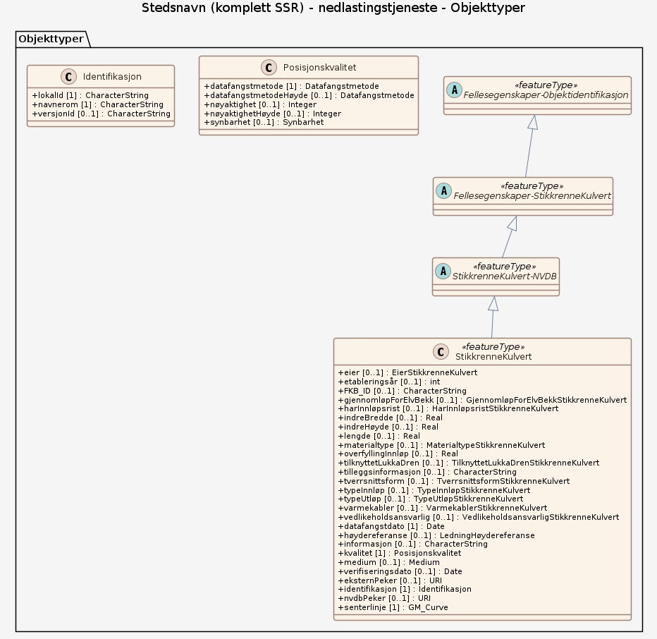

### Datamodell

#### StikkrenneKulvert

Stikkrenne: konstruksjoner og rør med maksimal lysåpning 1,0 meter under veg eller jernbane, der vann kan strømme gjennom.  Kulvert: konstruksjoner og rør med lysåpning over 1,0 meter og maksimal 2,5 meter under veg eller jernbane, der vann kan strømme gjennom.

Egenskaper

<table class="feature-attribute-table">
  <colgroup>
    <col style="width: 35%;" />
    <col style="width: 65%;" />
  </colgroup>
  <tbody>
    <tr>
      <th scope="row">Navn:</th>
      <td><strong>senterlinje</strong></td>
    </tr>
    <tr>
      <th scope="row">Definisjon:</th>
      <td>Gir linje/kurve som geometrisk representerer objektet.</td>
    </tr>
    <tr>
      <th scope="row">Multiplisitet:</th>
      <td>1</td>
    </tr>
    <tr>
      <th scope="row">Type:</th>
      <td>GM_Curve</td>
    </tr>
  </tbody>
</table>

Relasjoner

**Arv**
StikkrenneKulvert-NVDB

#### StikkrenneKulvert-NVDB (abstrakt)

abstrakt objekttype som bærer sentrale egenskaper fra objekt StikkrenneKulvert i NVDB datakatalogen som brukes videre i denne spesifikasjonen.

Egenskaper

<table class="feature-attribute-table">
  <colgroup>
    <col style="width: 35%;" />
    <col style="width: 65%;" />
  </colgroup>
  <tbody>
    <tr>
      <th scope="row">Navn:</th>
      <td><strong>eier</strong></td>
    </tr>
    <tr>
      <th scope="row">Definisjon:</th>
      <td>Angir hvem som er eier av objektet.</td>
    </tr>
    <tr>
      <th scope="row">Multiplisitet:</th>
      <td>0..1</td>
    </tr>
    <tr>
      <th scope="row">Type:</th>
      <td>EierStikkrenneKulvert</td>
    </tr>
    <tr>
      <th scope="row">Tillatte verdier:</th>
      <td>- Kodeliste: <a href="https://raw.githubusercontent.com/vegvesen/NVDB-Datakatalogen/master/GMLEierStikkrenneKulvert">https://raw.githubusercontent.com/vegvesen/NVDB-Datakatalogen/master/GMLEierStikkrenneKulvert</a> - Fylkeskommune - Kommune - Privat - Stat, Bane NOR – Bane NOR - Stat, Nye Veier – Nye Veier - Stat, Statens vegvesen – Statens vegvesen - Uavklart – Verdi benyttes inntil det er avklart hvem som er eier (ingen verdi tolkes som at vegeier er eier).</td>
    </tr>
  </tbody>
</table>

<table class="feature-attribute-table">
  <colgroup>
    <col style="width: 35%;" />
    <col style="width: 65%;" />
  </colgroup>
  <tbody>
    <tr>
      <th scope="row">Navn:</th>
      <td><strong>etableringsår</strong></td>
    </tr>
    <tr>
      <th scope="row">Definisjon:</th>
      <td>Angir hvilket år objektet ble etablert på stedet.</td>
    </tr>
    <tr>
      <th scope="row">Multiplisitet:</th>
      <td>0..1</td>
    </tr>
    <tr>
      <th scope="row">Type:</th>
      <td>int</td>
    </tr>
  </tbody>
</table>

<table class="feature-attribute-table">
  <colgroup>
    <col style="width: 35%;" />
    <col style="width: 65%;" />
  </colgroup>
  <tbody>
    <tr>
      <th scope="row">Navn:</th>
      <td><strong>FKB_ID</strong></td>
    </tr>
    <tr>
      <th scope="row">Definisjon:</th>
      <td>Refererer til FKB-identitet. Benyttes i forbindelse med felles forvaltning av geometri.</td>
    </tr>
    <tr>
      <th scope="row">Multiplisitet:</th>
      <td>0..1</td>
    </tr>
    <tr>
      <th scope="row">Type:</th>
      <td>CharacterString</td>
    </tr>
  </tbody>
</table>

<table class="feature-attribute-table">
  <colgroup>
    <col style="width: 35%;" />
    <col style="width: 65%;" />
  </colgroup>
  <tbody>
    <tr>
      <th scope="row">Navn:</th>
      <td><strong>gjennomløpForElvBekk</strong></td>
    </tr>
    <tr>
      <th scope="row">Definisjon:</th>
      <td>Angir om elv/bekk renner gjennom stikkrenne/kulvert.</td>
    </tr>
    <tr>
      <th scope="row">Multiplisitet:</th>
      <td>0..1</td>
    </tr>
    <tr>
      <th scope="row">Type:</th>
      <td>GjennomløpForElvBekkStikkrenneKulvert</td>
    </tr>
    <tr>
      <th scope="row">Tillatte verdier:</th>
      <td>- Kodeliste: <a href="https://raw.githubusercontent.com/vegvesen/NVDB-Datakatalogen/master/GMLGjennomløpForElvBekkStikkrenneKulvert">https://raw.githubusercontent.com/vegvesen/NVDB-Datakatalogen/master/GMLGjennomløpForElvBekkStikkrenneKulvert</a> - Ja – ja - Nei – nei</td>
    </tr>
  </tbody>
</table>

<table class="feature-attribute-table">
  <colgroup>
    <col style="width: 35%;" />
    <col style="width: 65%;" />
  </colgroup>
  <tbody>
    <tr>
      <th scope="row">Navn:</th>
      <td><strong>harInnløpsrist</strong></td>
    </tr>
    <tr>
      <th scope="row">Definisjon:</th>
      <td>Angir om det er innløpsrist i tilknytning til objektet.</td>
    </tr>
    <tr>
      <th scope="row">Multiplisitet:</th>
      <td>0..1</td>
    </tr>
    <tr>
      <th scope="row">Type:</th>
      <td>HarInnløpsristStikkrenneKulvert</td>
    </tr>
    <tr>
      <th scope="row">Tillatte verdier:</th>
      <td>- Kodeliste: <a href="https://raw.githubusercontent.com/vegvesen/NVDB-Datakatalogen/master/GMLHarInnløpsristStikkrenneKulvert">https://raw.githubusercontent.com/vegvesen/NVDB-Datakatalogen/master/GMLHarInnløpsristStikkrenneKulvert</a> - Ja – ja - Nei – nei</td>
    </tr>
  </tbody>
</table>

<table class="feature-attribute-table">
  <colgroup>
    <col style="width: 35%;" />
    <col style="width: 65%;" />
  </colgroup>
  <tbody>
    <tr>
      <th scope="row">Navn:</th>
      <td><strong>indreBredde</strong></td>
    </tr>
    <tr>
      <th scope="row">Definisjon:</th>
      <td>Angir innvendig bredde av gjennomløpskonstruksjon. Ikke aktuell for sirkulære tverrsnitt. Måleenhet: mm</td>
    </tr>
    <tr>
      <th scope="row">Multiplisitet:</th>
      <td>0..1</td>
    </tr>
    <tr>
      <th scope="row">Type:</th>
      <td>Real</td>
    </tr>
  </tbody>
</table>

<table class="feature-attribute-table">
  <colgroup>
    <col style="width: 35%;" />
    <col style="width: 65%;" />
  </colgroup>
  <tbody>
    <tr>
      <th scope="row">Navn:</th>
      <td><strong>indreHøyde</strong></td>
    </tr>
    <tr>
      <th scope="row">Definisjon:</th>
      <td>Angir innvendig høyde av gjennomløpskonstruksjon. Tar ikke hensyn til ev. igjenfylling i bunn av konstruksjon. Måleenhet: mm</td>
    </tr>
    <tr>
      <th scope="row">Multiplisitet:</th>
      <td>0..1</td>
    </tr>
    <tr>
      <th scope="row">Type:</th>
      <td>Real</td>
    </tr>
  </tbody>
</table>

<table class="feature-attribute-table">
  <colgroup>
    <col style="width: 35%;" />
    <col style="width: 65%;" />
  </colgroup>
  <tbody>
    <tr>
      <th scope="row">Navn:</th>
      <td><strong>lengde</strong></td>
    </tr>
    <tr>
      <th scope="row">Definisjon:</th>
      <td>Angir lengde av objektet.</td>
    </tr>
    <tr>
      <th scope="row">Multiplisitet:</th>
      <td>0..1</td>
    </tr>
    <tr>
      <th scope="row">Type:</th>
      <td>Real</td>
    </tr>
  </tbody>
</table>

<table class="feature-attribute-table">
  <colgroup>
    <col style="width: 35%;" />
    <col style="width: 65%;" />
  </colgroup>
  <tbody>
    <tr>
      <th scope="row">Navn:</th>
      <td><strong>materialtype</strong></td>
    </tr>
    <tr>
      <th scope="row">Definisjon:</th>
      <td>Angir materialtype.</td>
    </tr>
    <tr>
      <th scope="row">Multiplisitet:</th>
      <td>0..1</td>
    </tr>
    <tr>
      <th scope="row">Type:</th>
      <td>MaterialtypeStikkrenneKulvert</td>
    </tr>
    <tr>
      <th scope="row">Tillatte verdier:</th>
      <td>- Kodeliste: <a href="https://raw.githubusercontent.com/vegvesen/NVDB-Datakatalogen/master/GMLMaterialtypeStikkrenneKulvert">https://raw.githubusercontent.com/vegvesen/NVDB-Datakatalogen/master/GMLMaterialtypeStikkrenneKulvert</a> - Betong - Eternitt - Naturstein - Plast - Stål - Tre</td>
    </tr>
  </tbody>
</table>

<table class="feature-attribute-table">
  <colgroup>
    <col style="width: 35%;" />
    <col style="width: 65%;" />
  </colgroup>
  <tbody>
    <tr>
      <th scope="row">Navn:</th>
      <td><strong>overfyllingInnløp</strong></td>
    </tr>
    <tr>
      <th scope="row">Definisjon:</th>
      <td>Angir tykkelsen på overfylling ved innløp. Det vil si tykkelse fra topp av stikkrenne til topp dekke.</td>
    </tr>
    <tr>
      <th scope="row">Multiplisitet:</th>
      <td>0..1</td>
    </tr>
    <tr>
      <th scope="row">Type:</th>
      <td>Real</td>
    </tr>
  </tbody>
</table>

<table class="feature-attribute-table">
  <colgroup>
    <col style="width: 35%;" />
    <col style="width: 65%;" />
  </colgroup>
  <tbody>
    <tr>
      <th scope="row">Navn:</th>
      <td><strong>tilknyttetLukkaDren</strong></td>
    </tr>
    <tr>
      <th scope="row">Definisjon:</th>
      <td>Angir om stikkrenne er tilknytta lukka drenering. Vannet ledes inn i et lukket dreneringssystem.</td>
    </tr>
    <tr>
      <th scope="row">Multiplisitet:</th>
      <td>0..1</td>
    </tr>
    <tr>
      <th scope="row">Type:</th>
      <td>TilknyttetLukkaDrenStikkrenneKulvert</td>
    </tr>
    <tr>
      <th scope="row">Tillatte verdier:</th>
      <td>- Kodeliste: <a href="https://raw.githubusercontent.com/vegvesen/NVDB-Datakatalogen/master/GMLTilknyttetLukkaDrenStikkrenneKulvert">https://raw.githubusercontent.com/vegvesen/NVDB-Datakatalogen/master/GMLTilknyttetLukkaDrenStikkrenneKulvert</a> - Ja – ja - Nei – nei</td>
    </tr>
  </tbody>
</table>

<table class="feature-attribute-table">
  <colgroup>
    <col style="width: 35%;" />
    <col style="width: 65%;" />
  </colgroup>
  <tbody>
    <tr>
      <th scope="row">Navn:</th>
      <td><strong>tilleggsinformasjon</strong></td>
    </tr>
    <tr>
      <th scope="row">Definisjon:</th>
      <td>Supplerende informasjon om objektet som ikke framkommer direkte av andre egenskapstyper.</td>
    </tr>
    <tr>
      <th scope="row">Multiplisitet:</th>
      <td>0..1</td>
    </tr>
    <tr>
      <th scope="row">Type:</th>
      <td>CharacterString</td>
    </tr>
  </tbody>
</table>

<table class="feature-attribute-table">
  <colgroup>
    <col style="width: 35%;" />
    <col style="width: 65%;" />
  </colgroup>
  <tbody>
    <tr>
      <th scope="row">Navn:</th>
      <td><strong>tverrsnittsform</strong></td>
    </tr>
    <tr>
      <th scope="row">Definisjon:</th>
      <td>Angir hvilken type tverrsnitt gjennomløpskonstruksjon har.</td>
    </tr>
    <tr>
      <th scope="row">Multiplisitet:</th>
      <td>0..1</td>
    </tr>
    <tr>
      <th scope="row">Type:</th>
      <td>TverrsnittsformStikkrenneKulvert</td>
    </tr>
    <tr>
      <th scope="row">Tillatte verdier:</th>
      <td>- Kodeliste: <a href="https://raw.githubusercontent.com/vegvesen/NVDB-Datakatalogen/master/GMLTverrsnittsformStikkrenneKulvert">https://raw.githubusercontent.com/vegvesen/NVDB-Datakatalogen/master/GMLTverrsnittsformStikkrenneKulvert</a> - Ellipseform - Flatbunnet med hvelv - Rektangulær - Sirkulær</td>
    </tr>
  </tbody>
</table>

<table class="feature-attribute-table">
  <colgroup>
    <col style="width: 35%;" />
    <col style="width: 65%;" />
  </colgroup>
  <tbody>
    <tr>
      <th scope="row">Navn:</th>
      <td><strong>typeInnløp</strong></td>
    </tr>
    <tr>
      <th scope="row">Definisjon:</th>
      <td>Angir hvilken type innløp det er i ei stikkrenne.</td>
    </tr>
    <tr>
      <th scope="row">Multiplisitet:</th>
      <td>0..1</td>
    </tr>
    <tr>
      <th scope="row">Type:</th>
      <td>TypeInnløpStikkrenneKulvert</td>
    </tr>
    <tr>
      <th scope="row">Tillatte verdier:</th>
      <td>- Kodeliste: <a href="https://raw.githubusercontent.com/vegvesen/NVDB-Datakatalogen/master/GMLTypeInnløpStikkrenneKulvert">https://raw.githubusercontent.com/vegvesen/NVDB-Datakatalogen/master/GMLTypeInnløpStikkrenneKulvert</a> - Kum over stikkrenne - Åpent i grøft – Vann renner inn direkte fra åpen grøft. - Åpent i grøft med støtteskjold – Åpen i grøft med støtteskjold - Åpent med frontmur - Åpent med vingemur</td>
    </tr>
  </tbody>
</table>

<table class="feature-attribute-table">
  <colgroup>
    <col style="width: 35%;" />
    <col style="width: 65%;" />
  </colgroup>
  <tbody>
    <tr>
      <th scope="row">Navn:</th>
      <td><strong>typeUtløp</strong></td>
    </tr>
    <tr>
      <th scope="row">Definisjon:</th>
      <td>Angir hvilken type utløp det er i ei stikkrenne.</td>
    </tr>
    <tr>
      <th scope="row">Multiplisitet:</th>
      <td>0..1</td>
    </tr>
    <tr>
      <th scope="row">Type:</th>
      <td>TypeUtløpStikkrenneKulvert</td>
    </tr>
    <tr>
      <th scope="row">Tillatte verdier:</th>
      <td>- Kodeliste: <a href="https://raw.githubusercontent.com/vegvesen/NVDB-Datakatalogen/master/GMLTypeUtløpStikkrenneKulvert">https://raw.githubusercontent.com/vegvesen/NVDB-Datakatalogen/master/GMLTypeUtløpStikkrenneKulvert</a> - I bekk/elv – Vann ledes ut i bekk/elv. - I skråning/terreng – Vann ledes ut i skråning eller ut i terreng. - Kum – Vann ledes til kum. - Åpen grøft – Vann ledes til åpen grøft</td>
    </tr>
  </tbody>
</table>

<table class="feature-attribute-table">
  <colgroup>
    <col style="width: 35%;" />
    <col style="width: 65%;" />
  </colgroup>
  <tbody>
    <tr>
      <th scope="row">Navn:</th>
      <td><strong>varmekabler</strong></td>
    </tr>
    <tr>
      <th scope="row">Definisjon:</th>
      <td>Angir om det er varmekabler eller ikke i tilknytning til objektet.</td>
    </tr>
    <tr>
      <th scope="row">Multiplisitet:</th>
      <td>0..1</td>
    </tr>
    <tr>
      <th scope="row">Type:</th>
      <td>VarmekablerStikkrenneKulvert</td>
    </tr>
    <tr>
      <th scope="row">Tillatte verdier:</th>
      <td>- Kodeliste: <a href="https://raw.githubusercontent.com/vegvesen/NVDB-Datakatalogen/master/GMLVarmekablerStikkrenneKulvert">https://raw.githubusercontent.com/vegvesen/NVDB-Datakatalogen/master/GMLVarmekablerStikkrenneKulvert</a> - Ja – ja - Nei – nei</td>
    </tr>
  </tbody>
</table>

<table class="feature-attribute-table">
  <colgroup>
    <col style="width: 35%;" />
    <col style="width: 65%;" />
  </colgroup>
  <tbody>
    <tr>
      <th scope="row">Navn:</th>
      <td><strong>vedlikeholdsansvarlig</strong></td>
    </tr>
    <tr>
      <th scope="row">Definisjon:</th>
      <td>Angir hvem som er ansvarlig for vedlikehold av objektet.</td>
    </tr>
    <tr>
      <th scope="row">Multiplisitet:</th>
      <td>0..1</td>
    </tr>
    <tr>
      <th scope="row">Type:</th>
      <td>VedlikeholdsansvarligStikkrenneKulvert</td>
    </tr>
    <tr>
      <th scope="row">Tillatte verdier:</th>
      <td>- Kodeliste: <a href="https://raw.githubusercontent.com/vegvesen/NVDB-Datakatalogen/master/GMLVedlikeholdsansvarligStikkrenneKulvert">https://raw.githubusercontent.com/vegvesen/NVDB-Datakatalogen/master/GMLVedlikeholdsansvarligStikkrenneKulvert</a> - Bane NOR - Fylkeskommune - Kommune - Nye Veier - OPS - Privat - Statens vegvesen - Uavklart – Verdi benyttes inntil det er avklart hvem som er vedlikeholdsansvarlig.</td>
    </tr>
  </tbody>
</table>

Relasjoner

**Arv**
Fellesegenskaper-StikkrenneKulvert

#### Fellesegenskaper-StikkrenneKulvert (abstrakt)

abstrakt objekttype som bærer sentrale egenskaper fra standardiserte SOSI_Objekt som brukes videre i denne spesifikasjonen.

Egenskaper

<table class="feature-attribute-table">
  <colgroup>
    <col style="width: 35%;" />
    <col style="width: 65%;" />
  </colgroup>
  <tbody>
    <tr>
      <th scope="row">Navn:</th>
      <td><strong>datafangstdato</strong></td>
    </tr>
    <tr>
      <th scope="row">Definisjon:</th>
      <td>dato når objektet siste gang ble registrert/observert/målt i terrenget  Merknad: I mange tilfeller er denne forskjellig fra oppdateringsdato, da registrerte endringer kan bufres i en kortere eller lengre periode før disse legges inn i databasen. Ved førstegangsregistrering settes Datafangstdato lik førsteDatafangstdato.</td>
    </tr>
    <tr>
      <th scope="row">Multiplisitet:</th>
      <td>1</td>
    </tr>
    <tr>
      <th scope="row">Type:</th>
      <td>Date</td>
    </tr>
  </tbody>
</table>

<table class="feature-attribute-table">
  <colgroup>
    <col style="width: 35%;" />
    <col style="width: 65%;" />
  </colgroup>
  <tbody>
    <tr>
      <th scope="row">Navn:</th>
      <td><strong>høydereferanse</strong></td>
    </tr>
    <tr>
      <th scope="row">Definisjon:</th>
      <td>koordinatregistering utført på topp eller bunn av et objekt</td>
    </tr>
    <tr>
      <th scope="row">Multiplisitet:</th>
      <td>0..1</td>
    </tr>
    <tr>
      <th scope="row">Type:</th>
      <td>LedningHøydereferanse</td>
    </tr>
    <tr>
      <th scope="row">Tillatte verdier:</th>
      <td>- bunnInnvendig – høydereferansen er bunn innvendig

Eksempel: Dette er nyttig når en skal modellere fall på avløpsrør - fot – naturlig å bruke for eksempel på master/mastefundamenter - påBakken – høydereferanse er på bakken

Merknad: Mange ledninger er målt på lukket grøft - senter – høydereferansen er senter innvendig

Eksempel: Dersom en ønsker å representere volumet på rør, kan dette gjøres med å angi LedningHøydereferanse = senter og supplere dette med passende radius. - toppInnvendig – høydereferansen er topp innvendig komponent - toppUtvendig – høydereferansen er til toppen av komponenten - ukjent – brukes der det ikke er kjent hva som er benyttet som høydereferanse - underkantUtvendig – høydereferansen er bunn utvendig</td>
    </tr>
  </tbody>
</table>

<table class="feature-attribute-table">
  <colgroup>
    <col style="width: 35%;" />
    <col style="width: 65%;" />
  </colgroup>
  <tbody>
    <tr>
      <th scope="row">Navn:</th>
      <td><strong>informasjon</strong></td>
    </tr>
    <tr>
      <th scope="row">Definisjon:</th>
      <td>generell opplysning  Merknad: mulighet til å legge inn utfyllende informasjon om objektet</td>
    </tr>
    <tr>
      <th scope="row">Multiplisitet:</th>
      <td>0..1</td>
    </tr>
    <tr>
      <th scope="row">Type:</th>
      <td>CharacterString</td>
    </tr>
  </tbody>
</table>

<table class="feature-attribute-table">
  <colgroup>
    <col style="width: 35%;" />
    <col style="width: 65%;" />
  </colgroup>
  <tbody>
    <tr>
      <th scope="row">Navn:</th>
      <td><strong>kvalitet</strong></td>
    </tr>
    <tr>
      <th scope="row">Definisjon:</th>
      <td>beskrivelse av kvaliteten på stedfestingen  Merknad: Denne er identisk med ..KVALITET i tidligere versjoner av SOSI.</td>
    </tr>
    <tr>
      <th scope="row">Multiplisitet:</th>
      <td>1</td>
    </tr>
    <tr>
      <th scope="row">Type:</th>
      <td>Posisjonskvalitet</td>
    </tr>
  </tbody>
</table>

<table class="feature-attribute-table">
  <colgroup>
    <col style="width: 35%;" />
    <col style="width: 65%;" />
  </colgroup>
  <tbody>
    <tr>
      <th scope="row">Navn:</th>
      <td><strong>kvalitet.datafangstmetode</strong></td>
    </tr>
    <tr>
      <th scope="row">Definisjon:</th>
      <td>metode for datafangst. Egenskapen beskriver datafangstmetode for grunnrisskoordinater (x,y), eller for både grunnriss og høyde (x,y,z) dersom det ikke er oppgitt noen verdi for datafangstmetodeHøyde.</td>
    </tr>
    <tr>
      <th scope="row">Multiplisitet:</th>
      <td>1</td>
    </tr>
    <tr>
      <th scope="row">Type:</th>
      <td>Datafangstmetode</td>
    </tr>
    <tr>
      <th scope="row">Tillatte verdier:</th>
      <td>- Kodeliste: <a href="https://register.geonorge.no/sosi-kodelister/fkb/generell/5.0/datafangstmetode">https://register.geonorge.no/sosi-kodelister/fkb/generell/5.0/datafangstmetode</a></td>
    </tr>
  </tbody>
</table>

<table class="feature-attribute-table">
  <colgroup>
    <col style="width: 35%;" />
    <col style="width: 65%;" />
  </colgroup>
  <tbody>
    <tr>
      <th scope="row">Navn:</th>
      <td><strong>kvalitet.datafangstmetodeHøyde</strong></td>
    </tr>
    <tr>
      <th scope="row">Definisjon:</th>
      <td>metoden brukt for høyderegistrering av posisjon.  Det er bare nødvending å angi en verdi for egenskapen dersom datafangstmetode for høyde avviker fra datafangstmetode for grunnriss.</td>
    </tr>
    <tr>
      <th scope="row">Multiplisitet:</th>
      <td>0..1</td>
    </tr>
    <tr>
      <th scope="row">Type:</th>
      <td>Datafangstmetode</td>
    </tr>
    <tr>
      <th scope="row">Tillatte verdier:</th>
      <td>- Kodeliste: <a href="https://register.geonorge.no/sosi-kodelister/fkb/generell/5.0/datafangstmetode">https://register.geonorge.no/sosi-kodelister/fkb/generell/5.0/datafangstmetode</a></td>
    </tr>
  </tbody>
</table>

<table class="feature-attribute-table">
  <colgroup>
    <col style="width: 35%;" />
    <col style="width: 65%;" />
  </colgroup>
  <tbody>
    <tr>
      <th scope="row">Navn:</th>
      <td><strong>kvalitet.nøyaktighet</strong></td>
    </tr>
    <tr>
      <th scope="row">Definisjon:</th>
      <td>standardavviket til posisjoneringa av objektet oppgitt i cm  I de aller fleste sammenhenger benyttes en anslått eller forventet verdi for standardavvik, men dersom man har en beregnet verdi skal denne benyttes.  For objekter med punktgeometri benyttes verdi for punktstandardavvik. For objekter med kurvegeometri benyttes standardavviket for tverravviket fra kurva. For objekter med overflate- eller volumgeometri er forståelsen at standardavviket beregnes ut fra (3D) avvikene mellom sann posisjon og nærmeste punkt på overflata.  Merknad: Verdien er ment å beskrive nøyaktigheten til objektet sammenlignet med sann verdi. Standardavvik er i utgangspunktet et mål på det tilfeldige avviket og det innebærer at vi forutsetter at det systematiske avviket i liten grad påvirker nøyaktigheten til posisjoneringa. For fotogrammetriske data settes som hovedregel verdien lik kravet til standardavvik ved datafangst. Se standarden Geodatakvalitet for nærmere definisjon av standardavvik og hvordan dette defineres, beregnes og kontrolleres.</td>
    </tr>
    <tr>
      <th scope="row">Multiplisitet:</th>
      <td>0..1</td>
    </tr>
    <tr>
      <th scope="row">Type:</th>
      <td>Integer</td>
    </tr>
  </tbody>
</table>

<table class="feature-attribute-table">
  <colgroup>
    <col style="width: 35%;" />
    <col style="width: 65%;" />
  </colgroup>
  <tbody>
    <tr>
      <th scope="row">Navn:</th>
      <td><strong>kvalitet.nøyaktighetHøyde</strong></td>
    </tr>
    <tr>
      <th scope="row">Definisjon:</th>
      <td>standardavviket til posisjoneringa av objektet oppgitt i cm  I de aller fleste sammenhenger benyttes en anslått eller forventet verdi for standardavviket, men dersom man faktisk har standardavviket til posisjoneringa av objektet oppgitt i cm  I de aller fleste sammenhenger benyttes en anslått eller forventet verdi for standardavvik, men dersom man har en beregnet verdi skal denne benyttes.  Merknad: Verdien er ment å beskrive nøyaktigheten til objektet sammenlignet med sann verdi. Standardavvik er i utgangspunktet et mål på det tilfeldige avviket og det innebærer at vi forutsetter at det systematiske avviket i liten grad påvirker nøyaktigheten til posisjoneringa. For fotogrammetriske data settes som hovedregel verdien lik kravet til standardavvik ved datafangst. Se standarden Geodatakvalitet for nærmere definisjon av standardavvik og hvordan dette defineres, beregnes og kontrolleres.</td>
    </tr>
    <tr>
      <th scope="row">Multiplisitet:</th>
      <td>0..1</td>
    </tr>
    <tr>
      <th scope="row">Type:</th>
      <td>Integer</td>
    </tr>
  </tbody>
</table>

<table class="feature-attribute-table">
  <colgroup>
    <col style="width: 35%;" />
    <col style="width: 65%;" />
  </colgroup>
  <tbody>
    <tr>
      <th scope="row">Navn:</th>
      <td><strong>kvalitet.synbarhet</strong></td>
    </tr>
    <tr>
      <th scope="row">Definisjon:</th>
      <td>beskrivelse av hvor godt objektene framgår i datagrunnlaget for posisjonering (f.eks. flybildene).</td>
    </tr>
    <tr>
      <th scope="row">Multiplisitet:</th>
      <td>0..1</td>
    </tr>
    <tr>
      <th scope="row">Type:</th>
      <td>Synbarhet</td>
    </tr>
    <tr>
      <th scope="row">Tillatte verdier:</th>
      <td>- Kodeliste: <a href="https://register.geonorge.no/sosi-kodelister/fkb/generell/5.0/synbarhet">https://register.geonorge.no/sosi-kodelister/fkb/generell/5.0/synbarhet</a></td>
    </tr>
  </tbody>
</table>

<table class="feature-attribute-table">
  <colgroup>
    <col style="width: 35%;" />
    <col style="width: 65%;" />
  </colgroup>
  <tbody>
    <tr>
      <th scope="row">Navn:</th>
      <td><strong>medium</strong></td>
    </tr>
    <tr>
      <th scope="row">Definisjon:</th>
      <td>objektets beliggenhet i forhold til jordoverflaten  Eksempel: På bro, i tunnel, inne i et bygningsmessig anlegg, etc.</td>
    </tr>
    <tr>
      <th scope="row">Multiplisitet:</th>
      <td>0..1</td>
    </tr>
    <tr>
      <th scope="row">Type:</th>
      <td>Medium</td>
    </tr>
    <tr>
      <th scope="row">Tillatte verdier:</th>
      <td>- Kodeliste: <a href="https://register.geonorge.no/sosi-kodelister/fkb/generell/5.0/medium">https://register.geonorge.no/sosi-kodelister/fkb/generell/5.0/medium</a></td>
    </tr>
  </tbody>
</table>

<table class="feature-attribute-table">
  <colgroup>
    <col style="width: 35%;" />
    <col style="width: 65%;" />
  </colgroup>
  <tbody>
    <tr>
      <th scope="row">Navn:</th>
      <td><strong>verifiseringsdato</strong></td>
    </tr>
    <tr>
      <th scope="row">Definisjon:</th>
      <td>dato når dataene er fastslått å være i samsvar med virkeligheten  Merknad: Verifiseringsdato er identisk med ..DATO i tidligere versjoner av SOSI</td>
    </tr>
    <tr>
      <th scope="row">Multiplisitet:</th>
      <td>0..1</td>
    </tr>
    <tr>
      <th scope="row">Type:</th>
      <td>Date</td>
    </tr>
  </tbody>
</table>

Relasjoner

**Arv**
Fellesegenskaper-Objektidentifikasjon

#### Fellesegenskaper-Objektidentifikasjon (abstrakt)

abstrakt objekttype som bærer sentrale egenskaper fra standardisert SOSI_Fellesegenskaper som brukes videre i denne spesifikasjonen.

Egenskaper

<table class="feature-attribute-table">
  <colgroup>
    <col style="width: 35%;" />
    <col style="width: 65%;" />
  </colgroup>
  <tbody>
    <tr>
      <th scope="row">Navn:</th>
      <td><strong>eksternPeker</strong></td>
    </tr>
    <tr>
      <th scope="row">Definisjon:</th>
      <td>referanse til objektet i et eksternt system, som ikke er Nasjonal vegdatabank (NVDB).</td>
    </tr>
    <tr>
      <th scope="row">Multiplisitet:</th>
      <td>0..1</td>
    </tr>
    <tr>
      <th scope="row">Type:</th>
      <td>URI</td>
    </tr>
  </tbody>
</table>

<table class="feature-attribute-table">
  <colgroup>
    <col style="width: 35%;" />
    <col style="width: 65%;" />
  </colgroup>
  <tbody>
    <tr>
      <th scope="row">Navn:</th>
      <td><strong>identifikasjon</strong></td>
    </tr>
    <tr>
      <th scope="row">Definisjon:</th>
      <td>unik identifikasjon av et objekt</td>
    </tr>
    <tr>
      <th scope="row">Multiplisitet:</th>
      <td>1</td>
    </tr>
    <tr>
      <th scope="row">Type:</th>
      <td>Identifikasjon</td>
    </tr>
  </tbody>
</table>

<table class="feature-attribute-table">
  <colgroup>
    <col style="width: 35%;" />
    <col style="width: 65%;" />
  </colgroup>
  <tbody>
    <tr>
      <th scope="row">Navn:</th>
      <td><strong>identifikasjon.lokalId</strong></td>
    </tr>
    <tr>
      <th scope="row">Definisjon:</th>
      <td>lokal identifikator av et objekt  Merknad: Det er dataleverendørens ansvar å sørge for at den lokale identifikatoren er unik innenfor navnerommet. For FKB-data benyttes UUID som lokalId.</td>
    </tr>
    <tr>
      <th scope="row">Multiplisitet:</th>
      <td>1</td>
    </tr>
    <tr>
      <th scope="row">Type:</th>
      <td>CharacterString</td>
    </tr>
  </tbody>
</table>

<table class="feature-attribute-table">
  <colgroup>
    <col style="width: 35%;" />
    <col style="width: 65%;" />
  </colgroup>
  <tbody>
    <tr>
      <th scope="row">Navn:</th>
      <td><strong>identifikasjon.navnerom</strong></td>
    </tr>
    <tr>
      <th scope="row">Definisjon:</th>
      <td>navnerom som unikt identifiserer datakilden til et objekt, anbefales å være en http-URI  Eksempel: <a href="http://data.geonorge.no/SentraltStedsnavnsregister/1.0">http://data.geonorge.no/SentraltStedsnavnsregister/1.0</a>  Merknad : Verdien for nanverom vil eies av den dataprodusent som har ansvar for de unike identifikatorene og må være registrert i data.geonorge.no eller data.norge.no</td>
    </tr>
    <tr>
      <th scope="row">Multiplisitet:</th>
      <td>1</td>
    </tr>
    <tr>
      <th scope="row">Type:</th>
      <td>CharacterString</td>
    </tr>
  </tbody>
</table>

<table class="feature-attribute-table">
  <colgroup>
    <col style="width: 35%;" />
    <col style="width: 65%;" />
  </colgroup>
  <tbody>
    <tr>
      <th scope="row">Navn:</th>
      <td><strong>identifikasjon.versjonId</strong></td>
    </tr>
    <tr>
      <th scope="row">Definisjon:</th>
      <td>identifikasjon av en spesiell versjon av et geografisk objekt (instans)</td>
    </tr>
    <tr>
      <th scope="row">Multiplisitet:</th>
      <td>0..1</td>
    </tr>
    <tr>
      <th scope="row">Type:</th>
      <td>CharacterString</td>
    </tr>
  </tbody>
</table>

<table class="feature-attribute-table">
  <colgroup>
    <col style="width: 35%;" />
    <col style="width: 65%;" />
  </colgroup>
  <tbody>
    <tr>
      <th scope="row">Navn:</th>
      <td><strong>nvdbPeker</strong></td>
    </tr>
    <tr>
      <th scope="row">Definisjon:</th>
      <td>referanse til objektet i Nasjonal vegdatabank (NVDB).</td>
    </tr>
    <tr>
      <th scope="row">Multiplisitet:</th>
      <td>0..1</td>
    </tr>
    <tr>
      <th scope="row">Type:</th>
      <td>URI</td>
    </tr>
  </tbody>
</table>

### Kodelister

#### «Enumeration» EierStikkrenneKulvert

**Definisjon:** Angir hvem som er eier av objektet.

Profilparametre i tagged values

<table class="feature-attribute-table">
  <colgroup>
    <col style="width: 35%;" />
    <col style="width: 65%;" />
  </colgroup>
  <tbody>
    <tr>
      <th scope="row">asDictionary</th>
      <td>false</td>
    </tr>
    <tr>
      <th scope="row">codeList</th>
      <td><a href="https://raw.githubusercontent.com/vegvesen/NVDB-Datakatalogen/master/GMLEierStikkrenneKulvert">https://raw.githubusercontent.com/vegvesen/NVDB-Datakatalogen/master/GMLEierStikkrenneKulvert</a></td>
    </tr>
  </tbody>
</table>

Koder

<table class="code-list-table">
  <thead>
    <tr>
      <th>Kodenavn:</th>
      <th>Definisjon:</th>
      <th>Kodeverdi:</th>
    </tr>
  </thead>
  <tbody>
    <tr>
      <td>Fylkeskommune</td>
      <td></td>
      <td></td>
    </tr>
    <tr>
      <td>Kommune</td>
      <td></td>
      <td></td>
    </tr>
    <tr>
      <td>Privat</td>
      <td></td>
      <td></td>
    </tr>
    <tr>
      <td>Stat, Bane NOR</td>
      <td>Bane NOR</td>
      <td></td>
    </tr>
    <tr>
      <td>Stat, Nye Veier</td>
      <td>Nye Veier</td>
      <td></td>
    </tr>
    <tr>
      <td>Stat, Statens vegvesen</td>
      <td>Statens vegvesen</td>
      <td></td>
    </tr>
    <tr>
      <td>Uavklart</td>
      <td>Verdi benyttes inntil det er avklart hvem som er eier (ingen verdi tolkes som at vegeier er eier).</td>
      <td></td>
    </tr>
  </tbody>
</table>

#### «Enumeration» GjennomløpForElvBekkStikkrenneKulvert

**Definisjon:** Angir om elv/bekk renner gjennom stikkrenne/kulvert.

Profilparametre i tagged values

<table class="feature-attribute-table">
  <colgroup>
    <col style="width: 35%;" />
    <col style="width: 65%;" />
  </colgroup>
  <tbody>
    <tr>
      <th scope="row">asDictionary</th>
      <td>false</td>
    </tr>
    <tr>
      <th scope="row">codeList</th>
      <td><a href="https://raw.githubusercontent.com/vegvesen/NVDB-Datakatalogen/master/GMLGjennomløpForElvBekkStikkrenneKulvert">https://raw.githubusercontent.com/vegvesen/NVDB-Datakatalogen/master/GMLGjennomløpForElvBekkStikkrenneKulvert</a></td>
    </tr>
  </tbody>
</table>

Koder

<table class="code-list-table">
  <thead>
    <tr>
      <th>Kodenavn:</th>
      <th>Definisjon:</th>
      <th>Kodeverdi:</th>
    </tr>
  </thead>
  <tbody>
    <tr>
      <td>Ja</td>
      <td>ja</td>
      <td></td>
    </tr>
    <tr>
      <td>Nei</td>
      <td>nei</td>
      <td></td>
    </tr>
  </tbody>
</table>

#### «Enumeration» HarInnløpsristStikkrenneKulvert

**Definisjon:** Angir om det er innløpsrist i tilknytning til objektet.

Profilparametre i tagged values

<table class="feature-attribute-table">
  <colgroup>
    <col style="width: 35%;" />
    <col style="width: 65%;" />
  </colgroup>
  <tbody>
    <tr>
      <th scope="row">asDictionary</th>
      <td>false</td>
    </tr>
    <tr>
      <th scope="row">codeList</th>
      <td><a href="https://raw.githubusercontent.com/vegvesen/NVDB-Datakatalogen/master/GMLHarInnløpsristStikkrenneKulvert">https://raw.githubusercontent.com/vegvesen/NVDB-Datakatalogen/master/GMLHarInnløpsristStikkrenneKulvert</a></td>
    </tr>
  </tbody>
</table>

Koder

<table class="code-list-table">
  <thead>
    <tr>
      <th>Kodenavn:</th>
      <th>Definisjon:</th>
      <th>Kodeverdi:</th>
    </tr>
  </thead>
  <tbody>
    <tr>
      <td>Ja</td>
      <td>ja</td>
      <td></td>
    </tr>
    <tr>
      <td>Nei</td>
      <td>nei</td>
      <td></td>
    </tr>
  </tbody>
</table>

#### «Enumeration» MaterialtypeStikkrenneKulvert

**Definisjon:** Angir materialtype.

Profilparametre i tagged values

<table class="feature-attribute-table">
  <colgroup>
    <col style="width: 35%;" />
    <col style="width: 65%;" />
  </colgroup>
  <tbody>
    <tr>
      <th scope="row">asDictionary</th>
      <td>false</td>
    </tr>
    <tr>
      <th scope="row">codeList</th>
      <td><a href="https://raw.githubusercontent.com/vegvesen/NVDB-Datakatalogen/master/GMLMaterialtypeStikkrenneKulvert">https://raw.githubusercontent.com/vegvesen/NVDB-Datakatalogen/master/GMLMaterialtypeStikkrenneKulvert</a></td>
    </tr>
  </tbody>
</table>

Koder

<table class="code-list-table">
  <thead>
    <tr>
      <th>Kodenavn:</th>
      <th>Definisjon:</th>
      <th>Kodeverdi:</th>
    </tr>
  </thead>
  <tbody>
    <tr>
      <td>Betong</td>
      <td></td>
      <td></td>
    </tr>
    <tr>
      <td>Eternitt</td>
      <td></td>
      <td></td>
    </tr>
    <tr>
      <td>Naturstein</td>
      <td></td>
      <td></td>
    </tr>
    <tr>
      <td>Plast</td>
      <td></td>
      <td></td>
    </tr>
    <tr>
      <td>Stål</td>
      <td></td>
      <td></td>
    </tr>
    <tr>
      <td>Tre</td>
      <td></td>
      <td></td>
    </tr>
  </tbody>
</table>

#### «Enumeration» TilknyttetLukkaDrenStikkrenneKulvert

**Definisjon:** Angir om stikkrenne er tilknytta lukka drenering. Vannet ledes inn i et lukket dreneringssystem.

Profilparametre i tagged values

<table class="feature-attribute-table">
  <colgroup>
    <col style="width: 35%;" />
    <col style="width: 65%;" />
  </colgroup>
  <tbody>
    <tr>
      <th scope="row">asDictionary</th>
      <td>false</td>
    </tr>
    <tr>
      <th scope="row">codeList</th>
      <td><a href="https://raw.githubusercontent.com/vegvesen/NVDB-Datakatalogen/master/GMLTilknyttetLukkaDrenStikkrenneKulvert">https://raw.githubusercontent.com/vegvesen/NVDB-Datakatalogen/master/GMLTilknyttetLukkaDrenStikkrenneKulvert</a></td>
    </tr>
  </tbody>
</table>

Koder

<table class="code-list-table">
  <thead>
    <tr>
      <th>Kodenavn:</th>
      <th>Definisjon:</th>
      <th>Kodeverdi:</th>
    </tr>
  </thead>
  <tbody>
    <tr>
      <td>Ja</td>
      <td>ja</td>
      <td></td>
    </tr>
    <tr>
      <td>Nei</td>
      <td>nei</td>
      <td></td>
    </tr>
  </tbody>
</table>

#### «Enumeration» TverrsnittsformStikkrenneKulvert

**Definisjon:** Angir hvilken type tverrsnitt gjennomløpskonstruksjon har.

Profilparametre i tagged values

<table class="feature-attribute-table">
  <colgroup>
    <col style="width: 35%;" />
    <col style="width: 65%;" />
  </colgroup>
  <tbody>
    <tr>
      <th scope="row">asDictionary</th>
      <td>false</td>
    </tr>
    <tr>
      <th scope="row">codeList</th>
      <td><a href="https://raw.githubusercontent.com/vegvesen/NVDB-Datakatalogen/master/GMLTverrsnittsformStikkrenneKulvert">https://raw.githubusercontent.com/vegvesen/NVDB-Datakatalogen/master/GMLTverrsnittsformStikkrenneKulvert</a></td>
    </tr>
  </tbody>
</table>

Koder

<table class="code-list-table">
  <thead>
    <tr>
      <th>Kodenavn:</th>
      <th>Definisjon:</th>
      <th>Kodeverdi:</th>
    </tr>
  </thead>
  <tbody>
    <tr>
      <td>Ellipseform</td>
      <td></td>
      <td></td>
    </tr>
    <tr>
      <td>Flatbunnet med hvelv</td>
      <td></td>
      <td></td>
    </tr>
    <tr>
      <td>Rektangulær</td>
      <td></td>
      <td></td>
    </tr>
    <tr>
      <td>Sirkulær</td>
      <td></td>
      <td></td>
    </tr>
  </tbody>
</table>

#### «Enumeration» TypeInnløpStikkrenneKulvert

**Definisjon:** Angir hvilken type innløp det er i ei stikkrenne.

Profilparametre i tagged values

<table class="feature-attribute-table">
  <colgroup>
    <col style="width: 35%;" />
    <col style="width: 65%;" />
  </colgroup>
  <tbody>
    <tr>
      <th scope="row">asDictionary</th>
      <td>false</td>
    </tr>
    <tr>
      <th scope="row">codeList</th>
      <td><a href="https://raw.githubusercontent.com/vegvesen/NVDB-Datakatalogen/master/GMLTypeInnløpStikkrenneKulvert">https://raw.githubusercontent.com/vegvesen/NVDB-Datakatalogen/master/GMLTypeInnløpStikkrenneKulvert</a></td>
    </tr>
  </tbody>
</table>

Koder

<table class="code-list-table">
  <thead>
    <tr>
      <th>Kodenavn:</th>
      <th>Definisjon:</th>
      <th>Kodeverdi:</th>
    </tr>
  </thead>
  <tbody>
    <tr>
      <td>Kum over stikkrenne</td>
      <td></td>
      <td></td>
    </tr>
    <tr>
      <td>Åpent i grøft</td>
      <td>Vann renner inn direkte fra åpen grøft.</td>
      <td></td>
    </tr>
    <tr>
      <td>Åpent i grøft med støtteskjold</td>
      <td>Åpen i grøft med støtteskjold</td>
      <td></td>
    </tr>
    <tr>
      <td>Åpent med frontmur</td>
      <td></td>
      <td></td>
    </tr>
    <tr>
      <td>Åpent med vingemur</td>
      <td></td>
      <td></td>
    </tr>
  </tbody>
</table>

#### «Enumeration» TypeUtløpStikkrenneKulvert

**Definisjon:** Angir hvilken type utløp det er i ei stikkrenne.

Profilparametre i tagged values

<table class="feature-attribute-table">
  <colgroup>
    <col style="width: 35%;" />
    <col style="width: 65%;" />
  </colgroup>
  <tbody>
    <tr>
      <th scope="row">asDictionary</th>
      <td>false</td>
    </tr>
    <tr>
      <th scope="row">codeList</th>
      <td><a href="https://raw.githubusercontent.com/vegvesen/NVDB-Datakatalogen/master/GMLTypeUtløpStikkrenneKulvert">https://raw.githubusercontent.com/vegvesen/NVDB-Datakatalogen/master/GMLTypeUtløpStikkrenneKulvert</a></td>
    </tr>
  </tbody>
</table>

Koder

<table class="code-list-table">
  <thead>
    <tr>
      <th>Kodenavn:</th>
      <th>Definisjon:</th>
      <th>Kodeverdi:</th>
    </tr>
  </thead>
  <tbody>
    <tr>
      <td>I bekk/elv</td>
      <td>Vann ledes ut i bekk/elv.</td>
      <td></td>
    </tr>
    <tr>
      <td>I skråning/terreng</td>
      <td>Vann ledes ut i skråning eller ut i terreng.</td>
      <td></td>
    </tr>
    <tr>
      <td>Kum</td>
      <td>Vann ledes til kum.</td>
      <td></td>
    </tr>
    <tr>
      <td>Åpen grøft</td>
      <td>Vann ledes til åpen grøft</td>
      <td></td>
    </tr>
  </tbody>
</table>

#### «Enumeration» VarmekablerStikkrenneKulvert

**Definisjon:** Angir om det er varmekabler eller ikke i tilknytning til objektet.

Profilparametre i tagged values

<table class="feature-attribute-table">
  <colgroup>
    <col style="width: 35%;" />
    <col style="width: 65%;" />
  </colgroup>
  <tbody>
    <tr>
      <th scope="row">asDictionary</th>
      <td>false</td>
    </tr>
    <tr>
      <th scope="row">codeList</th>
      <td><a href="https://raw.githubusercontent.com/vegvesen/NVDB-Datakatalogen/master/GMLVarmekablerStikkrenneKulvert">https://raw.githubusercontent.com/vegvesen/NVDB-Datakatalogen/master/GMLVarmekablerStikkrenneKulvert</a></td>
    </tr>
  </tbody>
</table>

Koder

<table class="code-list-table">
  <thead>
    <tr>
      <th>Kodenavn:</th>
      <th>Definisjon:</th>
      <th>Kodeverdi:</th>
    </tr>
  </thead>
  <tbody>
    <tr>
      <td>Ja</td>
      <td>ja</td>
      <td></td>
    </tr>
    <tr>
      <td>Nei</td>
      <td>nei</td>
      <td></td>
    </tr>
  </tbody>
</table>

#### «Enumeration» VedlikeholdsansvarligStikkrenneKulvert

**Definisjon:** Angir hvem som er ansvarlig for vedlikehold av objektet.

Profilparametre i tagged values

<table class="feature-attribute-table">
  <colgroup>
    <col style="width: 35%;" />
    <col style="width: 65%;" />
  </colgroup>
  <tbody>
    <tr>
      <th scope="row">asDictionary</th>
      <td>false</td>
    </tr>
    <tr>
      <th scope="row">codeList</th>
      <td><a href="https://raw.githubusercontent.com/vegvesen/NVDB-Datakatalogen/master/GMLVedlikeholdsansvarligStikkrenneKulvert">https://raw.githubusercontent.com/vegvesen/NVDB-Datakatalogen/master/GMLVedlikeholdsansvarligStikkrenneKulvert</a></td>
    </tr>
  </tbody>
</table>

Koder

<table class="code-list-table">
  <thead>
    <tr>
      <th>Kodenavn:</th>
      <th>Definisjon:</th>
      <th>Kodeverdi:</th>
    </tr>
  </thead>
  <tbody>
    <tr>
      <td>Bane NOR</td>
      <td></td>
      <td></td>
    </tr>
    <tr>
      <td>Fylkeskommune</td>
      <td></td>
      <td></td>
    </tr>
    <tr>
      <td>Kommune</td>
      <td></td>
      <td></td>
    </tr>
    <tr>
      <td>Nye Veier</td>
      <td></td>
      <td></td>
    </tr>
    <tr>
      <td>OPS</td>
      <td></td>
      <td></td>
    </tr>
    <tr>
      <td>Privat</td>
      <td></td>
      <td></td>
    </tr>
    <tr>
      <td>Statens vegvesen</td>
      <td></td>
      <td></td>
    </tr>
    <tr>
      <td>Uavklart</td>
      <td>Verdi benyttes inntil det er avklart hvem som er vedlikeholdsansvarlig.</td>
      <td></td>
    </tr>
  </tbody>
</table>

#### «Enumeration» LedningHøydereferanse

**Definisjon:** den høyden som høydedelen av stedfestingen til komponenten ( Ledning/beliggenhet og Kopling/posisjon) referer til.

Merknad: På VA-ledning er det kun to som er aktuelle:
- ToppUtvendig: ledning overkant, brukes på vannledning
- BunnInnvendig: brukes på avløpsledning

Koder

<table class="code-list-table">
  <thead>
    <tr>
      <th>Kodenavn:</th>
      <th>Definisjon:</th>
      <th>Kodeverdi:</th>
    </tr>
  </thead>
  <tbody>
    <tr>
      <td>bunnInnvendig</td>
      <td>høydereferansen er bunn innvendig

Eksempel: Dette er nyttig når en skal modellere fall på avløpsrør</td>
      <td></td>
    </tr>
    <tr>
      <td>fot</td>
      <td>naturlig å bruke for eksempel på master/mastefundamenter</td>
      <td></td>
    </tr>
    <tr>
      <td>påBakken</td>
      <td>høydereferanse er på bakken

Merknad: Mange ledninger er målt på lukket grøft</td>
      <td></td>
    </tr>
    <tr>
      <td>senter</td>
      <td>høydereferansen er senter innvendig

Eksempel: Dersom en ønsker å representere volumet på rør, kan dette gjøres med å angi LedningHøydereferanse = senter og supplere dette med passende radius.</td>
      <td></td>
    </tr>
    <tr>
      <td>toppInnvendig</td>
      <td>høydereferansen er topp innvendig komponent</td>
      <td></td>
    </tr>
    <tr>
      <td>toppUtvendig</td>
      <td>høydereferansen er til toppen av komponenten</td>
      <td></td>
    </tr>
    <tr>
      <td>ukjent</td>
      <td>brukes der det ikke er kjent hva som er benyttet som høydereferanse</td>
      <td></td>
    </tr>
    <tr>
      <td>underkantUtvendig</td>
      <td>høydereferansen er bunn utvendig</td>
      <td></td>
    </tr>
  </tbody>
</table>

#### «CodeList» Datafangstmetode

**Definisjon:** metode for datafangst.

Datafangstmetoden beskriver hvordan selve vektordataene er posisjonert fra et datagrunnlag (observasjoner med landmålingsutstyr, fotogrammetrisk stereomodell, digital terrengmodell etc.) og ikke prosessen med å innhente det bakenforliggende datagrunnlaget.

Profilparametre i tagged values

<table class="feature-attribute-table">
  <colgroup>
    <col style="width: 35%;" />
    <col style="width: 65%;" />
  </colgroup>
  <tbody>
    <tr>
      <th scope="row">asDictionary</th>
      <td>true</td>
    </tr>
    <tr>
      <th scope="row">codeList</th>
      <td><a href="https://register.geonorge.no/sosi-kodelister/fkb/generell/5.0/datafangstmetode">https://register.geonorge.no/sosi-kodelister/fkb/generell/5.0/datafangstmetode</a></td>
    </tr>
  </tbody>
</table>

#### «CodeList» Synbarhet

**Definisjon:** synbarhet beskriver hvor godt objektene framgår i datagrunnlaget for posisjonering (f.eks. flybildene).

Profilparametre i tagged values

<table class="feature-attribute-table">
  <colgroup>
    <col style="width: 35%;" />
    <col style="width: 65%;" />
  </colgroup>
  <tbody>
    <tr>
      <th scope="row">asDictionary</th>
      <td>true</td>
    </tr>
    <tr>
      <th scope="row">codeList</th>
      <td><a href="https://register.geonorge.no/sosi-kodelister/fkb/generell/5.0/synbarhet">https://register.geonorge.no/sosi-kodelister/fkb/generell/5.0/synbarhet</a></td>
    </tr>
  </tbody>
</table>

#### «CodeList» Medium

**Definisjon:** objektets beliggenhet i forhold til jordoverflaten

Eksempel:
Veg på bro, i tunnel, inne i et bygningsmessig anlegg, etc.

Profilparametre i tagged values

<table class="feature-attribute-table">
  <colgroup>
    <col style="width: 35%;" />
    <col style="width: 65%;" />
  </colgroup>
  <tbody>
    <tr>
      <th scope="row">asDictionary</th>
      <td>true</td>
    </tr>
    <tr>
      <th scope="row">codeList</th>
      <td><a href="https://register.geonorge.no/sosi-kodelister/fkb/generell/5.0/medium">https://register.geonorge.no/sosi-kodelister/fkb/generell/5.0/medium</a></td>
    </tr>
  </tbody>
</table>
